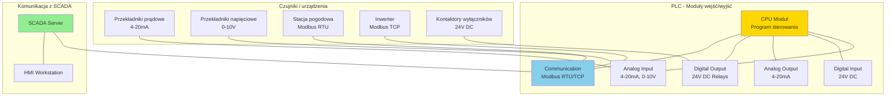
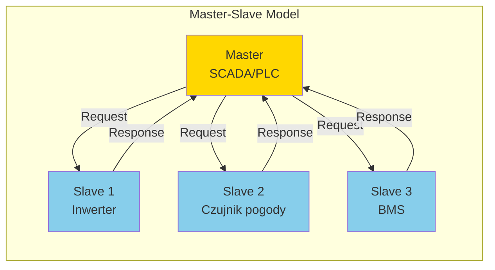
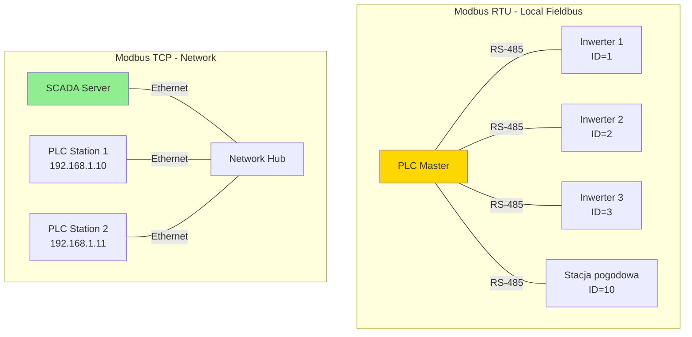
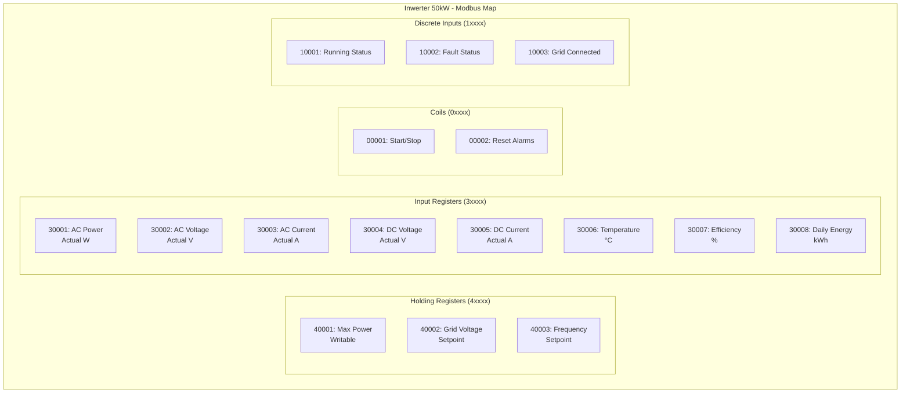

import { 
  SlideContainer, 
  Slide, 
  KeyPoints, 
  SupportingDetails, 
  InstructorNotes,
  VisualSeparator,
  LearningObjective,
  KeyConcept,
  Example
} from '@site/src/components/SlideComponents';

<LearningObjective>
Po tej sekcji student potrafi:
- Zdefiniować rolę PLC w systemach monitoringu OZE i zrozumieć ich podstawową architekturę
- Wyjaśnić różnice między protokołami Modbus RTU i Modbus TCP, oraz zastosować odpowiedni w różnych scenariuszach
- Zidentyfikować i skonfigurować rejestry Modbus (Holding, Input, Coil, Discrete) w kontekście czujników OZE
- Zaprojektować mapowanie danych z urządzeń (inwertery, czujniki pogodowe) do odpowiednich rejestrów Modbus
</LearningObjective>

<SlideContainer>

<Slide title="🤖 Wprowadzenie do PLC w systemach OZE" type="info">

<KeyPoints title="📋 Co to jest PLC?">
- **PLC** = Programmable Logic Controller (Sterownik Programowalny)
- **Specjalizowany komputer przemysłowy** zaprojektowany do automatyki
- **Operuje w czasie rzeczywistym** z deterministycznymi czasami odpowiedzi
- **Odporny na warunki przemysłowe** (temperatura, wilgotność, wibracje, EMI)
- **Komunikuje się** z różnymi protokołami (Modbus, Ethernet, OPC UA)
</KeyPoints>

<SupportingDetails title="🎯 Rola PLC w instalacjach OZE">

**PLC w systemach OZE pełnią kluczowe funkcje:**

**1. Zbieranie danych z czujników**
- Pomiary napięć, prądów, temperatur, ciśnień
- Dane pogodowe (nasłonecznienie, prędkość wiatru, temperatura otoczenia)
- Status urządzeń (inwertery, kontakty, wyłączniki)

**2. Realizacja algorytmów sterowania**
- Sterowanie pracą inwerterów
- Zarządzanie magazynami energii (BESS)
- Automatyczne wyłączanie przy awariach

**3. Komunikacja z systemami nadrzędnymi**
- SCADA, MES (Manufacturing Execution System)
- Chmury obliczeniowe, platformy IoT

</SupportingDetails>

**Typowa architektura PLC w farmie PV:**



<InstructorNotes>

**Zacznij od podstaw**: PLC to "mały komputer przemysłowy". **Nie Windows, nie Linux** - specjalny system operacyjny (często real-time OS) zaprojektowany do automatyki.

**Kluczowa różnica od PC**: **deterministyczne** czasy odpowiedzi. W PC gdy system się zawiesi, aplikacja może czekać. **W PLC to niedopuszczalne** - zawsze musi odpowiedzieć w określonym czasie (ms).

Pokaż diagram architektury. **CPU** wykonuje program, **moduły I/O** łączą się ze światem zewnętrznym. **Communication moduł** (COM) to interfejs do sieci.

**Przykłady z OZE**: PLC w farmie PV odczytuje dane z 20 inwerterów przez Modbus TCP, z 5 stacji pogodowych przez Modbus RTU, z czujników analogowych (prąd/napięcie), kontroluje wyłączniki kontaktowe.

**Czas**: 5-6 minut z diagramem.

</InstructorNotes>

</Slide>

<VisualSeparator type="default" />

<Slide title="📡 Protokół Modbus - podstawy" type="info">

<KeyPoints title="📋 Historia i standardy Modbus">
- **Modbus** opracowany przez Modicon (1979) - pierwszy standard komunikacji przemysłowej
- **Open standard** - może implementować każdy producent
- **Dwie główne wersje**: Modbus RTU (serial) i Modbus TCP (Ethernet)
- **Prosty i niezawodny** - szeroko stosowany w automatyce przemysłowej
- **Obsługa**: wszystkie urządzenia OZE (inwertery, czujniki, BMS, stacje pogodowe)
</KeyPoints>

**Modele komunikacji Modbus:**



<SupportingDetails title="🔄 Cykl komunikacji Master-Slave">

**1. Master wysyła request** (funkcja + adres slave + dane)
**2. Slave przetwarza request** (odczyt/zapis rejestrów)  
**3. Slave odpowiada** (potwierdzenie + dane/status)
**4. Master interpretuje response** (success/error handling)

**Typowe funkcje:**
- **03**: Read Holding Registers (16-bit)
- **04**: Read Input Registers (16-bit)
- **01**: Read Coils (1-bit digital out)
- **02**: Read Discrete Inputs (1-bit digital in)
- **06**: Write Single Register (16-bit)
- **16**: Write Multiple Registers (16-bit)

</SupportingDetails>

<KeyConcept title="⚠️ Limitation: Master-Slave tylko">
Modbus **nie obsługuje peer-to-peer** komunikacji. Tylko Master może inicjować komunikację. To może być ograniczeniem w nowoczesnych systemach IoT, gdzie potrzebna jest komunikacja między urządzeniami.
</KeyConcept>

<InstructorNotes>

**Modbus to fundament** komunikacji przemysłowej - **40+ lat historii**, nadal powszechnie stosowany.

**Master-Slave model** - kluczowe do zrozumienia. **Tylko Master inicjuje komunikację**. Slave czeka na request i odpowiada. Jeśli Slave ma coś ważnego do powiedzenia, musi czekać na Master.

**Funkcje** - pokaż listę najważniejszych. **03 i 04** to workhorse - większość danych z czujników jest w rejestrach 16-bit (Holdings dla danych konfiguracyjnych, Inputs dla danych pomiarowych).

**Limitation** - warto wspomnieć, że to może być problem w systemach IoT, gdzie potrzebna komunikacja między urządzeniami. Ale dla tradycyjnej automatyki sprawdza się doskonale.

**Czas**: 4-5 minut z diagramem komunikacji.

</InstructorNotes>

</Slide>

<VisualSeparator type="default" />

<Slide title="🔌 Modbus RTU vs Modbus TCP" type="tip">

<KeyPoints title="📋 Modbus RTU (Remote Terminal Unit)">
- **Transmisja szeregowa** przez RS-485 (fizycznie) lub RS-232
- **Jeden kabel** może obsługiwać do 247 urządzeń (slave IDs 1-247)
- **Długie dystanse** - do 1200m z RS-485, z repeaterami nawet dalej
- **Niski koszt** - prosta implementacja sprzętowa
- **Potrzeba terminatorów** na końcach linii
</KeyPoints>

<KeyPoints title="📋 Modbus TCP/IP">
- **Transmisja przez Ethernet** - standard TCP/IP
- **Jedno urządzenie na adres IP** (ale może mieć różne unit IDs)
- **Wysoka prędkość** - 100 Mbps vs 115 kbps (RTU)
- **Routing przez sieć** - można komunikować się przez internet
- **Wyższy koszt** - wymaga stack TCP/IP
</KeyPoints>

### Porównanie techniczne

| Cecha | Modbus RTU | Modbus TCP |
|-------|------------|-------------|
| **Medium fizyczne** | RS-485/232 | Ethernet |
| **Prędkość** | 115 kbps | 100+ Mbps |
| **Dystans** | 1200m | 100m (cat5e) |
| **Topologia** | Master-slave bus | IP network |
| **Koszt** | €€ | €€€ |
| **Setup** | Terminatorzy + adresy | IP addressing |
| **Routing** | Nie | Tak |
| **Zastosowanie** | Local fieldbus | Network/distributed |

**Typowe zastosowania w OZE:**



<InstructorNotes>

**Kluczowa decyzja projektowa**: RTU czy TCP? To zależy od **architektury sieci** i **dystansów**.

**Modbus RTU** - **dla lokalnych instalacji** gdzie wszystkie urządzenia są blisko siebie (do 1-2km) i potrzebujemy **prostej, niezawodnej komunikacji**. Jeden kabel RS-485 obsługuje dziesiątki urządzeń.

**Modbus TCP** - **dla rozproszonych instalacji** gdzie urządzenia są w różnych lokalizacjach (różne budynki, nawet różne miasta). **Routing przez sieć IP** umożliwia komunikację przez internet.

**Pokaż przykłady**:
- **RTU**: farma PV - wszystkie inwertery w jednym budynku, jedna linia RS-485
- **TCP**: farma PV w 3 lokalizacjach - każda ma PLC z IP, komunikacja przez VPN

**W praktyce często łączy się**: RTU lokalnie, TCP do komunikacji z SCADA.

**Czas**: 6-7 minut z przykładami praktycznymi.

</InstructorNotes>

</Slide>

<VisualSeparator type="default" />

<Slide title="📊 Rejestry Modbus - mapowanie danych" type="technical">

<KeyPoints title="📋 Typy rejestrów w Modbus">
- **Holding Registers** (4xxxxx) - R/W, konfiguracja urządzeń
- **Input Registers** (3xxxxx) - R-only, dane pomiarowe (czujniki)
- **Coils** (0xxxxx) - R/W, wyjścia dyskretne (1-bit)
- **Discrete Inputs** (1xxxxx) - R-only, wejścia dyskretne (1-bit)

**Konwencja adresacji**: 40001 = Holding Register #1, 30001 = Input Register #1
</KeyPoints>

**Przykład mapowania dla inwertera PV:**



<Example title="Mapowanie dla stacji pogodowej">

**Stacja pogodowa - przykładowe mapowanie:**

| Adres | Nazwa | Typ | Jednostka | Opis |
|-------|-------|-----|-----------|------|
| 30001 | Irradiance | Input | W/m² | Napromieniowanie globalne |
| 30002 | Temp_Ambient | Input | °C | Temperatura otoczenia |
| 30003 | Wind_Speed | Input | m/s | Prędkość wiatru |
| 30004 | Wind_Direction | Input | ° | Kierunek wiatru |
| 30005 | Humidity | Input | % | Wilgotność względna |
| 10001 | Rain_Sensor | Discrete | bool | Sensor deszczu |
| 10002 | Anemometer_OK | Discrete | bool | Status anemometru |

**Odczyt danych przez Modbus:**
```
Master Request: Read Input Registers (function 04)
- Start Address: 30001
- Quantity: 5 registers
Slave Response: [850, 23, 3.2, 45, 65] (irrad [W/m²], temp [°C], ...)
```

</Example>

<SupportingDetails title="⚠️ Najczęstsze błędy w mapowaniu">

**1. Błędne interpretowanie jednostek**
- Register 30001: wartość 850 = 85.0 W/m² czy 850 W/m²?
- **Rozwiązanie**: zawsze sprawdzać dokumentację producenta

**2. Kierunek bajtów (Byte Ordering)**
- Big Endian vs Little Endian
- Register value: 0x1234 = 4660 (decimal) czy 13330?

**3. Skalowanie wartości**
- Register: raw value 1234
- Rzeczywista wartość: (1234 - offset) / scale factor

</SupportingDetails>

<InstructorNotes>

**Mapowanie rejestrów to serce** Modbus - trzeba wiedzieć, gdzie szukać jakich danych.

**Pokaż przykład inwertera**. **Holding Registers** - konfiguracja (max power, voltage setpoints). **Input Registers** - pomiary (actual power, temperature). **Coils** - sterowanie (start/stop). **Discrete Inputs** - status (running, fault).

**Praktyczny przykład**: jak odczytać moc AC z inwertera? Function 04 (Read Input Registers), Address 30001, Quantity 1. Response: [15500] oznacza 15.5 kW (jeśli scale = 1.0).

**Błędy w mapowaniu** to częsta przyczyna problemów. **Jednostki** - czy 850 to 85.0 czy 850 W/m²? **Byte ordering** - 0x1234 może być różnie interpretowane. **Skalowanie** - surowa wartość vs rzeczywista.

**Zawsze sprawdzać dokumentację producenta** - każdy ma inne mapowanie!

**Czas**: 7-8 minut z praktycznymi przykładami odczytu.

</InstructorNotes>

</Slide>

<VisualSeparator type="default" />

<Slide title="🛠️ Praktyczna konfiguracja i testowanie" type="success">

<KeyPoints title="📋 Kroki implementacji Modbus">
1. **Okablowanie** - RS-485 z terminatorem 120Ω na końcach
2. **Konfiguracja adresów** - unikalne slave ID dla każdego urządzenia
3. **Mapowanie rejestrów** - dokumentacja każdego urządzenia
4. **Testowanie komunikacji** - narzędzia diagnostyczne
5. **Integracja z SCADA** - konfiguracja driverów Modbus
</KeyPoints>

<Example title="Konfiguracja farmy PV 1MW">

**Parametry systemu:**
- 20 inwerterów 50kW każdy
- 1 stacja pogodowa
- 1 PLC jako Modbus Master
- Komunikacja RS-485 z hub/switch

**Przypisanie Slave IDs:**
```
Inwertery: 1-20 (ID = numer inwertera)
Stacja pogodowa: 50 (ID = 50 untuk weather station)
PLC Master: No ID needed (to jest master)
```

**Konfiguracja kablowa RS-485:**
```
+ Data A: czerwony przewód
- Data B: czarny przewód  
Terminator 120Ω na obu końcach linii
Maksymalna długość: 500m (z hub)
```

</Example>

**Narzędzia testowe i debugowanie:**

<SupportingDetails title="🔧 Software tools">

**1. Modbus Poll/Master**
- Komercjalne narzędzie do testowania komunikacji
- Obsługa RTU i TCP
- Real-time monitoring, data logging

**2. QModMaster (Open Source)**
- Darmowe narzędzie do testów Modbus
- Cross-platform (Windows/Linux)
- Basic functionality, good for learning

**3. Custom scripts (Python)**
```python
from pymodbus.client.sync import ModbusSerialClient

client = ModbusSerialClient(method='rtu', port='COM1', baudrate=9600)
if client.connect():
    result = client.read_input_registers(30001, 1, unit=1)  # Read from inverter ID=1
    print(f"AC Power: {result.registers[0]} W")
```

</SupportingDetails>

**Typowe problemy i rozwiązania:**

| Problem | Przyczyna | Rozwiązanie |
|---------|-----------|-------------|
| **No response** | Błędne ID, brak terminacji | Check slave IDs, 120Ω terminators |
| **Timeouts** | Zbyt długi polling interval | Reduce scan rate |
| **Bad data** | Błąd w mapowaniu, endianness | Verify register mapping |
| **CRC errors** | Złe ustawienia komunikacji | Check baud rate, parity |

<InstructorNotes>

**To jest praktyczny slajd** - jak rzeczywiście implementować Modbus w terenie.

**Okablowanie RS-485** - **częsty błąd**: zapomnienie o terminatorach. Bez 120Ω rezystorów na końcach linii komunikacja nie działa lub jest niestabilna.

**Slave IDs** - każdy slave musi mieć unikalny adres. Typowy błąd: dwa urządzenia z tym samym ID, co prowadzi do konfliktów.

**Narzędzia testowe** - zacznij od **QModMaster** (darmowe), potem można przejść na **Modbus Poll** dla profesjonalnego użycia. **Python scripts** dla automatyzacji.

**Typowe problemy** - tabela z rzeczywistymi błędami. **No response** = najczęściej brak terminacji lub błędny slave ID. **CRC errors** = problem z ustawieniami komunikacji (baud rate, parity, stop bits).

**Pokaż przykład** konfiguracji farmy PV - to jest konkretny case study z rzeczywistymi parametrami.

**Czas**: 6-7 minut z praktycznymi przykładami.

</InstructorNotes>

</Slide>

</SlideContainer>
