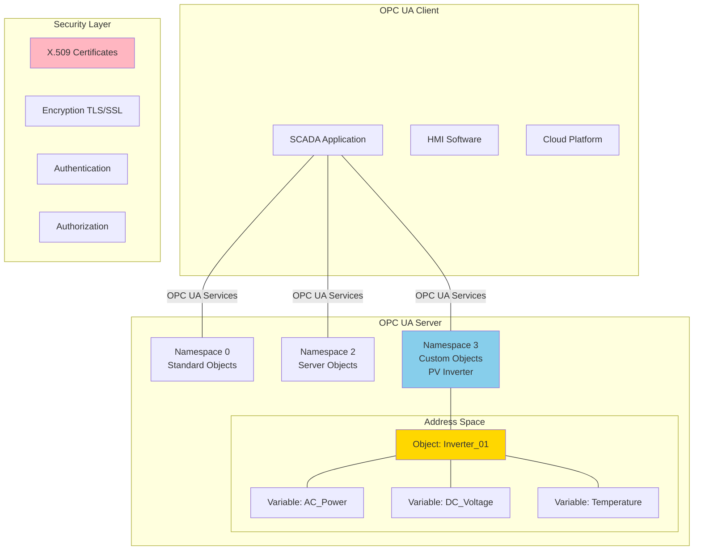
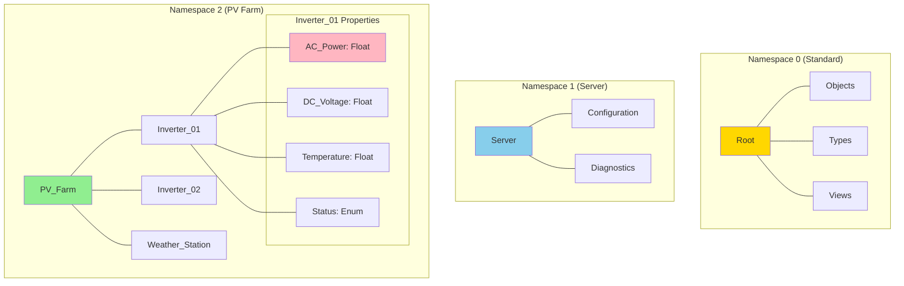
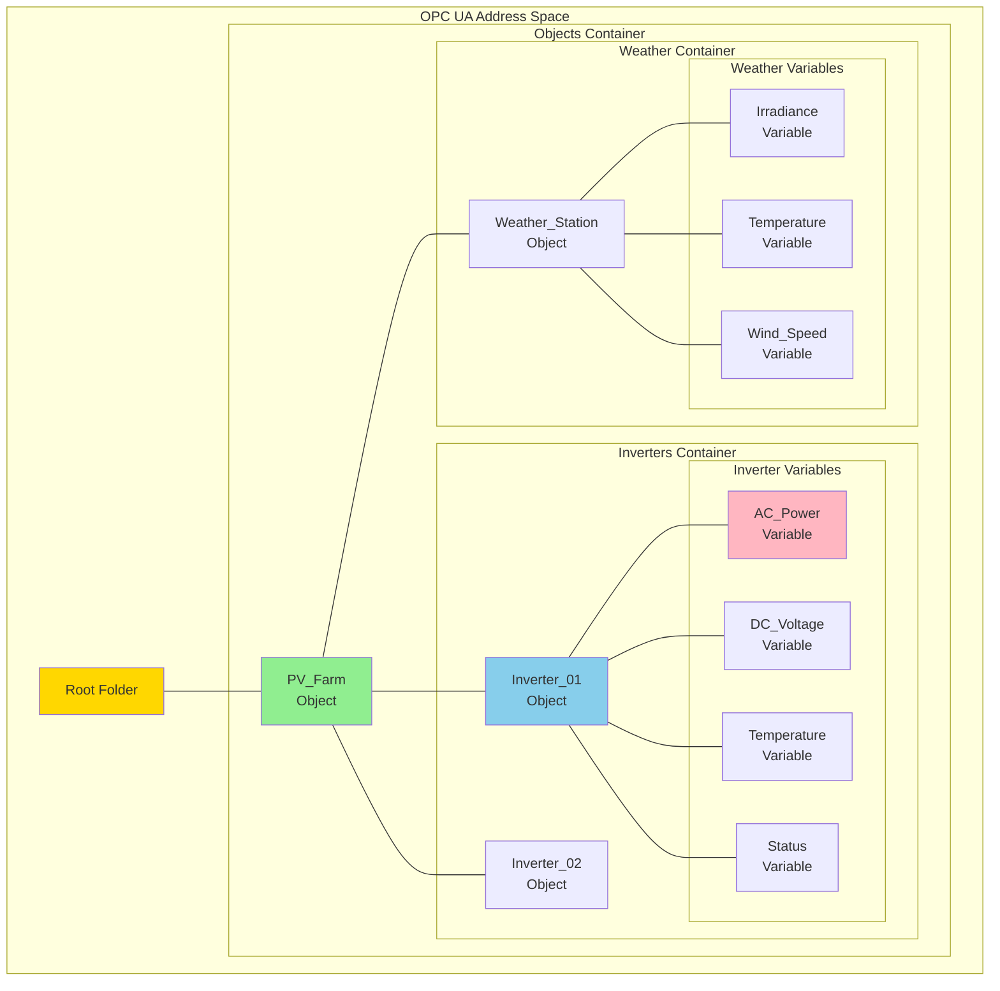
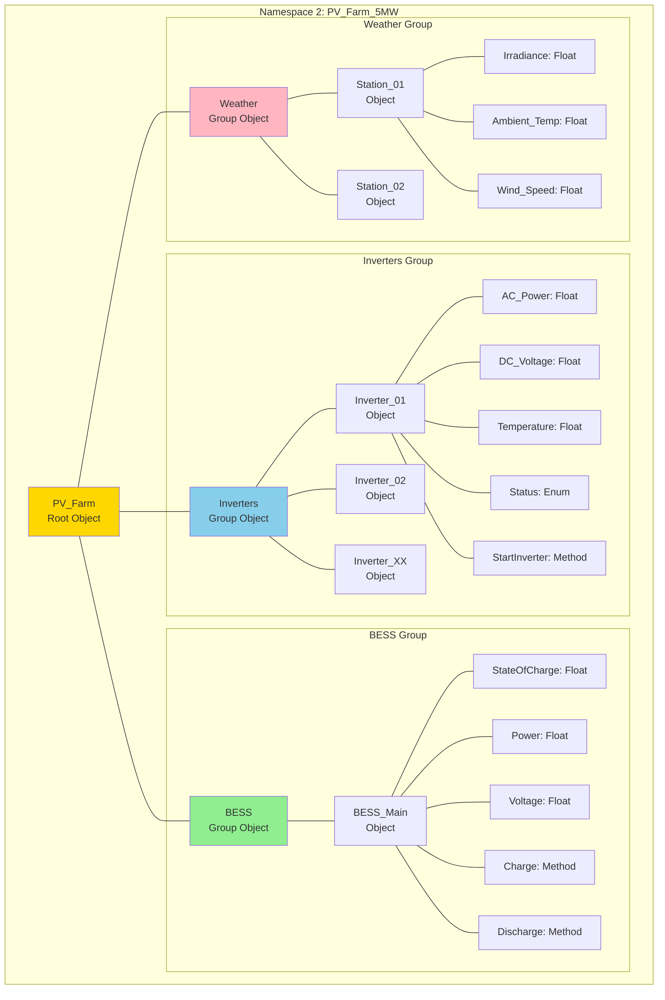

import { 
  SlideContainer, 
  Slide, 
  KeyPoints, 
  SupportingDetails, 
  InstructorNotes,
  VisualSeparator,
  LearningObjective,
  KeyConcept,
  Example
} from '@site/src/components/SlideComponents';

<LearningObjective>
Po tej sekcji student potrafi:
- Wyjaśnić architekturę OPC UA i różnice względem klasycznych protokołów (Modbus, DNP3)
- Skonfigurować namespace'y i strukturę tagów w serwerze OPC UA dla instalacji OZE
- Zdefiniować role użytkowników, uprawnienia dostępu i mechanizmy bezpieczeństwa OPC UA
- Zaprojektować model informacyjny OPC UA dla przykładowego systemu monitoringu (PV/wiatr/BESS)
</LearningObjective>

<SlideContainer>

<Slide title="🌐 Wprowadzenie do OPC UA" type="info">

<KeyPoints title="📋 Co to jest OPC UA?">
- **OPC UA** = OPC Unified Architecture (IEC 62541 standard)
- **Następca OPC Classic** - rozwiązuje problemy z platformą Windows
- **Platform-independent** - działa na Windows, Linux, embedded systems
- **Built-in security** - szyfrowanie, autentykacja, autoryzacja
- **Service-oriented architecture** - zbiór usług dla komunikacji przemysłowej
- **Rich information model** - hierarchiczna struktura danych z metadanymi
</KeyPoints>

<SupportingDetails title="🎯 Dlaczego OPC UA przewyższa tradycyjne protokoły?">

**Problem z Modbus/DNP3:**
- **Tylko flat addressing** - brak struktury hierarchicznej
- **Brak metadanych** - nie wiemy co oznacza register 30001
- **No built-in security** - dane przesyłane w plain text
- **Platform dependency** - Modbus wymaga RS-485, DNP3 to legacy

**Rozwiązania OPC UA:**
- **Hierarchiczny model** - drzewo obiektów z namespace'ami i folderami
- **Rich metadata** - każdy tag ma description, engineering units, data type
- **Security by design** - X.509 certificates, encryption, user management
- **Cross-platform** - działa wszędzie gdzie jest TCP/IP stack

</SupportingDetails>

**Architektura OPC UA Client-Server:**



<InstructorNotes>

**OPC UA to przyszłość** komunikacji przemysłowej - standard IEC, adopted by major vendors.

**Kluczowe różnice od Modbus**: **modelling capabilities**. Modbus to tylko flat table of registers. **OPC UA to full information model** - objects, variables, properties, methods, organized w namespaces.

**Security by design** - nie add-on jak w Modbus TCP, ale **integralna część**. **X.509 certificates**, **TLS encryption**, **user management** - wszystko built-in.

Pokaż diagram architektury. **Address Space** to hierarchiczna struktura (**drzewo**) vs flat registers w Modbus. **Namespaces** pozwalają organizować dane - standard objects, server objects, custom/customer objects.

**Platform independence** - to ogromne zalety. **Modbus RTU** wymaga RS-485, **Modbus TCP** wymaga Ethernet, ale **OPC UA** działa przez standardowy **TCP/IP**, można komunikować się przez internet.

**Czas**: 6-7 minut z diagramem architektury.

</InstructorNotes>

</Slide>

<VisualSeparator type="default" />

<Slide title="📁 Namespace'y i organizacja danych" type="info">

<KeyPoints title="📋 Co to są namespace'y?">
- **Namespace** = przestrzeń nazw dla obiektów OPC UA
- **Zapobiega konfliktom** - różni producenci mogą używać tych samych nazw
- **Namespace ID** = unikalny identyfikator (URI + numeric index)
- **Namespace 0** - zawsze standardowe obiekty OPC UA
- **Namespace 1** - zawsze obiekty serwera
- **Namespace 2+** - obiekty użytkownika/kustomizowane
</KeyPoints>

**Przykład struktury namespace'ów:**



<Example title="Definiowanie namespace'u dla farmy PV">

**Namespace configuration:**
```xml
<!-- Namespace Definition -->
<Namespaces>
  <Namespace>http://opcfoundation.org/UA/</Namespace>  <!-- Standard -->
  <Namespace>http://YOUR-COMPANY.COM/PV-Farm/</Namespace>  <!-- Custom -->
</Namespaces>
```

**Address Space dla Inwertera:**
```xml
<!-- Custom Object Definition -->
<Object NodeId="ns=2;s=Inverter_01" BrowseName="2:Inverter_01" DisplayName="Inverter_01">
  <Property NodeId="ns=2;s=Inverter_01/AC_Power" BrowseName="2:AC_Power" DataType="Float" />
  <Property NodeId="ns=2;s=Inverter_01/DC_Voltage" BrowseName="2:DC_Voltage" DataType="Float" />
  <Property NodeId="ns=2;s=Inverter_01/Temperature" BrowseName="2:Temperature" DataType="Float" />
  <Property NodeId="ns=2;s=Inverter_01/Status" BrowseName="2:Status" DataType="UInt32" />
</Object>
```

</Example>

<SupportingDetails title="🏗️ Hierarchiczna organizacja danych">

**Zasady dobrej organizacji:**

**1. Logic grouping** - grupuj powiązane obiekty
- PV_Farm → Inverters → Individual Inverters → Properties
- PV_Farm → Weather → Sensors → Individual Readings

**2. Consistent naming** - konsekwentne nazewnictwo
- Use_PascalCase for objects
- Use_descriptive names: "AC_Power" not "P1"

**3. Metadata** - dodawaj opis do każdego elementu
- Description: "Actual AC power output in Watts"
- Engineering Units: "W" (Watts)
- Range: 0-50000 (for 50kW inverter)

</SupportingDetails>

<InstructorNotes>

**Namespaces to kluczowa koncepcja** - rozwiązuje problem vendor lock-in. Jeśli Siemens używa "Power" i ABB też używa "Power", nie ma konfliktu bo są w różnych namespace'ach.

**Namespace 0** - to zawsze standard OPC UA (built-in objects). **Namespace 1** - to objects własnego serwera (server info, configuration). **Namespace 2+** to user/customer objects.

**Pokaż przykład** farmy PV. **Namespace 2** zawiera custom objects dla instalacji: Inverter_01, Weather_Station, etc. Każdy ma properties: AC_Power, DC_Voltage, Temperature.

**XML configuration** - to jest jak rzeczywiście definiuje się address space w praktyce. **NodeId** to unikalny identyfikator, **BrowseName** to human-readable name.

**Hierarchiczna organizacja** - to ogromna zaleta vs flat Modbus. Można organizować dane logicznie: Farm → Inverters → Properties, łatwiej nawigować i maintain.

**Czas**: 6-7 minut z praktycznymi przykładami XML configuration.

</InstructorNotes>

</Slide>

<VisualSeparator type="default" />

<Slide title="🏷️ Tagi i model informacyjny" type="technical">

<KeyPoints title="📋 Komponenty Address Space">
- **Objects** - kontener dla Variables, Methods i innych Objects
- **Variables** - dane (analogiczne do Modbus registers, ale z metadanymi)
- **Properties** - metadane obiektów (opis, jednostki, zakres)
- **Methods** - funkcje/komendy które można wykonać
- **References** - powiązania między nodes (parent-child, type-instance)
</KeyPoints>

**Struktura Address Space:**



<SupportingDetails title="📊 Rich Metadata dla każdego tagu">

**Przykładowa konfiguracja Variable dla AC_Power:**

```xml
<Variable NodeId="ns=2;s=Inverter_01/AC_Power" 
          BrowseName="2:AC_Power" 
          DisplayName="AC Power Output"
          DataType="Float">
  
  <!-- Properties z metadanymi -->
  <Property BrowseName="Description" DataType="String" Value="Actual AC power output"/>
  <Property BrowseName="EngineeringUnits" DataType="String" Value="W"/>
  <Property BrowseName="ValidRange" DataType="FloatRange" Value="0.0,50000.0"/>
  <Property BrowseName="AccessLevel" DataType="Byte" Value="3"/>  <!-- Read+Write -->
  <Property BrowseName="UserAccessLevel" DataType="Byte" Value="1"/>  <!-- Read only -->
</Variable>
```

**Typy danych (DataTypes):**
- **Basic Types**: Boolean, Byte, Int16/32/64, Float, Double, String
- **Complex Types**: Structures (custom data types)
- **Enumeration**: Status codes, alarm states

</SupportingDetails>

<KeyConcept title="🔄 Data Access Patterns">

**1. Subscription** - OPC UA Client zasubskrybuje zmiany w Variables
- Server powiadamia Client o zmianach
- Efektywne wykorzystanie bandwidth

**2. Polling** - Client okresowo odczytuje wartości
- Podobnie jak w Modbus, ale z lepszą obsługą błędów
- Fallback gdy subscription nie działa

**3. Single Reads** - jednorazowe odczyty
- Dla ad-hoc queries i debugging

</KeyConcept>

<InstructorNotes>

**Address Space to serce** OPC UA - hierarchiczna struktura obiektów, variables, properties.

**Objects** vs **Variables**:
- **Objects** to kontenary (jak foldery w systemie plików)
- **Variables** to rzeczywiste dane (jak files w folderach)
- **Properties** to metadata (jak file attributes)

**Rich metadata** - to kluczowa zaleta vs Modbus. W Modbus register 30001 oznacza... co? W OPC UA **każda Variable ma description, engineering units, valid range**.

Pokaż **przykład AC_Power** - description "Actual AC power output", units "W", range "0-50000". To jest informacja, której nie ma w Modbus!

**Data Access Patterns** - **Subscription** to rewolucyjna funkcja. Client mówi "powiadom mnie gdy AC_Power się zmieni o więcej niż 100W" - server wysyła update tylko gdy potrzeba. W Modbus trzeba ciągle pollować.

**Czas**: 7-8 minut z przykładami configuration.

</InstructorNotes>

</Slide>

<VisualSeparator type="warning" />

<Slide title="🔐 Bezpieczeństwo OPC UA" type="warning">

<KeyPoints title="📋 Wbudowane mechanizmy bezpieczeństwa">
- **Transport Security** - TLS/SSL encryption dla wszystkich komunikacji
- **Message Security** - signing i encryption na poziomie OPC UA messages
- **Authentication** - X.509 certificates i username/password
- **Authorization** - role-based access control (RBAC)
- **Audit logging** - rejestracja wszystkich operacji bezpieczeństwa
</KeyPoints>

**Security Stack OPC UA:**

```mermaid
graph TB
    subgraph "OPC UA Security Layers"
        subgraph "Application Layer"
            UA_SEC[OPC UA<br/>Message Security]
            UA_SEC --- SIG[Digital<br/>Signing]
            UA_SEC --- ENC[Encryption]
        end
        
        subgraph "Transport Layer"
            TLS[TLS/SSL<br/>Transport Security]
            TLS --- CERT[X.509<br/>Certificates]
        end
        
        subgraph "Identity & Access"
            AUTH[Authentication]
            AUTHZ[Authorization]
            
            AUTH --- USER[Username/Password]
            AUTH --- X509[X.509 Certificates]
            AUTHZ --- ROLE[Role-Based<br/>Access Control]
        end
    end
    
    subgraph "OPC UA Client"
        CLIENT[Client Application]
        CLIENT_CERT[Client Certificate]
    end
    
    subgraph "OPC UA Server"
        SERVER[Server Application]
        SERVER_CERT[Server Certificate]
        USER_DB[User Database]
        ROLE_DB[Role Database]
    end
    
    CLIENT --|TLS + UA Security| SERVER
    CLIENT_CERT --|Certificate Exchange| SERVER_CERT
    AUTH --|Validate| USER_DB
    AUTHZ --|Check Permissions| ROLE_DB
    
    style TLS fill:#ffb6c1
    style AUTH fill:#87ceeb
    style AUTHZ fill:#90ee90
```

<SupportingDetails title="🔑 Certificate Management">

**1. Server Certificate**
- Każdy OPC UA Server ma unikalny X.509 certificate
- Clients muszą trust server certificate
- Certificate zawiera Server URI, może być signed by CA

**2. Client Certificate (opcjonalnie)**
- For mutual authentication
- Client posiada własny certificate dla server verification

**3. Certificate Trust Lists**
- Server ma listę trusted client certificates
- Client ma listę trusted server certificates
- Można używać commercial CA lub self-signed

</SupportingDetails>

<Example title="Konfiguracja ról użytkowników">

**Role-based access example:**

```xml
<!-- User Roles -->
<Roles>
  <Role RoleId="ns=2;i=1001" Name="Operator">
    <Permissions ReadAccess="true" WriteAccess="false" ExecuteAccess="false"/>
    <NodeAccess NodeId="ns=2;i=5001" Access="Read"/>  <!-- Read-only access to PV data -->
  </Role>
  
  <Role RoleId="ns=2;i=1002" Name="Engineer">
    <Permissions ReadAccess="true" WriteAccess="true" ExecuteAccess="false"/>
    <NodeAccess NodeId="ns=2;i=5001" Access="ReadWrite"/>  <!-- Read-write access to PV data -->
    <NodeAccess NodeId="ns=2;i=5002" Access="Read"/>  <!-- Read-only access to weather data -->
  </Role>
  
  <Role RoleId="ns=2;i=1003" Name="Administrator">
    <Permissions ReadAccess="true" WriteAccess="true" ExecuteAccess="true"/>
    <NodeAccess NodeId="*" Access="ReadWriteExecute"/>  <!-- Full access to all nodes -->
  </Role>
</Roles>

<!-- User Assignment -->
<Users>
  <User UserId="ns=2;s=Operator_John" Username="john.operator">
    <Role RoleId="ns=2;i=1001" />  <!-- Operator role -->
  </User>
  
  <User UserId="ns=2;s=Engineer_Mary" Username="mary.engineer">
    <Role RoleId="ns=2;i=1002" />  <!-- Engineer role -->
  </User>
</Users>
```

</Example>

<InstructorNotes>

**Security to największa zaleta** OPC UA vs tradycyjne protokoły. **Modbus TCP** przesyła dane w plain text - każdy może podsłuchać.

**Security stack** pokazuje multiple layers:
- **Transport Security** (TLS) - encryption na poziomie network
- **Message Security** (OPC UA level) - additional signing i encryption
- **Authentication** - who are you?
- **Authorization** - what can you do?

**Certificate management** może być complex, ale to standard enterprise security. **X.509 certificates** to ten sam system używany w HTTPS, emails, VPN.

**Role-based access control** - praktyczny przykład z farmą PV:
- **Operators** - read-only access do danych produkcyjnych
- **Engineers** - read-write access do konfiguracji
- **Administrators** - full access do wszystkiego

To jest **real-world example** - w dużych instalacjach różni ludzie potrzebują różnych poziomów dostępu.

**Czas**: 8-9 minut z praktycznymi przykładami konfiguracji security.

</InstructorNotes>

</Slide>

<VisualSeparator type="success" />

<Slide title="🏭 Przykład: Model informacyjny dla farmy PV+BESS" type="success">

<KeyPoints title="📋 Case Study: Farma 5MW + 2MWh BESS">

**Parametry instalacji:**
- 20 inwerterów PV po 250kW
- 1 magazyn energii BESS 2MWh
- 2 stacje pogodowe
- 1 SCADA Server jako OPC UA Client
- Monitoring przez internet (remote sites)

**Wymagania:**
- Real-time monitoring wszystkich parametrów
- Remote control dla inwerterów i BESS
- Role-based access dla różnych użytkowników
- Historical data logging
</KeyPoints>

**Address Space design:**



<Example title="Implementation example - Client connection">

**Python OPC UA Client example:**
```python
from opcua import Client
import time

# Connect to OPC UA Server
client = Client("opc.tcp://pv-farm-server:4840/opcua/")
client.set_security_string("Basic256Sha256,SignAndEncrypt,cert.pem,key.pem")

try:
    client.connect()
    
    # Get nodes for reading
    root = client.get_root_node()
    inverter_01 = root.get_child("2:PV_Farm").get_child("2:Inverters").get_child("2:Inverter_01")
    ac_power_node = inverter_01.get_child("2:AC_Power")
    status_node = inverter_01.get_child("2:Status")
    
    # Subscribe to changes
    handler = DataHandler()
    sub = client.create_subscription(1000, handler)
    sub.subscribe_data_change(ac_power_node)
    sub.subscribe_data_change(status_node)
    
    # Read initial values
    ac_power = ac_power_node.get_value()
    status = status_node.get_value()
    print(f"Inverter 01: {ac_power}W, Status: {status}")
    
except Exception as e:
    print(f"Connection failed: {e}")
finally:
    client.disconnect()
```

</Example>

<SupportingDetails title="🎯 Best Practices dla OPC UA w OZE">

**1. Address Space Design**
- **Logical hierarchy** - grupuj related objects
- **Consistent naming** - użyj standardowych prefixes i suffixes
- **Descriptive names** - "AC_Power" nie "P1"

**2. Security Configuration**
- **Always enable encryption** - nie używaj None security policy w production
- **Role separation** - różne role dla operators, engineers, administrators
- **Certificate rotation** - regular renewal of certificates

**3. Performance Optimization**
- **Subscription-based** - prefer subscriptions over polling
- **Sampling rates** - dostosuj do potrzeb aplikacji (nie za często, nie za rzadko)
- **Batch operations** - group multiple reads/writes w single transactions

</SupportingDetails>

<InstructorNotes>

**To jest comprehensive case study** - prawdziwy przykład farmy PV+BESS z OPC UA.

**Address Space design** pokazuje **logical hierarchy**:
- Root: PV_Farm
- Groups: Inverters, BESS, Weather
- Objects: individual devices (Inverter_01, BESS_Main)
- Variables: actual data (AC_Power, SOC)
- Methods: control actions (StartInverter, Charge)

**Python example** pokazuje jak **praktycznie** connect do OPC UA server, subscribe do changes, read values. To jest **real-world code** który students mogą użyć.

**Best practices** to **key takeaways**:
- **Logical hierarchy** - nie flat structure jak Modbus
- **Always encryption** - security nie jest opcjonalne
- **Subscription vs polling** - OPC UA daje lepsze options niż Modbus

**Czas**: 8-9 minut z live code example.

</InstructorNotes>

</Slide>

</SlideContainer>
