import { 
  SlideContainer, 
  Slide, 
  KeyPoints, 
  SupportingDetails, 
  InstructorNotes,
  VisualSeparator,
  LearningObjective,
  KeyConcept,
  Example
} from '@site/src/components/SlideComponents';

<LearningObjective>
Po tej sekcji student potrafi:
- Wyjaśnić podstawy protokołu MQTT (publish-subscribe model) i jego zalety w systemach IIoT
- Rozróżnić poziomy QoS (Quality of Service) w MQTT i zastosować odpowiedni w zależności od aplikacji
- Zaprojektować topologię MQTT dla instalacji OZE z broker'ami, topic'ami i retained messages
- Zintegrować MQTT z systemami SCADA oraz innymi protokołami (Modbus, OPC UA)
</LearningObjective>

<SlideContainer>

<Slide title="📡 Wprowadzenie do MQTT" type="info">

<KeyPoints title="📋 Co to jest MQTT?">
- **MQTT** = Message Queuing Telemetry Transport
- **Protokół publish-subscribe** - nadawca (publisher) i odbiorcy (subscribers)
- **Lekki i efektywny** - minimalny overhead, idealny dla urządzeń IoT
- **Orientowany na sieci** - zaprojektowany dla niestabilnych połączeń
- **Platform agnostic** - działa na każdym systemie z TCP/IP
- **Standard OASIS** - otwarty standard komunikacji
</KeyPoints>

<SupportingDetails title="🎯 Dlaczego MQTT w systemach OZE?">

**Zalety MQTT względem tradycyjnych protokołów:**

**1. Decoupling** - nadawca nie musi znać odbiorców
- Jeden czujnik może wysyłać dane do wielu systemów jednocześnie
- Łatwe dodawanie nowych odbiorców bez modyfikacji nadawcy

**2. Resilience** - działa w niestabilnych sieciach
- **Last Will Testament** - powiadomienia o rozłączeniu urządzenia
- **Retained messages** - nowi subscribers otrzymują ostatnie dane
- **Automatic reconnection** - odbudowa połączenia po przerwie

**3. Scalability** - łatwe rozszerzanie systemu
- **Topic hierarchy** - organizacja wiadomości w strukturze drzewa
- **Broker clustering** - skalowanie poprzez wiele brokerów

</SupportingDetails>

**Architektura MQTT w systemie OZE:**


<InstructorNotes>

**MQTT to rewolucja** w komunikacji przemysłowej - szczególnie w kontekście IoT i edge computing.

**Kluczowa różnica**: **publish-subscribe vs request-response**. W Modbus/OPC UA to "pytanie-odpowiedź". W MQTT urządzenie **publikuje dane spontanicznie**, a **odbiorcy subskrybują to co ich interesuje**.

**Decoupling** - to ogromna zaleta. Czujnik prądu publikuje do `pv/inverter/01/power`, a **jednocześnie** SCADA, cloud platform i HMI mogą subskrybować te same dane. **Nie trzeba modyfikować czujnika** gdy dodajesz nowego odbiorcę.

Pokaż diagram - **Broker to centralny hub**, **Publishers** wysyłają dane, **Subscribers** je odbierają. **Topic hierarchy** - `pv/inverter/01/power` to struktura drzewa łatwa do nawigacji.

**Resilience** - to kluczowe w OZE gdzie często mamy **unstable network connections** (remote sites, cellular, satellite).

**Czas**: 6-7 minut z diagramem architektury.

</InstructorNotes>

</Slide>

<VisualSeparator type="default" />

<Slide title="🏷️ Topic Structure i Message Format" type="tip">

<KeyPoints title="📋 Hierarchiczna struktura topiców">
- **Topic** = nazwa/kategoria dla wiadomości (jak adres pocztowy)
- **Hierarchical structure** - używa separatora "/" jak ścieżka w systemie plików
- **Wildcards** - "+" (single level) i "#" (multi-level) do subskrypcji grup
- **Naming convention** - spójne nazewnictwo dla całej instalacji
</KeyPoints>

**Topic hierarchy dla farmy PV+BESS:**

```mermaid
graph TB
    subgraph "Topic Structure Example"
        ROOT[/pv-farm/]
        
        subgraph "Inverters Topics"
            INV[/pv-farm/inverters/]
            INV01[/pv-farm/inverters/01/]
            INV02[/pv-farm/inverters/02/]
            
            INV01_PWR[/pv-farm/inverters/01/power]
            INV01_VOLT[/pv-farm/inverters/01/voltage]
            INV01_TEMP[/pv-farm/inverters/01/temperature]
            INV01_STAT[/pv-farm/inverters/01/status]
            
            INV01 --- INV01_PWR
            INV01 --- INV01_VOLT
            INV01 --- INV01_TEMP
            INV01 --- INV01_STAT
        end
        
        subgraph "Weather Topics"
            WTHR[/pv-farm/weather/]
            IRR[/pv-farm/weather/irradiance]
            TEMP[/pv-farm/weather/temperature]
            WIND[/pv-farm/weather/wind-speed]
            
            WTHR --- IRR
            WTHR --- TEMP
            WTHR --- WIND
        end
        
        subgraph "BESS Topics"
            BESS[/pv-farm/bess/]
            SOC[/pv-farm/bess/soc]
            POWER[/pv-farm/bess/power]
            VOLTAGE[/pv-farm/bess/voltage]
            
            BESS --- SOC
            BESS --- POWER
            BESS --- VOLTAGE
        end
        
        ROOT --- INV
        ROOT --- WTHR
        ROOT --- BESS
        INV --- INV01
        INV --- INV02
    end
    
    style ROOT fill:#ffd700
    style INV fill:#87ceeb
    style WTHR fill:#90ee90
    style BESS fill:#ffb6c1
```

<Example title="Przykładowe messages w systemie PV">

**Format wiadomości:**
```
Topic: /pv-farm/inverters/01/power
Message: {"value": 15500, "unit": "W", "timestamp": "2024-01-15T10:30:45Z", "quality": "good"}

Topic: /pv-farm/weather/irradiance  
Message: {"value": 850, "unit": "W/m²", "timestamp": "2024-01-15T10:30:45Z"}

Topic: /pv-farm/bess/soc
Message: {"value": 65.2, "unit": "%", "timestamp": "2024-01-15T10:30:45Z"}
```

**Subscriptions z wildcards:**
```
Subscribe to: /pv-farm/inverters/+/power    # Wszystkie inwertery, tylko power
Subscribe to: /pv-farm/inverters/01/#       # Wszystkie dane z inwertera 01
Subscribe to: /pv-farm/#                    # Wszystkie dane z całej farmy
```

</Example>

<KeyConcept title="🔍 Best Practices dla naming convention">

**1. Hierarchical naming**
- `/company/facility/device/measurement`
- `/pv-farm/inverters/01/power`

**2. Consistent units**
- Wszystkie wartości w standardowych jednostkach SI
- Explicit unit field w JSON payload

**3. Structured payload**
- JSON format z timestamp, value, quality, unit
- Versioning dla schema evolution

**4. Topic levels**
- Nie więcej niż 5-6 poziomów (performance)
- Logiczne grupowanie według funkcjonalności

</KeyConcept>

<InstructorNotes>

**Topic structure to foundation** MQTT system - musi być przemyślany z góry.

**Naming convention** - pokaż przykład z farmy PV. **Hierarchical** structure: facility → category → device → measurement. To ułatwia **wildcard subscriptions** i **maintenance**.

**Wildcards** - **"+"** to single level (wszystkie inwertery), **"#"** to multi-level (wszystko z inwertera 01). To bardzo powerful feature do **bulk subscriptions**.

**Message format** - **JSON** to standard, ale ważne są **consistency** i **schema**. **Timestamp**, **quality flags**, **units** - to metadata potrzebne w systemach przemysłowych.

**Best practices** - nie więcej niż 5-6 poziomów topic (performance impact), **logical grouping**, **SI units**.

**Pokaż praktyczne przykłady**: jak subscribe do wszystkich inverter power values, jak dodać nowy device bez zmiany existing code.

**Czas**: 6-7 minut z praktycznymi przykładami subscriptions.

</InstructorNotes>

</Slide>

<VisualSeparator type="default" />

<Slide title="⚙️ QoS Levels - Quality of Service" type="technical">

<KeyPoints title="📋 Poziomy QoS w MQTT">
- **QoS 0** - "At most once" - fire and forget, może być zgubiona
- **QoS 1** - "At least once" - gwarantuje delivery, może być duplikat
- **QoS 2** - "Exactly once" - gwarantuje delivery bez duplikatów, ale większy overhead
- **Wybór QoS** zależy od typu danych i wymagań aplikacji
</KeyPoints>

**Porównanie poziomów QoS:**

| Kryterium | QoS 0 | QoS 1 | QoS 2 |
|-----------|-------|-------|-------|
| **Delivery guarantee** | Nie | Tak | Tak |
| **Duplicates** | Nie | Możliwe | Nie |
| **Network overhead** | Minimalny | Średni | Wysoki |
| **Latency** | Najniższy | Średni | Najwyższy |
| **Use cases** | Telemetry | Commands | Critical data |

**Architektura QoS:**

```mermaid
sequenceDiagram
    participant Publisher
    participant Broker
    participant Subscriber
    
    Note over Publisher,Subscriber: QoS 0 - Fire and Forget
    Publisher->>Broker: PUBLISH (QoS 0)
    Broker->>Subscriber: FORWARD
    Note over Subscriber: Message może być lost
    
    Note over Publisher,Subscriber: QoS 1 - At Least Once
    Publisher->>Broker: PUBLISH (QoS 1)
    Broker-->>Publisher: PUBACK
    Broker->>Subscriber: PUBLISH (QoS 1)
    Subscriber-->>Broker: PUBACK
    Note over Subscriber: Gwarantowana delivery,<br/>możliwy duplicate
    
    Note over Publisher,Subscriber: QoS 2 - Exactly Once
    Publisher->>Broker: PUBLISH (QoS 2)
    Broker-->>Publisher: PUBREC
    Publisher-->>Broker: PUBREL
    Broker-->>Publisher: PUBCOMP
    Broker->>Subscriber: PUBLISH (QoS 2)
    Subscriber-->>Broker: PUBREC
    Broker-->>Subscriber: PUBREL
    Subscriber-->>Broker: PUBCOMP
    Note over Subscriber: Exactly once delivery
```



<Example title="Dobór QoS dla różnych typów danych OZE">

**QoS 0 - Telemetry data (częste, niekrytyczne):**
```
Topic: /pv-farm/inverters/01/temperature
Reason: Wysoka częstotliwość (co 10s), utrata kilku samples nie krytyczna
Performance: Minimal overhead dla high-frequency data
```

**QoS 1 - Commands i alarms:**
```
Topic: /pv-farm/inverters/01/commands/start
Reason: Komendy muszą dotrzeć, duplikat nie szkodzi
Performance: Balance między reliability i overhead
```

**QoS 2 - Critical data (rozliczenia, status):**
```
Topic: /pv-farm/bess/battery/soc
Reason: SOC (State of Charge) critical dla safety, no duplicates allowed
Performance: Highest reliability, acceptable overhead dla critical data
```

</Example>

<SupportingDetails title="⚠️ Considerations dla wyboru QoS">

**Network conditions:**
- **Stable networks**: QoS 0 dla telemetry może wystarczyć
- **Unstable networks**: QoS 1 minimum dla important data
- **Satellite/cellular**: QoS 1 dla commands, QoS 0 dla telemetry

**Performance impact:**
- **QoS 0**: ~100x more messages/second możliwe
- **QoS 1**: ~10x overhead vs QoS 0
- **QoS 2**: ~3x overhead vs QoS 1

**Application requirements:**
- **Real-time dashboards**: QoS 0 acceptable
- **Control commands**: QoS 1 minimum
- **Financial data**: QoS 2 recommended

</SupportingDetails>

<InstructorNotes>

**QoS levels to fundamental concept** MQTT - trzeba rozumieć trade-offs.

**QoS 0** - **fire and forget**, najszybszy ale **no guarantee**. **Good for high-frequency telemetry** gdzie utrata kilku samples nie jest krytyczna.

**QoS 1** - **at least once delivery** - **standard choice** dla większości industrial applications. **Overhead acceptable**, **duplicates manageable** w aplikacji.

**QoS 2** - **exactly once** - **highest reliability** ale **significant overhead**. **Only for critical data** gdzie duplicates są unacceptable.

Pokaż **sequence diagram** - to pomaga zrozumieć **message flow** i **overhead** każdego poziomu.

**Practical recommendation**:
- **Telemetry** (temperature, power): QoS 0
- **Commands** (start/stop): QoS 1  
- **Critical status** (SOC, safety): QoS 2

**Network conditions matter** - w **unstable networks** (cellular, satellite) **QoS 1 minimum** nawet dla telemetry.

**Czas**: 7-8 minut z praktycznymi przykładami doboru QoS.

</InstructorNotes>

</Slide>

<VisualSeparator type="default" />

<Slide title="🔄 MQTT Broker - konfiguracja i zarządzanie" type="info">

<KeyPoints title="📋 Popularne MQTT Brokers">
- **Eclipse Mosquitto** - open source, lekki, idealny do embedded
- **HiveMQ** - commercial, enterprise-grade, clustering support
- **EMQX** - scalable, high-performance, edge computing
- **AWS IoT Core** - managed service, integracja z chmurą
- **Azure IoT Hub** - Microsoft managed service
</KeyPoints>

**Architektura MQTT Broker:**


<Example title="Podstawowa konfiguracja Mosquitto">

**mosquitto.conf:**
```conf
# Basic listening configuration
listener 1883 0.0.0.0
listener 8883 0.0.0.0
cafile /path/to/ca.crt
certfile /path/to/server.crt
keyfile /path/to/server.key

# Persistence and logging
persistence true
persistence_location /var/lib/mosquitto/
log_dest file /var/log/mosquitto/mosquitto.log

# Connection limits
max_connections -1
max_inflight_messages 20

# Retained messages
max_retained_messages 1000

# Authentication
allow_anonymous false
password_file /etc/mosquitto/passwd
acl_file /etc/mosquitto/acl.conf
```

**ACL (Access Control List):**
```conf
# User permissions
user pv_operator
topic read pv-farm/inverters/+/+
topic write pv-farm/inverters/+/commands/+

user weather_sensor
topic write pv-farm/weather/+

user scada_system
topic readwrite pv-farm/#
```

</Example>

<SupportingDetails title="🎯 Key Features dla Industrial IoT">

**1. Retained Messages**
- Broker przechowuje ostatnią wiadomość dla każdego topic
- Nowi subscribers automatycznie otrzymują current state
- Essential dla status monitoring w OZE

**2. Last Will Testament (LWT)**
- Broker publikuje wiadomość gdy client disconnect
- Idealny do wykrywania awarii urządzeń
- Topic: `/device/pv-inverter-01/status` payload: `{"online": false}`

**3. Keep Alive/Ping**
- Client regular heartbeat do broker
- Wykrywa "silent deaths" w network
- Typowo 60 seconds keep_alive interval

**4. Message Persistence**
- QoS 1/2 messages stored podczas reconnection
- Nie traci danych podczas brief network outages

</SupportingDetails>

<InstructorNotes>

**MQTT Broker to brain** całego systemu - wybór i konfiguracja mają ogromny wpływ na performance i reliability.

**Eclipse Mosquitto** - **most popular open source** broker, idealny do startu i **small-medium deployments**. **Lightweight**, łatwa konfiguracja.

**Commercial solutions** (HiveMQ, EMQX) dla **larger deployments** - **clustering**, **load balancing**, **enterprise support**.

Pokaż **cluster architecture** - **load balancer**, **multiple broker nodes**, **shared storage**. To dla **high availability** i **scalability**.

**Configuration example** - **mosquitto.conf** pokazuje **key settings**:
- **Security** (TLS, authentication)
- **Persistence** (data retention)
- **ACL** (access control)

**ACL example** - to **critical for security** w industrial systems. **Role-based access** - sensors can write, operators can read, SCADA can read/write.

**Key features**:
- **Retained messages** - **essential** dla OZE monitoring (last known state)
- **LWT** - **ideal** dla **device health monitoring**
- **Keep alive** - **network health** detection

**Czas**: 7-8 minut z praktycznymi przykładami konfiguracji.

</InstructorNotes>

</Slide>

<VisualSeparator type="success" />

<Slide title="🔗 Integracja MQTT z systemami SCADA" type="success">

<KeyPoints title="📋 Typowe scenariusze integracji">
- **Modbus → MQTT Bridge** - PLC zbiera dane Modbus, publikuje MQTT
- **OPC UA → MQTT Gateway** - OPC UA data convertowane do MQTT messages
- **MQTT → SCADA** - SCADA systems jako MQTT subscribers
- **Cloud Integration** - MQTT messages forwarded do cloud platforms
</KeyPoints>

**Architektura integracji:**


<Example title="Node-RED jako Modbus→MQTT Bridge">

**Node-RED flow example:**
```javascript
// Modbus read → MQTT publish flow
[{"id":"modbus-read","type":"modbus-read","z":"flow1"},
 {"id":"format-data","type":"function","z":"flow1","func":"msg.payload = {\n    value: msg.payload.data[0],\n    unit: 'W',\n    timestamp: new Date().toISOString(),\n    device: 'inverter-01'\n};\nmsg.topic = '/pv-farm/inverters/01/power';\nreturn msg;"},
 {"id":"mqtt-publish","type":"mqtt out","z":"flow1","topic":"","qos":"1","retain":"false","broker":"broker-config"}]
```

**SCADA subscriber example (Python):**
```python
import paho.mqtt.client as mqtt
import json

def on_message(client, userdata, message):
    data = json.loads(message.payload.decode())
    topic = message.topic
    
    # Parse topic: /pv-farm/inverters/01/power
    parts = topic.split('/')
    facility = parts[1]  # pv-farm
    category = parts[2]  # inverters
    device = parts[3]    # 01
    measurement = parts[4] # power
    
    # Update SCADA database
    update_scada_database(facility, category, device, measurement, data)

client = mqtt.Client()
client.on_message = on_message
client.connect("mqtt-broker", 1883, 60)

# Subscribe to all inverter data
client.subscribe("/pv-farm/inverters/+/+")
client.loop_forever()
```

</Example>

<KeyConcept title="🎯 Advantages MQTT integration">

**1. Protocol Bridging**
- **Legacy systems** (Modbus, DNP3) mogą komunikować się z **modern systems**
- **Incremental modernization** - nie trzeba wymieniać wszystkiego naraz

**2. Data Distribution**
- **One source, many consumers** - jeden czujnik, wiele aplikacji
- **Real-time** updates dla wszystkich interested parties

**3. Network Resilience**
- **Automatic reconnection** po network failures
- **Message persistence** dla reliable delivery

**4. Cloud Integration**
- **Direct connection** do cloud platforms (AWS IoT, Azure IoT Hub)
- **Hybrid architectures** (on-premise + cloud)

</KeyConcept>

<InstructorNotes>

**Integration scenarios** to **real-world application** MQTT w industrial systems.

**Bridge architecture** - **Gateways** (Node-RED, custom solutions) **convert** Modbus/OPC UA data do MQTT format. **Multiple consumers** (SCADA, cloud, HMI) **subscribe** do potrzebnych danych.

**Node-RED example** - to **popular tool** dla **rapid prototyping** industrial gateways. **Visual programming** makes it **accessible** nawet dla non-programmers.

**SCADA integration** - **Python example** pokazuje jak **parse MQTT topics** i **update industrial databases**. **Topic parsing** pozwala **automatically route** data do **appropriate systems**.

**Key advantages**:
- **Protocol bridging** - **incremental modernization** without **complete system replacement**
- **Data distribution** - **one publisher, many subscribers**
- **Network resilience** - **built-in reconnection** i **message persistence**
- **Cloud ready** - **direct integration** z **major cloud platforms**

**Practical deployment**: **start small** z **single gateway**, **add more** as needed. **MQTT scales** very well.

**Czas**: 8-9 minut z live code examples i practical deployment scenarios.

</InstructorNotes>

</Slide>

</SlideContainer>
