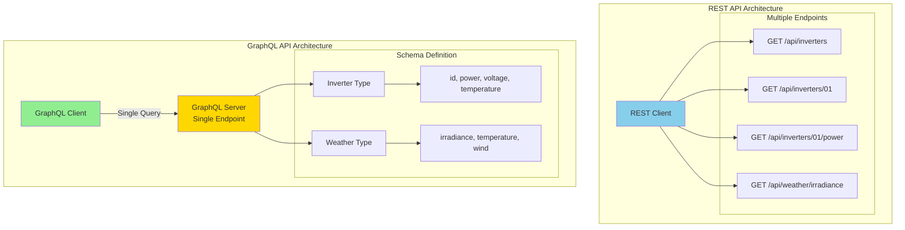
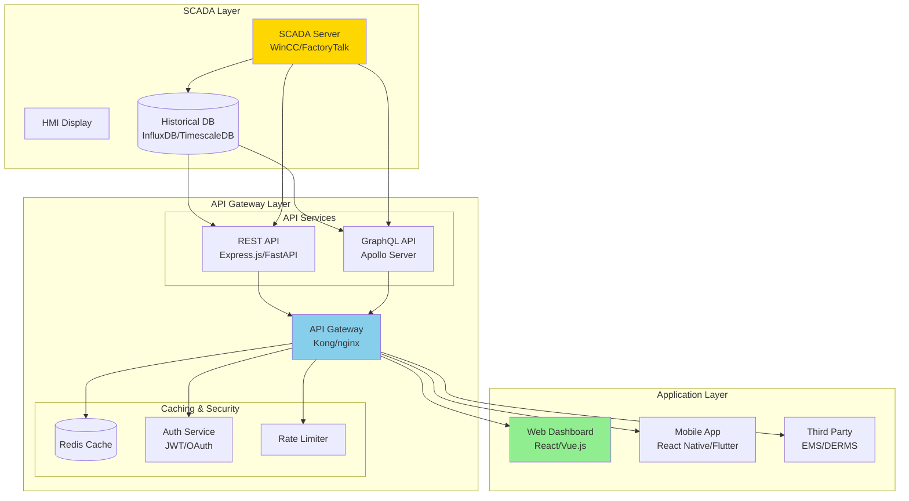

import { 
  SlideContainer, 
  Slide, 
  KeyPoints, 
  SupportingDetails, 
  InstructorNotes,
  VisualSeparator,
  LearningObjective,
  KeyConcept,
  Example
} from '@site/src/components/SlideComponents';

<LearningObjective>
Po tej sekcji student potrafi:
- Zrozumieć podstawy architektury REST i GraphQL oraz ich zastosowanie w systemach przemysłowych
- Zaprojektować REST API dla integracji systemów monitoringu OZE z aplikacjami web/mobile
- Porównać REST vs GraphQL w kontekście wydajności, elastyczności i złożoności implementacji
- Zaimplementować podstawowe endpointy REST i zapytania GraphQL dla danych z systemów SCADA
</LearningObjective>

<SlideContainer>

<Slide title="🌐 Wprowadzenie do REST i GraphQL" type="info">

<KeyPoints title="📋 Co to jest REST?">
- **REST** = Representational State Transfer
- **Architektura web services** oparta na protokole HTTP
- **Stateless** - każdy request zawiera wszystkie potrzebne informacje
- **Resource-oriented** - wszystko to zasoby identyfikowane przez URL
- **Standardowe metody HTTP**: GET, POST, PUT, DELETE
- **Powszechnie stosowany** w integracji systemów webowych
</KeyPoints>

<KeyPoints title="📋 Co to jest GraphQL?">
- **GraphQL** = Graph Query Language (opracowany przez Facebook 2012)
- **Single endpoint** - wszystkie zapytania przez jeden URL
- **Client-driven** - klient określa dokładnie jakie dane potrzebuje
- **Strongly typed** - schema definiuje strukturę danych
- **Real-time subscriptions** - live updates przez WebSocket
- **Nowoczesne API** dla aplikacji web i mobile
</KeyPoints>

**Porównanie architektur:**



<SupportingDetails title="🎯 Zastosowania w systemach OZE">

**REST API w OZE:**
- **Integration z web dashboards** - dane z SCADA do aplikacji web
- **Mobile applications** - monitoring farm przez telefon/tablet
- **Third-party integrations** - integracja z systemami EMS/DERMS
- **Data exchange** między różnymi platformami (SCADA ↔ Cloud)

**GraphQL w OZE:**
- **Flexible data fetching** - aplikacja pobiera tylko potrzebne dane
- **Real-time dashboards** - subscriptions do live updates
- **Mobile apps** - adaptacja do różnych screen sizes i potrzeb
- **Microservices** - unified API dla różnych backend services

</SupportingDetails>

<InstructorNotes>

**REST vs GraphQL** to **fundamental choice** w modern API design dla industrial systems.

**REST** - **mature, widely adopted**, **simple to understand**. **Resource-based** - każdy resource ma swój endpoint. **Standard HTTP methods** - GET, POST, PUT, DELETE.

**GraphQL** - **newer approach**, **more flexible**. **Single endpoint**, **client specifies** exactly what data potrzebuje. **Strongly typed** - schema definition.

Pokaż **architecture diagram** - **REST** ma **multiple endpoints**, **GraphQL** ma **single endpoint** ale **complex schema**.

**Zastosowania w OZE**: **REST** good dla **simple integrations**, **GraphQL** better dla **complex dashboards** gdzie potrzebujemy **flexible data fetching**.

**Czas**: 6-7 minut z diagramem porównawczym.

</InstructorNotes>

</Slide>

<VisualSeparator type="default" />

<Slide title="🔧 REST API - design i implementacja" type="technical">

<KeyPoints title="📋 Zasady projektowania REST API">
- **Stateless** - każdy request niezależny, bez session state
- **Resource-based URLs** - `/api/inverters/01` zamiast `/api/get_inverter_data?id=01`
- **HTTP methods** - GET (read), POST (create), PUT (update), DELETE (remove)
- **Status codes** - 200 (OK), 404 (Not Found), 500 (Server Error)
- **JSON format** - standardowy format danych w request/response
</KeyPoints>

**Przykład REST API dla farmy PV:**

```mermaid
graph TB
    subgraph "REST API Endpoints"
        API_BASE[/api/v1/]
        
        subgraph "Inverter Resources"
            INV_LIST[GET /inverters<br/>List all inverters]
            INV_DETAIL[GET /inverters/{id}<br/>Inverter details]
            INV_POWER[GET /inverters/{id}/power<br/>Current power]
            INV_HISTORY[GET /inverters/{id}/power/history<br/>Historical data]
            INV_CONTROL[POST /inverters/{id}/commands<br/>Send commands]
        end
        
        subgraph "Weather Resources"
            WTHR_IRR[GET /weather/irradiance<br/>Current irradiance]
            WTHR_DATA[GET /weather<br/>All weather data]
        end
        
        subgraph "Farm Resources"
            FARM_SUMMARY[GET /farm/summary<br/>Farm overview]
            FARM_ENERGY[GET /farm/energy/daily<br/>Daily production]
        end
        
        API_BASE --- INV_LIST
        API_BASE --- INV_DETAIL
        API_BASE --- INV_POWER
        API_BASE --- INV_HISTORY
        API_BASE --- INV_CONTROL
        API_BASE --- WTHR_IRR
        API_BASE --- WTHR_DATA
        API_BASE --- FARM_SUMMARY
        API_BASE --- FARM_ENERGY
    end
    
    style API_BASE fill:#ffd700
    style INV_LIST fill:#87ceeb
    style WTHR_DATA fill:#90ee90
```

<Example title="Przykładowe REST endpoints i responses">

**GET /api/v1/inverters**
```json
{
  "inverters": [
    {
      "id": "01",
      "name": "Inverter 01",
      "model": "SMA250",
      "max_power": 250000,
      "status": "running",
      "current_power": 155000
    },
    {
      "id": "02", 
      "name": "Inverter 02",
      "model": "SMA250",
      "max_power": 250000,
      "status": "running",
      "current_power": 148000
    }
  ],
  "total": 20,
  "page": 1,
  "limit": 10
}
```

**GET /api/v1/inverters/01/power**
```json
{
  "inverter_id": "01",
  "power": {
    "ac_power": 155000,
    "dc_power": 162000,
    "efficiency": 95.68,
    "unit": "W",
    "timestamp": "2024-01-15T10:30:45Z"
  }
}
```

**POST /api/v1/inverters/01/commands**
```json
Request Body:
{
  "command": "stop",
  "parameters": {
    "reason": "maintenance"
  }
}

Response:
{
  "command_id": "cmd_12345",
  "status": "sent",
  "message": "Command queued for execution",
  "timestamp": "2024-01-15T10:30:45Z"
}
```

</Example>

<SupportingDetails title="⚠️ Best practices dla REST API">

**1. URL Design**
- **Consistent naming**: `/inverters` not `/inverter_list`
- **Versioning**: `/api/v1/` for API versioning
- **Nested resources**: `/inverters/01/power` not `/inverter_power?id=01`

**2. HTTP Methods**
- **GET**: tylko read operations, idempotent
- **POST**: create new resources lub complex operations
- **PUT**: update entire resource (replace)
- **PATCH**: partial updates
- **DELETE**: remove resource

**3. Response Format**
- **Consistent JSON structure**
- **Error handling**: standardized error responses
- **Pagination**: dla large datasets

</SupportingDetails>

<InstructorNotes>

**REST API design** to **foundation** dla modern web integration. **Resource-based URLs** - wszystko to "resources" identyfikowane przez URL.

**Przykład** pokazuje **hierarchical structure**: `/api/v1/inverters/01/power` - clear resource hierarchy.

**HTTP methods** - **GET** dla reading, **POST** dla commands/complex operations. **Status codes** - standard HTTP responses.

**JSON responses** - **consistent structure**, **proper error handling**, **timestamps** dla industrial data.

**Best practices**:
- **URL consistency** - `/inverters` nie `/inverter_list`
- **API versioning** - `/api/v1/` dla **backward compatibility**
- **Nested resources** - logical hierarchy w URLs

**Practical example** z farmą PV - **real-world endpoints** które można implementować.

**Czas**: 7-8 minut z praktycznymi przykładami JSON responses.

</InstructorNotes>

</Slide>

<VisualSeparator type="default" />

<Slide title="🔍 GraphQL - query language i schema" type="technical">

<KeyPoints title="📋 Podstawy GraphQL">
- **Schema-first design** - schema definiuje dostępne dane i operacje
- **Single endpoint** - wszystkie queries przez `/graphql`
- **Type system** - strong typing dla wszystkich danych
- **Resolvers** - funkcje które fetch actual data z backend systems
- **Introspection** - automatic documentation i type discovery
</KeyPoints>

**GraphQL Schema dla systemu PV:**

```mermaid
graph TB
    subgraph "GraphQL Schema Definition"
        QUERY[Query Type]
        MUTATION[Mutation Type]
        SUBSCRIPTION[Subscription Type]
        
        subgraph "Data Types"
            INVERTER[Inverter Type]
            WEATHER[Weather Type]
            FARM[Farm Type]
            POWER_DATA[PowerData Type]
            
            INVERTER --> ID[id: ID!]
            INVERTER --> NAME[name: String!]
            INVERTER --> POWER[currentPower: Int]
            INVERTER --> STATUS[status: InverterStatus!]
            INVERTER --> HISTORY[powerHistory: [PowerData!]!]
            
            WEATHER --> IRRADIANCE[irradiance: Float]
            WEATHER --> TEMP[temperature: Float]
            WEATHER --> WIND[windSpeed: Float]
            
            FARM --> INVERTERS[inverters: [Inverter!]!]
            FARM --> WEATHER[weather: Weather!]
            FARM --> SUMMARY[summary: FarmSummary!]
        end
        
        QUERY --> INVERTER
        QUERY --> WEATHER
        QUERY --> FARM
        MUTATION --> INVERTER_CONTROL[controlInverter]
        SUBSCRIPTION --> POWER_UPDATES[powerUpdates]
    end
    
    style QUERY fill:#ffd700
    style INVERTER fill:#87ceeb
    style WEATHER fill:#90ee90
```

<Example title="GraphQL Schema Definition">

**Schema definition (GraphQL SDL):**
```graphql
type Query {
  inverters(limit: Int, offset: Int): [Inverter!]!
  inverter(id: ID!): Inverter
  weather: Weather!
  farm: Farm!
}

type Mutation {
  controlInverter(id: ID!, command: String!): CommandResult!
}

type Subscription {
  powerUpdates: PowerUpdate!
}

type Inverter {
  id: ID!
  name: String!
  model: String!
  maxPower: Int!
  currentPower: Int
  efficiency: Float
  status: InverterStatus!
  powerHistory(
    from: DateTime!
    to: DateTime!
    interval: TimeInterval!
  ): [PowerData!]!
}

type Weather {
  irradiance: Float!  # W/m²
  temperature: Float! # °C
  windSpeed: Float!   # m/s
  humidity: Float     # %
  timestamp: DateTime!
}

enum InverterStatus {
  RUNNING
  STOPPED
  ERROR
  MAINTENANCE
}

enum TimeInterval {
  MINUTE
  HOUR
  DAY
}

type PowerData {
  timestamp: DateTime!
  power: Int!      # Watts
  voltage: Float!  # Volts
  current: Float!  # Amperes
  efficiency: Float
}
```

</Example>

**Przykład GraphQL queries:**

```graphql
# Pobierz podstawowe informacje o wszystkich inwerterach
query GetInverters {
  inverters(limit: 10) {
    id
    name
    status
    currentPower
  }
}

# Szczegółowe dane dla konkretnego inwertera z historią
query GetInverterDetails($inverterId: ID!) {
  inverter(id: $inverterId) {
    id
    name
    maxPower
    currentPower
    efficiency
    status
    powerHistory(
      from: "2024-01-15T00:00:00Z"
      to: "2024-01-15T23:59:59Z"
      interval: HOUR
    ) {
      timestamp
      power
      voltage
      efficiency
    }
  }
}

# Subskrypcja live updates dla mocy
subscription PowerUpdates {
  powerUpdates {
    inverterId
    power
    timestamp
  }
}
```

<SupportingDetails title="🎯 GraphQL Resolvers - backend implementation">

**Resolver example (Node.js/JavaScript):**
```javascript
const resolvers = {
  Query: {
    inverters: async (parent, { limit = 10, offset = 0 }) => {
      // Fetch z SCADA database lub MQTT broker
      return await db.inverters.findAll({ limit, offset });
    },
    
    inverter: async (parent, { id }) => {
      return await db.inverters.findByPk(id);
    },
    
    weather: async () => {
      // Real-time data z weather station
      return await mqttClient.getLastMessage('/pv-farm/weather/#');
    }
  },
  
  Mutation: {
    controlInverter: async (parent, { id, command }) => {
      // Send command przez MQTT lub Modbus
      const result = await commandService.sendCommand(id, command);
      return {
        success: result.success,
        message: result.message,
        timestamp: new Date().toISOString()
      };
    }
  },
  
  Subscription: {
    powerUpdates: {
      subscribe: () => {
        // Subscribe do MQTT broker dla live updates
        return mqttClient.subscribe('/pv-farm/inverters/+/power');
      }
    }
  }
};
```

</SupportingDetails>

<InstructorNotes>

**GraphQL schema** to **contract** między client i server - **strongly typed** definition wszystkich available data.

**Schema-first approach** - najpierw **design schema**, potem **implement resolvers**. To **ensures consistency** i **enables tooling**.

**Type system** - **Inverter**, **Weather**, **PowerData** to **custom types** z **defined fields**. **Enums** jak **InverterStatus** dla **type safety**.

**Queries** - **client specifies** exactly what data potrzebuje. **No over-fetching** jak w REST (gdzie endpoint może return więcej niż potrzebne).

**Resolvers** - **backend functions** które **fetch actual data** z różnych sources (SCADA, MQTT, databases). **Each field** ma **own resolver**.

**Practical example** z **Node.js resolvers** - pokazuje jak **integrate** GraphQL z **existing systems** (MQTT, databases).

**Czas**: 8-9 minut z live examples queries i resolver implementation.

</InstructorNotes>

</Slide>

<VisualSeparator type="default" />

<Slide title="⚖️ REST vs GraphQL - porównanie praktyczne" type="info">

### Tabela porównawcza REST vs GraphQL

| Kryterium | REST | GraphQL |
|-----------|------|---------|
| **Flexibility** | Fixed endpoints | Client-driven queries |
| **Over-fetching** | Częsty problem | Eliminowane |
| **Under-fetching** | Wymaga multiple requests | Jedno query |
| **Caching** | HTTP cache (proste) | Complex (query-based) |
| **Learning curve** | Łatwy start | Steeper curve |
| **Tooling** | Mature ecosystem | Growing, but good |
| **Real-time** | WebSocket separate | Built-in subscriptions |
| **File uploads** | Native HTTP | Requires workarounds |

<KeyConcept title="🎯 Kiedy użyć REST vs GraphQL">

**REST API - idealne dla:**
- **Simple integrations** - data exchange między systems
- **File uploads/downloads** - native HTTP support
- **Caching** - HTTP caching mechanisms
- **Third-party integrations** - universally understood
- **Mobile backends** - simple data fetching patterns

**GraphQL - idealne dla:**
- **Complex dashboards** - flexible data requirements
- **Mobile apps** - adaptive do different screen needs
- **Real-time updates** - subscriptions built-in
- **Microservices** - unified API layer
- **Developer experience** - type safety, introspection

</KeyConcept>

**Przykład porównania dla farmy PV:**

<Example title="REST vs GraphQL - ten sam use case">

**REST Approach - Multiple requests:**
```javascript
// Potrzebujemy: inverter list + current power dla dashboard
// 1. GET /api/v1/inverters (limit: 10)
// 2. GET /api/v1/weather
// 3. GET /api/v1/farm/summary

// Total: 3 HTTP requests, możliwe over-fetching
const inverters = await fetch('/api/v1/inverters').then(r => r.json());
const weather = await fetch('/api/v1/weather').then(r => r.json());
const summary = await fetch('/api/v1/farm/summary').then(r => r.json());
```

**GraphQL Approach - Single request:**
```javascript
// Jedno query, dokładnie to czego potrzebujemy
const query = `
  query DashboardData {
    inverters(limit: 10) {
      id
      name
      currentPower
      status
    }
    weather {
      irradiance
      temperature
    }
    farm {
      summary {
        totalPower
        dailyProduction
      }
    }
  }
`;

const data = await graphqlClient.request(query);
// Total: 1 request, no over-fetching
```

</Example>

<SupportingDetails title="🔧 Hybrid approach w praktyce">

**W rzeczywistych systemach często używamy hybrid approach:**

**REST APIs dla:**
- **File uploads** (sensor data exports, reports)
- **Simple CRUD** operations (user management, configurations)
- **Third-party integrations** (payment systems, external APIs)

**GraphQL dla:**
- **Main application** data fetching (dashboards, reports)
- **Real-time features** (live monitoring, alerts)
- **Mobile applications** (adaptive data needs)

**Gateway pattern:**
```
Mobile App → GraphQL Gateway → REST APIs (backend services)
Web App   → GraphQL Gateway → REST APIs (backend services)  
Third Party → REST APIs (direct access)
```

</SupportingDetails>

<InstructorNotes>

**Practical comparison** - **when to use what** w real-world scenarios.

**REST** - **simpler to start**, **HTTP caching**, **file uploads native**. **Good for simple integrations** i **third-party APIs**.

**GraphQL** - **more flexible**, **eliminates over-fetching**, **real-time subscriptions**. **Better for complex applications** z **varying data needs**.

**Pokaż przykład** - **dashboard use case** gdzie GraphQL **eliminates multiple requests** vs REST.

**Hybrid approach** - **practical reality**. **REST** dla **file operations** i **simple CRUD**, **GraphQL** dla **main app** data fetching.

**Gateway pattern** - **common architecture** gdzie **GraphQL gateway** **aggregates** multiple **REST services**.

**Decision factors**:
- **Team expertise** - REST easier to start
- **Data complexity** - GraphQL better dla complex needs  
- **Real-time requirements** - GraphQL subscriptions
- **Caching needs** - REST HTTP caching simpler

**Czas**: 7-8 minut z practical examples i decision framework.

</InstructorNotes>

</Slide>

<VisualSeparator type="success" />

<Slide title="🚀 Implementacja w systemach SCADA" type="success">

<KeyPoints title="📋 Architektura integracji SCADA ↔ REST/GraphQL">
- **SCADA jako data source** - dane z systemów przemysłowych przez standardowe protokoły
- **API Gateway** - warstwa abstrakcji między SCADA i aplikacjami web
- **Caching layer** - Redis/Memcached dla performance optimization
- **Authentication/Authorization** - JWT tokens, OAuth 2.0, role-based access
- **Rate limiting** - ochrona przed overload SCADA systems
</KeyPoints>

**Architektura systemu:**



<Example title="Przykład implementacji REST API z SCADA">

**SCADA Data Adapter (Python/Flask):**
```python
from flask import Flask, jsonify, request
from flask_caching import Cache
import pymodbus.client.sync as modbus
import json

app = Flask(__name__)
cache = Cache(app, config={'CACHE_TYPE': 'redis'})

# SCADA connection
scada_client = modbus.ModbusTcpClient('192.168.1.10', port=502)

@app.route('/api/v1/inverters', methods=['GET'])
@cache.memoize(timeout=30)  # Cache for 30 seconds
def get_inverters():
    """Get all inverters data from SCADA"""
    try:
        # Read from SCADA using Modbus
        inverters = []
        for inverter_id in range(1, 21):  # 20 inverters
            # Read holding registers from SCADA
            result = scada_client.read_holding_registers(
                address=40000 + (inverter_id * 10),
                count=10,
                unit=inverter_id
            )
            
            if result.isError():
                continue
                
            data = result.registers
            inverters.append({
                'id': f"{inverter_id:02d}",
                'name': f"Inverter {inverter_id}",
                'current_power': data[0],  # Register 1
                'dc_voltage': data[1] / 10.0,  # Register 2 (scaled)
                'efficiency': data[2] / 100.0,  # Register 3 (percentage)
                'status': 'running' if data[3] == 1 else 'stopped',
                'timestamp': datetime.utcnow().isoformat()
            })
            
        return jsonify({
            'inverters': inverters,
            'total': len(inverters),
            'timestamp': datetime.utcnow().isoformat()
        })
        
    except Exception as e:
        return jsonify({'error': str(e)}), 500

@app.route('/api/v1/inverters/<inverter_id>/commands', methods=['POST'])
def control_inverter(inverter_id):
    """Send command to inverter via SCADA"""
    command_data = request.get_json()
    command = command_data.get('command')
    
    try:
        # Send command to SCADA
        if command == 'start':
            coil_value = 1
        elif command == 'stop':
            coil_value = 0
        else:
            return jsonify({'error': 'Invalid command'}), 400
            
        result = scada_client.write_coil(
            address=1000 + int(inverter_id),
            value=coil_value,
            unit=int(inverter_id)
        )
        
        if result.isError():
            return jsonify({'error': 'Command failed'}), 500
            
        return jsonify({
            'success': True,
            'message': f'Command {command} sent to inverter {inverter_id}',
            'timestamp': datetime.utcnow().isoformat()
        })
        
    except Exception as e:
        return jsonify({'error': str(e)}), 500

if __name__ == '__main__':
    app.run(host='0.0.0.0', port=5000)
```

</Example>

<SupportingDetails title="🔐 Security i Performance Considerations">

**1. Authentication & Authorization**
```python
from flask_jwt_extended import JWTManager, jwt_required, get_jwt_identity

# Role-based access control
@jwt_required()
@app.route('/api/v1/inverters/<id>/commands', methods=['POST'])
def control_inverter(id):
    current_user = get_jwt_identity()
    if not has_permission(current_user, 'inverter_control'):
        return jsonify({'error': 'Insufficient permissions'}), 403
    # ... command logic
```

**2. Rate Limiting**
```python
from flask_limiter import Limiter

limiter = Limiter(
    app,
    key_func=lambda: request.remote_addr,
    default_limits=["100 per minute"]
)

@limiter.limit("10 per minute")
@app.route('/api/v1/inverters/<id>/commands', methods=['POST'])
def control_inverter(id):
    # ... implementation
```

**3. Caching Strategy**
- **30 seconds** dla real-time data
- **5 minutes** dla configuration data
- **1 hour** dla historical summaries

</SupportingDetails>

<InstructorNotes>

**SCADA integration** to **real-world implementation** gdzie teoria meets practice.

**Architecture** pokazuje **typical industrial setup**:
- **SCADA systems** (WinCC, FactoryTalk) jako **primary data source**
- **API Gateway** z **caching, auth, rate limiting**
- **Multiple API services** (REST + GraphQL)
- **Various clients** (web, mobile, third-party)

**Python example** - **practical SCADA integration** using **Modbus** do read data. **Flask** jako **lightweight framework**, **Redis caching** dla **performance**.

**Key considerations**:
- **Error handling** - SCADA connections mogą fail
- **Caching** - **30-second cache** dla **real-time data** (balance między **freshness** i **performance**)
- **Security** - **JWT authentication**, **role-based access**
- **Rate limiting** - **protect SCADA** od **overload**

**Production deployment** wymaga **monitoring**, **logging**, **health checks**, **failover mechanisms**.

**Czas**: 8-9 minut z **complete working example** i **production considerations**.

</InstructorNotes>

</Slide>

</SlideContainer>
