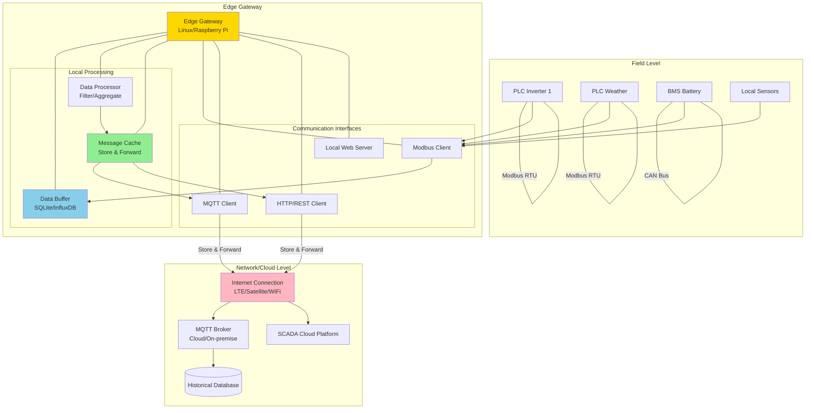
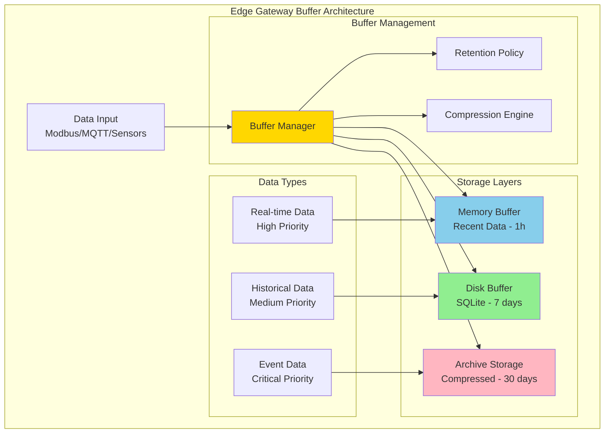
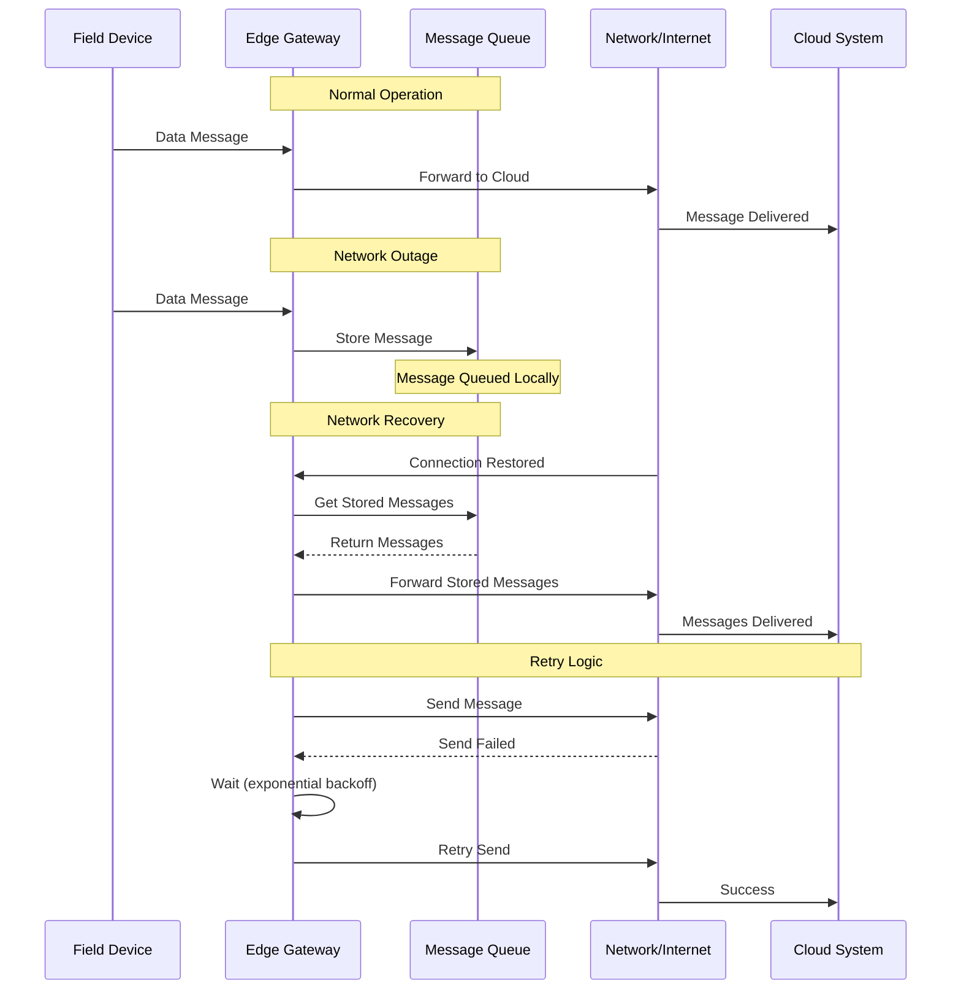
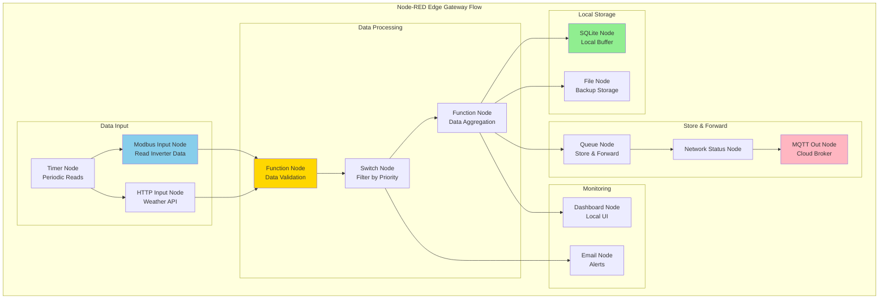
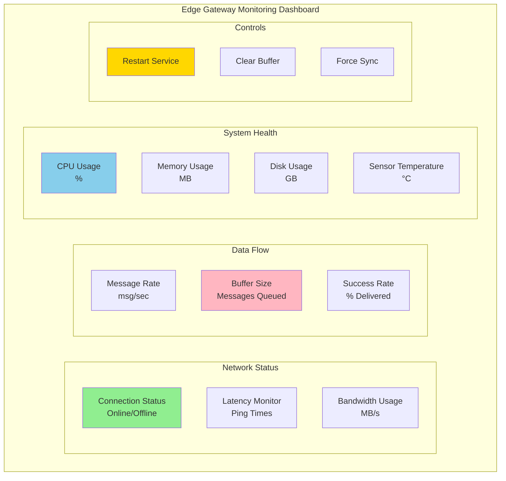

import { 
  SlideContainer, 
  Slide, 
  KeyPoints, 
  SupportingDetails, 
  InstructorNotes,
  VisualSeparator,
  LearningObjective,
  KeyConcept,
  Example
} from '@site/src/components/SlideComponents';

<LearningObjective>
Po tej sekcji student potrafi:
- Zrozumieć rolę edge gateways w architekturze IIoT i ich znaczenie dla systemów OZE
- Zaprojektować mechanizmy buforowania danych lokalnie podczas przerw w łączności
- Zaimplementować store-and-forward patterns dla zapewnienia niezawodności transmisji danych
- Skonfigurować edge gateway z odpowiednimi protokołami komunikacji (Modbus, MQTT, REST)
</LearningObjective>

<SlideContainer>

<Slide title="🌐 Wprowadzenie do Edge Gateways" type="info">

<KeyPoints title="📋 Co to jest Edge Gateway?">
- **Edge Gateway** = urządzenie brzegowe łączące lokalne systemy z chmurą/internetem
- **Lokalne przetwarzanie** - analiza i filtracja danych przed wysłaniem
- **Protocol translation** - konwersja między różnymi protokołami (Modbus ↔ MQTT)
- **Data buffering** - przechowywanie danych podczas przerw w łączności
- **Edge computing** - wykonywanie obliczeń lokalnie bez potrzeby łączności z chmurą
</KeyPoints>

<SupportingDetails title="🎯 Dlaczego Edge Gateways w systemach OZE?">

**Problem z bezpośrednią komunikacją Field → Cloud:**
- **Niestabilna łączność** - farmy OZE często w remote locations
- **High latency** - opóźnienia w komunikacji cloud → field
- **Bandwidth limitations** - ograniczenia sieci mobilnych/satelitarnych
- **Reliability** - utrata łączności = utrata danych
- **Security** - bezpośrednie połączenia do internetu mogą być niebezpieczne

**Rozwiązania Edge Gateway:**
- **Local data storage** - dane bezpieczne lokalnie
- **Offline operation** - system działa bez internetu
- **Data compression** - efektywne wykorzystanie bandwidth
- **Protocol optimization** - najwłaściwszy protokół dla każdego segmentu

</SupportingDetails>

**Architektura Edge Gateway w systemie OZE:**



<InstructorNotes>

**Edge Gateway to kluczowy element** modern IIoT architecture - **bridge** między **field devices** i **cloud systems**.

**Problem statement** - **direct field-to-cloud** communication ma **fundamental limitations**:
- **Network reliability** - remote OZE sites często mają **unstable connections**
- **Latency** - **real-time control** wymaga **local processing**
- **Bandwidth costs** - **mobile/satellite** connections są **expensive**

**Edge Gateway rozwiązuje** te problemy przez **local intelligence**:
- **Protocol translation** - **Modbus** local, **MQTT/HTTPS** cloud
- **Data buffering** - **local storage** podczas network outages
- **Pre-processing** - **filter, aggregate, compress** data przed transmission

Pokaż **architecture diagram** - **Edge Gateway** jako **central hub** pomiędzy **field** i **cloud**.

**Key components**:
- **Data Buffer** - **local database** (SQLite dla simple, InfluxDB dla time-series)
- **Message Cache** - **store-and-forward** mechanism
- **Multiple interfaces** - **Modbus** dla field, **MQTT/HTTP** dla cloud

**Czas**: 6-7 minut z architecture overview.

</InstructorNotes>

</Slide>

<VisualSeparator type="default" />

<Slide title="💾 Data Buffering - lokalne przechowywanie danych" type="technical">

<KeyPoints title="📋 Strategie buforowania danych">
- **Ring buffer** - circular storage, automatyczne usuwanie starych danych
- **Time-based retention** - przechowywanie danych przez określony czas
- **Size-based retention** - limit pojemności bufora
- **Priority buffering** - ważne dane przechowywane dłużej
- **Compression** - kompresja danych dla oszczędności miejsca
</KeyPoints>

**Konfiguracja bufora danych:**



<Example title="Implementacja bufora w Node.js">

**Buffer configuration:**
```javascript
const sqlite3 = require('sqlite3');
const { open } = require('sqlite');
const zlib = require('zlib');

class DataBuffer {
  constructor(config) {
    this.config = {
      maxMemorySize: 1000,      // records in memory
      maxDiskSize: 100000,      // records on disk  
      retentionDays: 7,         // disk retention
      archiveDays: 30,          // archive retention
      compressionThreshold: 1000 // compress after N records
    };
    this.memoryBuffer = [];
    this.db = null;
  }

  async initialize() {
    // SQLite database setup
    this.db = await open({
      filename: './data_buffer.db',
      driver: sqlite3.Database
    });
    
    await this.db.exec(`
      CREATE TABLE IF NOT EXISTS sensor_data (
        id INTEGER PRIMARY KEY AUTOINCREMENT,
        timestamp DATETIME DEFAULT CURRENT_TIMESTAMP,
        device_id TEXT NOT NULL,
        measurement TEXT NOT NULL,
        value REAL NOT NULL,
        quality INTEGER DEFAULT 1,
        compressed INTEGER DEFAULT 0,
        data_blob BLOB
      )
    `);
  }

  async addData(data) {
    // Add to memory buffer first (fastest)
    this.memoryBuffer.push({
      timestamp: new Date(),
      device_id: data.device_id,
      measurement: data.measurement,
      value: data.value,
      quality: data.quality || 1
    });

    // When memory buffer full, flush to disk
    if (this.memoryBuffer.length >= this.config.maxMemorySize) {
      await this.flushToDisk();
    }

    // Check retention policy
    await this.enforceRetention();
  }

  async flushToDisk() {
    if (this.memoryBuffer.length === 0) return;

    const stmt = await this.db.prepare(
      'INSERT INTO sensor_data (device_id, measurement, value, quality) VALUES (?, ?, ?, ?)'
    );

    for (const record of this.memoryBuffer) {
      await stmt.run(
        record.device_id,
        record.measurement, 
        record.value,
        record.quality
      );
    }

    await stmt.finalize();
    this.memoryBuffer = [];
  }

  async getBufferedData(deviceId, from, to) {
    // Get from memory first
    let memoryData = this.memoryBuffer.filter(record => 
      record.device_id === deviceId &&
      record.timestamp >= from &&
      record.timestamp <= to
    );

    // Get from disk
    const diskData = await this.db.all(
      'SELECT * FROM sensor_data WHERE device_id = ? AND timestamp BETWEEN ? AND ?',
      [deviceId, from, to]
    );

    return [...memoryData, ...diskData].sort((a, b) => 
      new Date(a.timestamp) - new Date(b.timestamp)
    );
  }
}
```

</Example>

<SupportingDetails title="⚠️ Buffer Management Strategies">

**1. Ring Buffer (Circular)**
- Fixed size buffer, overwrites oldest data
- **Pros**: predictable memory usage, fast writes
- **Cons**: data loss when buffer full

**2. Time-based Retention**
- Keep data for X hours/days based on timestamp
- **Pros**: predictable disk usage, no data loss for specified period
- **Cons**: variable memory usage

**3. Priority-based Buffering**
- Critical data (alarms, commands) stored longer
- **Pros**: important data preserved during outages
- **Cons**: complex management logic

**4. Compression**
- Compress old data to save space
- **Pros**: more data in same space
- **Cons**: CPU overhead, slower access

</SupportingDetails>

<InstructorNotes>

**Data buffering** to **core feature** edge gateway - **local storage** podczas network outages.

**Buffer strategies** - różne approaches dla różnych scenarios:
- **Ring buffer** - **simple**, **predictable**, ale **data loss** possible
- **Time-based** - **no data loss** dla specified period, **variable usage**
- **Priority-based** - **sophisticated** management, **important data** preserved

**Pokaż implementation** - **Node.js example** z **SQLite** dla **persistent storage**.

**Key features**:
- **Memory buffer** - **fastest access** dla recent data
- **Disk buffer** - **persistent storage** dla longer retention
- **Compression** - **space optimization** dla old data
- **Retention policies** - **automatic cleanup** old data

**Practical considerations**:
- **Storage capacity** planning - ile data needs local storage
- **Performance** - **memory vs disk** trade-offs
- **Data integrity** - **corruption handling** w **edge environments**

**Czas**: 7-8 minut z practical implementation example.

</InstructorNotes>

</Slide>

<VisualSeparator type="default" />

<Slide title="🔄 Store-and-Forward Mechanism" type="warning">

<KeyPoints title="📋 Jak działa Store-and-Forward?">
- **Store** - zapisanie wiadomości lokalnie gdy łączność niedostępna
- **Forward** - automatyczne wysłanie gdy łączność powróci
- **Retry logic** - ponowne próby wysłania z exponential backoff
- **Message ordering** - zachowanie kolejności wiadomości
- **Duplicate detection** - unikanie wysyłania duplikatów
</KeyPoints>

**Architektura Store-and-Forward:**



<Example title="Implementacja Store-and-Forward w Python">

**Message Queue Manager:**
```python
import time
import json
import sqlite3
import threading
import requests
from datetime import datetime, timedelta
import queue

class StoreAndForwardManager:
    def __init__(self, config):
        self.config = config
        self.message_queue = queue.Queue()
        self.db_path = config['db_path']
        self.max_retries = config.get('max_retries', 5)
        self.retry_delay = config.get('retry_delay', 60)  # seconds
        self.is_online = False
        self.worker_thread = None
        
    def initialize(self):
        # Setup SQLite database for message persistence
        conn = sqlite3.connect(self.db_path)
        cursor = conn.cursor()
        cursor.execute('''
            CREATE TABLE IF NOT EXISTS message_queue (
                id INTEGER PRIMARY KEY AUTOINCREMENT,
                topic TEXT NOT NULL,
                payload TEXT NOT NULL,
                qos INTEGER DEFAULT 1,
                timestamp DATETIME DEFAULT CURRENT_TIMESTAMP,
                retry_count INTEGER DEFAULT 0,
                last_retry DATETIME,
                status TEXT DEFAULT 'pending'
            )
        ''')
        conn.commit()
        conn.close()
        
        # Start background worker
        self.worker_thread = threading.Thread(target=self._worker, daemon=True)
        self.worker_thread.start()
        
    def send_message(self, topic, payload, qos=1):
        """Send message - either immediately or store for later"""
        message = {
            'topic': topic,
            'payload': json.dumps(payload),
            'qos': qos,
            'timestamp': datetime.now()
        }
        
        if self.is_online:
            success = self._direct_send(message)
            if success:
                return True
        
        # If offline or send failed, store message
        self._store_message(message)
        return False
        
    def _direct_send(self, message):
        """Attempt direct send to cloud/MQTT broker"""
        try:
            if self.config['transport'] == 'mqtt':
                return self._send_mqtt(message)
            elif self.config['transport'] == 'http':
                return self._send_http(message)
        except Exception as e:
            print(f"Direct send failed: {e}")
            return False
            
    def _send_mqtt(self, message):
        """Send via MQTT"""
        import paho.mqtt.client as mqtt
        
        client = mqtt.Client()
        client.connect(self.config['mqtt_broker'], 
                      self.config['mqtt_port'], 60)
        
        result = client.publish(
            message['topic'], 
            message['payload'], 
            qos=message['qos']
        )
        client.disconnect()
        return result.rc == 0
        
    def _send_http(self, message):
        """Send via HTTP/REST API"""
        headers = {'Content-Type': 'application/json'}
        data = {
            'topic': message['topic'],
            'payload': message['payload'],
            'timestamp': message['timestamp'].isoformat()
        }
        
        response = requests.post(
            self.config['api_endpoint'],
            json=data,
            headers=headers,
            timeout=30
        )
        return response.status_code == 200
        
    def _store_message(self, message):
        """Store message in local database"""
        conn = sqlite3.connect(self.db_path)
        cursor = conn.cursor()
        
        cursor.execute('''
            INSERT INTO message_queue (topic, payload, qos, timestamp)
            VALUES (?, ?, ?, ?)
        ''', (
            message['topic'],
            message['payload'], 
            message['qos'],
            message['timestamp']
        ))
        
        conn.commit()
        conn.close()
        print(f"Message stored: {message['topic']}")
        
    def _worker(self):
        """Background worker to process stored messages"""
        while True:
            try:
                if self.is_online:
                    self._process_stored_messages()
                    
                time.sleep(10)  # Check every 10 seconds
                
            except Exception as e:
                print(f"Store-and-forward worker error: {e}")
                time.sleep(30)
                
    def _process_stored_messages(self):
        """Process all stored messages"""
        conn = sqlite3.connect(self.db_path)
        cursor = conn.cursor()
        
        cursor.execute('''
            SELECT * FROM message_queue 
            WHERE status = 'pending' 
            ORDER BY timestamp ASC
        ''')
        
        messages = cursor.fetchall()
        
        for msg in messages:
            msg_id, topic, payload, qos, timestamp, retry_count, last_retry, status = msg
            
            # Check retry limit
            if retry_count >= self.max_retries:
                cursor.execute(
                    "UPDATE message_queue SET status = 'failed' WHERE id = ?",
                    (msg_id,)
                )
                continue
                
            # Check retry delay
            if last_retry:
                last_retry_dt = datetime.fromisoformat(last_retry)
                if datetime.now() - last_retry_dt < timedelta(seconds=self.retry_delay * (2**retry_count)):
                    continue
                    
            # Attempt to send
            message = {
                'topic': topic,
                'payload': payload,
                'qos': qos
            }
            
            success = self._direct_send(message)
            
            if success:
                # Mark as sent
                cursor.execute(
                    "DELETE FROM message_queue WHERE id = ?",
                    (msg_id,)
                )
                print(f"Stored message sent successfully: {topic}")
            else:
                # Update retry count
                cursor.execute(
                    "UPDATE message_queue SET retry_count = ?, last_retry = ? WHERE id = ?",
                    (retry_count + 1, datetime.now(), msg_id)
                )
                
        conn.commit()
        conn.close()
        
    def set_network_status(self, online):
        """Update network connectivity status"""
        self.is_online = online
        if online:
            print("Network online - starting store-and-forward processing")
        else:
            print("Network offline - messages will be stored locally")
```

</Example>

<KeyConcept title="🎯 Retry Strategies">

**1. Exponential Backoff**
- Retry delays: 60s, 120s, 240s, 480s, 960s
- Prevents overwhelming network during recovery

**2. Maximum Retry Limit**
- Stop retrying after N attempts to prevent infinite loops
- Move to "failed" status for manual review

**3. Message Prioritization**
- Critical messages (alarms) retried more aggressively
- Normal telemetry can wait longer

**4. Duplicate Prevention**
- Message IDs to prevent sending same data twice
- Timestamp-based deduplication

</KeyConcept>

<InstructorNotes>

**Store-and-Forward** to **critical mechanism** dla **reliable data transmission** w **unreliable networks**.

**Key concept**: **Store locally** gdy **network down**, **forward automatically** gdy **network back**.

**Sequence diagram** pokazuje **normal operation**, **network outage**, **recovery process**.

**Python implementation** pokazuje **complete working example**:
- **Message queuing** w **SQLite database**
- **Retry logic** z **exponential backoff**
- **Network status monitoring**
- **Background worker** dla **automatic processing**

**Key features**:
- **Persistent storage** - messages survive **gateway restart**
- **Retry policies** - **configurable** retry count i delays
- **Status tracking** - **pending**, **sent**, **failed** statuses
- **Multiple transports** - **MQTT** i **HTTP** support

**Retry strategies**:
- **Exponential backoff** - **prevents network flooding**
- **Maximum retries** - **prevents infinite loops**
- **Message prioritization** - **critical messages first**

**Production considerations**:
- **Database size management** - **cleanup** failed messages
- **Monitoring** - **queue size**, **retry counts**, **success rates**
- **Configuration** - **tune** retry parameters dla **network conditions**

**Czas**: 8-9 minut z **complete implementation** example.

</InstructorNotes>

</Slide>

<VisualSeparator type="default" />

<Slide title="🛠️ Node-RED jako Edge Gateway" type="success">

<KeyPoints title="📋 Node-RED dla Edge Computing">
- **Node-RED** = visual programming tool for IoT applications
- **Ready-made nodes** dla Modbus, MQTT, HTTP, databases
- **Easy deployment** na Raspberry Pi, industrial gateways
- **Built-in store-and-forward** w niektórych node'ach
- **JSON configuration** - łatwe versioning i backup
</KeyPoints>

**Node-RED Flow dla Edge Gateway:**



<Example title="Node-RED Flow Configuration">

**Modbus to MQTT Bridge Flow:**
```json
[
  {
    "id": "modbus-read",
    "type": "modbus-read",
    "z": "flow1",
    "name": "Read Inverter Data",
    "showStatusActivities": false,
    "logIOActivities": false,
    "unitid": "1",
    "dataType": "HoldingRegister",
    "adr": "40001",
    "quantity": "10",
    "rate": "10",
    "rateUnit": "s",
    "server": "modbus-server",
    "useIOFile": false,
    "ioFile": "",
    "useIOForPayload": false
  },
  {
    "id": "data-processor",
    "type": "function",
    "z": "flow1",
    "name": "Process Data",
    "func": "// Extract and format data\nconst power = msg.payload.data[0];\nconst voltage = msg.payload.data[1] / 10.0;\nconst temperature = msg.payload.data[2] / 100.0;\n\n// Create message payload\nmsg.payload = {\n    device_id: \"inverter_01\",\n    timestamp: new Date().toISOString(),\n    measurements: {\n        power: power,\n        voltage: voltage,\n        temperature: temperature\n    }\n};\n\nmsg.topic = \"/pv-farm/inverters/01/data\";\nreturn msg;",
    "outputs": 1,
    "initialize": "",
    "finalize": ""
  },
  {
    "id": "store-forward",
    "type": "mqtt out",
    "z": "flow1",
    "name": "Store & Forward",
    "topic": "",
    "qos": "1",
    "retain": "false",
    "broker": "mqtt-broker",
    "x": 600,
    "y": 200
  },
  {
    "id": "local-buffer",
    "type": "sqlite",
    "z": "flow1",
    "mydb": "data_buffer.db",
    "sqlquery": "INSERT INTO sensor_data (device_id, timestamp, payload) VALUES (?, ?, ?)",
    "sql": "",
    "name": "Buffer Data",
    "x": 400,
    "y": 300
  }
]
```

<SupportingDetails title="🔧 Node-RED Edge Gateway Features">

**1. Built-in Protocol Support**
- **Modbus** nodes dla industrial data acquisition
- **MQTT** nodes z automatic reconnection
- **HTTP** nodes dla REST API calls
- **SQLite** nodes dla local data storage

**2. Store-and-Forward Capabilities**
- **MQTT Out** node automatically buffers podczas disconnection
- **Queue** nodes dla advanced message queuing
- **Function** nodes dla custom retry logic

**3. Local Dashboard**
- **Dashboard** nodes dla web-based monitoring
- **Gauges, charts, tables** dla real-time visualization
- **Form controls** dla manual operations

**4. Deployment Options**
- **Raspberry Pi** - cost-effective edge computing
- **Industrial gateways** - ruggedized hardware
- **Docker containers** - easy deployment i updates

</SupportingDetails>

**Node-RED vs Custom Implementation:**

| Feature | Node-RED | Custom Code |
|---------|----------|-------------|
| **Development time** | Szybki (visual) | Wolniejszy (coding) |
| **Maintenance** | Łatwy (visual debug) | Trudniejszy (code debug) |
| **Flexibility** | Ograniczona (nodes) | Pełna (custom logic) |
| **Performance** | Dobry (JavaScript) | Lepszy (native) |
| **Deployment** | Simple (JSON export) | Complex (build/deploy) |
| **Learning curve** | Łatwy | Steeper |

<InstructorNotes>

**Node-RED** to **popular choice** dla **rapid prototyping** edge gateways, szczególnie w **OZE applications**.

**Visual programming** - **drag-and-drop** nodes, **wiring** connections, **no coding** required dla basic scenarios.

**Built-in capabilities**:
- **Modbus** integration - **ready-made nodes**
- **MQTT** support z **automatic store-and-forward**
- **Data processing** - **function nodes** dla **custom logic**
- **Local dashboard** - **web interface** bez additional coding

**JSON flow example** pokazuje **real configuration** - **Modbus input** → **data processing** → **local buffer** → **MQTT output**.

**Advantages**:
- **Fast development** - **visual interface**
- **Easy maintenance** - **non-technical users** can modify
- **Rich ecosystem** - **thousands of nodes** available
- **Deployment flexibility** - **Raspberry Pi**, **Docker**, **cloud**

**Limitations**:
- **Performance** - **JavaScript runtime** vs **native code**
- **Complexity** - **very complex logic** może być **difficult** w visual editor
- **Vendor dependency** - **IBM/Siemens** platform

**Comparison table** - **when to use Node-RED vs custom implementation**.

**Czas**: 7-8 minut z **practical flow examples** i **comparison**.

</InstructorNotes>

</Slide>

<VisualSeparator type="success" />

<Slide title="📊 Monitoring i zarządzanie Edge Gateway" type="success">

<KeyPoints title="📋 Kluczowe metryki do monitorowania">
- **Network connectivity** - uptime, latency, packet loss
- **Storage usage** - disk space, buffer size, archive management
- **Message throughput** - messages/second, success/failure rates
- **System health** - CPU, memory, temperature, power consumption
- **Data integrity** - message sequence, duplicates, missing data
</KeyPoints>

**Dashboard dla Edge Gateway:**



<Example title="Health Check i Alerting">

**Health Check Script (Python):**
```python
import psutil
import sqlite3
import requests
import time
from datetime import datetime, timedelta

class EdgeGatewayMonitor:
    def __init__(self, config):
        self.config = config
        self.alerts = []
        
    def check_system_health(self):
        """Comprehensive system health check"""
        health_status = {
            'timestamp': datetime.now().isoformat(),
            'overall_status': 'healthy',
            'issues': []
        }
        
        # CPU usage check
        cpu_percent = psutil.cpu_percent(interval=1)
        if cpu_percent > 90:
            health_status['issues'].append(f"High CPU usage: {cpu_percent}%")
            health_status['overall_status'] = 'warning'
        
        # Memory usage check
        memory = psutil.virtual_memory()
        if memory.percent > 85:
            health_status['issues'].append(f"High memory usage: {memory.percent}%")
            health_status['overall_status'] = 'warning'
            
        # Disk space check
        disk = psutil.disk_usage('/')
        disk_percent = (disk.used / disk.total) * 100
        if disk_percent > 90:
            health_status['issues'].append(f"Low disk space: {disk_percent:.1f}%")
            health_status['overall_status'] = 'critical'
            
        # Buffer size check
        buffer_size = self.get_buffer_size()
        if buffer_size > 10000:  # 10k messages
            health_status['issues'].append(f"Large buffer: {buffer_size} messages")
            health_status['overall_status'] = 'warning'
            
        # Network connectivity check
        if not self.check_network_connectivity():
            health_status['issues'].append("Network connectivity issues")
            health_status['overall_status'] = 'critical'
            
        return health_status
        
    def get_buffer_size(self):
        """Get number of queued messages"""
        try:
            conn = sqlite3.connect(self.config['db_path'])
            cursor = conn.cursor()
            cursor.execute("SELECT COUNT(*) FROM message_queue WHERE status = 'pending'")
            count = cursor.fetchone()[0]
            conn.close()
            return count
        except Exception as e:
            print(f"Error checking buffer size: {e}")
            return -1
            
    def check_network_connectivity(self):
        """Test network connectivity"""
        try:
            # Test MQTT broker connection
            response = requests.get(
                f"http://{self.config['mqtt_broker']}:1883", 
                timeout=5
            )
            return True
        except:
            try:
                # Fallback: ping test
                import subprocess
                result = subprocess.run(
                    ['ping', '-c', '1', self.config['mqtt_broker']],
                    capture_output=True,
                    timeout=5
                )
                return result.returncode == 0
            except:
                return False
                
    def send_alert(self, message, severity='warning'):
        """Send alert via email/SMS/webhook"""
        alert = {
            'timestamp': datetime.now().isoformat(),
            'severity': severity,
            'message': message,
            'gateway_id': self.config['gateway_id']
        }
        
        if self.config.get('webhook_url'):
            try:
                requests.post(self.config['webhook_url'], json=alert, timeout=10)
            except Exception as e:
                print(f"Failed to send webhook alert: {e}")
                
        # Store alert locally
        self.alerts.append(alert)
        if len(self.alerts) > 100:  # Keep only last 100
            self.alerts.pop(0)
            
    def run_monitoring(self):
        """Run continuous monitoring"""
        while True:
            try:
                health = self.check_system_health()
                
                # Log health status
                print(f"Health check: {health['overall_status']}")
                if health['issues']:
                    for issue in health['issues']:
                        print(f"  Issue: {issue}")
                        
                # Send alerts for critical issues
                if health['overall_status'] == 'critical':
                    self.send_alert(
                        f"Critical issues detected: {'; '.join(health['issues'])}",
                        'critical'
                    )
                elif health['overall_status'] == 'warning':
                    self.send_alert(
                        f"Warning issues detected: {'; '.join(health['issues'])}",
                        'warning'
                    )
                    
                time.sleep(60)  # Check every minute
                
            except Exception as e:
                print(f"Monitoring error: {e}")
                time.sleep(60)

# Configuration
config = {
    'gateway_id': 'edge-gateway-01',
    'db_path': '/opt/edge-gateway/data_buffer.db',
    'mqtt_broker': 'mqtt.example.com',
    'webhook_url': 'https://monitoring.example.com/alerts'
}

# Run monitoring
monitor = EdgeGatewayMonitor(config)
monitor.run_monitoring()
```

</Example>

<SupportingDetails title="🛡️ Best Practices dla Edge Gateway Management">

**1. Automated Health Monitoring**
- **Continuous monitoring** system resources
- **Proactive alerts** before critical issues
- **Automated recovery** gdzie possible

**2. Data Management**
- **Regular cleanup** old buffered data
- **Archive management** dla long-term storage
- **Backup strategies** dla critical configuration

**3. Security Considerations**
- **Regular firmware updates**
- **Access control** i **authentication**
- **Network security** (VPN, firewalls)

**4. Remote Management**
- **SSH access** dla maintenance
- **Configuration management** (Ansible, Puppet)
- **Remote updates** capability

</SupportingDetails>

<InstructorNotes>

**Monitoring edge gateways** to **critical operational requirement** - **remote sites** bez local IT support potrzebują **automated monitoring**.

**Key metrics**:
- **Network status** - **uptime**, **latency**, **connectivity**
- **Storage usage** - **buffer size**, **disk space**
- **Performance** - **CPU**, **memory**, **message throughput**
- **Data integrity** - **success rates**, **message ordering**

**Dashboard** pokazuje **essential information** dla **remote monitoring** - **status overview**, **trends**, **controls**.

**Python monitoring script** - **comprehensive health check**:
- **System resources** (CPU, memory, disk)
- **Buffer management** (queue size)
- **Network connectivity** testing
- **Automated alerting** via webhooks/email

**Best practices**:
- **Automated monitoring** - **no manual intervention** needed
- **Proactive alerts** - **warn before** critical issues
- **Data management** - **prevent** storage overflow
- **Security** - **regular updates**, **access control**

**Production deployment** wymaga **robust monitoring** i **alerting system** - **edge gateways** są **critical infrastructure** dla **OZE operations**.

**Czas**: 7-8 minut z **complete monitoring implementation**.

</InstructorNotes>

</Slide>

</SlideContainer>
