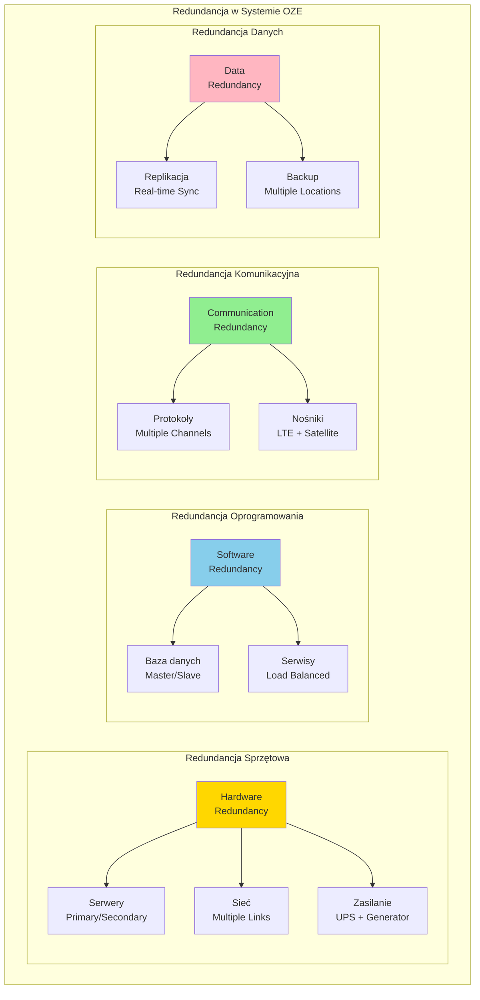
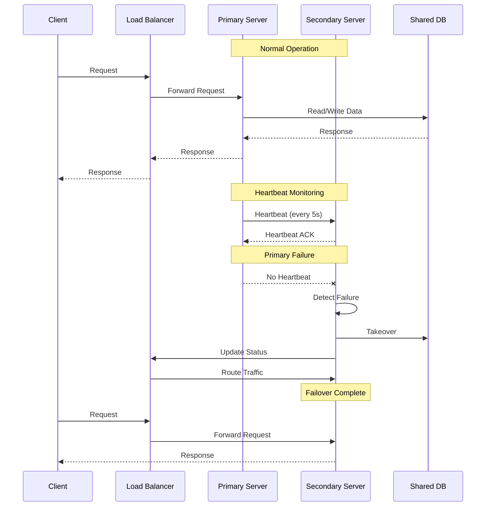
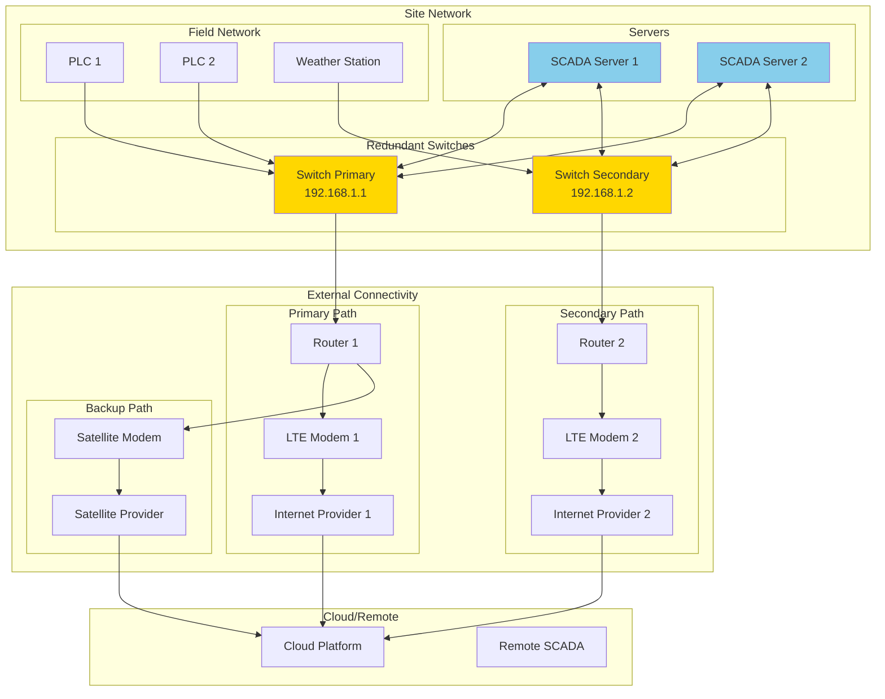
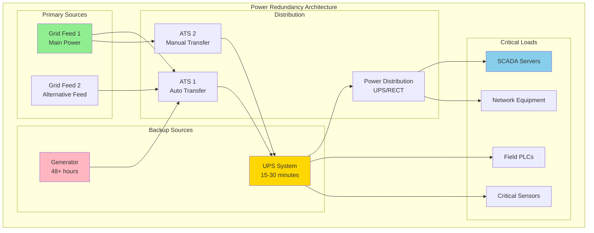
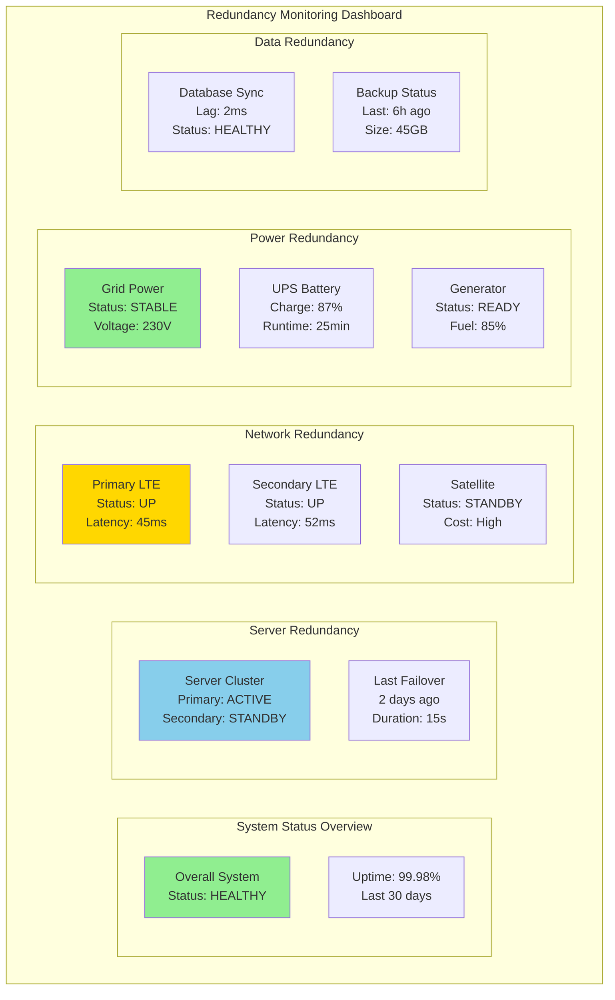

import { 
  SlideContainer, 
  Slide, 
  KeyPoints, 
  SupportingDetails, 
  InstructorNotes,
  VisualSeparator,
  LearningObjective,
  KeyConcept,
  Example
} from '@site/src/components/SlideComponents';

<LearningObjective>
Po tej sekcji student potrafi:
- Zdefiniować pojęcia redundancji i wysokiej dostępności w kontekście systemów monitoringu OZE
- Zaprojektować rozwiązania redundantne dla różnych komponentów systemu (serwery, sieć, zasilanie)
- Zidentyfikować punkty awarii w systemie i zaproponować odpowiednie mechanizmy zabezpieczeń
- Skonfigurować podstawowe mechanizmy failover i load balancing dla systemów SCADA i IIoT
</LearningObjective>

<SlideContainer>

<Slide title="🛡️ Wprowadzenie do redundancji i wysokiej dostępności" type="info">

<KeyPoints title="📋 Podstawowe pojęcia">
- **Redundancja** = duplikowanie komponentów systemu dla zapewnienia ciągłości działania
- **Wysoka dostępność** = system działa przez określony procent czasu (99%, 99.9%, 99.99%)
- **Failover** = automatyczne przełączanie na komponent zapasowy przy awarii głównego
- **Load balancing** = rozkładanie obciążenia między wieloma serwerami
- **Mean Time Between Failures (MTBF)** = średni czas między awariami
- **Mean Time To Repair (MTTR)** = średni czas naprawy
</KeyPoints>

<SupportingDetails title="🎯 Znaczenie dla systemów OZE">

**Dlaczego redundancja jest krytyczna w OZE?**

**Regulacyjne wymagania**: Operatorzy sieci (TSO) wymagają min. 99% uptime dla instalacji >10MW

**Konsekwencje przestojów**: 
- **Strata przychodów**: 1h przestoju w farmie 50MW = ~5,000 EUR przy cenie 100 EUR/MWh
- **Kary regulacyjne**: Opłaty za niedostarczenie zobowiązanej mocy
- **Utrata zaufania**: Problemy z monitoringiem wpływają na reputację O&M

**Krytyczne funkcje wymagające redundancji**:
- **Monitoring produkcji** - ciągłe zbieranie danych KPI
- **Systemy bezpieczeństwa** - detekcja pożarów, przeciążeń
- **Komunikacja z TSO** - raportowanie mocy, status instalacji

</SupportingDetails>

**Typy redundancji w systemach OZE:**



<InstructorNotes>

**Redundancja to fundament** reliable industrial systems - szczególnie w OZE gdzie **uptime directly impacts revenue**.

**Basic concepts** - **redundancy** vs **high availability**. **99% uptime** = **3.65 days downtime/year**. **99.9%** = **8.76 hours/year**. **Cost of downtime** znacznie przekracza **cost of redundancy**.

**Regulatory requirements** - **TSO/OSD wymagają** specific uptime dla **large installations**. **Below threshold** = **penalties**.

**Types of redundancy** - **hardware** (servers, network), **software** (services, databases), **communication** (multiple protocols/carriers), **data** (replication, backup).

Pokaż **redundancy types diagram** - **different levels** redundancy w **complete system**.

**Real-world example**: **50MW farm** - **1 hour downtime** = **5000 EUR loss** przy **100 EUR/MWh**. **Redundancy cost** ~**50k EUR** - **ROI** w **10 hours** of prevented downtime.

**Czas**: 6-7 minut z **concrete examples** i **cost analysis**.

</InstructorNotes>

</Slide>

<VisualSeparator type="default" />

<Slide title="🏗️ Redundancja serwerów i aplikacji" type="technical">

<KeyPoints title="📋 Strategie redundancji serwerów">
- **Active/Passive** - jeden serwer aktywny, drugi w trybie standby
- **Active/Active** - oba serwery obsługują ruch, load balancing
- **N+1 Redundancy** - N serwerów aktywnych + 1 zapasowy
- **Geographic Redundancy** - serwery w różnych lokalizacjach
- **Heartbeat monitoring** - ciągłe sprawdzanie statusu serwerów
</KeyPoints>

**Architektura Active/Passive z failover:**



<Example title="Konfiguracja redundancji SCADA Server">

**Windows Server Failover Cluster Setup:**
```powershell
# Konfiguracja Windows Failover Cluster
Import-Module FailoverClusters

# Sprawdzenie wymagań
Test-Cluster -Node "SCADA01", "SCADA02"

# Utworzenie klastra
New-Cluster -Name "SCADA-Cluster" -Node "SCADA01", "SCADA02" -StaticAddress 192.168.1.100

# Konfiguracja quorum
Set-ClusterQuorum -NodeAndFileShareMajority "\\NFSSERVER\quorum"

# Dodanie roli SCADA Server
Add-ClusterGenericServiceRole -Name "SCADA-Service" -ServiceName "SCADAServer"
```

**Konfiguracja PostgreSQL w trybie Master/Slave:**
```sql
-- Konfiguracja Master (SCADA01)
-- postgresql.conf
wal_level = replica
max_wal_senders = 3
max_replication_slots = 3

-- pg_hba.conf
host replication replicator 192.168.1.0/24 md5

-- Utworzenie użytkownika replikacji
CREATE USER replicator REPLICATION LOGIN CONNECTION LIMIT 3 ENCRYPTED PASSWORD 'secure_password';

-- Konfiguracja Slave (SCADA02)
-- pg_basebackup dla inicjalnej replikacji
pg_basebackup -h 192.168.1.11 -D /var/lib/postgresql/data -U replicator -v -P -W

-- recovery.conf
standby_mode = 'on'
primary_conninfo = 'host=192.168.1.11 port=5432 user=replicator password=secure_password'
```

<SupportingDetails title="🔧 Heartbeat i Health Check Mechanisms">

**1. Application-level Health Checks**
```python
# Health check endpoint dla SCADA Server
from flask import Flask, jsonify
import psutil
import time

app = Flask(__name__)

@app.route('/health')
def health_check():
    health_status = {
        'status': 'healthy',
        'timestamp': time.time(),
        'uptime': time.time() - start_time,
        'cpu_percent': psutil.cpu_percent(),
        'memory_percent': psutil.virtual_memory().percent
    }
    
    # Sprawdzenie krytycznych komponentów
    if health_status['cpu_percent'] > 90:
        health_status['status'] = 'unhealthy'
    if health_status['memory_percent'] > 85:
        health_status['status'] = 'unhealthy'
        
    return jsonify(health_status)

# External monitoring script
import requests
import time

def monitor_scada_server():
    while True:
        try:
            response = requests.get('http://scada01:8080/health', timeout=5)
            if response.status_code != 200:
                trigger_failover()
        except requests.RequestException:
            trigger_failover()
        
        time.sleep(10)
```

**2. Network-level Monitoring**
- **ICMP ping** - podstawowa kontrola łączności
- **Port connectivity** - sprawdzenie dostępności serwisów
- **Application-specific** - testy query do baz danych

</SupportingDetails>

<KeyConcept title="⚙️ Failover Strategies">

**Automatic Failover (do 30 sekund)**
- **Heartbeat failure** detection
- **Automatic** database takeover
- **Service restart** na secondary server
- **Load balancer** update

**Manual Failover (planowany maintenance)**
- **Graceful shutdown** primary services
- **Data synchronization** verification
- **Controlled switch** to secondary

**Rollback Procedures**
- **Verify** secondary stability
- **Data integrity** checks
- **Performance** monitoring
- **Return** to primary when ready

</KeyConcept>

<InstructorNotes>

**Server redundancy** to **most common** implementation w industrial systems.

**Active/Passive** - **simpler**, **lower cost**, ale **longer failover time**. **Active/Active** - **more complex**, **higher performance**, **faster failover**.

**Sequence diagram** pokazuje **typical failover** scenario - **heartbeat monitoring**, **failure detection**, **automatic takeover**.

**Practical examples**:
- **Windows Failover Cluster** - **enterprise solution** dla **SCADA systems**
- **PostgreSQL Master/Slave** - **database redundancy**

**Health check mechanisms**:
- **Application-level** - **custom endpoints** sprawdzające **service health**
- **System-level** - **CPU**, **memory**, **disk space**
- **Network-level** - **connectivity testing**

**Failover strategies** - **automatic** dla **emergency**, **manual** dla **planned maintenance**.

**Timing** - **30 seconds** to **acceptable** dla **most industrial applications**. **Critical systems** mogą wymagać **faster failover**.

**Czas**: 8-9 minut z **practical configuration examples**.

</InstructorNotes>

</Example>

</Slide>

<VisualSeparator type="default" />

<Slide title="🌐 Redundancja sieciowa i komunikacyjna" type="warning">

<KeyPoints title="📋 Komponenty redundancji sieciowej">
- **Multiple network paths** - różne ścieżki fizyczne do tego samego celu
- **Link aggregation** - łączenie wielu interfejsów w jeden logiczny
- **VLAN redundancy** - wirtualne sieci z multiple switches
- **DNS redundancy** - multiple DNS servers
- **Carrier diversity** - różni dostawcy łączności (LTE + Satellite)
</KeyPoints>

**Redundant network topology:**



<Example title="Konfiguracja redundantnej łączności">

**Router Configuration (VLAN + Load Balancing):**
```bash
# Router główny - konfiguracja redundantnych interfejsów
interface GigabitEthernet0/0
 description "Primary Uplink - LTE 1"
 ip address 10.0.1.1 255.255.255.252
 standby 1 ip 10.0.1.3
 standby 1 priority 110
 standby 1 preempt

interface GigabitEthernet0/1  
 description "Secondary Uplink - LTE 2"
 ip address 10.0.2.1 255.255.255.252
 standby 2 ip 10.0.2.3
 standby 2 priority 100
 standby 2 preempt

# Load balancing policy
route-map LOAD_BALANCE permit 10
 match ip address 101
 set ip next-hop 10.0.1.2

route-map LOAD_BALANCE permit 20
 match ip address 102  
 set ip next-hop 10.0.2.2

# Access lists dla load balancing
access-list 101 permit ip 192.168.1.0 0.0.0.255 any
access-list 102 permit ip 192.168.2.0 0.0.0.255 any
```

**Network Monitoring Script:**
```python
import subprocess
import time
import requests
from datetime import datetime

class NetworkRedundancyMonitor:
    def __init__(self, config):
        self.primary_gateway = config['primary_gateway']
        self.secondary_gateway = config['secondary_gateway'] 
        self.backup_gateway = config['backup_gateway']
        self.test_endpoint = config['test_endpoint']  # e.g., "8.8.8.8"
        
    def ping_test(self, gateway):
        """Test connectivity przez ping"""
        try:
            result = subprocess.run(
                ['ping', '-c', '3', '-W', '5', gateway],
                capture_output=True,
                timeout=15
            )
            return result.returncode == 0
        except:
            return False
            
    def http_test(self, url):
        """Test HTTP connectivity"""
        try:
            response = requests.get(url, timeout=10)
            return response.status_code == 200
        except:
            return False
            
    def route_switch_test(self):
        """Test switching między routes"""
        routes = [
            {'name': 'Primary LTE', 'gateway': self.primary_gateway},
            {'name': 'Secondary LTE', 'gateway': self.secondary_gateway},
            {'name': 'Satellite Backup', 'gateway': self.backup_gateway}
        ]
        
        results = {}
        for route in routes:
            # Test basic connectivity
            ping_ok = self.ping_test(route['gateway'])
            
            # Test internet connectivity
            http_ok = self.http_test(f"http://{self.test_endpoint}")
            
            results[route['name']] = {
                'gateway_reachable': ping_ok,
                'internet_available': http_ok,
                'status': 'UP' if ping_ok and http_ok else 'DOWN'
            }
            
        return results
        
    def monitor_network(self):
        """Continuous network monitoring"""
        while True:
            start_time = time.time()
            
            try:
                status = self.route_switch_test()
                
                # Log status
                print(f"[{datetime.now()}] Network Status:")
                for route_name, route_status in status.items():
                    print(f"  {route_name}: {route_status['status']}")
                    
                # Alert if all routes down
                all_down = all(
                    route['status'] == 'DOWN' 
                    for route in status.values()
                )
                
                if all_down:
                    self.send_alert("All network paths are down!")
                    
            except Exception as e:
                print(f"Monitoring error: {e}")
                
            # Wait until next check (60 seconds)
            elapsed = time.time() - start_time
            time.sleep(max(0, 60 - elapsed))
```

<SupportingDetails title="📡 Carrier Diversity - różni dostawcy">

**Strategy dla remote OZE sites:**

**Primary**: **LTE Provider A** (main carrier)
**Secondary**: **LTE Provider B** (different carrier)  
**Backup**: **Satellite** (VSAT or Iridium)

**Benefits**:
- **Geographic redundancy** - różne cell towers
- **Technology diversity** - LTE vs Satellite
- **Vendor independence** - no single point of failure

**Cost considerations**:
- **Dual LTE** może być **expensive** (2x subscription costs)
- **Satellite backup** - **high cost** ale **reliable** dla **emergency**

</SupportingDetails>

</Example>

<InstructorNotes>

**Network redundancy** to **critical** dla **remote OZE installations** gdzie **single network failure** może **isolate entire site**.

**Multiple levels** redundancy:
- **Local network** - **redundant switches**, **link aggregation**
- **External connectivity** - **multiple carriers**, **different technologies**

**Topology diagram** pokazuje **complete redundant setup** - **multiple paths** do **cloud/remote systems**.

**Router configuration** example - **HSRP/VRRP** dla **gateway redundancy**, **load balancing** policies.

**Monitoring script** - **continuous testing** wszystkich **network paths**, **automatic alerts** gdy **all paths down**.

**Carrier diversity** - **practical consideration** dla **remote sites**:
- **Different LTE carriers** - **geographic redundancy**
- **Satellite backup** - **expensive** ale **reliable** dla **emergency**

**Real-world costs**: **Dual LTE** może kosztować **500-1000 EUR/month**, **satellite** dodatkowo **800-1500 EUR/month**. **Cost** vs **risk** analysis.

**Czas**: 8-9 minut z **network topology** i **monitoring examples**.

</InstructorNotes>

</Slide>

<VisualSeparator type="default" />

<Slide title="⚡ Redundancja zasilania i infrastruktury" type="warning">

<KeyPoints title="📋 Komponenty redundancji zasilania">
- **UPS (Uninterruptible Power Supply)** - baterie dla krótkich przerw
- **Generator backup** - zasilanie długoterminowe podczas awarii sieci
- **Dual power feeds** - dwa niezależne źródła zasilania z sieci
- **Automatic transfer switch (ATS)** - automatyczne przełączanie źródeł
- **Environmental monitoring** - temperatura, wilgotność, dostęp
</KeyPoints>

**Hierarchia redundancji zasilania:**



<Example title="Konfiguracja systemu zasilania redundantnego">

**UPS Configuration (APC Smart-UPS):**
```bash
# APC UPS monitoring software configuration
# /etc/apcupsd/apcupsd.conf

UPSNAME "SCADA-UPS-1"
UPSCABLE usb
UPSTYPE usb
DEVICE

# Battery thresholds
BATTERYLEVEL 25
MINUTES 10

# Shutdown configuration
KILLDELAY 0
SELFTEST YES

# Network monitoring
NISIP 127.0.0.1
NISPORT 3551
```

**Automatic Transfer Switch (ATS) Logic:**
```python
class PowerRedundancyManager:
    def __init__(self, config):
        self.primary_power = config['primary_power']
        self.backup_power = config['backup_power']
        self.generator = config['generator']
        self.ups_status = config['ups_status']
        
    def monitor_power_sources(self):
        """Monitor all power sources"""
        status = {
            'primary_grid': self.check_grid_power(self.primary_power),
            'backup_grid': self.check_grid_power(self.backup_power),
            'ups_status': self.check_ups_status(),
            'generator_status': self.check_generator_status()
        }
        
        return status
        
    def check_grid_power(self, power_source):
        """Check grid power availability"""
        try:
            # Voltage and frequency monitoring
            voltage = self.read_voltage(power_source['voltage_sensor'])
            frequency = self.read_frequency(power_source['frequency_sensor'])
            
            # Power quality checks
            if 210 <= voltage <= 240 and 49 <= frequency <= 51:
                return {'status': 'OK', 'voltage': voltage, 'frequency': frequency}
            else:
                return {'status': 'FAIL', 'reason': f'Out of range: V={voltage}, F={frequency}'}
                
        except Exception as e:
            return {'status': 'ERROR', 'reason': str(e)}
            
    def check_ups_status(self):
        """Check UPS battery and runtime"""
        try:
            import subprocess
            result = subprocess.run(['apcaccess'], capture_output=True, text=True)
            
            for line in result.stdout.split('\n'):
                if line.startswith('BCHARGE'):
                    battery_charge = float(line.split(':')[1].strip().replace('%', ''))
                elif line.startswith('TIMELEFT'):
                    time_left = line.split(':')[1].strip()
                    
            return {
                'status': 'OK' if battery_charge > 25 else 'LOW',
                'battery_charge': battery_charge,
                'time_left': time_left
            }
            
        except Exception as e:
            return {'status': 'ERROR', 'reason': str(e)}
            
    def automatic_power_switch(self, power_status):
        """Automatic power source switching logic"""
        if power_status['primary_grid']['status'] == 'OK':
            # Primary grid OK - use primary
            self.set_power_source('primary')
            self.stop_generator()
            
        elif power_status['backup_grid']['status'] == 'OK':
            # Backup grid OK - switch to backup
            self.set_power_source('backup')
            self.stop_generator()
            
        elif power_status['ups_status']['battery_charge'] < 25:
            # UPS low - start generator
            if power_status['generator_status']['status'] != 'RUNNING':
                self.start_generator()
                
    def emergency_shutdown_sequence(self):
        """Emergency shutdown if all power sources fail"""
        # 1. Save critical data
        self.save_scada_data()
        
        # 2. Send alerts
        self.send_emergency_alert("Complete power failure - emergency shutdown")
        
        # 3. Shutdown non-critical systems
        self.shutdown_non_critical_systems()
        
        # 4. Keep only essential monitoring
        self.keep_essential_monitoring_only()
```

</Example>

<SupportingDetails title="🌡️ Environmental Redundancy">

**Temperature Control:**
- **Dual HVAC** systems z **automatic failover**
- **Temperature monitoring** z **automated alerts**
- **Free cooling** podczas **winter** months

**Physical Security:**
- **Redundant access control** (card readers + keypad)
- **Video surveillance** z **backup recording**
- **Intrusion detection** z **multiple sensors**

**Fire Protection:**
- **Dual suppression systems** (sprinkler + gas)
- **Fire detection** w **multiple zones**
- **Emergency power** dla **fire systems**

</SupportingDetails>

<KeyConcept title="⚙️ Power Budgeting i Sizing">

**Load Analysis:**
- **Critical loads**: SCADA servers, network equipment (~2-3 kW)
- **Semi-critical**: PLC, sensors (~1-2 kW)  
- **Non-critical**: lighting, HVAC (~5-10 kW)

**UPS Sizing:**
- **15-30 minutes** dla **normal operations**
- **Enough time** dla **generator start** i **grid restoration**

**Generator Sizing:**
- **48+ hours** runtime capacity
- **Automatic weekly** test runs
- **Fuel monitoring** i **delivery scheduling**

</KeyConcept>

<InstructorNotes>

**Power redundancy** to **most critical** aspect - **without power, everything fails**.

**Power hierarchy** - **grid feeds** → **UPS** → **Generator** → **Critical loads**. **Each level** backup dla **previous**.

**Practical configuration**:
- **UPS monitoring** - **battery status**, **runtime calculation**
- **ATS logic** - **automatic switching** między **power sources**
- **Emergency procedures** - **graceful shutdown** gdy **all power fails**

**Environmental considerations**:
- **Temperature control** - **dual HVAC** systems
- **Physical security** - **redundant access control**
- **Fire protection** - **multiple suppression** systems

**Power budgeting** - **realistic sizing** based na **actual load requirements**:
- **UPS** - **short-term** backup (15-30 min)
- **Generator** - **long-term** backup (48+ hours)

**Cost considerations**: **Complete redundancy** może kosztować **50-100k EUR** dla **large installation**, ale **prevents** **weeks of downtime** costs.

**Czas**: 8-9 minut z **power management** i **environmental controls**.

</InstructorNotes>

</Slide>

<VisualSeparator type="success" />

<Slide title="📊 Monitoring i zarządzanie redundancją" type="success">

<KeyPoints title="📋 Metryki monitorowania redundancji">
- **System Availability** - uptime percentage (99%, 99.9%, 99.99%)
- **Failover Time** - czas przełączenia na system zapasowy
- **Recovery Time** - czas powrotu do normalnego działania
- **Mean Time Between Failures (MTBF)** - średni czas między awariami
- **Mean Time To Recovery (MTTR)** - średni czas naprawy
</KeyPoints>

**Dashboard monitorowania redundancji:**



<Example title="Automated Redundancy Testing">

**Scheduled Failover Testing Script:**
```python
import schedule
import time
import requests
from datetime import datetime
import logging

class RedundancyTester:
    def __init__(self, config):
        self.config = config
        self.logger = logging.getLogger('redundancy_tester')
        
    def test_server_failover(self):
        """Test server failover capability"""
        self.logger.info("Starting server failover test...")
        
        try:
            # 1. Get initial status
            initial_status = self.get_system_status()
            
            # 2. Simulate primary server failure
            self.simulate_server_failure('primary')
            
            # 3. Monitor failover process
            start_time = time.time()
            while time.time() - start_time < 60:  # Max 60 seconds
                status = self.get_system_status()
                if status['active_server'] == 'secondary':
                    failover_time = time.time() - start_time
                    self.logger.info(f"Failover completed in {failover_time:.2f} seconds")
                    break
                time.sleep(1)
            else:
                self.logger.error("Failover test failed - timeout")
                return False
                
            # 4. Restore primary server
            self.restore_server('primary')
            
            # 5. Verify system stability
            time.sleep(30)  # Allow system to stabilize
            final_status = self.get_system_status()
            
            return {
                'test': 'server_failover',
                'duration': failover_time,
                'success': True,
                'timestamp': datetime.now().isoformat()
            }
            
        except Exception as e:
            self.logger.error(f"Failover test failed: {e}")
            return {'test': 'server_failover', 'success': False, 'error': str(e)}
            
    def test_network_redundancy(self):
        """Test network path redundancy"""
        self.logger.info("Starting network redundancy test...")
        
        results = {}
        
        # Test each network path
        paths = [
            {'name': 'primary_lte', 'gateway': '192.168.1.1'},
            {'name': 'secondary_lte', 'gateway': '192.168.1.2'},
            {'name': 'satellite', 'gateway': '192.168.1.3'}
        ]
        
        for path in paths:
            start_time = time.time()
            
            # Disable other paths temporarily
            self.disable_network_paths([p for p in paths if p != path])
            
            # Test connectivity
            connectivity_ok = self.test_connectivity(path['gateway'])
            
            # Restore all paths
            self.enable_all_network_paths()
            
            results[path['name']] = {
                'connectivity': connectivity_ok,
                'response_time': time.time() - start_time
            }
            
        return {
            'test': 'network_redundancy',
            'results': results,
            'timestamp': datetime.now().isoformat()
        }
        
    def test_power_redundancy(self):
        """Test power backup systems"""
        self.logger.info("Starting power redundancy test...")
        
        try:
            # Check UPS status
            ups_status = self.get_ups_status()
            if ups_status['battery_charge'] < 50:
                return {'test': 'power_redundancy', 'success': False, 'reason': 'UPS battery too low'}
                
            # Test generator start (dry run)
            gen_test_result = self.test_generator_start()
            
            return {
                'test': 'power_redundancy',
                'ups_status': ups_status,
                'generator_test': gen_test_result,
                'success': True,
                'timestamp': datetime.now().isoformat()
            }
            
        except Exception as e:
            return {'test': 'power_redundancy', 'success': False, 'error': str(e)}
            
    def schedule_regular_tests(self):
        """Schedule regular redundancy tests"""
        # Weekly server failover test
        schedule.every().sunday.at("02:00").do(self.test_server_failover)
        
        # Daily network redundancy test
        schedule.every().day.at("03:00").do(self.test_network_redundancy)
        
        # Monthly power system test
        schedule.every().month.do(self.test_power_redundancy)
        
        # Run scheduler
        while True:
            schedule.run_pending()
            time.sleep(60)

# Configuration
config = {
    'primary_server': '192.168.1.10',
    'secondary_server': '192.168.1.11',
    'test_schedule': {
        'server_failover': 'weekly',
        'network_redundancy': 'daily',
        'power_redundancy': 'monthly'
    }
}

# Run redundancy testing
tester = RedundancyTester(config)
tester.schedule_regular_tests()
```

</Example>

<SupportingDetails title="📈 Reporting i Analytics">

**Availability Reports:**
- **Weekly availability** summary
- **Trend analysis** dla **uptime** patterns
- **Root cause analysis** dla **failures**

**Performance Metrics:**
- **Failover times** trends
- **Recovery times** optimization
- **Resource utilization** monitoring

**Cost Analysis:**
- **Redundancy costs** vs **downtime avoidance**
- **ROI calculation** dla **redundancy investments**
- **Maintenance costs** tracking

</SupportingDetails>

<InstructorNotes>

**Monitoring redundancy** to **continuous process** - **proactive** rather than **reactive**.

**Key metrics** - **availability percentage**, **failover times**, **recovery times**. **MTBF** i **MTTR** dla **long-term planning**.

**Dashboard** pokazuje **comprehensive view** wszystkich **redundancy components** - **servers**, **network**, **power**, **data**.

**Automated testing** - **critical** dla **verifying redundancy** works:
- **Scheduled tests** - **weekly server failover**, **daily network**, **monthly power**
- **Performance tracking** - **failover times**, **recovery times**
- **Documentation** - **test results**, **trends**, **improvements**

**Testing script** example pokazuje **comprehensive testing** approach:
- **Server failover testing** - **simulate failures**, **measure recovery**
- **Network redundancy** - **test each path** individually
- **Power testing** - **UPS**, **generator** verification

**Reporting** - **weekly/monthly reports** dla **management**, **trend analysis** dla **improvements**.

**Business value** - **redundancy monitoring** provides **confidence** że **systems work** when needed, **documents ROI** dla **redundancy investments**.

**Czas**: 7-8 minut z **practical monitoring** i **testing examples**.

</InstructorNotes>

</Slide>

</SlideContainer>
