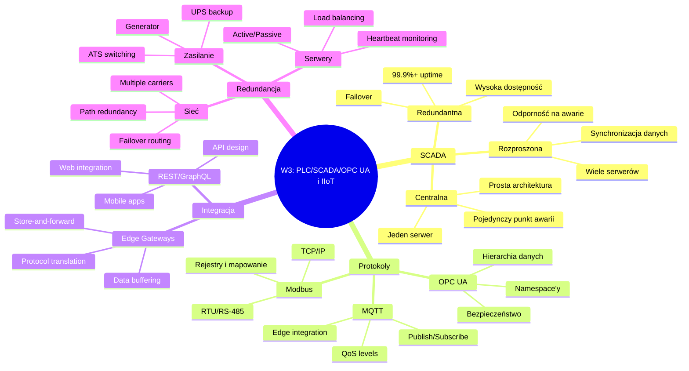
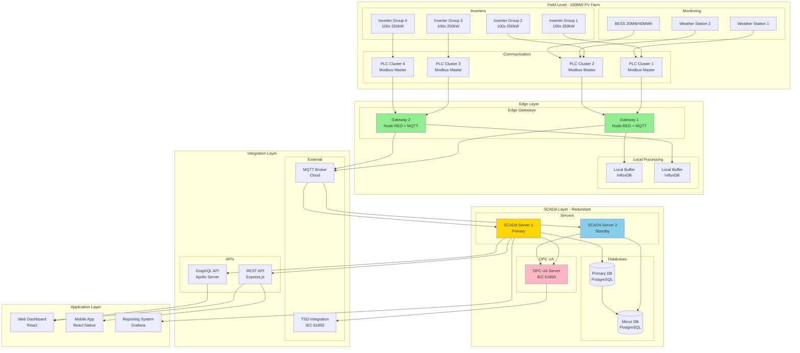
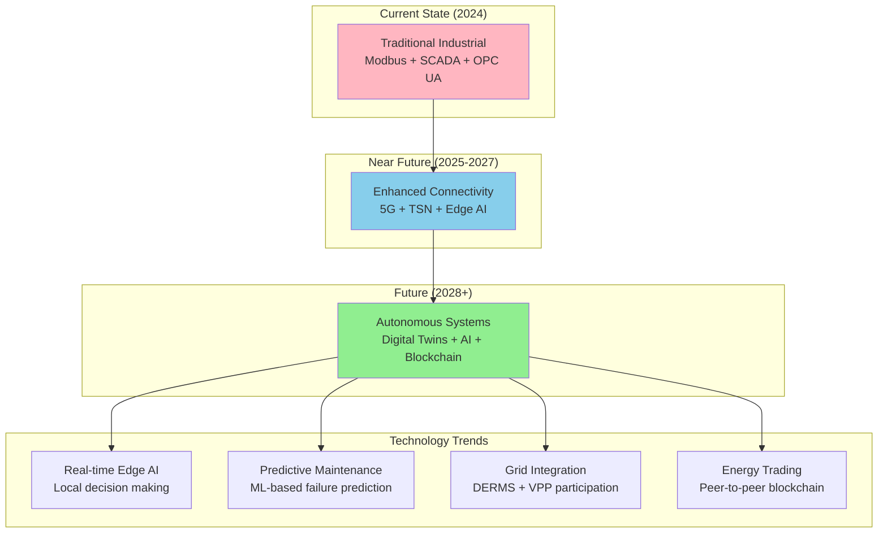

import { 
  SlideContainer, 
  Slide, 
  KeyPoints, 
  SupportingDetails, 
  InstructorNotes,
  VisualSeparator,
  LearningObjective,
  KeyConcept,
  Example
} from '@site/src/components/SlideComponents';
import { InteractiveQuiz } from '@site/src/components/InteractiveQuiz';

<LearningObjective>
Po tej sekcji student potrafi:
- Zintegrować wiedzę z całego wykładu o protokołach komunikacyjnych, SCADA, OPC UA i IIoT
- Zaprojektować kompletną architekturę systemu monitoringu dla instalacji OZE
- Wybrać odpowiednie technologie (Modbus, MQTT, OPC UA, REST/GraphQL) dla konkretnych zastosowań
- Zidentyfikować kluczowe decyzje projektowe i trade-offs w systemach przemysłowych
</LearningObjective>

<SlideContainer>

<Slide title="🔄 Przegląd całego wykładu - kluczowe koncepcje" type="info">

<KeyPoints title="📋 Co omówiliśmy w tym wykładzie?">
- **Topologie SCADA** - centralna, rozproszona, redundantna
- **PLC i Modbus** - protokoły komunikacji z urządzeniami polowymi
- **OPC UA** - nowoczesny standard komunikacji przemysłowej z bezpieczeństwem
- **MQTT** - protokół publish-subscribe dla systemów IIoT
- **REST/GraphQL** - API dla integracji z aplikacjami web/mobile
- **Edge Gateways** - buforowanie i store-and-forward dla niezawodności
- **Redundancja** - zapewnienie wysokiej dostępności systemów
</KeyPoints>

**Mapa koncepcji z wykładu:**



<SupportingDetails title="🎯 Kluczowe powiązania między koncepcjami">

**Architektura warstwowa:**
1. **Layer 1 - Field**: PLC, Modbus RTU, czujniki
2. **Layer 2 - Edge**: Edge gateways, MQTT, store-and-forward  
3. **Layer 3 - SCADA**: OPC UA, redundant servers, databases
4. **Layer 4 - Integration**: REST/GraphQL APIs, web applications
5. **Layer 5 - Cloud**: Remote monitoring, analytics, reporting

**Protokoły w kontekście:**
- **Modbus** - legacy field communication, simple ale limited
- **OPC UA** - modern industrial standard, secure ale complex  
- **MQTT** - ideal dla edge-to-cloud, lightweight ale requires broker
- **REST/GraphQL** - web integration, standard ale not real-time

</SupportingDetails>

<InstructorNotes>

**Summary slide** - **recap** wszystkich **key concepts** z wykładu.

**Mind map** pokazuje **hierarchical relationships** między **concepts**:
- **SCADA architectures** - **different topologies** dla **different needs**
- **Protokoły** - **when to use** każdy **protocol**
- **Integration methods** - **REST vs GraphQL**, **edge gateways**
- **Redundancy strategies** - **multiple levels** protection

**Key message**: **All concepts** są **interconnected** - **practical systems** używa **multiple protocols** i **architectures** w **different layers**.

**Student powinien understand**:
- **When to use** każdy **technology**
- **How components** **integrate together**
- **Trade-offs** w **design decisions**

**Czas**: 5-6 minut na **comprehensive overview**.

</InstructorNotes>

</Slide>

<VisualSeparator type="default" />

<Slide title="🏭 Case Study: Kompletna farma PV 100MW" type="success">

<KeyPoints title="📋 Parametry instalacji">
- **Lokalizacja**: Farma PV 100MW w północnej Polsce
- **Komponenty**: 400x inwerterów 250kW, 2x stacje pogodowe, 1x magazyn energii 20MW/40MWh
- **Wymagania**: Monitoring zgodny z IEC 61850, integracja z TSO, redundancja 99.5%
- **Operacja**: 24/7 monitoring, automatyczne raportowanie, zdalny dostęp
</KeyPoints>

**Kompletna architektura systemu:**



<Example title="Implementacja - przepływ danych i protokoły">

**1. Field Level - Modbus RTU:**
```python
# PLC Konfiguracja dla grupy inwerterów
modbus_config = {
    'port': '/dev/ttyUSB0',
    'baudrate': 9600,
    'parity': 'E',
    'stopbits': 1,
    'timeout': 3
}

# Mapowanie rejestrów dla inwertera 250kW
inverter_map = {
    'ac_power': {'register': 40001, 'scale': 1.0, 'unit': 'W'},
    'dc_voltage': {'register': 40002, 'scale': 0.1, 'unit': 'V'},
    'dc_current': {'register': 40003, 'scale': 0.1, 'unit': 'A'},
    'efficiency': {'register': 40004, 'scale': 0.01, 'unit': '%'},
    'temperature': {'register': 40005, 'scale': 0.1, 'unit': '°C'},
    'status': {'register': 40006, 'scale': 1, 'unit': 'enum'}
}
```

**2. Edge Gateway - Node-RED Flow:**
```json
[
  {
    "id": "modbus-read",
    "type": "modbus-read",
    "name": "Read Inverter Data",
    "unitid": "1",
    "dataType": "HoldingRegister",
    "adr": "40001",
    "quantity": "6",
    "rate": "10",
    "server": "modbus-server"
  },
  {
    "id": "data-processor",
    "type": "function",
    "func": "msg.payload = {\n  timestamp: new Date().toISOString(),\n  device_id: 'inverter_' + msg.payload.unitid,\n  measurements: {\n    ac_power: msg.payload.data[0],\n    dc_voltage: msg.payload.data[1] / 10.0,\n    dc_current: msg.payload.data[2] / 10.0,\n    efficiency: msg.payload.data[3] / 100.0,\n    temperature: msg.payload.data[4] / 10.0,\n    status: msg.payload.data[5]\n  }\n};\nmsg.topic = '/pv-farm/inverters/' + msg.payload.unitid + '/data';\nreturn msg;"
  },
  {
    "id": "mqtt-out",
    "type": "mqtt out",
    "topic": "",
    "qos": "1",
    "broker": "mqtt-broker"
  }
]
```

**3. SCADA Server - OPC UA Configuration:**
```xml
<Namespace>
  <NamespaceUri>http://pv-farm-100mw.com/</NamespaceUri>
  <NamespaceIndex>2</NamespaceIndex>
</Namespace>

<Object NodeId="ns=2;s=PV_Farm_100MW" BrowseName="2:PV_Farm_100MW">
  <Object NodeId="ns=2;s=Inverter_Group_1" BrowseName="2:Inverter_Group_1">
    <Variable NodeId="ns=2;s=Inverter_Group_1/Total_Power" 
              BrowseName="2:Total_Power" 
              DataType="Float" 
              Description="Total AC power from group 1"/>
    <Variable NodeId="ns=2;s=Inverter_Group_1/Status_Count" 
              BrowseName="2:Status_Count" 
              DataType="UInt32" 
              Description="Number of running inverters"/>
  </Object>
</Object>
```

</Example>

<SupportingDetails title="🔧 Kluczowe decyzje projektowe">

**1. Wybór protokołów:**
- **Modbus RTU** - field level (proven, simple, reliable)
- **MQTT** - edge to SCADA (store-and-forward, lightweight)
- **OPC UA** - SCADA to TSO (IEC 61850 compliance, security)

**2. Redundancja:**
- **Dual PLC clusters** - geographic separation
- **Dual edge gateways** - independent data paths
- **SCADA server failover** - automatic switching

**3. Performance:**
- **10-second polling** - balance between freshness i network load
- **QoS 1** MQTT - guaranteed delivery without duplicates
- **Local buffering** - 7-day retention dla offline operation

</SupportingDetails>

<InstructorNotes>

**Complete case study** - **100MW farm** to **realistic scale** gdzie wszystkie **concepts** z wykładu są **applied together**.

**Architecture diagram** pokazuje **complete system** z **all layers**:
- **Field level** - **Modbus RTU** dla **device communication**
- **Edge layer** - **Node-RED gateways** z **MQTT** i **local buffering**
- **SCADA layer** - **redundant servers** z **PostgreSQL** i **OPC UA**
- **Integration** - **REST/GraphQL APIs**
- **Applications** - **web**, **mobile**, **reporting**

**Implementation examples** pokazują **practical code**:
- **Modbus configuration** - **real register mapping**
- **Node-RED flow** - **data processing** i **MQTT publishing**
- **OPC UA schema** - **IEC 61850** structure

**Key decisions** - **practical reasoning** behind **technology choices**:
- **Why Modbus RTU** zamiast **OPC UA** dla field
- **Why MQTT** dla edge-to-cloud
- **Why redundancy** w każdej layer

**Czas**: 10-12 minut na **detailed case study**.

</InstructorNotes>

</Slide>

<VisualSeparator type="default" />

<Slide title="⚖️ Trade-offs i decyzje projektowe" type="info">

### Tabela porównawcza technologii

| Kryterium | Modbus RTU | Modbus TCP | OPC UA | MQTT | REST | GraphQL |
|-----------|------------|-------------|---------|------|------|---------|
| **Złożoność** | ⭐ | ⭐⭐ | ⭐⭐⭐⭐ | ⭐⭐ | ⭐⭐⭐ | ⭐⭐⭐⭐ |
| **Bezpieczeństwo** | ❌ | ⭐ | ⭐⭐⭐⭐ | ⭐⭐ | ⭐⭐⭐ | ⭐⭐⭐ |
| **Real-time** | ⭐⭐⭐ | ⭐⭐⭐ | ⭐⭐ | ⭐⭐⭐ | ⭐ | ⭐ |
| **Skalowalność** | ⭐ | ⭐⭐ | ⭐⭐⭐ | ⭐⭐⭐⭐ | ⭐⭐⭐ | ⭐⭐⭐⭐ |
| **Koszt** | ⭐⭐⭐⭐ | ⭐⭐⭐ | ⭐⭐ | ⭐⭐⭐ | ⭐⭐⭐⭐ | ⭐⭐⭐ |
| **Maintenance** | ⭐⭐⭐⭐ | ⭐⭐⭐ | ⭐⭐ | ⭐⭐⭐ | ⭐⭐⭐⭐ | ⭐⭐ |

<KeyConcept title="🎯 Framework decyzyjny">

**Wybierz technologię na podstawie:**

**1. Wymagań aplikacji**
- **Real-time control** → Modbus RTU/TCP lub OPC UA
- **Data logging** → MQTT lub REST API
- **Web integration** → REST lub GraphQL

**2. Wymagań bezpieczeństwa**
- **Critical infrastructure** → OPC UA (encryption, certificates)
- **Internal networks** → Modbus TCP (acceptable)
- **Internet connectivity** → MQTT z TLS lub REST z HTTPS

**3. Budżetu i zasobów**
- **Limited budget** → Modbus RTU (simple, cheap)
- **High performance** → OPC UA (complex ale powerful)
- **Rapid development** → REST API (mature tooling)

**4. Wymagań skalowalności**
- **Small installation** → Modbus direct connection
- **Large farm** → MQTT + OPC UA hybrid
- **Multi-site** → GraphQL + cloud architecture

</KeyConcept>

<Example title="Scenariusze wyboru technologii">

**Scenariusz 1: Mała farma PV 1MW**
```
Wymagania: Prosta, tania, niezawodna
Wybór: Modbus RTU → Node-RED Gateway → Cloud MQTT
Uzasadnienie: Modbus wystarcza, Node-RED darmowy, cloud MQTT minimal cost
```

**Scenariusz 2: Średnia farma PV 10MW**  
```
Wymagania: Integracja z TSO, redundancja, security
Wybór: Modbus TCP → SCADA with OPC UA → TSO integration
Uzasadnienie: OPC UA dla compliance, redundant SCADA dla reliability
```

**Scenariusz 3: Duża farma 100MW+**
```
Wymagania: High performance, multiple integrations, analytics
Wybór: Hybrid (Modbus + MQTT + OPC UA + GraphQL)
Uzasadnienie: Każdy protocol w appropriate layer, maximum flexibility
```

</Example>

<SupportingDetails title="⚠️ Częste pułapki projektowe">

**1. Over-engineering**
- **Problem**: Wybór OPC UA dla simple 1MW installation
- **Rozwiązanie**: Start simple (Modbus), evolve as needed

**2. Under-engineering**  
- **Problem**: Modbus RTU dla 50MW farmy wymagającej TSO integration
- **Rozwiązanie**: Plan for compliance requirements upfront

**3. Security neglect**
- **Problem**: Plain text protocols w public networks
- **Rozwiązanie**: Always encrypt external communications

**4. Single points of failure**
- **Problem**: One gateway, one server, one network path
- **Rozwiązanie**: Design redundancy into critical paths

</SupportingDetails>

<InstructorNotes>

**Trade-offs** to **core engineering skill** - **understand** kiedy używać **each technology**.

**Comparison table** - **visual guide** dla **technology selection**:
- **Complexity** - **Modbus simple**, **OPC UA complex**
- **Security** - **OPC UA best**, **Modbus poor**
- **Real-time** - **Modbus/MQTT good**, **REST/GraphQL poor**
- **Scalability** - **MQTT/GraphQL excellent**

**Decision framework** - **systematic approach** do **technology selection**:
- **Application requirements** first
- **Security** considerations
- **Budget** i **resources**
- **Scalability** needs

**Scenarios** pokazują **real-world examples**:
- **Small farm** - **simple, cheap** approach
- **Medium farm** - **compliance** i **redundancy**
- **Large farm** - **hybrid approach** dla **maximum flexibility**

**Common pitfalls** - **learn from mistakes**:
- **Over-engineering** - **complex solutions** dla **simple problems**
- **Under-engineering** - **simple solutions** dla **complex needs**
- **Security** - **often neglected** until **it's too late**
- **Single points of failure** - **avoid** w **critical systems**

**Czas**: 8-9 minut na **practical decision-making** guide.

</InstructorNotes>

</Slide>

<VisualSeparator type="success" />

<Slide title="🔮 Trendy i przyszłość systemów komunikacyjnych" type="success">

<KeyPoints title="📋 Rozwój technologii przemysłowych">
- **5G Industrial** - niska latency, high bandwidth dla edge computing
- **Time-Sensitive Networking (TSN)** - deterministyczna komunikacja Ethernet
- **Edge AI** - przetwarzanie danych lokalnie bez potrzeby łączności z chmurą
- **Digital Twins** - cyfrowe modele instalacji dla prognozowania i optymalizacji
- **Blockchain** - niezmienne rejestry dla handlu energią i compliance
</KeyPoints>

**Ewolucja architektury systemów:**



<Example title="Przykład: System z Edge AI 2030">

**Architektura z AI na Edge:**
```python
# Edge Gateway z AI inference
class AIEdgeGateway:
    def __init__(self, model_path):
        self.model = load_tensorflow_model(model_path)
        self.data_buffer = []
        
    def process_sensor_data(self, data):
        # 1. Collect data from multiple sensors
        self.data_buffer.append({
            'timestamp': data['timestamp'],
            'power': data['power'],
            'temperature': data['temperature'],
            'irradiance': data['irradiance']
        })
        
        # 2. AI prediction every 5 minutes
        if len(self.data_buffer) >= 30:  # 30 readings = 5 min
            prediction = self.analyze_trends()
            if prediction['anomaly_detected']:
                self.alert_local_operator(prediction)
                
    def analyze_trends(self):
        # Local AI inference - no cloud needed
        features = self.extract_features(self.data_buffer[-30:])
        prediction = self.model.predict(features)
        
        return {
            'efficiency_trend': prediction['efficiency'],
            'maintenance_needed': prediction['maintenance'] > 0.8,
            'anomaly_detected': prediction['anomaly'] > 0.9,
            'recommendations': self.generate_recommendations(prediction)
        }
```

**Digital Twin Integration:**
```python
class DigitalTwin:
    def __init__(self, physical_system_id):
        self.physical_id = physical_system_id
        self.model = self.load_physics_model()
        
    def update_simulation(self, real_data):
        # Update digital twin z real data
        self.model.set_parameters({
            'irradiance': real_data['irradiance'],
            'temperature': real_data['temperature'],
            'wind_speed': real_data['wind_speed']
        })
        
        # Predict optimal settings
        optimal_settings = self.model.optimize()
        
        return {
            'predicted_power': optimal_settings['expected_power'],
            'optimal_inverter_settings': optimal_settings['inverter_config'],
            'maintenance_schedule': optimal_settings['maintenance_plan']
        }
```

</Example>

<SupportingDetails title="🚀 Wpływ na systemy OZE">

**Immediate Benefits (2025-2027):**
- **5G connectivity** - reliable, high-speed dla remote sites
- **Edge AI** - local anomaly detection, predictive maintenance
- **TSN** - deterministic communication dla grid integration

**Future Capabilities (2028+):**
- **Autonomous operation** - self-optimizing systems
- **Grid services** - automatic participation w energy markets
- **Peer-to-peer trading** - direct energy sales między producers

**Skills dla inżynierów:**
- **AI/ML basics** - understanding edge inference
- **5G/TSN** - industrial networking evolution
- **Blockchain** - distributed systems dla energy

</SupportingDetails>

<KeyConcept title="🎓 Przygotowanie na przyszłość">

**Continuous Learning:**
- **Follow standards evolution** - IEC 61850, OPC UA updates
- **Experiment z new technologies** - edge AI, 5G testing
- **Understand cybersecurity** - increasingly critical dla industrial systems

**Hybrid Approach:**
- **Maintain legacy expertise** - Modbus, SCADA still relevant
- **Adopt modern protocols** - MQTT, OPC UA, REST/GraphQL
- **Prepare for future** - edge AI, digital twins

</KeyConcept>

<InstructorNotes>

**Future trends** - **important** dla **career planning** i **system design**.

**Technology evolution** - **5G**, **TSN**, **Edge AI**, **Digital Twins** będą **shape** future industrial systems.

**Architecture evolution** diagram - **current state** → **near future** → **future state**:
- **Current**: **traditional** Modbus/SCADA
- **Near future**: **enhanced** z **5G** i **edge AI**
- **Future**: **autonomous systems** z **digital twins**

**AI Edge example** - **practical implementation** gdzie **AI runs locally** na **edge gateway**:
- **Local inference** - **no cloud dependency**
- **Real-time decisions** - **immediate response**
- **Privacy** - **data stays local**

**Skills evolution** - **engineers need** to **adapt**:
- **Traditional** - **Modbus**, **SCADA** knowledge
- **Modern** - **OPC UA**, **MQTT**, **REST/GraphQL**
- **Future** - **AI/ML**, **5G**, **blockchain**

**Key message**: **Stay current** z **technology trends** ale **maintain** **fundamental knowledge**.

**Czas**: 6-7 minut na **future outlook** i **career guidance**.

</InstructorNotes>

</Slide>

<VisualSeparator type="quiz" />

<InteractiveQuiz 
  title="Quiz: Podsumowanie wykładu"
  questions={[
    {
      question: "Który protokół najlepiej nadaje się do komunikacji z inwerterami w farmie PV 50MW wymagającej integracji z systemem TSO?",
      options: [
        "Modbus RTU - jest prosty i niezawodny",
        "Modbus TCP - balance między prostotą i funkcjonalnością",
        "OPC UA - zapewnia bezpieczeństwo i zgodność z IEC 61850",
        "MQTT - lekki protokół idealny dla IoT"
      ],
      correct: 2,
      explanation: "OPC UA jest najlepszy dla dużych instalacji wymagających integracji z TSO, ponieważ zapewnia bezpieczeństwo, zgodność z IEC 61850 oraz hierarchiczną strukturę danych potrzebną dla systemów nadzoru."
    },
    {
      question: "W systemie Edge Gateway z store-and-forward, co się dzieje gdy łączność z chmurą zostanie przerwana?",
      options: [
        "System przestaje działać i traci wszystkie dane",
        "Dane są buforowane lokalnie i automatycznie wysłane gdy łączność wróci",
        "System przełącza się na backup connection przez satellite",
        "Dane są wysyłane przez alternatywny protokół"
      ],
      correct: 1,
      explanation: "Store-and-forward to kluczowy mechanizm - dane są buforowane lokalnie podczas przerwy w łączności, a następnie automatycznie przesyłane gdy połączenie zostanie przywrócone."
    },
    {
      question: "Jaki poziom QoS w MQTT jest odpowiedni dla danych telemetrycznych z czujników (temperatura, moc) publikowanych co 10 sekund?",
      options: [
        "QoS 0 - najszybszy, brak gwarancji dostarczenia",
        "QoS 1 - gwarancja dostarczenia, możliwe duplikaty",
        "QoS 2 - gwarancja dostarczenia bez duplikatów",
        "Wszystkie poziomy są równie odpowiednie"
      ],
      correct: 1,
      explanation: "QoS 1 jest optymalny dla telemetrii - zapewnia dostarczenie wiadomości (ważne dla monitoringu), a możliwe duplikaty nie są problemem przy wysokiej częstotliwości publikowania."
    },
    {
      question: "W redundantnej architekturze Active/Passive serwerów SCADA, jaki jest typowy czas przełączenia (failover time)?",
      options: [
        "Mniej niż 5 sekund",
        "5-30 sekund", 
        "1-5 minut",
        "Powyżej 10 minut"
      ],
      correct: 1,
      explanation: "Typowy failover time w systemach Active/Passive to 5-30 sekund - wystarczająco szybko dla większości aplikacji przemysłowych, ale wymaga odpowiedniej konfiguracji heartbeat i automatycznego przełączania."
    },
    {
      question: "Który element architektury jest najbardziej krytyczny dla zapewnienia redundancji w systemie monitoringu OZE?",
      options: [
        "Redundantne serwery SCADA - przechowują i przetwarzają dane",
        "Redundantne połączenia sieciowe - zapewniają komunikację",
        "Redundantne źródła zasilania - bez prądu nic nie działa",
        "Wszystkie elementy są równie krytyczne"
      ],
      correct: 3,
      explanation: "Wszystkie elementy są krytyczne, ale system redundancy musi być holistyczny - redundantne serwery bez zasilania to bezużyteczne, redundantne sieci bez serwerów też nie działają. Kluczem jest redundancy na wszystkich poziomach."
    }
  ]}
/>

<InstructorNotes>
**Quiz** podsumowuje **key concepts** z całego wykładu:
- **Protocol selection** - **OPC UA** dla **large SCADA** systems
- **Store-and-forward** - **data buffering** podczas **network outages**
- **QoS levels** - **appropriate choice** dla **different data types**
- **Failover timing** - **realistic expectations** dla **redundant systems**
- **Holistic redundancy** - **all components** są **important**

**Interactive quiz** engages students i **reinforces learning** przez **practical questions**.

**Czas**: 5-7 minut na **quiz** i **discussion**.

</InstructorNotes>

</Slide>

</SlideContainer>
