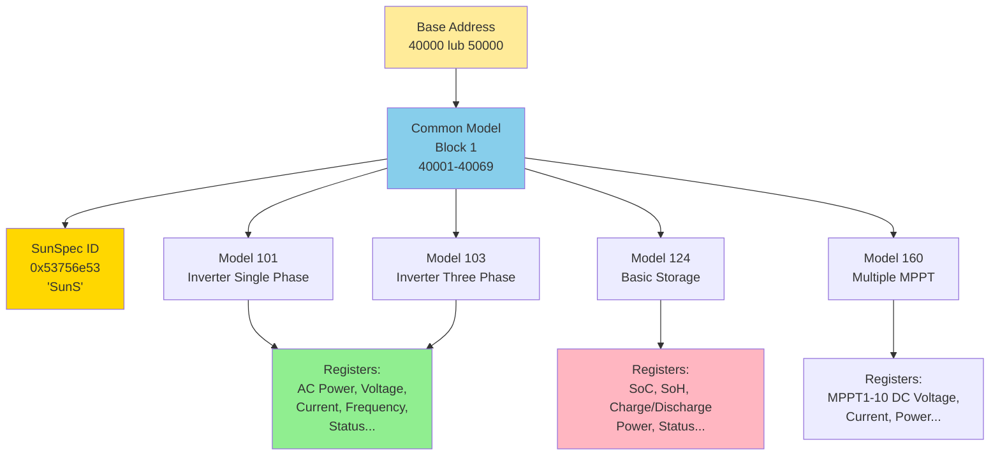

import { 
  SlideContainer, 
  Slide, 
  KeyPoints, 
  SupportingDetails, 
  InstructorNotes,
  VisualSeparator,
  LearningObjective,
  KeyConcept,
  Example
} from '@site/src/components/SlideComponents';
import { InteractiveQuiz } from '@site/src/components/InteractiveQuiz';

<LearningObjective>
Po tej sekcji student potrafi:
- Zidentyfikować kluczowe profile danych dla różnych technologii OZE (SunSpec dla PV, IEC 61400-25 dla wiatru, BMS dla BESS)
- Zbudować słownik tagów (tag dictionary) z normalizacją jednostek, nazewnictwa i quality flags
- Zaprojektować wspólny model danych umożliwiający porównanie KPI między różnymi instalacjami
- Zastosować best practices dla metadanych (time zones, calibration info, provenance)
</LearningObjective>

<SlideContainer>

<Slide title="🗂️ Profile danych — dlaczego potrzebujemy standaryzacji?" type="info">

<KeyPoints title="📋 Problem: Różnorodność producentów i protokołów">

**Typowa farma OZE (hybrid PV + Wind + BESS) to zoo technologiczne:**

- **10+ producentów**: Inwertery (SMA, Fronius, Huawei), BESS (Tesla, BYD, LG Chem), turbiny (Vestas, Siemens Gamesa)
- **5+ protokołów**: Modbus RTU/TCP, SunSpec, proprietary (Huawei FusionSolar), OPC UA, IEC 61850
- **Różne modele danych**: 
  - Producent A: "ActivePower_W" (W)
  - Producent B: "P_AC" (kW)
  - Producent C: "AC_Power" (MW)
  - → **TEN SAM parametr, 3 różne nazwy, 3 różne jednostki!**

**Konsekwencje braku standaryzacji:**

1. **Niemożność agregacji danych** – Jak zsumować moc, jeśli jednostki różne?
2. **Błędy w KPI** – PR calculation wymaga spójnych danych (E_actual, G_POA, T_mod)
3. **Integration hell** – Każdy producent wymaga custom driver/parser
4. **Vendor lock-in** – Trudno zmienić producenta (data migration nightmare)
5. **Utrudnione porównania** – Nie możesz compare performance między farmami

**Rozwiązanie: Profile danych (Data Profiles)**

**Data Profile** = Standardowy zestaw:
- **Punktów danych** (data points): Jakie wielkości mierzyć
- **Nazewnictwa** (naming convention): Jednolite nazwy tagów
- **Jednostek** (units): SI units lub inne standardowe
- **Typów danych** (data types): INT16, FLOAT32, ENUM, etc.
- **Semantyki** (semantics): Co dany tag oznacza, jak interpretować

**Główne profile dla OZE:**
- **PV**: SunSpec Alliance (Modbus maps + IEEE 1547 extensions)
- **Wind**: IEC 61400-25 (Logical Nodes based on IEC 61850)
- **BESS**: SunSpec (dla PCS/inverter) + proprietary BMS protocols
- **Hydro**: IEC 61850 (hydroelectric domain-specific LNs)
- **Generic**: IEC 61850 dla wszystkich (universal, ale complex)

</KeyPoints>

<SupportingDetails title="🎯 Korzyści ze standaryzacji">

**1. Interoperability (interoperacyjność)**
- Multi-vendor installations "just work" (plug-and-play)
- Wymiana sprzętu bez przebudowy całego SCADA
- **Przykład**: Farma PV 10 MWp z 5 producentami inwerterów → wszystkie mówią SunSpec → jeden driver w SCADA

**2. Portability (przenośność)**
- Konfiguracje SCADA/dashboards wielokrotnego użytku
- Templates dla nowych projektów
- **Przykład**: Dashboard Grafana dla "SunSpec Inverter" działa z SMA, Fronius, Huawei bez zmian

**3. Comparability (porównywalność)**
- Benchmarking farm A vs. farm B (różni producenci, ale ten sam profile)
- Fleet-wide analytics (portfolio 100+ farm)
- **Przykład**: Investor porównuje PR między 50 farmami → spójne dane

**4. Compliance (zgodność z normami)**
- IEEE 1547 (grid interconnection) wymaga SunSpec
- IEC 61850 wymóg dla medium/high voltage substations
- ISO 50001 (energy management) zaleca standardized data models

**5. Reduced integration costs**
- Generic drivers zamiast custom dla każdego producenta
- **Oszczędność: 50-80% dev time** w integracji
- **Przykład**: Integracja 10 inwerterów SunSpec = 2 dni. Bez SunSpec (proprietary) = 10 dni (1 dzień każdy)

:::tip Dobra praktyka przemysłowa
W specyfikacjach przetargowych (tender specifications) dla farm >1 MWp **wymagaj zgodności z profilem danych** (SunSpec dla PV, IEC 61400-25 dla wiatru). To eliminuje vendor lock-in i ułatwia future expansion.
:::

</SupportingDetails>

<InstructorNotes>

**Czas**: 14-16 min

**Przebieg**:
1. Problem: Zoo technologiczne w OZE (3 min) – przykład różnych nazw dla tej samej wielkości
2. Czym są data profiles (3 min) – definicja, składniki
3. Główne profile dla OZE (4 min) – SunSpec, IEC 61400-25, etc.
4. Korzyści standaryzacji (3 min) – interoperability, cost savings
5. Q&A (2 min)

**Punkty kluczowe**:
- **Standaryzacja to NIE zbędna biurokracja** – to practical cost savings (50-80% integration time)
- SunSpec to de facto standard dla PV (>90% producentów inwerterów wspiera)
- IEC 61850 to heavyweight (complex), ale universal dla energetyki
- Vendor lock-in to real problem – standardy go eliminują

**Demonstracja praktyczna**:
- Pokaż 3 różne inwertery (SMA, Fronius, Huawei) w SunSpec explorer – te same registry numbers, różni producenci
- Comparison: Proprietary Modbus map vs. SunSpec map (side-by-side)

**Materiały pomocnicze**:
- SunSpec Alliance: Information Models (free download, https://sunspec.org/specifications/)
- IEC 61400-25-2: Wind turbine communications – Information models
- IEEE 1547-2018: Standard for Interconnecting Distributed Energy Resources (SunSpec mentioned)

**Typowe błędy studenckie**:
- Myślenie, że "Modbus to standard" – NO! Modbus to protokół, SunSpec to data model OVER Modbus
- Ignorowanie quality flags (valid/invalid) – dane bez quality = ryzyko false decisions
- Brak metadata (units, timestamps) w tag dictionary

**Pytania studenckie**:
- Q: Czy wszyscy producenci wspierają SunSpec?
- A: Większość (&gt;90% inwerterów &gt;10 kW). Ale: małe/cheap inverters (&lt;5 kW) często mają tylko basic Modbus (non-SunSpec). W przetargach komercyjnych: SunSpec compliance obowiązkowy.

- Q: Co jeśli producent nie wspiera standardu?
- A: (1) Gateway z custom driver (mapuje proprietary → standard), (2) Push back w przetargu (wymóg compliance), (3) W ostateczności: accept vendor lock-in (know the risks).

</InstructorNotes>

</Slide>

<VisualSeparator type="technical" />

<Slide title="☀️ SunSpec – standard dla systemów PV" type="tip">

<KeyConcept title="SunSpec Alliance Information Models">

**SunSpec** to otwarty standard definiujący:
- Modbus register maps dla urządzeń PV (inwertery, liczniki, met sensors, trackers, BESS)
- Information models (data structures) zgodne z IEEE 1547
- Interoperacyjność multi-vendor

**Architektura SunSpec (Modbus registers):**



**Kluczowe modele SunSpec:**

| Model # | Nazwa | Zastosowanie | Kluczowe data points |
|---------|-------|--------------|----------------------|
| **101** | Inverter (Single Phase) | Inwertery 1-fazowe | AC_Power, AC_Current, DC_Voltage, Status, Temp |
| **103** | Inverter (Three Phase) | Inwertery 3-fazowe | AC_Power (L1/L2/L3), AC_Current, PF, DC_Power, Event flags |
| **124** | Basic Storage Control | BESS/PCS | ChaState (Charging/Discharging), SoC, SoH, Charge_Power, Discharge_Power |
| **160** | Multiple MPPT Inverter | Stringinwertery | MPPT1-10: DC_Voltage, DC_Current, DC_Power, Status |
| **201** | Meter (Single Phase) | Liczniki 1-fazowe | Total_Energy, AC_Power, Voltage, Current, Frequency |
| **203** | Meter (Three Phase) | Liczniki 3-fazowe | Energy_Import/Export (L1/L2/L3), Power_Factor, THD |
| **302** | Irradiance | Pyranometry/sensors | Irradiance (W/m²), Plane-of-Array angle, Module_Temp |
| **308** | Tracker Controller | Trackery 1-axis/2-axis | Azimuth, Zenith, Target_Azimuth, Status |

**Przykład: SunSpec Model 103 (Inverter 3-Phase) – wybrane rejestry:**

| Offset | Nazwa | Typ | Jednostka | Scale Factor | R/W | Opis |
|--------|-------|-----|-----------|--------------|-----|------|
| 0 | ID | UINT16 | — | — | R | Model ID = 103 |
| 1 | L | UINT16 | registers | — | R | Block length (50 reg) |
| 2 | AC_Current | UINT16 | A | SF_AC_Current | R | AC Total Current |
| 3 | AC_CurrentA | UINT16 | A | SF_AC_Current | R | Phase A Current |
| ...| ... | ... | ... | ... | ... | ... |
| 14 | AC_Power | INT16 | W | SF_AC_Power | R | AC Power (total) |
| ...| ... | ... | ... | ... | ... | ... |
| 38 | DC_Power | INT16 | W | SF_DC_Power | R | DC Power Input |
| 40 | Temp_Cabinet | INT16 | °C | SF_Temp | R | Cabinet Temperature |
| ...| ... | ... | ... | ... | ... | ... |
| 48 | Status | ENUM16 | — | — | R | Operating State (OFF/SLEEPING/STARTING/MPPT/THROTTLED/SHUTDOWN/FAULT) |
| 50 | Event1 | BITFIELD32 | — | — | R | Event flags (Ground Fault, DC Over Volt, etc.) |

**Scale Factor (SF)**: Pozwala na różne zakresy przy stałym typie danych
- Jeśli SF_AC_Power = -1 (stored w osobnym rejestrze)
- AC_Power register value = 12500
- **Rzeczywista wartość**: 12500 × 10^(-1) = 1250 W = **1.25 kW**

</KeyConcept>

<SupportingDetails title="🔧 Implementacja SunSpec w SCADA">

**Procedura integracji:**

**Krok 1: Discovery (wykrywanie modeli)**
- Read base address + offset 0-2: Szukaj "SunS" signature (0x53756e53)
- Jeśli found → read Model ID (register następny) i Length
- Iterate przez wszystkie modele (Common → Model 103 → Model 160 → ...)

**Krok 2: Parsing (odczyt danych)**
```python
# Python example (pymodbus library)
from pymodbus.client import ModbusTcpClient

client = ModbusTcpClient('192.168.1.100', port=502)
client.connect()

# SunSpec base address (Modbus Holding Registers)
base_addr = 40000

# Read Common Block (length 69)
common = client.read_holding_registers(base_addr, 69, unit=1)
sunspec_id = (common.registers[0] << 16) | common.registers[1]  # Should be 0x53756e53

# Find Model 103 (Inverter 3-Phase)
offset = 69  # After Common Block
while offset < 200:
    model_id = client.read_holding_registers(base_addr + offset, 1, unit=1).registers[0]
    model_len = client.read_holding_registers(base_addr + offset + 1, 1, unit=1).registers[0]
    
    if model_id == 103:  # Found Inverter 3-Phase
        # Read full model
        model_data = client.read_holding_registers(base_addr + offset, model_len + 2, unit=1)
        
        # Extract AC_Power (offset 14 within model)
        ac_power_raw = model_data.registers[14]
        sf_ac_power = model_data.registers[xx]  # Scale factor register
        ac_power = ac_power_raw * (10 ** sf_ac_power)  # Real value in W
        
        print(f"AC Power: {ac_power} W")
        break
    
    offset += model_len + 2  # Next model
    if model_id == 0xFFFF:  # End marker
        break

client.close()
```

**Krok 3: Normalizacja i storage**
- Convert do SI units (wszystko w W, nie kW/MW)
- Add quality flag (check Status register: MPPT = valid, FAULT = invalid)
- Timestamp (UTC)
- Store w InfluxDB:
```
measurement: sunspec_inverter
tags: site=farm1, inverter_id=INV01, model=103
fields: ac_power=1250.0, dc_power=1280.0, status=4
timestamp: 2023-10-08T12:34:56Z
```

**Krok 4: Visualization (Grafana)**
```sql
-- InfluxDB query (Flux)
from(bucket: "solar")
  |> range(start: -24h)
  |> filter(fn: (r) => r._measurement == "sunspec_inverter")
  |> filter(fn: (r) => r._field == "ac_power")
  |> aggregateWindow(every: 5m, fn: mean)
```

</SupportingDetails>

<Example title="SunSpec tag dictionary – farma PV 5 MWp">

**Inwentaryzacja urządzeń:**
- 10× Inwertery 500 kW (SMA Sunny Central, SunSpec Model 103)
- 1× Licznik AC (Carlo Gavazzi EM340, SunSpec Model 203)
- 2× Pyranometry (NRG Systems, SunSpec Model 302)
- 1× Weather station (temp, wind – SunSpec Model 307, 308)

**Normalized Tag Dictionary (excerpt):**

| Tag Name | SunSpec Model.Point | Description | Unit | Data Type | Quality Flag | Update Rate |
|----------|---------------------|-------------|------|-----------|--------------|-------------|
| `PV.INV01.AC_Power` | 103.AC_Power | AC Power Output (3-phase sum) | W | FLOAT32 | VALID/INVALID | 1 s |
| `PV.INV01.AC_Energy` | 103.AC_Energy_Lifetime | Cumulative Energy | Wh | UINT64 | VALID | 60 s |
| `PV.INV01.DC_Power` | 103.DC_Power | DC Power Input | W | FLOAT32 | VALID/INVALID | 1 s |
| `PV.INV01.Status` | 103.Status | Operating State | ENUM | — | — | 1 s |
| `PV.INV01.Temp_Cabinet` | 103.Temp_Cabinet | Cabinet Temperature | °C | FLOAT32 | VALID | 10 s |
| `PV.METER.Energy_Import` | 203.Total_Energy_Import | Grid Import (cumulative) | Wh | UINT64 | VALID | 60 s |
| `PV.METEO.Irradiance_POA` | 302.Irradiance | POA Irradiance | W/m² | FLOAT32 | VALID/INVALID/CALIBRATION_DUE | 1 s |
| `PV.METEO.Temp_Module` | 302.Module_Temp | Module Back Temperature | °C | FLOAT32 | VALID/INVALID | 10 s |

**Quality Flags (rozszerzone):**
- `VALID`: Sensor OK, data reliable
- `INVALID`: Sensor fault, communication error
- `SUSPECT`: Data questionable (outlier detected)
- `CALIBRATION_DUE`: Sensor overdue for calibration (warning, ale still logging)
- `MAINTENANCE`: Sensor in maintenance mode (ignore in KPI calculations)

**Metadata (per tag):**
- `calibration_last_date`: "2023-05-15"
- `calibration_due_date`: "2025-05-15"
- `sensor_serial`: "KZ-CMP11-45678"
- `data_source`: "sunspec_modbus"
- `timezone`: "UTC"

**Benefits:**
- ✅ **Single Grafana dashboard** działa z wszystkimi 10 inwerterami (bez zmian)
- ✅ **KPI calculations** (PR, Availability) automatyczne (spójne nazwy, jednostki)
- ✅ **Easy expansion** – dodanie 11-tego inwertera = 5 min configuration (nie 1 dzień custom integration)

</Example>

<InstructorNotes>

**Czas**: 16-18 min

**Przebieg**:
1. SunSpec architecture (5 min) – Common Block + Models, discovery process
2. Przykład Model 103 (4 min) – omów kluczowe rejestry, scale factors
3. Python kod (3 min) – pokazuje live reading (jeśli możliwe, z prawdziwym inwerterem lub simulatorem)
4. Tag dictionary example (3 min) – normalizacja nazw, quality flags
5. Q&A (2 min)

**Punkty kluczowe**:
- **SunSpec to Modbus + standardized register map** – nie nowy protokół, tylko convention
- Scale factors pozwalają na flexible ranges (INT16 może reprezentować 0.1 W do 10 MW z odpowiednim SF)
- Quality flags są KLUCZOWE – dane bez quality = ryzyko (false alarms, bad KPI)
- Discovery process (szukanie "SunS") = plug-and-play (SCADA auto-detects urządzenia)

**Demonstracja praktyczna**:
- SunSpec Modbus scanner (pymodbus script) – live discovery inwertera
- Comparison: Modbus map SMA (proprietary, 200+ custom registers) vs. SunSpec (standardized)
- Grafana dashboard template dla SunSpec inverter (pokazuje reusability)

**Materiały pomocnicze**:
- SunSpec Information Models (https://sunspec.org/sunspec-modbus-specifications/) – free download
- IEEE 1547-2018 (mentions SunSpec as reference implementation)
- pymodbus library (https://pymodbus.readthedocs.io/) – Python SunSpec support
- SunSpec test tool (https://sunspec.org/sunspec-test-tool/) – validator

**Typowe błędy studenckie**:
- Myślenie, że SunSpec to komunikacja (NO, to data model OVER Modbus)
- Ignorowanie scale factors – wartość raw bez SF = nonsense
- Brak quality flags w database → dane INVALID traktowane jako VALID

**Pytania studenckie**:
- Q: Czy SunSpec działa tylko z Modbus?
- A: Pierwotnie TAK (Modbus TCP/RTU). Ale: nowsze SunSpec models są mapped do OPC UA (SunSpec OPC UA Companion Spec, 2020). Flexibility!

- Q: Co jeśli inwerter ma SunSpec + proprietary registers (advanced features)?
- A: Common pattern. SunSpec = minimum required (grid compliance), proprietary = value-add (advanced diagnostics, OEM-specific). Read oba.

</InstructorNotes>

</Slide>

<VisualSeparator type="default" />

<Slide title="🌬️ IEC 61400-25 – standard dla turbin wiatrowych" type="info">

<KeyConcept title="Wind Power Plant Communications (IEC 61400-25 series)">

**IEC 61400-25** (części 1-6) definiuje komunikację dla farm wiatrowych, bazując na **IEC 61850** (substation automation).

**Logical Nodes (LN) dla turbin:**

| Logical Node | Domena | Opis | Przykładowe Data Objects |
|--------------|--------|------|--------------------------|
| **WTUR** | Wind TURbine | Główny LN turbiny | `WTUR.OutPwrSt` (output power status), `WTUR.TurSt` (turbine state) |
| **WROT** | Wind ROTor | Rotor i łopaty | `WROT.RotSpd` (rotor speed RPM), `WROT.PitchAngle` (pitch angle °) |
| **WNAC** | Wind NACelle | Gondola (nacelle) | `WNAC.YawAngle` (yaw angle °), `WNAC.Temp` (temp gondoli) |
| **WGEN** | Wind GENerator | Generator | `WGEN.GenSpd` (generator speed), `WGEN.Temp` (temp uzwojeń) |
| **WTRM** | Wind TRansforMer | Transformator | `WTRM.PwrIn` (power input), `WTRM.Temp` (temp oleju) |
| **WALM** | Wind ALarMs | Alarmy i events | `WALM.AlmSt` (alarm status), `WALM.EvtLog` (event log) |
| **MMXU** | Measurements MUltipleX | Pomiary elektryczne (generic z 61850) | `MMXU.TotW` (total active power), `MMXU.Hz` (frequency) |

**Hierarchia LN w turbinie:**

```
WTUR (Wind Turbine General)
├── WROT (Rotor)
├── WNAC (Nacelle)
│   ├── WGEN (Generator)
│   ├── WGBX (Gearbox) [jeśli ma]
│   └── WCNV (Converter/PCS)
├── WTRM (Transformer)
└── WALM (Alarms)
```

**Data Objects (DO) i Data Attributes (DA):**

Przykład: `WROT.RotSpd` (Rotor Speed)
- `RotSpd.mag.f` (magnitude, float): 15.2 rpm
- `RotSpd.q` (quality): VALID
- `RotSpd.t` (timestamp): 2023-10-08T12:34:56.123Z
- `RotSpd.units` (units): SIUnit code for rpm

</KeyConcept>

<SupportingDetails title="🔍 Mapowanie IEC 61400-25 → praktyczne tagi">

**Translation layer (dla InfluxDB/Grafana):**

| IEC 61400-25 LN.DO | Normalized Tag | Unit | Description |
|--------------------|----------------|------|-------------|
| `WTUR.OutPwrSt.mag.f` | `Wind.T01.Power_AC` | W | Output power |
| `WROT.RotSpd.mag.f` | `Wind.T01.Rotor_Speed` | rpm | Rotor speed |
| `WROT.PitchAngle.mag.f` | `Wind.T01.Pitch_Angle` | ° | Blade pitch |
| `WNAC.YawAngle.mag.f` | `Wind.T01.Yaw_Angle` | ° | Nacelle yaw |
| `WGEN.GenSpd.mag.f` | `Wind.T01.Generator_Speed` | rpm | Generator speed |
| `WGEN.Temp.mag.f` | `Wind.T01.Generator_Temp` | °C | Winding temperature |
| `WALM.AlmSt` | `Wind.T01.Alarm_Status` | BITFIELD | Active alarms |
| `MMXU.Hz.mag.f` | `Wind.T01.Grid_Frequency` | Hz | Grid frequency |

**Quality flag inheritance:**
- IEC 61400-25 `q` attribute → `_quality` suffix w InfluxDB
- `Wind.T01.Power_AC` (value)
- `Wind.T01.Power_AC_quality` (VALID/INVALID/SUSPECT)

</SupportingDetails>

<Example title="WROT.RotSpd anomaly detection – case study">

**Farma wiatrowa 50 MW (25 turbin × 2 MW)**

**Data points monitorowane:**
- `WROT.RotSpd` (rotor speed): 10-18 rpm (normalny zakres)
- `WGEN.GenSpd` (generator speed): 1400-1550 rpm
- `WTUR.OutPwrSt` (power output): 0-2000 kW

**Anomalia wykryta (sierpień 2023, turbina T12):**
- `WROT.RotSpd` = 16.5 rpm (normalny)
- `WGEN.GenSpd` = **1200 rpm** (oczekiwane ~1500 rpm przy 16.5 rpm rotor, gearbox ratio 1:91)
- `WTUR.OutPwrSt` = 1200 kW (zamiast expected ~1800 kW)

**Diagnosis:**
- Gearbox slippage lub miscount w encoder
- **Root cause**: Uszkodzenie przekładni (gear tooth spalling) → zmienne ratio

**Action:**
- Shutdown turbiny, inspekcja (oil analysis pokazała metal particles)
- Wymiana gearbox (planowana, 300 000 EUR + 3 tygodnie downtime)

**Jak IEC 61400-25 pomógł:**
- Standardized LNs (`WROT.RotSpd`, `WGEN.GenSpd`) → easy to correlate
- Quality flags: Generator encoder = VALID, ratio out of range → automatic SUSPECT flag
- SOE (Sequence of Events) timestamp precision ±10 ms → clear diagnosis timeline

**Savings:**
- Early detection (3 miesiące przed catastrophic failure) → planowana wymiana zamiast emergency (savings ~100 000 EUR downtime costs)

</Example>

<InstructorNotes>

**Czas**: 14-16 min

**Przebieg**:
1. IEC 61400-25 introduction (3 min) – based on IEC 61850, wind-specific LNs
2. Logical Nodes overview (5 min) – WTUR, WROT, WNAC, WGEN, omów hierarchię
3. Mapowanie do praktycznych tagów (3 min) – translation layer dla InfluxDB
4. Case study: Anomaly detection (3 min) – pokazuje value of standardization
5. Q&A (2 min)

**Punkty kluczowe**:
- **IEC 61400-25 = IEC 61850 + wind domain extensions** – reuses proven technology
- Logical Nodes to semantic model (WROT.RotSpd ma meaning, nie tylko "register_123")
- Quality attributes (q, t) są integrated – każda wartość ma jakość i timestamp
- Standard ułatwia fleet management (25 turbin, 50 turbin, 100 turbin – ten sam model)

**Demonstracja praktyczna**:
- Pokaż IEC 61850 SCL file (System Configuration Language) – XML definition of LNs
- OPC UA client (UAExpert) reading IEC 61400-25 nodes – live browse
- Grafana dashboard dla farm wiatrowej (wszystkie turbiny, standardized tags)

**Materiały pomocnicze**:
- IEC 61400-25-2:2015 – Information models
- IEC 61400-25-6:2016 – Condition monitoring
- Example SCL file dla turbiny (XML, annotated)

**Typowe błędy studenckie**:
- Mylenie IEC 61400 (design standard dla turbin) z IEC 61400-25 (communication standard)
- Myślenie, że IEC 61850 to tylko dla electrical substations – NO! Also wind, hydro, solar (IEC 61850-7-420, -7-410)
- Ignorowanie `.q` quality attribute – dane bez quality check = ryzyko

**Pytania studenckie**:
- Q: Czy małe turbiny (&lt;500 kW) używają IEC 61400-25?
- A: Rzadko (overkill, koszt). Małe turbiny: Modbus (proprietary lub SunSpec Model 101 adapted). IEC 61400-25 dla &gt;1 MW i farm.

- Q: Co to SCL (System Configuration Language)?
- A: XML format definiujący IEC 61850/61400-25 configuration. Exported z engineering tools (e.g., Siemens DIGSI, ABB PCM600), imported do SCADA. Eliminuje manual configuration.

</InstructorNotes>

</Slide>

<VisualSeparator type="default" />

<Slide title="🔋 BESS (Battery Energy Storage System) – profile danych" type="success">

<KeyPoints title="📋 Wyzwania modelowania BESS">

**BESS to hybrid system:**
- **BMS (Battery Management System)**: Zarządza ogniwami, modułami, bezpieczeństwem
- **PCS (Power Conversion System)**: Inwerter/converter (DC ↔ AC)
- **EMS (Energy Management System)**: Optymalizuje charging/discharging strategies

**Każda warstwa ma własny protokół:**
- BMS: CAN bus (internal), Modbus (external), często proprietary (Tesla, BYD)
- PCS: SunSpec Model 124 (Basic Storage), Model 126 (Lithium-Ion detailed)
- EMS: REST API, MQTT, OPC UA (control setpoints)

**Kluczowe data points:**

| Kategoria | Tag examples | Unit | Krytyczność | Update rate |
|-----------|--------------|------|-------------|-------------|
| **State of Charge** | `BESS.SoC`, `BESS.SoC_usable` | % | HIGH (billing, control) | 1-10 s |
| **State of Health** | `BESS.SoH` | % | MEDIUM (trending) | 1 h - 1 dzień |
| **Voltages** | `BESS.V_cell_min`, `BESS.V_cell_max`, `BESS.V_cell_avg`, `BESS.V_stack` | V | HIGH (safety) | 1 s |
| **Currents** | `BESS.I_charge`, `BESS.I_discharge`, `BESS.I_max_continuous` | A | HIGH (control, safety) | 1 s |
| **Temperatures** | `BESS.T_cell_min`, `BESS.T_cell_max`, `BESS.T_cell_avg`, `BESS.ΔT_max` | °C | CRITICAL (thermal runaway!) | 1 s |
| **Power** | `BESS.P_charge`, `BESS.P_discharge`, `BESS.P_loss` | W | HIGH (billing) | 1 s |
| **Energy** | `BESS.E_charged_total`, `BESS.E_discharged_total`, `BESS.E_throughput` | Wh | MEDIUM (aging) | 1 min |
| **Status/Alarms** | `BESS.Status` (IDLE/CHARGING/DISCHARGING/FAULT), `BESS.Alarms` (bitfield) | ENUM | CRITICAL (safety) | 1 s |
| **Safety** | `BESS.Contactors_Status`, `BESS.Isolation_Resistance`, `BESS.Smoke_Detected` | — / MΩ / BOOL | CRITICAL | 1 s |

**Thermal runaway indicators (MUST monitor):**
- ΔT_max (max cell temp difference): Threshold <5°C (normal), >10°C (WARNING), >15°C (ALARM → shutdown)
- dT/dt (rate of temperature rise): >5°C/min → immediate shutdown
- V_cell_min divergence: Jeśli 1 cell <2.5 V (others ~3.7 V) → fault

</KeyPoints>

<SupportingDetails title="🧪 SunSpec Model 124 vs. Model 126">

### **Model 124: Basic Storage Control (uproszczony)**

**Data points (20 registers):**
- `ChaState` (Charging State): OFF / EMPTY / DISCHARGING / CHARGING / FULL / HOLDING / TESTING
- `SoC` (State of Charge): 0-100%
- `SoH` (State of Health): 0-100%
- `Charge_Power` (W): Current charging power
- `Max_Charge_Power` (W): Maximum capability
- Similar dla discharge

**Zastosowanie**: Prosty BESS, basic control, residential (10-50 kWh)

---

### **Model 126: Lithium-Ion String (zaawansowany)**

**Data points (60+ registers):**
- Wszystko z Model 124 PLUS:
- `Cell_Voltage_Min/Max/Avg` (V)
- `Cell_Temp_Min/Max/Avg` (°C)
- `Module_Voltage` (array): Napięcia poszczególnych modułów
- `String_Current` (A)
- `Contactor_Status` (bitfield): Main+, Main-, Pre-charge, status każdego
- `Insulation_Resistance` (MΩ)
- `Event_Flags` (bitfield32): OverVoltage, UnderVoltage, OverTemp, OverCurrent, etc.

**Zastosowanie**: Commercial/utility BESS (>100 kWh), safety-critical, grid-tied

---

### **Proprietary BMS additions (beyond SunSpec):**

Producenci (Tesla Powerpack, BYD Battery-Box) dodają:
- Individual cell voltages (100-1000 cells) → massive data (nie w SunSpec, tylko OEM protocol)
- Detailed thermal model (20-50 temp sensors per rack)
- Balancing status (która cell jest balancingowana)
- Lifecycle analytics (cycles, calendar aging, projected SoH)

**Integration approach:**
1. **SunSpec dla PCS** (AC side) → standard grid interface
2. **Modbus/OPC UA dla aggregate BMS data** → monitoring (SoC, SoH, alarms)
3. **Proprietary dla detailed diagnostics** → O&M, root cause analysis

</SupportingDetails>

<Example title="Hybrid PV+BESS tag dictionary – projekt integracji">

**System: 2 MWp PV + 1 MWh BESS (peak shaving + time-shift)**

**Wspólny model danych:**

```yaml
# Common KPI tags (cross-technology)
Site:
  Site_Power_AC: W           # Sum PV + BESS (positive = generation, negative = consumption)
  Site_Energy_Import: Wh     # Cumulative from grid
  Site_Energy_Export: Wh     # Cumulative to grid
  Site_PR: dimensionless     # Performance Ratio (PV-specific, but site-level)
  Site_Availability: %       # (PV_avail × PV_share + BESS_avail × BESS_share)

# PV subsystem (SunSpec)
PV:
  PV_Power_AC: W             # Sum all inverters (SunSpec Model 103.AC_Power)
  PV_Power_DC: W             # Sum DC input
  PV_Energy_Total: Wh        # Cumulative lifetime
  PV_Irradiance_POA: W/m²    # SunSpec Model 302
  PV_Temp_Module: °C         # SunSpec Model 302
  PV_Status: ENUM            # Aggregated (all inverters MPPT = OK, any FAULT = FAULT)

# BESS subsystem (SunSpec + proprietary)
BESS:
  BESS_SoC: %                # State of Charge (SunSpec 124/126)
  BESS_SoH: %                # State of Health (long-term aging)
  BESS_Power: W              # Positive = discharging (generation), negative = charging (load)
  BESS_Energy_Charged: Wh    # Cumulative charged
  BESS_Energy_Discharged: Wh # Cumulative discharged
  BESS_Temp_Max: °C          # Max cell temp (safety-critical)
  BESS_Status: ENUM          # IDLE / CHARGING / DISCHARGING / FAULT
  BESS_Alarms: BITFIELD      # Over-temp, under-voltage, etc.

# Grid interconnection
Grid:
  Grid_Voltage_L1/L2/L3: V
  Grid_Frequency: Hz
  Grid_Power: W              # Positive = import, negative = export
  Grid_PF: dimensionless     # Power factor
```

**Normalizacja jednostek (SI standard):**
- **Moc**: Wszystko w W (nie kW, MW, mW) → łatwa agregacja
- **Energia**: Wszystko w Wh (nie kWh, MWh, J) → spójność
- **Temperatura**: °C (IEC convention, nie K ani °F)
- **Prędkość wiatru**: m/s (not km/h, mph, knots)

**Naming convention:**
- Format: `<System>.<Device>.<Parameter>`
- CamelCase dla parametrów (AC_Power, Rotor_Speed)
- Units w metadata, NIE w nazwie (tj. "Power_kW" = ZŁE, "Power_AC" + unit: "W" = DOBRE)

**Rezultat:**
- ✅ Wszystkie dane w InfluxDB z spójnymi tagami
- ✅ KPI calculations (PR, round-trip efficiency, peak shaving performance) automated
- ✅ Grafana dashboards reusable (1 dashboard dla wszystkich 50 farm w portfolio)

</Example>

<InstructorNotes>

**Czas**: 12-14 min

**Przebieg**:
1. Wyzwania BESS (3 min) – BMS + PCS + EMS, różne warstwy
2. IEC 61400-25 dla wiatru (4 min) – Logical Nodes, mapowanie
3. Hybrid PV+BESS tag dictionary (4 min) – pokazuje integrację
4. Q&A (2 min)

**Punkty kluczowe**:
- **BESS to most complex** (3 warstwy, proprietary BMS, safety-critical)
- **IEC 61400-25 reuses IEC 61850** – nie trzeba uczyć się nowego, jeśli znasz 61850
- **Naming convention** (System.Device.Parameter) ułatwia organizację (nie chaos "tag_1234")
- **SI units** (W, Wh, °C) zawsze – konwersje w visualization layer, nie w storage

**Demonstracja praktyczna**:
- Pokaż YAML/JSON tag dictionary (actual file z projektu)
- InfluxDB query: `SELECT mean("Power_AC") FROM "PV" WHERE time > now() - 1h GROUP BY time(5m)`
- Grafana variable: `$inverter` (dropdown z wszystkich inverterów, template reusable)

**Materiały pomocnicze**:
- SunSpec Model 124/126 specification (free PDF)
- IEC 61400-25-6 (condition monitoring extensions)
- Example tag dictionary (GitHub repo: https://github.com/.../oze-tag-dictionary)

**Typowe błędy studenckie**:
- Mixing units w tej samej kategorii (AC_Power w W, DC_Power w kW) – NO! Consistent units
- Brak naming convention → tags like "inv1_p", "inverter2_power", "pw_inv_03" (chaos)
- Quality flags jako osobna tabela (instead of attribute) – trudne queries

**Pytania studenckie**:
- Q: Czy trzeba tworzyć tag dictionary dla każdej instalacji od zera?
- A: NO! Start z template (generic PV, Wind, BESS), customize. Wiele organizacji O&M ma corporate standard (wszystkie farmy używają tego samego).

- Q: Co z legacy installations (przed SunSpec/61400-25)?
- A: Gateway approach: Legacy device → custom driver → normalizacja → standard tags. Koszt: 1-3 dni dev per device type. Ale: future devices już standard → marginal effort.

</InstructorNotes>

</Slide>

<VisualSeparator type="default" />

<Slide title="📝 Quiz: Profile danych" type="info">

<InteractiveQuiz 
  questions={[
    {
      question: "Co jest główną zaletą stosowania SunSpec w instalacjach PV multi-vendor?",
      options: [
        "SunSpec jest szybszy niż proprietary Modbus",
        "SunSpec zapewnia interoperacyjność – jeden driver SCADA działa z wszystkimi producentami wspierającymi standard",
        "SunSpec jest tańszy (nie wymaga licencji)",
        "SunSpec automatycznie oblicza KPI (PR, Availability)"
      ],
      correctAnswer: 1,
      explanation: "Główna zaleta SunSpec to interoperability (interoperacyjność) – standardized register maps = generic SCADA driver works with SMA, Fronius, Huawei, etc. bez custom integration. Opcja (a) nieprawda (performance taki sam). Opcja (c) częściowo prawda (SunSpec Alliance membership ~$500-5000, ale spec free). Opcja (d) nieprawda (KPI w aplikacji, nie w protokole)."
    },
    {
      question: "W IEC 61400-25 (turbiny wiatrowe), co reprezentuje Logical Node 'WROT'?",
      options: [
        "Wind ROTor – rotor i łopaty (rotor speed, pitch angle)",
        "Wind ROTation – obrót gondoli (yaw system)",
        "Wind ROTational energy – energia kinetyczna",
        "Wind ROT detection – wykrywanie uszkodzeń"
      ],
      correctAnswer: 0,
      explanation: "WROT = Wind ROTor. Zawiera data objects dla rotor speed, pitch angle, azimuth. WNAC to nacelle (w tym yaw). WR OT nie jest nazwą LN dla energia/uszkodzeń."
    },
    {
      question: "Tag dictionary zawiera: 'PV.INV01.AC_Power' (W), 'PV.INV02.AC_Power' (kW). Co jest ZŁEGO w tej konfiguracji?",
      options: [
        "Nazwy tagów są za długie (powinny być 'P1', 'P2')",
        "Mieszane jednostki (W vs. kW) – trudna agregacja, ryzyko błędów calculation",
        "Brak quality flags",
        "Naming convention CamelCase (powinien być snake_case)"
      ],
      correctAnswer: 1,
      explanation: "Mixing units to cardinal sin w tag dictionaries. Wszystkie AC_Power powinny być w W (lub wszystkie w kW, ale spójnie!). Agregacja wymaga conversion → ryzyko błędów. Opcja (c) prawda (quality ważne), ale nie błąd w *tej* konfiguracji (pytanie o units). Opcja (d) to styl (CamelCase vs. snake_case, oba OK jeśli consistent)."
    },
    {
      question: "BESS ma SoC = 85%, SoH = 92%. Co oznacza różnica między tymi parametrami?",
      options: [
        "SoC i SoH to to samo (85% i 92% to błąd pomiaru)",
        "SoC = current charge level (85% of current capacity), SoH = capacity health (92% of original capacity), czyli rzeczywista energia = 0.85 × 0.92 × E_nominal",
        "SoC to State of Charge, SoH to State of Heat (temperatura)",
        "92% > 85% to impossible (SoH zawsze ≤ SoC)"
      ],
      correctAnswer: 1,
      explanation: "SoC (State of Charge) = ile obecnie naładowane względem bieżącej capacity. SoH (State of Health) = degradacja capacity względem original (aging). BESS aged do 92% (straciło 8% capacity), obecnie charged do 85% z tej 92%. Opcja (c) nieprawda (SoH = Health, nie Heat). Opcja (d) nieprawda (SoH i SoC są niezależne)."
    },
    {
      question: "Dlaczego quality flags (VALID/INVALID/SUSPECT) są kluczowe w tagach danych?",
      options: [
        "Quality flags są opcjonalne (nice to have)",
        "Quality flags pozwalają na filtrowanie złych danych w KPI calculations – dane INVALID nie powinny wpływać na PR/Availability",
        "Quality flags służą tylko do debugowania (nie są używane w production)",
        "Quality flags są wymogiem prawnym (GDPR)"
      ],
      correctAnswer: 1,
      explanation: "Quality flags to must-have. Sensor fault → INVALID → KPI calculation SKIP ten data point (inaczej: false alarms, incorrect PR). Opcja (a) dangerous thinking. Opcja (c) nieprawda (production używa quality dla reliability). Opcja (d) nieprawda (GDPR to privacy, nie quality)."
    }
  ]}
/>

:::tip Rekomendacja po quizie
Jeśli uzyskałeś <80% poprawnych odpowiedzi, przejrzyj sekcje o SunSpec (Modbus register maps), IEC 61400-25 (Logical Nodes), i mixed units problem. Zrozumienie standaryzacji danych jest fundamentem interoperacyjnych systemów OZE.
:::

</Slide>

</SlideContainer>

---

## Podsumowanie i wnioski

**Kluczowe punkty z tej sekcji:**

1. **Profile danych to standard definiujący**: data points, naming, units, types, semantics → eliminuje integration hell i vendor lock-in.

2. **Główne standardy OZE:**
   - **PV**: SunSpec (Modbus maps, >90% wsparcia producentów)
   - **Wind**: IEC 61400-25 (Logical Nodes based on IEC 61850)
   - **BESS**: SunSpec Model 124/126 (PCS) + proprietary BMS
   - **Generic**: IEC 61850 (universal, complex)

3. **Korzyści**: Interoperability (multi-vendor), portability (dashboards reusable), comparability (benchmarking), compliance (IEEE 1547, ISO 50001), cost savings (50-80% integration time).

4. **Tag dictionary essentials:**
   - Naming convention: System.Device.Parameter (np. PV.INV01.AC_Power)
   - **SI units** konsystentnie (W, Wh, °C, m/s)
   - **Quality flags** obowiązkowe (VALID/INVALID/SUSPECT)
   - **Metadata**: calibration dates, sensor serials, time zones (UTC!)

5. **BESS = most complex**: 3 warstwy (BMS, PCS, EMS), thermal runaway monitoring CRITICAL (ΔT, dT/dt thresholds).

**Następne kroki:**
- Ćwiczenie: Stworzenie tag dictionary dla instalacji hybrid (PV + Wind + BESS)
- Przygotowanie do następnej sekcji: IEC 61850 i IEC 60870-5-104 (deep dive w protokoły energetyczne)

---

**Dodatkowe zasoby:**
- **SunSpec Alliance**: https://sunspec.org/ – specyfikacje, testery, certyfikacje
- **IEC 61400-25** series (parts 1-6) – Wind power plant communications
- **IEEE 1547-2018**: Interconnecting DER with electric power systems
- **Example projects**: https://github.com/sunspec/ – Python libraries, tools


