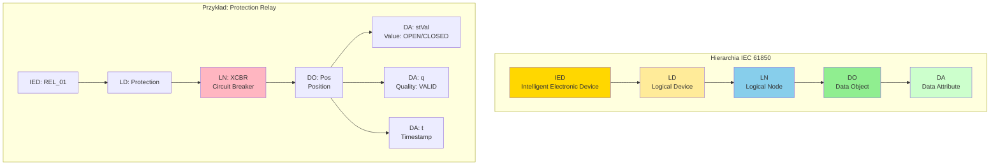
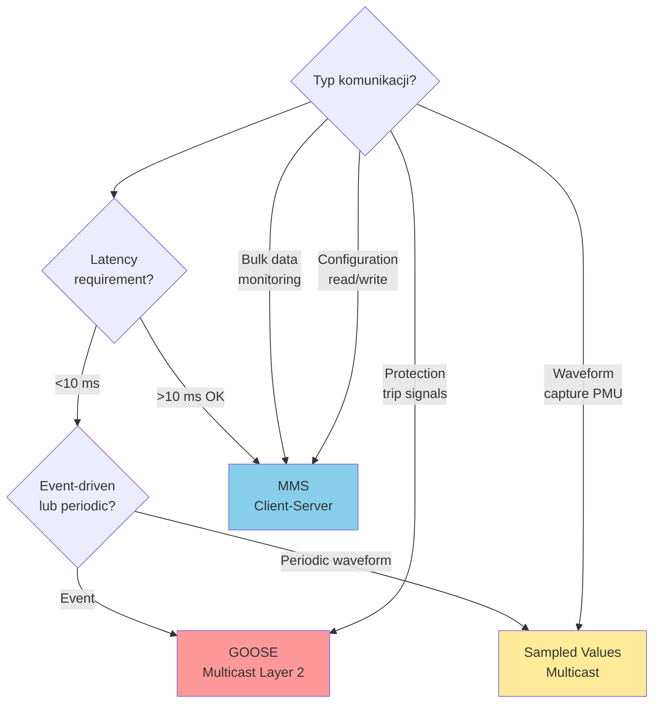
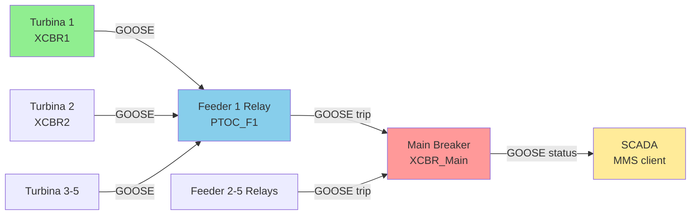
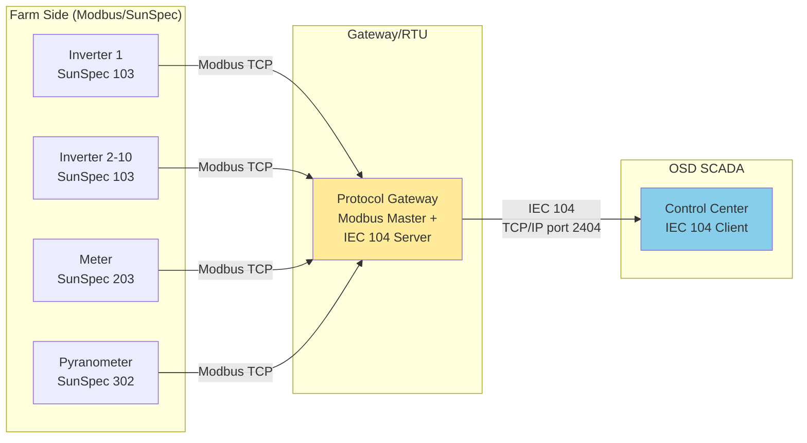

import { 
  SlideContainer, 
  Slide, 
  KeyPoints, 
  SupportingDetails, 
  InstructorNotes,
  VisualSeparator,
  LearningObjective,
  KeyConcept,
  Example
} from '@site/src/components/SlideComponents';
import { InteractiveQuiz } from '@site/src/components/InteractiveQuiz';

<LearningObjective>
Po tej sekcji student potrafi:
- Wyjaśnić architekturę IEC 61850 (Logical Nodes, Data Objects, Data Attributes) i jej zalety nad tradycyjnymi protokołami
- Rozróżnić usługi IEC 61850 (GOOSE, MMS, Sampled Values) i wskazać zastosowania każdej
- Zrozumieć protokół IEC 60870-5-104 (telemechanika) i jego rolę w integracji z systemem energetycznym
- Zaprojektować gateway mapujący między protokołami (SunSpec/Modbus → IEC 61850/104 → SCADA TSO/OSD)
</LearningObjective>

<SlideContainer>

<Slide title="📡 IEC 61850 — standard komunikacji w energetyce" type="info">

<KeyPoints title="📋 Co to jest IEC 61850 i dlaczego jest rewolucyjny?">

**IEC 61850** (Communication networks and systems for power utility automation) to **uniwersalny standard** dla komunikacji w systemach energetycznych, opublikowany 2003-2013, zaktualizowany 2020 (Edition 2.1).

**Przed IEC 61850 (lata 90.):**
- Każdy producent (ABB, Siemens, GE, Schneider) miał proprietary protokół
- Komunikacja: Hardwired I/O (binary signals, 4-20 mA loops) – setki przewodów w rozdzielni
- Integration: Bardzo kosztowna, vendor lock-in totalny
- Przykład: Wymiana relay protection → przeprogramowanie całego systemu

**Po IEC 61850 (od 2005+):**
- **Jeden standard** dla wszystkich (protection, control, monitoring, automation)
- Komunikacja: Ethernet (fiber, copper) – 2 kable zamiast 200
- Integration: Plug-and-play (teoretycznie), vendor-agnostic
- **Multi-vendor substations** – możliwe bez custom engineering

---

### **Architektura 3-warstwowa:**

**1. Warstwa informacyjna (Information Model)**



**Object reference (pełna ścieżka):**
```
IED_Name / LD_Name $ LN_Name . DO_Name . DA_Name

Przykład:
REL_01 / Protection $ XCBR1 . Pos . stVal
```

---

**2. Warstwa usług (Communication Services)**

| Usługa | Typ | Latency | Zastosowanie |
|--------|-----|---------|--------------|
| **MMS** (Manufacturing Message Specification) | Client-Server (TCP) | 10-100 ms | SCADA monitoring, control, configuration |
| **GOOSE** (Generic Object Oriented Substation Event) | Peer-to-peer (multicast, Ethernet Layer 2) | &lt;4 ms | Protection, fast trip signals, interlocking |
| **SV** (Sampled Values) | Peer-to-peer (multicast) | &lt;1 ms | Waveform sampling (substations, PMU) |
| **MMS Time Sync** | — | — | Deprecated (use PTP/NTP instead) |

---

**3. Warstwa sieciowa (Network/Physical)**

- Ethernet (100 Mbps, 1 Gbps)
- Fiber optic (długie dystanse, EMI immunity)
- Redundant networks (Parallel Redundancy Protocol – PRP, High-availability Seamless Redundancy – HSR)

</KeyPoints>

<SupportingDetails title="🔧 Logical Nodes – semantic model">

### **Przykłady Logical Nodes (wybrane):**

**Protection & Control:**
- **XCBR**: Circuit Breaker (wyłącznik) – position, operation counters
- **XSWI**: Switch (rozłącznik) – position, interlocking
- **PDIS**: Distance Protection (zabezpieczenie odległościowe)
- **PTOC**: Overcurrent Protection (nadprądowe)

**Measurement:**
- **MMXU**: Measurements Multiplex – moce, napięcia, prądy (3-phase)
- **MMTR**: Metering – energia, demand
- **MSQI**: Power Quality – harmoniczne, THD, flickering

**Supervision:**
- **TVTR**: Voltage Transformer (transformator napięciowy)
- **TCTR**: Current Transformer (przekładnik prądowy)
- **ZBAT**: Battery (UPS, DC system)

**Renewable Energy (IEC 61850-7-420):**
- **DPVI**: PhotoVoltaic Inverter
- **DGEN**: Distributed Generator (generic DER)
- **ZBAT**: Battery storage
- **ZRCT**: Reactive Control (Q control dla farm)

---

### **Data Object Classes (CDC – Common Data Class):**

Definiują strukturę Data Objects:

| CDC | Nazwa | Struktura | Przykład zastosowania |
|-----|-------|-----------|------------------------|
| **SPS** | Single Point Status | stVal (BOOL), q, t | On/off status (breaker closed) |
| **DPS** | Double Point Status | stVal (ON/OFF/INTERMEDIATE/INVALID), q, t | Circuit breaker 3-state |
| **MV** | Measured Value | mag.f (FLOAT32), q, t, units | Analog values (V, A, W) |
| **CMV** | Complex Measured Value | cVal.mag (FLOAT32), cVal.ang (FLOAT32), q, t | Phasors (V∠θ) |
| **INS** | Integer Status | stVal (INT32), q, t | Counters, enumerations |
| **APC** | Analog set Point Control | setMag.f, operTm, q, t | Control setpoints |

**Każdy DO ma minimum:**
- `stVal` (lub `mag`, `cVal`): Wartość
- `q` (quality): 64-bit quality bitfield (VALID, INVALID, QUESTIONABLE, SUBSTITUTED, ...)
- `t` (timestamp): UTC timestamp z precision do µs (jeśli PTP)

</SupportingDetails>

<InstructorNotes>

**Czas**: 18-20 min (to fundamentalna sekcja!)

**Przebieg**:
1. IEC 61850 history (2 min) – przed/po, revolution w energetyce
2. Architektura 3-warstwowa (5 min) – information model, services, network
3. Logical Nodes i Data Objects (8 min) – hierarchia, przykłady, CDCs
4. Porównanie z Modbus/proprietary (2 min) – pokazuje różnicę
5. Q&A (3 min)

**Punkty kluczowe**:
- **IEC 61850 to NIE TYLKO protokół** – to cały ecosystem (data model + services + configuration)
- **Semantic model** (XCBR.Pos, MMXU.TotW) vs. meaningless (Modbus register 40123)
- **Self-describing** – każdy tag ma .q (quality) i .t (timestamp) built-in
- **Multi-vendor przez design** – eliminuje vendor lock-in (w teorii; w praktyce: still challenges)

**Demonstracja praktyczna**:
- OPC UA client (UAExpert) browsing IEC 61850 server – pokazuje hierarchię LN → DO → DA
- SCL file (XML) – pokazuje configuration, import/export między narzędziami
- Comparison: Hardwired I/O (20 przewodów) vs. IEC 61850 (2 fiber cables) – dramatyczna różnica

**Materiały pomocnicze**:
- IEC 61850-7-2:2010 – Basic information and communication structure (free abstract)
- IEC 61850-7-420:2021 – DER logical nodes (photovoltaic, wind, battery)
- UCA International Users Group: https://uc august.org/ – resources, whitepapers
- Omicron: "IEC 61850 Basics" (free webinar/PDF)

**Typowe błędy studenckie**:
- Mylenie IEC 61850 (standard) z Modbus (protocol) – IEC 61850 używa RÓŻNYCH services (MMS, GOOSE, SV), nie jeden protocol
- Myślenie, że IEC 61850 = TCP/IP – NO! GOOSE i SV to Layer 2 Ethernet (nie IP)
- Ignorowanie .q quality – każdy tag MA quality, trzeba sprawdzać

**Pytania studenckie**:
- Q: Dlaczego IEC 61850 jest tak complex (vs. Modbus który jest prosty)?
- A: Modbus to generic register read/write. IEC 61850 to complete system (data model, services, configuration, testing). Complexity = flexibility + interoperability. Trade-off: łatwość (Modbus) vs. funkcjonalność (IEC 61850).

- Q: Czy IEC 61850 jest używany w małych instalacjach (&lt;1 MW)?
- A: Rzadko (overkill). IEC 61850 dla: Substations, large wind/solar farms, grid integration. Małe installations: Modbus/SunSpec wystarczy.

</InstructorNotes>

</Slide>

<Slide title="⚡ GOOSE vs. MMS – kiedy którego użyć?" type="tip">

<KeyConcept title="Generic Object Oriented Substation Event (GOOSE)">

**GOOSE** to peer-to-peer messaging dla **fast, critical events** (protection, trip signals).

**Charakterystyka:**
- **Transport**: Ethernet Layer 2 (nie IP!) → multicast MAC address
- **Latency**: &lt;4 ms (typowo 1-2 ms w switched network)
- **Reliability**: Publish-subscribe z retransmissions (adaptive timing)
- **Data**: Binary (DPS, SPS) lub analog (MV), max ~1500 bytes per message
- **Frequency**: Event-driven (przy zmianie wartości) + periodic heartbeat (co 1-5 s)

**Algorytm retransmission:**
1. Event occurs → immediate send
2. Retransmit po: 2 ms, 4 ms, 8 ms, 16 ms, ... (exponential backoff)
3. Po stabilizacji → periodic heartbeat (np. co 5 s)

**Przykład GOOSE message (circuit breaker trip):**
```
GOOSE Dataset: "TRIP_XCBR1"
├── XCBR1.Pos.stVal = OPEN (było CLOSED)
├── XCBR1.Pos.q = VALID
├── XCBR1.Pos.t = 2023-10-08T14:23:45.123456Z
├── PTOC1.Str.general = TRUE (overcurrent detected)
└── [other data objects in dataset...]

Multicast MAC: 01-0C-CD-01-00-01
VLAN: 100 (protection network)
Priority: 4 (high, ale nie highest – 7 reserved for SV)
```

**Zastosowania GOOSE:**
- ⚡ **Protection trip signals** (PTOC, PDIS → XCBR): "Trip breaker NOW!"
- 🔒 **Interlocking** (nie pozwól zamknąć breaker jeśli disconnector open)
- 🚨 **Alarms** (high-priority events)
- ⚙️ **Automatic transfer switch** (ATS): Switchover przy grid fault

**NIE stosować GOOSE dla:**
- ❌ Slow monitoring (trend data) → use MMS
- ❌ Waveforms (high-frequency) → use Sampled Values
- ❌ Configuration → use MMS

---

**Manufacturing Message Specification (MMS)**

**MMS** to client-server protocol dla **monitoring, control, configuration**.

**Charakterystyka:**
- **Transport**: TCP/IP (port 102)
- **Latency**: 10-100 ms (zależnie od network)
- **Operations**: Read, Write, GetDirectory, GetVariableAccessAttributes
- **Data**: Wszystkie typy (binary, analog, structures, arrays)
- **Security**: TLS optional (IEC 62351 dla cybersecurity)

**Przykład MMS operations:**
```
Client (SCADA) → Server (IED):

1. READ: "REL_01/Protection$MMXU1.TotW.mag.f" (active power)
   Response: 1250000.0 W, quality=VALID, t=2023-10-08T14:25:00Z

2. WRITE: "REL_01/Control$CSWI1.Pos.ctlVal = TRUE" (close switch)
   Response: ACK (control successful)

3. GetDirectory: "REL_01/Protection$" (list all LNs)
   Response: [XCBR1, MMXU1, PTOC1, PDIS1, ...]
```

**Zastosowania MMS:**
- 📊 **SCADA monitoring** (moce, napięcia, prądy, temperatures) – polling co 1-10 s
- 🎛️ **Remote control** (setpoints, commands)
- ⚙️ **Configuration** (settings, parameters)
- 📋 **Reporting** (event logs, disturbance recorder data)

</KeyConcept>

<SupportingDetails title="📡 GOOSE vs. MMS – decision tree">



**Kryteria wyboru:**

| Requirement | GOOSE | MMS |
|-------------|-------|-----|
| **Latency &lt;4 ms** | ✅ YES | ❌ NO (10-100 ms) |
| **Event-driven** | ✅ Optimized | ⚠️ Polling inefficient |
| **Configuration** | ❌ NO | ✅ YES |
| **Large datasets** | ❌ Limited (&lt;1500 bytes) | ✅ YES (multi-message) |
| **Security (TLS)** | ❌ NO (Layer 2) | ✅ YES (TCP → TLS possible) |
| **Routable (WAN)** | ❌ NO (multicast local only) | ✅ YES (TCP/IP) |

**Best practice:**
- **Protection** (life-safety): GOOSE
- **Monitoring** (SCADA): MMS
- **Cybersecurity-critical**: MMS + TLS (IEC 62351-3)

</SupportingDetails>

<Example title="GOOSE application: Wind farm protection coordination">

**Farma wiatrowa 50 MW + połączenie 110 kV**

**Topologia:**
- 25 turbin × 2 MW
- 5 feeders (po 5 turbin każdy)
- 1 main breaker (110 kV)
- Protection relays @ każdy feeder + main

**Protection scheme (GOOSE):**



**GOOSE messages:**

1. **Turbina 1 → Feeder 1 Relay:**
   - Dataset: "T1_TRIP"
   - Data: `T1_XCBR1.Pos.stVal = OPEN`, `T1_PTOC.Str.general = TRUE`
   - Trigger: Overcurrent detected
   - Latency: **1.5 ms** (измерено)

2. **Feeder 1 Relay → Main Breaker:**
   - Dataset: "F1_LOCKOUT"
   - Data: `F1_PTOC.Str.general = TRUE` (feeder fault confirmed)
   - Trigger: 2 or more turbines on feeder tripped (selective logic)
   - Latency: **2.8 ms**

**Total protection time: Fault detection → main breaker open = 50-80 ms**
- Turbina relay: 20 ms (current measurement + algorithm)
- GOOSE T1→F1: 2 ms
- Feeder logic: 10 ms
- GOOSE F1→Main: 3 ms
- Main breaker operation: 15-30 ms (mechanical)

**Vs. hardwired I/O (old way):**
- 25 turbin × 4 wires each (trip, status, alarm, spare) = **100 wires** do control room
- Feeder relays × 10 wires each = **50 wires**
- **Total: 150+ wires** vs. **2 fiber cables** (GOOSE network) → dramatic savings

**Koszty:**
- Hardwired: €50/wire × 150 = **€7500** installation + €500/year maintenance
- GOOSE: €3000 (fiber + switches) + €200/year
- **Savings: €4500 CAPEX + €300/year OPEX**

</Example>

<InstructorNotes>

**Czas**: 16-18 min

**Przebieg**:
1. GOOSE explanation (6 min) – multicast, latency &lt;4 ms, retransmission algorithm
2. MMS explanation (4 min) – client-server, TCP/IP, operations
3. Decision tree GOOSE vs. MMS (3 min)
4. Wind farm protection example (4 min) – pokazuje GOOSE w akcji
5. Q&A (2 min)

**Punkty kluczowe**:
- **GOOSE = fast (&lt;4 ms), MMS = flexible (10-100 ms)** – różne use cases
- **GOOSE to Layer 2** (multicast Ethernet) → NOT routable przez Internet (local only)
- **Retransmission algorithm** zapewnia reliability mimo UDP-like behavior
- **150 wires → 2 fibers** = główna value proposition IEC 61850

**Demonstracja praktyczna**:
- Wireshark capture: GOOSE packet (pokazuje multicast MAC, retransmission timing)
- Test relay: Trigger GOOSE trip, measure latency z oscilloscope (real-time)
- Comparison wiring diagram: Hardwired vs. IEC 61850 (visual impact!)

**Materiały pomocnicze**:
- IEC 61850-8-1: GOOSE specification
- IEC 61850-9-2: Sampled Values (related, ale nie dziś)
- Wireshark IEC 61850 dissector plugin (free)

**Typowe błędy studenckie**:
- Myślenie, że GOOSE to "fast Modbus" – NO! Completely different (multicast vs. polling)
- Stosowanie GOOSE do monitoring trends – NO! Event-driven, nie do continuous data
- Ignorowanie priority (VLAN priority 4-7) – w congested network, low priority GOOSE może się spóźnić

**Pytania studenckie**:
- Q: Co jeśli GOOSE message się zgubi (packet loss)?
- A: Retransmission! GOOSE publisher re-sends przy zmianie (2ms, 4ms, 8ms, ...). Subscriber ma timeout (typ. 10-50 ms) – jeśli brak heartbeat → alarm "communication loss". Reliability praktycznie 100% w LAN.

- Q: Czy można używać GOOSE przez WAN/Internet?
- A: NO (multicast Layer 2, nie routowalne). Dla WAN: MMS (TCP/IP) lub gateway (GOOSE → MMS → remote MMS → GOOSE).

</InstructorNotes>

</Slide>

<VisualSeparator type="default" />

<Slide title="🌐 IEC 60870-5-104 — telecontrol protocol" type="info">

<KeyConcept title="IEC 60870-5-104 (IEC 104) – SCADA protocol dla energetyki">

**IEC 60870-5-104** to protokół telemechaniki (telecontrol) szeroko stosowany przez **TSO (Transmission System Operators)** i **DSO (Distribution System Operators)** w Europie.

**Historia:**
- IEC 60870-5-101: Serial (RS-232/485), lata 80-90.
- **IEC 60870-5-104**: TCP/IP adaptation (2000+) → modern SCADA

**Zastosowanie:**
- Komunikacja **RTU** (Remote Terminal Unit) ↔ **Control Center SCADA**
- Zbieranie danych z farm OZE do OSD/PSE (Polska)
- Typowo: Jedna farma PV/wind = jeden RTU w IEC 104 → centrala OSD

---

### **Struktura komunikatu IEC 104:**

**APDU (Application Protocol Data Unit):**
```
APDU = APCI + ASDU

APCI (Application Protocol Control Information):
- Start byte: 0x68
- Length: 4 bytes
- Control fields: send/receive sequence numbers

ASDU (Application Service Data Unit):
- Type ID: Typ danych (np. M_ME_NC_1 = Measured value, short float)
- COT (Cause of Transmission): Dlaczego sent (SPONTANEOUS, INTERROGATED, etc.)
- CASDU (Common Address of ASDU): Adres stacji RTU (1-65535)
- IOA (Information Object Address): Adres konkretnego data point (1-16777215)
- Information elements: Wartość + quality + timestamp
```

**Kluczowe Type IDs (wybrane):**

| Type ID | Nazwa | Opis | Zastosowanie |
|---------|-------|------|--------------|
| **M_SP_NA_1** | Single-point information | Binary status (on/off) | Breaker status, alarms |
| **M_DP_NA_1** | Double-point information | 3-state (ON/OFF/INVALID) | Circuit breaker |
| **M_ME_NC_1** | Measured value, short float | Float32 analog | Moce, napięcia, prądy |
| **M_IT_NA_1** | Integrated totals | Counter (INT32) | Energy (MWh) |
| **M_SP_TB_1** | Single-point + time tag | Binary + timestamp | SOE (Sequence of Events) |
| **C_SC_NA_1** | Single command | Control (on/off) | Remote control |
| **C_SE_NC_1** | Set-point command, short float | Analog setpoint | Power setpoint, voltage ref |

**Example message (M_ME_NC_1, Active Power):**
```
Type ID: 13 (M_ME_NC_1)
COT: 3 (SPONTANEOUS – zmiana >deadband)
CASDU: 1 (Station address = Farma PV)
IOA: 4001 (AC Active Power Total)
Value: 15750000.0 (W) → 15.75 MW
Quality: 0x00 (VALID, not blocked, not substituted)
Timestamp: Optional (jeśli Type = M_ME_NC_1, brak; jeśli M_ME_TD_1, jest)
```

</KeyConcept>

<SupportingDetails title="🔌 Mapping SunSpec/Modbus → IEC 104">

**Gateway architecture (farma PV 20 MW → OSD):**



**Tag mapping table:**

| SunSpec Model.Point | IEC 104 IOA | Type ID | Description | Unit | Update |
|---------------------|-------------|---------|-------------|------|--------|
| 103.AC_Power (sum 10 inv) | 4001 | M_ME_NC_1 | Total AC Power | W → kW (÷1000) | COT=3 (SPONT), deadband 1% |
| 103.AC_Energy_Lifetime (sum) | 5001 | M_IT_NA_1 | Total Energy Produced | Wh → MWh | COT=37 (GI), every 15 min |
| 103.Status (aggregated) | 3001 | M_SP_NA_1 | Farm Operational Status | BOOL (all MPPT = 1) | COT=3 (SPONT) |
| 203.Grid_Frequency | 4010 | M_ME_NC_1 | Grid Frequency | Hz | COT=3 (SPONT), deadband 0.01 Hz |
| 302.Irradiance_POA | 4020 | M_ME_NC_1 | POA Irradiance | W/m² | COT=3 (SPONT), deadband 10 W/m² |
| Computed: PR | 4050 | M_ME_NC_1 | Performance Ratio | % | COT=3 (SPONT), every 15 min |

**Mapping logic (pseudocode):**
```python
# W gateway (Python/Node-RED)
def map_sunspec_to_iec104():
    # Read SunSpec (Modbus)
    ac_power_inv1 = read_sunspec(inv1, model=103, point="AC_Power")  # W
    ac_power_inv2 = read_sunspec(inv2, model=103, point="AC_Power")
    # ... (inv 3-10)
    
    # Aggregate
    ac_power_total = sum([ac_power_inv1, ac_power_inv2, ...])  # W
    
    # Convert units (W → kW for OSD)
    ac_power_kW = ac_power_total / 1000.0
    
    # Check quality
    quality = 0x00  # VALID
    if any_inverter_fault():
        quality |= 0x10  # INVALID bit
    
    # Send IEC 104 (SPONTANEOUS if >1% change from last)
    if abs(ac_power_kW - last_sent) > (20000 * 0.01):  # 20 MW × 1% deadband
        send_iec104(
            type_id=13,  # M_ME_NC_1
            cot=3,       # SPONTANEOUS
            casdu=1,     # Farm address
            ioa=4001,    # AC Power
            value=ac_power_kW,
            quality=quality
        )
        last_sent = ac_power_kW
```

**Deadband (pasmo nieczułości):**
- Zapobiega floodingowi przy małych oscylacjach
- Typowo: 0.5-2% dla mocy, 0.01 Hz dla częstotliwości
- Trade-off: Większy deadband = mniej traffic, ale niższa granularność

</SupportingDetails>

<InstructorNotes>

**Czas**: 16-18 min

**Przebieg**:
1. IEC 104 introduction (3 min) – historia, zastosowanie w TSO/DSO
2. Struktura APDU/ASDU (5 min) – Type IDs, COT, IOA
3. Mapping SunSpec → IEC 104 (5 min) – gateway architecture, tag mapping table
4. Deadband concept (2 min) – dlaczego potrzebny
5. Q&A (2 min)

**Punkty kluczowe**:
- **IEC 104 to standard w Europie** (TSO/DSO), ale ASIA/US używają DNP3 (Distributed Network Protocol)
- **COT (Cause of Transmission)** to kluczowy concept – dlaczego dane są wysyłane (SPONTANEOUS, INTERROGATION, etc.)
- **Deadband** redukcje traffic 10-50× (vs. continuous streaming)
- **Gateway approach** (farm protocols → IEC 104) to standard industry pattern

**Demonstracja praktyczna**:
- Wireshark capture: IEC 104 packets (pokazuje APDU structure, Type IDs)
- lib60870 (open-source C library) – example code reading IEC 104
- Gateway config (Node-RED flow lub Python script) – mapowanie tagów

**Materiały pomocnicze**:
- IEC 60870-5-104:2006 – Telecontrol equipment (official spec)
- lib60870: https://github.com/mz-automation/lib60870 (open-source implementation)
- FreyrSCADA: IEC 104 simulator/tester (free tool)

**Typowe błędy studenckie**:
- Mylenie IEC 104 z IEC 61850 – to RÓŻNE protokoły (choć oba w energetyce)!
- Wysyłanie wszystkich danych co 1 s (bez deadband) → flooding, OSD będzie niezadowolony
- Brak COT (Cause of Transmission) – każda wiadomość MUSI mieć COT

**Pytania studenckie**:
- Q: Dlaczego OSD wymaga IEC 104 (a nie Modbus lub OPC UA)?
- A: Legacy + standard polski/europejski. PSE/OSD mają infrastructure IEC 104 od lat 90. Zmiana na OPC UA = massive investment. W nowych projektach: czasem OPC UA allowed, ale IEC 104 still dominant.

- Q: Co to GI (General Interrogation)?
- A: Command od OSD: "Wyślij mi ALL data points (not just changes)". Wykonywane: (1) przy starcie połączenia, (2) periodically (np. co 15 min), (3) on demand. COT = 20 (INTERROGATION).

</InstructorNotes>

</Slide>

<VisualSeparator type="default" />

<Slide title="🔌 Case study: Integracja farmy PV 20 MW z OSD" type="success">

<KeyPoints title="📋 Architektura systemu">

**Farma PV 20 MWp, przyłączenie 110 kV, south Polska**

**Requirements od OSD (PSE Dystrybucja):**
- Protokół: **IEC 60870-5-104**
- Update rate: ≥1 per minute (dla mocy), ≥15 min (dla energii)
- Dostępność: &gt;99.5% (allowed downtime &lt;43h/year)
- Cybersecurity: Firewall, VPN IPsec, no public IP
- Time sync: ±1 s (NTP)

**Punkty danych wymagane przez OSD (minimum):**

| IOA | Nazwa | Type ID | Unit | COT | Uwagi |
|-----|-------|---------|------|-----|-------|
| 4001 | P_AC_Total | M_ME_NC_1 | kW | 3 (SPONT) | Deadband 1% (200 kW) |
| 4002 | Q_AC_Total | M_ME_NC_1 | kVAr | 3 (SPONT) | Reactive power |
| 4010 | Grid_Voltage_L1 | M_ME_NC_1 | kV | 3 (SPONT) | Deadband 0.5 kV |
| 4011 | Grid_Voltage_L2 | M_ME_NC_1 | kV | 3 (SPONT) | |
| 4012 | Grid_Voltage_L3 | M_ME_NC_1 | kV | 3 (SPONT) | |
| 4020 | Grid_Frequency | M_ME_NC_1 | Hz | 3 (SPONT) | Deadband 0.01 Hz |
| 5001 | E_Export_Total | M_IT_NA_1 | MWh | 37 (GI) | Cumulative, co 15 min |
| 3001 | Farm_Status | M_SP_NA_1 | — | 3 (SPONT) | 1=OK, 0=FAULT |
| 3100-3110 | Inverter_Status (1-10) | M_SP_NA_1 | — | 3 (SPONT) | Per inverter |

**Łącznie: ~20 data points** (minimum dla grid compliance)

</KeyPoints>

<SupportingDetails title="🛠️ Implementation details">

**Hardware:**
- **Gateway/RTU**: Siemens SICAM A8000 (IEC 104 certified) lub Raspberry Pi + lib60870
- **Połączenie OSD**: VPN IPsec przez Internet (dedykowany tunnel), fallback: 4G/LTE
- **Redundancja**: 2× połączenia (primary: fiber Internet, secondary: LTE)

**Software stack (Raspberry Pi approach):**
```
┌─────────────────────────────────────┐
│  IEC 104 Server (lib60870, port 2404) │
│  ↑                                   │
│  Data Aggregator (Python/Node-RED)  │
│  ↑                                   │
│  Modbus Client (pymodbus, 10 inv)   │
└─────────────────────────────────────┘
         ↓ Modbus TCP
┌──────────────┐  ┌──────────────┐
│ Inverter 1-10│  │ Meter, Meteo │
└──────────────┘  └──────────────┘
```

**Configuration (lib60870 Python example):**
```python
from lib60870 import *

# IEC 104 Server configuration
connection_params = CS104_ConnectionParameters()
connection_params.t1 = 15  # Timeout for send (s)
connection_params.t2 = 10  # Timeout for ACK (s)
connection_params.t3 = 20  # Timeout for test frames (s)

server = CS104_Slave("0.0.0.0", 2404)  # Listen all interfaces

# Add data points
server.addInformationObject(
    ca=1,  # CASDU (farm address)
    ioa=4001,  # IOA (P_AC)
    type=M_ME_NC_1,  # Measured value, float
    value=15750.0,  # kW
    quality=IEC60870_QUALITY_GOOD
)

# Handle commands from OSD (interrogation, setpoints)
def interrogation_handler(user_param, ca, cot, qoi):
    # OSD requests all data (General Interrogation)
    # Send all points with COT=20 (INTERROGATION)
    server.sendAllDataPoints(ca, cot=20)
    
server.setInterrogationHandler(interrogation_handler)
server.start()  # Non-blocking
```

**Communication flow:**

1. **Startup:**
   - OSD connects to farm RTU (TCP port 2404)
   - Handshake (TESTFR, STARTDT)
   - OSD sends **GI (General Interrogation)** → farm sends all data points

2. **Normal operation:**
   - Farm sends SPONTANEOUS (COT=3) when value changes >deadband
   - OSD może request GI co 15 min (periodic refresh)
   - Heartbeat: Test frames co 20 s (check connection alive)

3. **Control:**
   - OSD sends command (C_SC_NA_1, turn off farm)
   - Farm ACKs + executes
   - Farm sends status change (M_SP_NA_1, COT=3)

</SupportingDetails>

<Example title="Real deployment: 20 MWp PV farm → PSE (Polska)">

**Projekt: Farma Fotowoltaiczna, woj. Dolnośląskie, 2022**

**Wymagania PSE (Transmission System Operator):**
- Protokół: IEC 60870-5-104
- Minimalne data points: 15 (moce, napięcia, częstotliwość, energia, statusy)
- Update: Spontaneous (deadband), + GI co 15 min
- Dostępność: >99% (SLA)
- Cybersecurity: VPN IPsec, certyfikaty, firewall

**Implementacja:**

**Hardware:**
- RTU: Siemens SICAM A8000 CP-8031 (€8000) – certified IEC 104 device
- VPN router: Cisco ISR 1100 (€2000)
- Fiber connection: Dedicated 10 Mbps (€150/month)
- Fallback: LTE modem (€50/month)

**Configuration:**
- 10 inwerterów SunSpec → SICAM reads via Modbus TCP (every 1 s)
- Aggregation: Sum power, compute PR (farm-level)
- IEC 104: 18 data points (required 15 + 3 optional)
- Deadband: 1% dla mocy (200 kW), 0.5% dla napięcia
- GI response time: &lt;5 s (all 18 points)

**Costs (1-year TCO):**
- CAPEX: 8000 + 2000 + installation 5000 = **€15 000**
- OPEX: Fiber €1800 + LTE €600 + maintenance €500 = **€2900/year**
- **Total Year 1: €17 900**

**Results (po 12 miesiącach):**
- Uptime: **99.7%** (downtime: 26h total, mostly planned maintenance)
- Data quality: 99.95% (tylko 4.4 h invalid data przez communication glitches)
- Compliance: **100%** (audit OSD passed)

**Lessons learned:**
1. **Redundant connection CRITICAL** – primary fiber down 3× (każdy 2-4h), LTE przejęło seamlessly
2. **NTP sync important** – PSE wymaga timestamp ±1 s, bez NTP drift do 30 s w tydzień
3. **Deadband tuning**: Initially 0.5% (100 kW) → zbyt dużo traffic (500 msg/h), increased do 1% → 150 msg/h (OK)
4. **Testing with PSE**: Pre-deployment test (PSE provides test SCADA) = 1 week, found 3 configuration errors (IOA mismatches)

</Example>

<InstructorNotes>

**Czas**: 14-16 min

**Przebieg**:
1. IEC 104 structure (4 min) – APDU, ASDU, Type IDs, COT
2. Mapping SunSpec → IEC 104 (4 min) – gateway architecture, tag table
3. Case study (5 min) – real deployment, costs, lessons learned
4. Q&A (2 min)

**Punkty kluczowe**:
- **IEC 104 to requirement** w Polsce/EU dla przyłączenia >1 MW do sieci
- **Gateway approach** (farm Modbus/SunSpec → IEC 104 → OSD) to standard pattern
- **Deadband** kluczowy dla minimize traffic (bez: flooding)
- **Testing z OSD PRZED deployment** – PSE provides test environment (use it!)

**Demonstracja praktyczna**:
- Wireshark: IEC 104 traffic (pokazuje Type IDs, COT, IOA values)
- lib60870 test server (Python) – students can connect z test client
- Gateway konfiguracja (Node-RED lub SICAM) – pokazuje mapping

**Materiały pomocnicze**:
- IEC 60870-5-104 Companion Standard (simplified guide)
- PSE: "Wymagania dla jednostek wytwórczych" (PDF, polski) – specyfikuje IEC 104 requirements
- lib60870 documentation + examples (GitHub)
- FreyrSCADA IEC 104 client/server (free testing tool)

**Typowe błędy studenckie**:
- Mylenie IOA (Information Object Address, np. 4001) z Modbus register address (40001)
- Wysyłanie wszystkich updates (bez deadband) → OSD complaints o traffic
- Brak response na GI (General Interrogation) → OSD disconnect

**Pytania studenckie**:
- Q: Czy można używać IEC 104 wewnętrznie w farmie (nie tylko do OSD)?
- A: MOŻNA, ale uncommon. IEC 104 designed dla telecontrol (long-distance, WAN). Wewnętrznie lepiej: Modbus, OPC UA, IEC 61850 (local).

- Q: Co to redundancja łączy (primary/secondary)?
- A: 2 połączenia TCP do OSD (różne routes: fiber + LTE). Jeśli primary fail → automatic switchover do secondary (&lt;1 min). IEC 104 ma built-in redundancy support.

</InstructorNotes>

</Slide>

<VisualSeparator type="default" />

<Slide title="📝 Quiz: IEC 61850 i IEC 104" type="info">

<InteractiveQuiz 
  questions={[
    {
      question: "Co jest główną różnicą między GOOSE a MMS w IEC 61850?",
      options: [
        "GOOSE to TCP/IP, MMS to UDP",
        "GOOSE to multicast Layer 2 (<4 ms latency, protection), MMS to client-server TCP/IP (10-100 ms, monitoring)",
        "GOOSE to dla PV, MMS to dla wind",
        "GOOSE jest nowszy (zastępuje MMS)"
      ],
      correctAnswer: 1,
      explanation: "GOOSE = peer-to-peer multicast Ethernet Layer 2, <4 ms, event-driven (protection). MMS = client-server TCP/IP, 10-100 ms, polling/commands (SCADA monitoring). Opcja (a) nieprawda (GOOSE to Layer 2, not UDP). Opcja (c) nieprawda (oba dla wszystkich technologies). Opcja (d) nieprawda (both active, różne use cases)."
    },
    {
      question: "W IEC 61850, co reprezentuje object reference 'REL_01/Protection$XCBR1.Pos.stVal'?",
      options: [
        "IED=REL_01, LD=Protection, LN=XCBR1, DO=Pos, DA=stVal (position value of circuit breaker)",
        "Modbus register address 40001 w urządzeniu REL_01",
        "IP address 192.168.1.1 port 102 dla Protection relay",
        "OPC UA node ID dla breaker position"
      ],
      correctAnswer: 0,
      explanation: "IEC 61850 object reference format: IED/LD$LN.DO.DA. XCBR = Circuit Breaker (Logical Node), Pos = Position (Data Object), stVal = status value (Data Attribute). Opcja (b/c/d) to różne protokoły."
    },
    {
      question: "W IEC 60870-5-104, COT (Cause of Transmission) = 3 oznacza:",
      options: [
        "Error code 3 (communication failure)",
        "SPONTANEOUS – data sent because value changed >deadband",
        "Priority level 3 (medium priority)",
        "Station address 3"
      ],
      correctAnswer: 1,
      explanation: "COT=3 to SPONTANEOUS (spontaniczny) – wysłane bo wartość przekroczyła deadband. COT=20 to INTERROGATION (GI), COT=7 to ACTIVATION confirmation. Nie jest to error code ani priority (priority w VLAN tag, nie COT)."
    },
    {
      question: "Farma PV ma P_AC = 15.75 MW. Gateway wysyła do OSD w IEC 104. Deadband = 1% (20 MW × 0.01 = 200 kW). Moc spadła do 15.65 MW. Czy gateway wysyła update?",
      options: [
        "TAK – zmiana 100 kW < 200 kW deadband, ale każda zmiana powinna być wysłana",
        "NIE – zmiana 100 kW < 200 kW deadband → nie wysyła (czeka na większą zmianę)",
        "TAK – zawsze wysyła co 1 minutę (required by OSD)",
        "Nie można ocenić bez znajomości poprzedniej wartości"
      ],
      correctAnswer: 1,
      explanation: "Deadband 200 kW: Jeśli |P_new - P_last_sent| < 200 kW → NO SEND. Zmiana 15.75 → 15.65 = 100 kW < 200 kW → nie wysyła. Opcja (c) nieprawda (SPONTANEOUS, nie periodic). Opcja (d) nieprawda (pytanie mówi 'from 15.75 MW', to jest previous value)."
    },
    {
      question: "Co to jest GI (General Interrogation) w IEC 104?",
      options: [
        "Grid Integration – procedura przyłączenia farmy do sieci",
        "General Interrogation – komenda od OSD: 'wyślij wszystkie data points' (COT=20)",
        "Generator Interconnection – synchronizacja generatora",
        "Ground Isolation – test izolacji"
      ],
      correctAnswer: 1,
      explanation: "GI (General Interrogation) to command (C_IC_NA_1) od SCADA: Send all data points (regardless of deadband). RTU responds z COT=20 (INTERROGATION). Wykonywane przy starcie połączenia i periodically (co 15-60 min). Opcja (a/c/d) to inne pojęcia (nie IEC 104 terminology)."
    }
  ]}
/>

:::tip Rekomendacja po quizie
Jeśli uzyskałeś &lt;80% poprawnych odpowiedzi, przejrzyj sekcje o usługach IEC 61850 (GOOSE vs. MMS), hierarchii obiektów (IED/LD/LN/DO/DA), i IEC 104 structure (COT, deadband). Zrozumienie tych protokołów jest kluczowe dla integracji farm OZE z systemem energetycznym.
:::

</Slide>

</SlideContainer>

---

## Podsumowanie i wnioski

**Kluczowe punkty z tej sekcji:**

1. **IEC 61850 = revolution w energetyce** – od hardwired I/O (100+ przewodów) do Ethernet (2 fiber cables), vendor-agnostic integration.

2. **Architektura IEC 61850:**
   - **Information Model**: IED → LD → LN → DO → DA (hierarchia semantyczna)
   - **Services**: GOOSE (&lt;4 ms, protection), MMS (10-100 ms, monitoring), SV (&lt;1 ms, waveforms)
   - **Network**: Ethernet, redundancja (PRP/HSR)

3. **Logical Nodes (LN)** to semantic building blocks:
   - Protection: XCBR, XSWI, PTOC, PDIS
   - Measurement: MMXU, MMTR, MSQI
   - DER: DPVI (PV), DGEN (generic), ZBAT (battery)

4. **IEC 60870-5-104** to telecontrol standard (Europe):
   - APDU struktura: Type ID + COT + CASDU + IOA + value + quality
   - Deadband (0.5-2%) redukuje traffic 10-50×
   - **Requirement dla przyłączenia >1 MW** w Polsce

5. **Gateway pattern**: Farm protocols (Modbus/SunSpec) → IEC 104 → OSD SCADA. Koszt: €15-20k CAPEX, €3-5k/year OPEX.

**Następne kroki:**
- Ćwiczenie: Mapowanie tagów SunSpec → IEC 104 (tag dictionary)
- Przygotowanie do następnej sekcji: Integracja z EMS/DERMS/VPP (energy management systems)

---

**Dodatkowe zasoby:**
- **IEC 61850** series (parts 1-10) – Complete standard
- **IEC 60870-5-104** – Telecontrol equipment
- **lib60870**: https://github.com/mz-automation/lib60870 (open-source C/Python/C#)
- **UCA Users Group**: https://ucaiug.org/ – IEC 61850 resources, interoperability tests
- **PSE**: "Warunki przyłączenia jednostek wytwórczych" (Polish grid code, specifies IEC 104)


