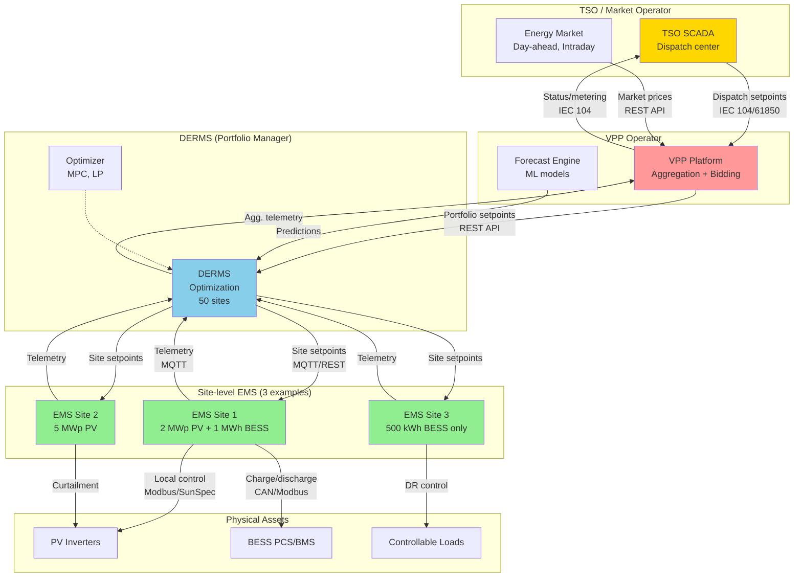
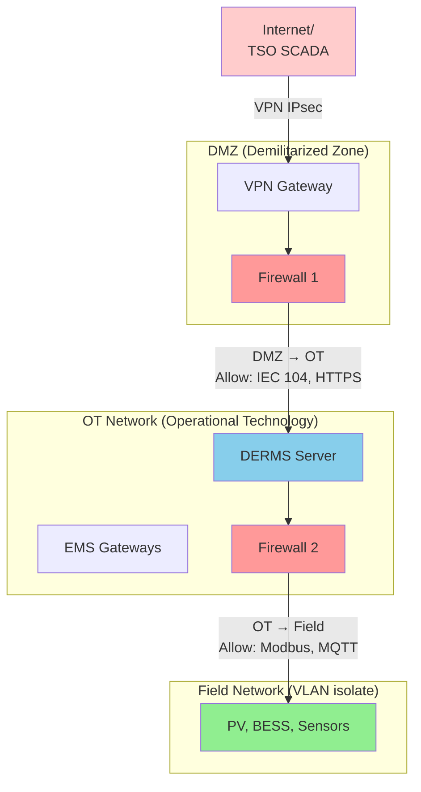

import { 
  SlideContainer, 
  Slide, 
  KeyPoints, 
  SupportingDetails, 
  InstructorNotes,
  VisualSeparator,
  LearningObjective,
  KeyConcept,
  Example
} from '@site/src/components/SlideComponents';
import { InteractiveQuiz } from '@site/src/components/InteractiveQuiz';

<LearningObjective>
Po tej sekcji student potrafi:
- Rozróżnić role EMS (lokalna optymalizacja), DERMS (koordynacja portfolio), i VPP (agregacja dla TSO)
- Zaprojektować interfejsy integracyjne (REST API, MQTT) z właściwym security (OAuth2, TLS)
- Zdefiniować przepływy danych (setpoints, telemetry, forecasts) między warstwami systemu
- Zaimplementować przykładowy use case (peak shaving, frequency regulation) w architekturze EMS/DERMS
</LearningObjective>

<SlideContainer>

<Slide title="🏗️ EMS, DERMS, VPP – definicje i role" type="info">

<KeyPoints title="📋 Hierarchia systemów zarządzania energią">

### **1. EMS (Energy Management System) – warstwa lokalna**

**Definicja**: System optymalizujący **pojedynczą instalację** lub budynek (local optimization).

**Funkcje:**
- **Load balancing**: Bilansowanie ładunków (priorytetyzacja)
- **Self-consumption**: Maksymalizacja autokonsumpcji (PV → local loads)
- **BESS control**: Optymalne ładowanie/rozładowanie według tariff/forecast
- **Demand response**: Reakcja na sygnały DR (demand response) od grid
- **Forecasting**: Local prediction (PV output, load demand) – 15 min do 72h ahead

**Typowa instalacja EMS:**
- Residential: 10 kWp PV + 10 kWh BESS + smart loads (heat pump, EV charger)
- Commercial: 500 kWp PV + 500 kWh BESS + building loads (HVAC, lighting)
- Industrial: 5 MWp PV + 2 MWh BESS + production lines

**Software examples**: Home Assistant, OpenEMS, Victron VRM, Tesla Powerwall app

---

### **2. DERMS (Distributed Energy Resource Management System) – warstwa portfolio**

**Definicja**: System koordynujący **portfolio rozproszonych zasobów** (multiple sites, DER aggregation).

**Funkcje:**
- **Portfolio optimization**: Optymalizacja wielu instalacji jednocześnie (10-1000 sites)
- **Grid constraints**: Respektowanie ograniczeń sieciowych (voltage, thermal limits)
- **Market participation**: Bidding do rynków energii (day-ahead, intraday, balancing)
- **Aggregation**: Wirtualne łączenie zasobów (małe BESS → duża jednostka)
- **Forecasting**: Portfolio-level (agregacja local forecasts + correlations)

**Typowa instalacja DERMS:**
- Portfolio: 50-500 farm PV/wind + BESS (total 100-1000 MW)
- Operator: Aggregator, utility, VPP operator
- Użytkownicy: Trading desk, grid operator, asset managers

**Software examples**: AutoGrid, Stem, Sunverge, Enbala, GE DERMS

---

### **3. VPP (Virtual Power Plant) – warstwa agregacji dla TSO**

**Definicja**: **Wirtualna elektrownia** agregująca rozproszone zasoby (DER) i prezentująca je do TSO jako **pojedyncza, dyspatchable jednostka**.

**Funkcje:**
- **Aggregation**: Sumowanie mocy z 100-10 000 zasobów (PV, wind, BESS, demand response)
- **Dispatch**: Realizacja setpoints od TSO (frequency regulation, reserves)
- **Forecasting**: Portfolio forecast with uncertainty quantification
- **Bidding**: Uczestnictwo w rynkach systemowych (FCR, aFRR, mFRR, RR)
- **Settlement**: Rozliczenia z TSO i distribucja do individual assets

**Typowa instalacja VPP:**
- Portfolio: 500-5000 farm + residential BESS (total 500 MW - 5 GW)
- Operator: Aggregator, utility, independent VPP operator
- Usługi: Frequency regulation (FCR ±10-50 MW), demand response (DR 100-500 MW)

**Software examples**: Next Kraftwerke, Sonnen VPP, Tesla Autobidder, EnergyHub

---

### **Hierarchia i przepływy:**



**Komunikacja (protokoły):**
- **TSO ↔ VPP**: IEC 60870-5-104, IEC 61850 (heavyweight)
- **VPP ↔ DERMS**: REST API, GraphQL (modern, flexible)
- **DERMS ↔ EMS**: MQTT, REST API, OPC UA (lightweight, cloud-friendly)
- **EMS ↔ Assets**: Modbus, SunSpec, CAN, proprietary (field-level)

</KeyPoints>

<SupportingDetails title="🎯 Kluczowe różnice między EMS, DERMS, VPP">

| Aspekt | EMS (Local) | DERMS (Portfolio) | VPP (Aggregation) |
|--------|-------------|-------------------|-------------------|
| **Skala** | 1 instalacja (10 kW - 10 MW) | 10-1000 instalacji (100 MW - 1 GW) | 100-10000 zasobów (500 MW - 5 GW) |
| **Optimizacja** | Lokalna (self-consumption, cost) | Portfolio (grid constraints, market) | System-wide (TSO services, reserves) |
| **Użytkownik** | Właściciel instalacji, facility manager | Asset manager, aggregator | VPP operator, trading desk |
| **Time horizon** | Realtime - 24h | Hours - week | Day-ahead + intraday |
| **Control** | Direct (Modbus commands) | Indirect (setpoints do EMS) | Very indirect (dispatch to DERMS/EMS) |
| **Granularity** | Sub-second (control loops) | Minutes (15 min typically) | Minutes-hours (market intervals) |
| **Compliance** | Local regulations | Grid codes (voltage, ramp rates) | TSO requirements (prequalification) |
| **Koszt** | €5-50k (software) | €100k-1M (platform) | €1M-10M (system) |

**Przykład flow (frequency regulation):**

1. **TSO** → VPP: "Increase output +10 MW w ciągu 5 min (aFRR activation)"
2. **VPP** → DERMS: "Portfolio target +10 MW, distribute according to availability"
3. **DERMS** (optymalizacja):
   - Site 1 (5 MWp PV): Currently 3 MW (weather OK) → curtail do 2.5 MW = +0.5 MW reduction (nie pomaga, potrzeba increase!)
   - Site 2 (2 MWh BESS): SoC 60%, available discharge power 1.5 MW → **dispatch +1.5 MW**
   - Site 3 (5 MWh BESS): SoC 80%, available 4 MW → **dispatch +4 MW**
   - Site 4-10 (various): Distribute remaining +4 MW
4. **EMS** (Sites 2,3,...): Receive setpoint, execute local control (BESS discharge)
5. **Assets** (BESS PCS): Ramp up power według setpoint (slew rate limits: typ. 1-5 MW/s)
6. **Telemetry** (reverse flow): EMS → DERMS → VPP → TSO (confirmation: +10 MW delivered)

**Timeline:**
- TSO activation signal → VPP receives: **&lt;1 s** (IEC 104)
- VPP optimization → DERMS setpoints: **5-15 s** (cloud processing)
- DERMS → EMS commands: **1-5 s** (MQTT)
- EMS → BESS ramp: **10-60 s** (physical constraints)
- **Total: 20-80 s** (well within 5 min requirement)

</SupportingDetails>

<InstructorNotes>

**Czas**: 16-18 min

**Przebieg**:
1. Definicje EMS/DERMS/VPP (5 min) – omów hierarchię, kto zarządza czym
2. Hierarchia i przepływy (Mermaid diagram) (4 min) – pokazuje big picture
3. Tabela różnic (3 min) – scales, optimization, costs
4. Przykład flow (frequency regulation) (3 min) – step-by-step
5. Q&A (2 min)

**Punkty kluczowe**:
- **EMS = local, DERMS = portfolio, VPP = market interface** – różne warstwy, różne cele
- **VPP to "glue"** między distributed assets a centralized TSO
- **Optimization cascades**: TSO setpoint → VPP → DERMS → EMS → Assets
- **Bidirectional telemetry**: Assets → EMS → DERMS → VPP → TSO (real-time status)

**Demonstracja praktyczna**:
- Dashboard DERMS (jeśli dostępne, pokazuje portfolio view)
- Live API call: VPP REST API (GET /sites, GET /forecasts) – Postman lub curl
- Grafana: Multi-site view (50 farm, aggregated power, status)

**Materiały pomocnicze**:
- IEEE 2030.5 (Smart Energy Profile) – DER communication standard (US)
- IEC 61850-7-420 – DER communication (Europe)
- OpenADR (Automated Demand Response) – protocol dla DR
- Example DERMS architecture (whitepaper: Siemens, GE, Schneider)

**Typowe błędy studenckie**:
- Mylenie EMS z DERMS (scale różny, optimization objectives różne)
- Myślenie, że VPP to software – NO! VPP to business model + software platform
- Ignorowanie latency (TSO activation → asset response): &lt;5 min dla aFRR (automatic Frequency Restoration Reserve)

**Pytania studenckie**:
- Q: Czy każda farma PV potrzebuje EMS?
- A: NIE. Małe farmy (&lt;1 MW, bez BESS): Basic monitoring wystarczy. EMS sensowny dla: (1) Hybrid PV+BESS, (2) Demand response participation, (3) Complex tariffs (TOU – Time of Use). Koszt EMS: €10-50k, ROI zależy od business case.

- Q: Co to prequalification dla VPP (TSO services)?
- A: TSO wymaga proof że VPP może deliver (testy performance: ramp rates, availability, telemetry). Proces: 3-12 miesięcy, koszty €50-200k (technical documentation, tests). Bez prequalification: NO market access.

</InstructorNotes>

</Slide>

<VisualSeparator type="technical" />

<Slide title="🔌 Interfejsy i protokoły integracyjne" type="tip">

<KeyConcept title="API-first architecture (modern approach)">

**Tradycyjne podejście** (SCADA-centric):
- Proprietary protocols (Modbus, OPC UA, IEC 104)
- Tight coupling (każda zmiana wymaga reconfiguration)
- Trudna skalacja (dodanie nowego site = manual work)

**Modern approach** (API-first, cloud-native):
- **REST API** dla configuration, control, reporting (synchronous)
- **MQTT/AMQP** dla telemetry, events (asynchronous, pub-sub)
- **GraphQL** dla flexible queries (alternatywa do REST)
- Loose coupling (APIs są contracts, implementation za nimi może się zmieniać)
- Easy scaling (auto-discovery, containerization)

---

### **REST API dla EMS/DERMS:**

**Typowe endpoints:**

```http
# Configuration
GET    /api/v1/sites                    # List all sites
GET    /api/v1/sites/{id}               # Get site details
POST   /api/v1/sites                    # Create new site
PATCH  /api/v1/sites/{id}               # Update configuration

# Control (setpoints)
POST   /api/v1/sites/{id}/setpoint      # Send power setpoint
GET    /api/v1/sites/{id}/constraints   # Get operational limits (Pmin, Pmax, ramp rate)

# Telemetry (optional, MQTT better dla high-frequency)
GET    /api/v1/sites/{id}/telemetry     # Get current state (SoC, Power, Status)
GET    /api/v1/sites/{id}/telemetry/history?start=...&end=...  # Historical data

# Forecasting
GET    /api/v1/sites/{id}/forecast/pv   # PV production forecast (next 72h)
GET    /api/v1/sites/{id}/forecast/load # Load forecast

# Reporting
GET    /api/v1/sites/{id}/kpi?period=month  # KPI report (PR, availability, revenue)
```

**Authentication & Authorization:**
- **OAuth 2.0** (preferred): Token-based, scope-based permissions
- **API Keys**: Prostszy, ale mniej flexible (no fine-grained control)
- **mTLS** (mutual TLS): Client certificates dla highest security

**Przykład request (setpoint via REST):**
```bash
curl -X POST https://derms.example.com/api/v1/sites/SITE_123/setpoint \
  -H "Authorization: Bearer eyJhbGc..." \
  -H "Content-Type: application/json" \
  -d '{
    "power_setpoint_kW": 1500,
    "ramp_rate_kW_per_min": 100,
    "duration_min": 60,
    "priority": "high"
  }'

# Response:
{
  "status": "accepted",
  "setpoint_id": "SP_456789",
  "expected_delivery_time": "2023-10-08T14:35:00Z",
  "estimated_power_kW": 1480  # May differ from request (constraints)
}
```

---

### **MQTT dla telemetry (high-frequency):**

**Topic structure:**
```
telemetry/{site_id}/{device_type}/{device_id}/{metric}

Examples:
telemetry/SITE_123/inverter/INV01/ac_power       → 1250.5 (kW)
telemetry/SITE_123/bess/BESS01/soc               → 65.2 (%)
telemetry/SITE_123/meter/METER01/grid_power      → -500.3 (kW, negative=export)
telemetry/SITE_123/site/AGGR/total_power         → 1750.0 (kW, PV+BESS)
```

**QoS levels:**
- **QoS 0** (at most once): Telemetry non-critical (trends) – fastest, no overhead
- **QoS 1** (at least once): Telemetry critical (alarms) – ACK required, może duplicate
- **QoS 2** (exactly once): Control commands – slowest, ale guaranteed

**Security:**
- **TLS 1.3** (encryption)
- **Username/password** lub **client certificates**
- **ACL (Access Control List)**: Który client może read/write które topics

**Payload (JSON):**
```json
{
  "timestamp": "2023-10-08T14:32:45.123Z",
  "value": 1250.5,
  "unit": "kW",
  "quality": "VALID",
  "source": "sunspec_modbus"
}
```

</KeyConcept>

<SupportingDetails title="📊 Przepływy danych (data flows)">

### **Downstream (commands): TSO → VPP → DERMS → EMS → Assets**

| Flow | Protocol | Frequency | Latency target | Example |
|------|----------|-----------|----------------|---------|
| **TSO → VPP** | IEC 104, IEC 61850 | On-demand (aFRR activation) | &lt;5 s | "Increase +10 MW" |
| **VPP → DERMS** | REST API (POST setpoint) | Minutes (optimization cycle) | &lt;30 s | Portfolio distribution |
| **DERMS → EMS** | MQTT (pub), REST (sync) | Seconds-minutes | &lt;10 s | Site-level setpoints |
| **EMS → Assets** | Modbus, SunSpec, CAN | Milliseconds-seconds | &lt;1 s | Inverter curtailment, BESS charge |

### **Upstream (telemetry): Assets → EMS → DERMS → VPP → TSO**

| Flow | Protocol | Frequency | Aggregation | Example |
|------|----------|-----------|-------------|---------|
| **Assets → EMS** | Modbus poll, SunSpec | 1-10 s (raw) | 1-min mean @ EMS | 10 inverters → 1 site value |
| **EMS → DERMS** | MQTT publish | 1-60 s | 5-min mean @ DERMS | 50 sites → portfolio view |
| **DERMS → VPP** | MQTT, REST | 1-15 min | 15-min aggregation | Portfolio KPI |
| **VPP → TSO** | IEC 104 SPONTANEOUS | Per deadband (1%) | Site-level already aggregated | Single value: Total output |

**Data reduction (through aggregation):**
- **Assets level**: 10 inverters × 10 Hz × 10 metrics = **1000 data points/s**
- **EMS level** (1-min mean): 10 metrics × (1/60 Hz) = **0.17 data points/s** → **600× reduction**
- **DERMS level** (5-min mean, 50 sites): 50 sites × 20 metrics × (1/300 Hz) = **3.3 data points/s**
- **VPP level** (15-min aggregation): 5 metrics × (1/900 Hz) = **0.0056 data points/s**

**From 1000 points/s (asset) to 0.0056 points/s (VPP) = 180 000× reduction!**

</SupportingDetails>

<Example title="Use case: Peak shaving w hybrid PV+BESS (EMS logic)">

**Instalacja: Commercial building, 500 kWp PV + 500 kWh BESS**

**Objective:** Minimize demand charges (opłaty szczytowe) – tariff penalizuje peak power >1000 kW

**EMS strategy:**

```python
# Pseudocode (EMS control loop, every 1 min)
while True:
    # Measurements
    pv_power = read_sunspec(inverters, "AC_Power")  # kW (current generation)
    load_power = read_meter("Load_Power")           # kW (building consumption)
    grid_power = read_meter("Grid_Power")           # kW (positive=import)
    bess_soc = read_sunspec(bess, "SoC")            # %
    
    # Prediction (short-term, 15 min ahead)
    load_forecast = ml_model.predict(load_power, time=now+15min)  # Historical pattern + weather
    pv_forecast = pvlib.forecast(ghi, cloud_cover, time=now+15min)
    
    # Decision logic
    if load_forecast > PEAK_THRESHOLD (1000 kW):
        # Predicted peak → preemptive action
        deficit = load_forecast - pv_forecast - PEAK_THRESHOLD
        
        if deficit > 0 and bess_soc > SOC_MIN (20%):
            # Discharge BESS to shave peak
            bess_setpoint = min(deficit, BESS_MAX_DISCHARGE (500 kW))
            send_command(bess, "Discharge", power=bess_setpoint)
            log("Peak shaving activated: BESS discharge {} kW".format(bess_setpoint))
        elif deficit > 0 and bess_soc <= SOC_MIN:
            # BESS depleted → curtail non-critical loads
            curtail_loads(deficit)
            log("Load curtailment: {} kW (BESS unavailable)".format(deficit))
    
    elif grid_power < 0 and bess_soc < SOC_MAX (90%):
        # Exporting to grid + BESS not full → charge BESS (store excess PV)
        bess_setpoint = min(-grid_power, BESS_MAX_CHARGE (500 kW), (SOC_MAX - bess_soc) * CAPACITY)
        send_command(bess, "Charge", power=bess_setpoint)
        log("Self-consumption: BESS charge {} kW".format(bess_setpoint))
    
    else:
        # No action needed (within limits)
        send_command(bess, "Idle")
    
    sleep(60)  # 1-min cycle
```

**Wyniki (6 miesięcy eksploatacji):**

| Metric | Przed EMS | Z EMS | Poprawa |
|--------|-----------|-------|---------|
| **Peak demand** (max) | 1450 kW | 980 kW | -32% (below 1000 kW threshold!) |
| **Demand charge** (monthly) | €8500 | €3200 | **€5300 savings/month** |
| **Self-consumption** | 45% | 78% | +33 p.p. (więcej PV used locally) |
| **BESS cycles/day** | 0.3 (manual) | 1.2 (optimized) | 4× utilization |
| **Grid energy cost** (€/kWh) | 0.18 | 0.12 | -33% (shifted to off-peak TOU) |

**ROI:**
- EMS cost: €25 000 (software + installation)
- Savings: €5300/month × 12 = **€63 600/year**
- **Payback: 5 months!**

</Example>

<InstructorNotes>

**Czas**: 14-16 min

**Przebieg**:
1. Interfejsy API (REST, MQTT) (5 min) – przykłady requests, topics
2. Data flows (upstream/downstream) (4 min) – pokazuje aggregation 180 000×
3. Peak shaving use case (4 min) – Python pseudocode, wyniki ROI
4. Q&A (2 min)

**Punkty kluczowe**:
- **REST = request-response (sync), MQTT = pub-sub (async)** – różne patterns
- **OAuth 2.0** to modern auth standard (nie basic auth, nie API keys alone)
- **Data aggregation** (through layers) radykalnie redukuje traffic
- **Peak shaving = simple algorytm, huge ROI** (€63k/year savings, payback 5 months!)

**Demonstracja praktyczna**:
- Postman collection: DERMS REST API (GET sites, POST setpoint) – live demo
- MQTT client (MQTT Explorer) – subscribe do telemetry topics, see real-time data
- Python script: Peak shaving logic (simplified) – studenci mogą run locally

**Materiały pomocnicze**:
- OpenAPI Specification (przykład: DERMS API swagger)
- MQTT.org: Specification + best practices
- Example: Tesla Autobidder API (limited public docs, ale gives idea)

**Typowe błędy studenckie**:
- Stosowanie REST do high-frequency telemetry (1 Hz) → inefficient, use MQTT
- Brak authentication w API (security hole!)
- Hardcoded URLs/credentials (instead of config files/env vars)

**Pytania studenckie**:
- Q: Dlaczego MQTT, a nie WebSockets lub HTTP/2 Server-Sent Events?
- A: MQTT to purpose-built dla IoT (lightweight, QoS levels, retained messages, LWT – Last Will Testament). WebSockets/SSE są generic (można używać, ale MQTT has better tooling/ecosystem dla telemetry).

- Q: Co jeśli EMS nie może deliver setpoint (constraints)?
- A: EMS responds z "setpoint_accepted": false + reason ("SoC too low", "ramp rate exceeded"). DERMS musi re-optimize (exclude ten asset lub reduce target).

</InstructorNotes>

</Slide>

<VisualSeparator type="default" />

<Slide title="🔐 Cybersecurity w systemach EMS/DERMS/VPP" type="success">

<KeyPoints title="📋 Zagrożenia i wymagania bezpieczeństwa">

**Systemy EMS/DERMS/VPP są krytyczne dla infrastruktury** (grid stability, supply) → **wysokie ryzyko cyberataków**.

**Typowe zagrożenia:**
1. **Unauthorized access**: Atakujący przejmuje kontrolę → manipulacja setpoints → blackout
2. **Data interception**: MitM (Man-in-the-Middle) → kradzież danych (forecasts, bidding strategies)
3. **DoS (Denial of Service)**: Flooding → system unavailable → utrata revenue (market penalties)
4. **Ransomware**: Encryption assets → demand payment → downtime
5. **Supply chain attacks**: Kompromitacja firmware/software przez producenta → backdoors

**Wymagania regulacyjne:**
- **NERC CIP** (North American Electric Reliability Corporation, Critical Infrastructure Protection) – USA
- **IEC 62351** (Security dla IEC 61850, 60870, 61970) – Europa
- **NIS Directive** (EU): Cybersecurity dla critical infrastructure
- **GDPR**: Ochrona danych osobowych (jeśli residential prosumers)

---

### **Defense-in-depth strategy (5 warstw):**

**1. Network segmentation (segmentacja sieci)**



**Rules:**
- **Internet → DMZ**: Only VPN (port 500/4500 IPsec, 1194 OpenVPN)
- **DMZ → OT**: Whitelist IEC 104 (port 2404), HTTPS (443), DENY all else
- **OT → Field**: Modbus (502), MQTT (8883 TLS), DENY all else
- **NO direct Internet → Field** (defense-in-depth)

**2. Authentication & Authorization**

- **Multi-factor authentication (MFA)**: Dla admin accounts (SMS, TOTP, hardware tokens)
- **Role-Based Access Control (RBAC)**: 
  - Operator: read telemetry, send setpoints
  - Engineer: read/write configuration
  - Admin: full access
- **Principle of least privilege**: Każdy user/service ma MINIMUM potrzebnych permissions

**3. Encryption (szyfrowanie)**

- **Data in transit**: TLS 1.3 dla REST/MQTT, IPsec VPN dla IEC 104
- **Data at rest**: Encrypted databases (AES-256), encrypted backups
- **Key management**: HSM (Hardware Security Module) dla critical keys (€5-20k), lub KMS (Key Management Service) w cloud

**4. Monitoring & Auditing**

- **SIEM (Security Information and Event Management)**: Centralized logging (Splunk, ELK stack)
- **Anomaly detection**: Suspicious API calls, unusual traffic patterns
- **Audit trails**: Wszystkie commands logged (who, what, when, result)
- **Intrusion Detection System (IDS)**: Network-based (Snort, Suricata) → detect attacks

**5. Incident Response Plan**

- **Playbooks**: Defined procedures dla różnych scenarios (ransomware, DoS, unauthorized access)
- **Isolation capability**: Możliwość disconnect compromised site/device w &lt;5 min
- **Backup & Recovery**: Daily backups (configuration, data), tested recovery (co kwartał)
- **Contacts**: 24/7 SOC (Security Operations Center) lub external (managed security)

</KeyPoints>

<SupportingDetails title="🛡️ IEC 62351 – cybersecurity dla IEC 61850/104">

**IEC 62351** definiuje security extensions dla protocols energetycznych:

- **Part 3**: Security dla MMS (IEC 61850) – TLS wrapping
- **Part 4**: Security dla GOOSE/SV – digital signatures (ale: latency penalty!)
- **Part 6**: Security dla IEC 60870-5-104 – TLS, authentication
- **Part 7**: Network security management – SIEM, intrusion detection

**Wyzwania GOOSE security:**
- GOOSE to Layer 2 multicast → **TLS nie działa** (TLS wymaga TCP connection)
- Rozwiązanie: **Digital signatures** (IEC 62351-6) – każdy GOOSE message signed
- **Problem**: Signing/verification adds 1-3 ms → może przekroczyć 4 ms latency budget
- **W praktyce**: GOOSE security przez network segmentation (isolate protection network), NIE przez digital signatures (zbyt wolne)

</SupportingDetails>

<Example title="Cyberatak na VPP – case study (hypothetical, based on industry reports)">

**Scenariusz (2021, Europa, anonymized):**

**Atak:**
- **Target**: VPP operator, portfolio 2 GW (1000 sites)
- **Vector**: Phishing email → compromised credentials (engineer account)
- **Action**: Atakujący logged in, sent **malicious setpoints** do 500 sites:
  - BESS: Charge at max power (wszystkie jednocześnie)
  - PV: Curtail do 0 (wszystkie offline)
- **Efekt**:  
  - Grid: Sudden demand spike +200 MW (500 BESS charging)
  - Grid: Loss of generation -500 MW (PV offline)
  - **Net: -700 MW swing w ciągu 5 min** → grid instability (frequency drop 49.2 Hz)

**Detection:**
- SIEM alert: "Unusual API activity – 500 setpoints w ciągu 1 min" (normalnie: 5-10/min)
- Manual verification: Setpoints nie pochodzą z optimization engine (bypassed logic)
- **Time to detect: 3 minuty** (automated + manual confirmation)

**Response:**
1. **Immediate isolation** (minute 3-5):
   - Disconnect compromised engineer account
   - Freeze wszystkie outgoing setpoints (manual override)
   - Notify TSO (grid operator) o incident

2. **Rollback** (minute 5-15):
   - Send reverse commands: BESS → idle, PV → resume MPPT
   - Sites gradually return to normal (ramp rate limits: 5 min total)

3. **Investigation** (hours-days):
   - Forensics: Log analysis (kto, kiedy, skąd)
   - Root cause: Phishing email, compromised credentials (weak password, no MFA)

4. **Remediation** (weeks):
   - **Mandatory MFA** dla wszystkich accounts
   - **Rate limiting** API (max 50 setpoints/min, alerts >threshold)
   - **Approval workflow**: Critical commands (>100 kW) wymaga 2-factor approval
   - **Re-training**: Phishing awareness dla all staff

**Costs:**
- Grid impact: Frequency excursion → **€150 000 penalty** (ENTSO-E rules)
- Lost revenue: 15 min downtime × 500 MW × €50/MWh = **€6250**
- Incident response: Security consultants, forensics = **€50 000**
- **Total: €206 250**

**vs. Cost of prevention:**
- MFA implementation: €5000
- SIEM + monitoring: €20 000/year
- Security audit (annual): €15 000
- **Total prevention (5-year): €120 000** < **Single incident: €206k**

**Lessons:**
- **MFA is MUST** (not optional) dla critical infrastructure
- **Rate limiting + anomaly detection** catches attacks early
- **Segmentation** (VPP control network isolated from Internet) limits blast radius
- **Incident response plan** tested regularly (drills co kwartał)

</Example>

<InstructorNotes>

**Czas**: 16-18 min

**Przebieg**:
1. Zagrożenia cybersecurity (3 min) – unauthorized access, MitM, DoS
2. Defense-in-depth (6 min) – 5 warstw, network segmentation diagram
3. IEC 62351 overview (2 min) – security extensions dla protocols
4. Case study cyberatak (5 min) – real-world incident (anonymized)
5. Q&A (2 min)

**Punkty kluczowe**:
- **Cybersecurity to NIE opcja** – critical infrastructure, grid stability at stake
- **Defense-in-depth** (multiple layers) – jeśli 1 layer fails, inne chronią
- **MFA + rate limiting + SIEM** to minimum viable security
- **Cost of prevention &lt;&lt; cost of incident** (€120k vs. €206k)

**Demonstracja praktyczna**:
- Network diagram: Segmentation (DMZ, OT, Field) – pokazuje firewalls, VLANs
- SIEM dashboard (Splunk/Elastic) – pokazuje logs, alerts, anomalies
- Example: OAuth 2.0 token flow (sequence diagram)

**Materiały pomocnicze**:
- IEC 62351 series (parts 1-11) – Security for power systems communication
- NERC CIP standards (North America, applicable concepts)
- NIS Directive (EU 2016/1148) – Network and Information Security
- Example: Incident response playbook (template, free from CISA)

**Typowe błędy studenckie**:
- Myślenie, że "firewall wystarczy" – NO! Defense-in-depth (multiple layers)
- Stosowanie HTTP (nie HTTPS), MQTT (nie MQTTS) – brak encryption
- Brak MFA ("hasło jest silne, wystarczy") – NO! Phishing/keyloggers bypass passwords

**Pytania studenckie**:
- Q: Czy open-source software (OpenEMS, Node-RED) jest bezpieczny?
- A: Depends. Open-source może być audited (transparency), ale trzeba: (1) regularne updates (patches), (2) security hardening (disable defaults, change passwords), (3) penetration testing. NOT inherently less/more secure than commercial.

- Q: Co to zero-trust architecture?
- A: Podejście: "Never trust, always verify". Każdy request (nawet wewnętrzny) wymaga authentication/authorization. Vs. traditional: perimeter security (inside network = trusted). Zero-trust better, ale more complex/expensive.

</InstructorNotes>

</Slide>

<VisualSeparator type="default" />

<Slide title="📝 Quiz: EMS/DERMS/VPP i bezpieczeństwo" type="info">

<InteractiveQuiz 
  questions={[
    {
      question: "Co jest główną różnicą między EMS a DERMS?",
      options: [
        "EMS to software, DERMS to hardware",
        "EMS optymalizuje pojedynczą instalację (local), DERMS koordynuje portfolio wielu instalacji (distributed)",
        "EMS to dla PV, DERMS to dla wind",
        "EMS jest tańszy (DERMS jest enterprise)"
      ],
      correctAnswer: 1,
      explanation: "EMS (Energy Management System) = local optimization (1 site). DERMS (Distributed ERS Management System) = portfolio optimization (10-1000 sites). Opcja (d) częściowo prawda (EMS €10-50k, DERMS €100k-1M), ale to konsekwencja scale, nie główna różnica."
    },
    {
      question: "Jaką metodę authentication należy zastosować dla REST API w DERMS (critical infrastructure)?",
      options: [
        "Basic Auth (username:password w header)",
        "API Keys (static token)",
        "OAuth 2.0 + MFA (Multi-Factor Authentication)",
        "Brak auth (API wewnętrzne, za firewall)"
      ],
      correctAnswer: 2,
      explanation: "Critical infrastructure wymaga OAuth 2.0 (tokens z expiration, scopes) + MFA (SMS, TOTP). Basic Auth (a) to plain-text credentials (insecure). API Keys (b) są static (no expiration, trudne rotation). Opcja (d) BARDZO ZŁE (insider threats, compromised internal network)."
    },
    {
      question: "W architekturze MQTT, który QoS level należy użyć dla critical control commands (BESS setpoints)?",
      options: [
        "QoS 0 (at most once) – najszybszy",
        "QoS 1 (at least once) – ACK required, może duplicate",
        "QoS 2 (exactly once) – guaranteed delivery, no duplicates",
        "Nie używać MQTT do control (tylko REST)"
      ],
      correctAnswer: 2,
      explanation: "Control commands (setpoints) są critical → **QoS 2** (exactly once) zapewnia: (1) guaranteed delivery, (2) no duplicates (duplicate command może cause issues). QoS 0 to dla telemetry non-critical. QoS 1 może duplicate (niebezpieczne dla control). Opcja (d) możliwa (REST sync command), ale MQTT QoS 2 też valid."
    },
    {
      question: "Data aggregation przez warstwy: Assets (1000 points/s) → EMS (1-min mean) → DERMS (5-min) → VPP (15-min). Jaki jest total reduction factor?",
      options: [
        "60× (tylko 1-min mean)",
        "300× (5-min aggregation)",
        "180 000× (1000 / (1/900) = 1000 × 900 / 1... wait, let me recalc)",
        "Nie można obliczyć (różne metrics)"
      ],
      correctAnswer: 2,
      explanation: "Assets: 1000 points/s. VPP: 0.0056 points/s (calculated: 5 metrics / 900 s). Reduction: 1000 / 0.0056 ≈ 180 000×. Math: (1000 data points/s) / (5 metrics każdy 15 min = 5/900 = 0.0056 points/s). Opcje (a/b) to intermediate stages."
    },
    {
      question: "W przypadku cyberataku (unauthorized setpoints), co jest PIERWSZYM krokiem response?",
      options: [
        "Powiadomienie mediów i public disclosure",
        "Immediate isolation – disconnect compromised account, freeze outgoing commands",
        "Analiza forensyczna – zbieranie logów",
        "Kontakt z policją (cybercrime unit)"
      ],
      correctAnswer: 1,
      explanation: "Incident response priority: (1) **CONTAIN** (isolate, prevent further damage), (2) Investigate, (3) Remediate, (4) Report. Opcja (a) jest later (public disclosure po investigation). Opcja (c) to step 2. Opcja (d) to parallel action (ale nie first)."
    }
  ]}
/>

:::tip Rekomendacja po quizie
Jeśli uzyskałeś &lt;80% poprawnych odpowiedzi, przejrzyj sekcje o różnicach EMS/DERMS/VPP (scale, optimization objectives), REST API security (OAuth 2.0, MFA), i defense-in-depth strategy. Cybersecurity w critical infrastructure to must-know topic.
:::

</Slide>

</SlideContainer>

---

## Podsumowanie i wnioski

**Kluczowe punkty z tej sekcji:**

1. **Hierarchia systemów:**
   - **EMS**: Local optimization (1 instalacja, self-consumption, peak shaving)
   - **DERMS**: Portfolio optimization (10-1000 sites, grid constraints, market bidding)
   - **VPP**: Aggregation dla TSO (100-10k zasobów, frequency regulation, reserves)

2. **Interfejsy modern approach:**
   - **REST API**: Configuration, control (synchronous, request-response)
   - **MQTT**: Telemetry, events (asynchronous, pub-sub, QoS levels)
   - **OAuth 2.0 + MFA**: Authentication dla critical infrastructure

3. **Data flows:**
   - **Downstream** (commands): TSO → VPP → DERMS → EMS → Assets (&lt;1 min total)
   - **Upstream** (telemetry): Assets → EMS → DERMS → VPP → TSO (aggregation 180 000×!)

4. **Cybersecurity fundamentals:**
   - **Defense-in-depth**: Network segmentation, firewalls, VPN, encryption
   - **IEC 62351**: Security extensions dla IEC 61850/104
   - **RBAC + MFA + SIEM**: Minimum viable security
   - **Cost prevention &lt;&lt; cost incident** (€120k vs. €206k)

5. **Use cases:**
   - Peak shaving: €63k/year savings, ROI 5 months
   - Frequency regulation (aFRR): €30-80/MW/h revenue
   - Time-shift (arbitrage): Depends on price spreads (€10-50/MWh delta)

**Następne kroki:**
- Ćwiczenie: Zaprojektowanie API dla DERMS (endpoints, authentication, data flows)
- Lab hands-on: MQTT telemetry (publish sensor data, subscribe w Grafana)
- Przygotowanie do Wykładu 05: Jakość danych i inżynieria strumieni

---

**Dodatkowe zasoby:**
- **IEC 62351** series – Security for power system communication
- **OpenADR** (Open Automated Demand Response): https://www.openadr.org/
- **IEEE 2030.5**: Smart Energy Profile (DER communication, US standard)
- **DERMS vendors**: AutoGrid, Stem, GE Grid Solutions (whitepapers, case studies)
- **MQTT.org**: Official specification, best practices
- **OAuth 2.0 RFC 6749**: Authorization framework


