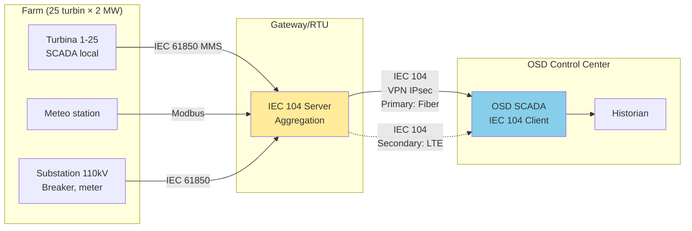
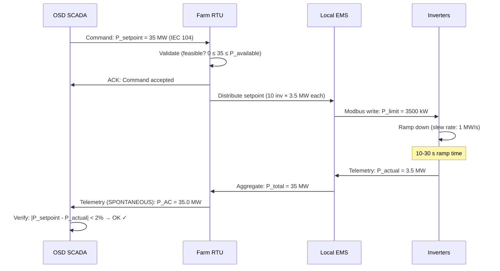

import { 
  SlideContainer, 
  Slide, 
  KeyPoints, 
  SupportingDetails, 
  InstructorNotes,
  VisualSeparator,
  LearningObjective,
  KeyConcept,
  Example
} from '@site/src/components/SlideComponents';
import { InteractiveQuiz } from '@site/src/components/InteractiveQuiz';

<LearningObjective>
Po tej sekcji student potrafi:
- Zdefiniować wymagania telemetryczne OSD/TSO dla farm OZE (zakres danych, częstotliwość, dostępność)
- Zaprojektować system telemetrii z właściwą agregacją czasową (1 min, 15 min) i quality flags
- Zaimplementować mechanizmy curtailment (redukcja mocy) z confirmation loop
- Spełnić wymagania SLA (Service Level Agreement) dla łączy telemetrycznych (uptime, latency)
</LearningObjective>

<SlideContainer>

<Slide title="📡 Telemetria do OSD/TSO – wymagania i zakres" type="info">

<KeyPoints title="📋 Co OSD/TSO wymaga od farm OZE?">

**Telemetria** to ciągły przepływ danych z instalacji OZE do **OSD (Operator Systemu Dystrybucyjnego)** lub **TSO (Transmission System Operator)** dla celów:
- **Monitorowania sieci** (grid monitoring) – bilans mocy, stabilność
- **Dispatching** – realizacja poleceń (curtailment, frequency response)
- **Rozliczeń** (settlement) – energia wyprodukowana/pobrana
- **Compliance** (zgodność) – weryfikacja warunków przyłączenia (grid codes)

---

### **Minimalne wymagania telemetryczne (typowe dla Polski/EU):**

**Dla farm &gt;1 MW przyłączonych do sieci SN/WN:**

| Kategoria | Data Points | Jednostka | Update frequency | Protocol |
|-----------|-------------|-----------|------------------|----------|
| **Moce** | P_AC (active), Q_AC (reactive) | kW, kVAr | SPONTANEOUS (deadband 1-2%) lub co 1-15 min | IEC 104, IEC 61850 |
| **Napięcia** | U_L1, U_L2, U_L3 (3-phase) | kV | SPONTANEOUS (deadband 0.5%) | IEC 104 |
| **Prądy** | I_L1, I_L2, I_L3 | A | SPONTANEOUS (deadband 2%) | IEC 104 |
| **Częstotliwość** | f_grid | Hz | SPONTANEOUS (deadband 0.01 Hz) | IEC 104 |
| **Energia** | E_export, E_import (cumulative) | MWh | Co 15 min (GI) | IEC 104 |
| **Statusy** | Farm_Status (ON/OFF/FAULT), Breaker_Status | BOOL, ENUM | SPONTANEOUS (change) | IEC 104 |
| **Dostępność** | Available_Power (current max capability) | kW | Co 1-5 min | IEC 104, REST API |
| **Setpoints** | P_setpoint (requested), P_actual (realized) | kW | Real-time (1-60 s) | IEC 104, MQTT |

**Łącznie: 15-25 data points** (minimum dla compliance)

---

### **Rozszerzone wymagania (dla VPP/DERMS participation):**

**Dodatkowo (dla rynków balancing, frequency regulation):**

- **Forecasts**: PV/wind production prediction (next 4-72h), confidence intervals
- **Ramp rates**: dP/dt capabilities (MW/min), ograniczenia
- **SoC/SoH** (BESS): Stan naładowania, degradacja (dla dyspatch optimization)
- **Weather**: Irradiancja, temperatura, wind speed (korelacja z produkcją)
- **Alarms/Events**: SOE (Sequence of Events) z timestamp precision ±100 ms

**Łącznie: 30-50 data points** (advanced participation)

:::caution Wymóg compliance
Według Instrukcji Ruchu i Eksploatacji Sieci (IRiESP) w Polsce, jednostki &gt;1 MW **MUSZĄ** przekazywać telemetrię do PSE/OSD. Brak telemetrii = możliwość odłączenia od sieci (grid disconnection).
:::

</KeyPoints>

<SupportingDetails title="🔧 Agregacja czasowa i quality flags">

### **Time windows (okna czasowe):**

**1-minutowe** (1-min interval):
- **Zastosowanie**: Real-time monitoring, fast response (frequency regulation)
- **Agregacja**: Mean (dla P, Q, U, I), last (dla statusów)
- **Storage**: InfluxDB retention 1-3 miesiące (raw), 10 lat (downsampled do 15-min)
- **Transmission**: SPONTANEOUS (IEC 104) lub MQTT co 1 min

**15-minutowe** (15-min interval):
- **Zastosowanie**: Rozliczenia energii (grid codes), market settlement
- **Agregacja**: Mean (dla P, Q), sum (dla E), max/min (dla U)
- **Storage**: 20+ lat (regulatory requirement)
- **Transmission**: GI (General Interrogation) co 15 min lub periodic

**Godzinowe/dobowe:**
- **Zastosowanie**: Raporty KPI (PR, CF, Availability), invoicing
- **Agregacja**: Sum (energy), mean (power), weighted average
- **Storage**: Indefinite (długoterminowe archiwum)

---

### **Quality flags (znaczniki jakości):**

**IEC 60870-5-104 quality byte (8-bit):**

| Bit | Nazwa | Znaczenie | Przykład |
|-----|-------|-----------|----------|
| 0 | **IV** (Invalid) | 0=VALID, 1=INVALID | Sensor fault, communication error |
| 1-2 | **NT** (Not Topical) | 00=Current, 01=Older, 10=Old | Data zastały (stare), nie fresh |
| 3 | **SB** (Substituted) | 0=Normal, 1=Substituted | Wartość estimated (nie zmierzona) |
| 4 | **BL** (Blocked) | 0=Normal, 1=Blocked | Pomiar zablokowany (manual override) |
| 5-7 | Reserved | — | Future use |

**Interpretation w SCADA:**
- Quality = 0x00 (wszystkie bity = 0) → **GOOD** (dane valid, fresh, measured)
- Quality = 0x01 (IV=1) → **INVALID** → ignore w KPI calculations
- Quality = 0x08 (SB=1) → **SUBSTITUTED** → użyj z caution (może być estimated/interpolated)

**Best practice:**
```python
# Python example (filtering by quality)
def calculate_pr(data_points):
    # Filter only GOOD quality data
    valid_data = [dp for dp in data_points if dp.quality == 0x00]
    
    if len(valid_data) < 0.95 * len(data_points):  # &lt;95% data quality
        return None, "INSUFFICIENT_DATA"  # Don't calculate PR
    
    # Calculate with valid data only
    E_actual = sum([dp.energy for dp in valid_data])
    # ... (PR calculation)
    return pr_value, "VALID"
```

---

### **Kompletność danych (completeness):**

**Requirement**: &gt;95% data points VALID w danym okresie (np. miesiąc)

**Definicja completeness:**

\[
Completeness = \frac{N_{\text{VALID}}}{N_{\text{expected}}} \times 100\%
\]

**Przykład (15-min intervals, 1 miesiąc):**
- Expected: 30 dni × 24 h × 4 (quarters) = **2880 intervals**
- Received VALID: 2850
- Completeness: 2850 / 2880 = **98.96%** ✓ (&gt;95% requirement)

**Konsekwencje &lt;95% completeness:**
- **Billing**: Nie można obliczyć miesięcznej energii → estimated (może być disadvantageous)
- **SLA penalties**: Grid operator może nałożyć kary (€100-1000/incident)
- **VPP disqualification**: Brak participation w rynkach (reliability requirement)

</SupportingDetails>

<Example title="Telemetria farmy wiatrowej 50 MW → OSD">

**Architektura:**



**Data points przekazywane do OSD (18 punktów):**

| IOA | Nazwa | Type | Unit | Aggregation | Deadband | Uwagi |
|-----|-------|------|------|-------------|----------|-------|
| 4001 | P_AC_Total | M_ME_NC_1 | MW | 1-min mean | 1% (0.5 MW) | Sum 25 turbin |
| 4002 | Q_AC_Total | M_ME_NC_1 | MVAr | 1-min mean | 2% | Reactive power |
| 4010 | U_L1_110kV | M_ME_NC_1 | kV | 1-min mean | 0.5% (0.5 kV) | @ Substation |
| 4011 | U_L2_110kV | M_ME_NC_1 | kV | 1-min mean | 0.5% | |
| 4012 | U_L3_110kV | M_ME_NC_1 | kV | 1-min mean | 0.5% | |
| 4020 | f_Grid | M_ME_NC_1 | Hz | Instantaneous | 0.01 Hz | Critical! |
| 5001 | E_Export_Total | M_IT_NA_1 | MWh | Cumulative | — | Co 15 min (GI) |
| 4030 | Wind_Speed | M_ME_NC_1 | m/s | 1-min mean | 0.5 m/s | Meteo |
| 4031 | Wind_Direction | M_ME_NC_1 | ° | 1-min mean | 5° | Meteo |
| 3001 | Farm_Status | M_SP_NA_1 | BOOL | — | — | 1=Operational, 0=Fault |
| 3002 | Breaker_110kV_Status | M_DP_NA_1 | DPS | — | — | OPEN/CLOSED/INVALID |
| 3100-3124 | Turbine_Status (1-25) | M_SP_NA_1 | BOOL | — | — | Per turbine |
| 4050 | Available_Power | M_ME_NC_1 | MW | 1-min calculation | 5% | Max capability (weather-dependent) |
| 4051 | Capacity_Factor | M_ME_NC_1 | % | 15-min calculation | — | CF = P_actual / P_rated |

**Komunikacja:**
- **Protocol**: IEC 60870-5-104
- **Primary link**: Fiber 10 Mbps (dedicated), VPN IPsec
- **Secondary link**: LTE (fallback), auto-switchover &lt;30 s
- **Update rate**: SPONTANEOUS (zmiana >deadband) + GI co 15 min
- **Latency SLA**: &lt;5 s (from measurement do OSD SCADA)

**Wyniki (12 miesięcy eksploatacji):**

| Metric | Target (SLA) | Achieved | Status |
|--------|--------------|----------|--------|
| **Uptime** | &gt;99% | 99.6% | ✅ PASS |
| **Data completeness** | &gt;95% | 98.2% | ✅ PASS |
| **Latency (mean)** | &lt;5 s | 2.3 s | ✅ PASS |
| **Quality (VALID)** | &gt;98% | 99.1% | ✅ PASS |
| **False alarms** (farm status) | &lt;10/month | 3/month | ✅ PASS |

**Downtime incidents (3.5 h total/year):**
1. **Fiber cut** (construction accident): 2h → LTE switchover worked, ale higher latency (50 ms vs. 3 ms)
2. **RTU maintenance** (firmware update): 1h (planned, notified OSD 48h advance)
3. **Power outage** (substation, 30 min) → farm offline, telemetry unavailable (acceptable, cause external)

**Compliance:** Audit OSD passed 100% (wszystkie wymagania spełnione)

</Example>

<InstructorNotes>

**Czas**: 14-16 min

**Przebieg**:
1. Wymagania telemetryczne OSD/TSO (4 min) – zakres danych, częstotliwość
2. Agregacja czasowa i quality flags (4 min) – 1-min vs. 15-min, IEC 104 quality byte
3. Architektura systemu (3 min) – diagram, primary/secondary links
4. Case study farmy wiatrowej (3 min) – real results, SLA compliance
5. Q&A (2 min)

**Punkty kluczowe**:
- **OSD/TSO requirements są NON-NEGOTIABLE** – grid codes specify dokładnie co, jak często
- **Quality flags kluczowe** – dane INVALID nie mogą wpływać na billing/KPI
- **Redundancja łączy** (fiber + LTE) to must dla &gt;99% uptime
- **15-min intervals** to standard energetyki (harmonizacja z rynkami, rozliczeniami)

**Demonstracja praktyczna**:
- Pokaż przykładowy "Warunki przyłączenia" od PSE (PDF) – specyfikuje telemetry requirements
- Dashboard OSD SCADA (screenshot lub simulation) – jak widzą dane z farm
- Live IEC 104 traffic (Wireshark) – pokazuje SPONTANEOUS vs. GI messages

**Materiały pomocnicze**:
- PSE: "Instrukcja Ruchu i Eksploatacji Sieci Przesyłowej" (IRiESP) – Polish grid code
- ENTSO-E: "Network Code on Requirements for Grid Connection" (EU)
- IEC 60870-5-104 quality byte specification (detail explanation)

**Typowe błędy studenckie**:
- Wysyłanie wszystkich danych co 1 s (bez deadband) → flooding, OSD reject connection
- Ignorowanie quality flags (wysyłanie INVALID jako VALID) → false data, penalties
- Brak redundancji łączy → single fiber cut = downtime (SLA breach)

**Pytania studenckie**:
- Q: Dlaczego 15-min intervals (a nie 1-min lub 1-hour)?
- A: Historyczne (legacy od lat 70-80, metering intervals) + harmonizacja z rynkami energii (day-ahead trading w 15-min blocks). IEC 61850/104 wspiera różne, ale 15-min to de facto standard.

- Q: Co się dzieje jeśli farma nie przekazuje telemetrii (communication loss)?
- A: (1) OSD alarm "RTU offline" (po 1-5 min timeout), (2) Możliwe curtailment do 0 MW (safe-side dispatch), (3) Po &gt;24h: możliwe odłączenie od sieci (extreme, ale w grid codes). Fix ASAP!

</InstructorNotes>

</Slide>

<VisualSeparator type="technical" />

<Slide title="✂️ Curtailment – polecenia redukcji mocy" type="tip">

<KeyConcept title="Curtailment (ograniczenie produkcji) – kiedy i dlaczego?">

**Curtailment** = celowe **zmniejszenie produkcji** OZE poniżej dostępnej (available power) na żądanie operatora sieci.

**Przyczyny curtailment:**

**1. Grid congestion (przeciążenie sieci)**
- **Przykład**: Linia SN (średnie napięcie) ma limit 20 MW, farmy PV na tej linii produkują 25 MW w sunny day
- **Akcja OSD**: Curtail łącznie -5 MW (distributed między farmy proporcjonalnie)

**2. Overvoltage (nadnapięcie)**
- **Przykład**: W sunny weekend (niska konsumpcja) napięcie rośnie do 110% nominal (przekroczenie norm)
- **Akcja OSD**: Reduce Q_AC (reactive power absorption) lub curtail P_AC

**3. System balancing (bilansowanie systemu)**
- **Przykład**: Wysoka produkcja wind+PV (40 GW) przekracza demand (35 GW) + export capability
- **Akcja TSO**: Curtail wind/PV priorities (cheapest sources first) → -5 GW total

**4. Negative prices (ceny ujemne na rynku)**
- **Przykład**: Day-ahead market price = -€50/MWh (overproduction)
- **Decyzja VPP**: Curtail production (nie opłaca się produkować za karę)

---

### **Curtailment mechanisms:**

**Metoda 1: Absolute setpoint (wartość bezwzględna)**
```
Command (IEC 104): C_SE_NC_1 (Set-point command, float)
IOA: 6001 (P_setpoint)
Value: 35.0 MW (z 50 MW available)
→ Farm reduces to 35 MW (curtail -15 MW = -30%)
```

**Metoda 2: Relative curtailment (procent redukcji)**
```
Command: C_SE_NC_1
IOA: 6002 (Curtail_Percentage)
Value: 20.0 (%)
→ Farm reduces by 20% (from 50 MW → 40 MW)
```

**Metoda 3: Reactive power control (Q setpoint)**
```
Command: C_SE_NC_1
IOA: 6010 (Q_setpoint)
Value: -5.0 MVAr (absorb reactive, voltage support)
```

---

### **Confirmation loop (potwierdzenie realizacji):**



**Timeline typical:**
1. OSD command → RTU receives: **1-5 s** (IEC 104 latency)
2. RTU validates + distributes → EMS: **1-3 s** (internal processing)
3. EMS → Inverters commands: **1-10 s** (Modbus polling cycles)
4. Inverters ramp: **10-60 s** (physical slew rate 0.5-5 MW/s)
5. Telemetry confirmation → OSD: **1-5 s** (IEC 104 SPONTANEOUS)

**Total: 15-80 s** (typically &lt;60 s dla modern systems)

**Penalties za non-compliance:**
- Setpoint NOT achieved within 5 min → warning
- Repeated failures (&gt;3/month) → financial penalty (€500-5000/incident)
- Persistent failures → possible disconnection (extreme)

</KeyConcept>

<SupportingDetails title="📊 SLA (Service Level Agreement) dla telemetrii">

### **Typowe SLA metrics:**

| Metric | Target | Measurement | Penalty (if breach) |
|--------|--------|-------------|---------------------|
| **Uptime** | &gt;99% | (Time_online / Time_total) × 100% | €1000/day poniżej 99% |
| **Data completeness** | &gt;95% | Valid points / Expected points | €500/month &lt;95% |
| **Latency (mean)** | &lt;5 s | Measurement timestamp → OSD receive | Warning &gt;10 s |
| **Latency (95th percentile)** | &lt;10 s | 95% of messages &lt;10 s | €200/day &gt;10 s |
| **Quality (VALID)** | &gt;98% | Points z quality=0x00 / total | Warning &lt;98% |
| **Setpoint response time** | &lt;5 min | Command → P_actual match | €1000/incident &gt;5 min |
| **GI response time** | &lt;10 s | GI command → all points sent | €500/incident &gt;10 s |

**Annual SLA costs (penalties avoided przez good performance):**
- Typical penalties potential: €5-20k/year (jeśli wszystko fails)
- Actual penalties (good operator): €0-500/year (rare incidents)

**Monitoring SLA (w SCADA/DERMS):**
```sql
-- InfluxDB query: Calculate uptime last 30 days
SELECT 
  (count(status) FILTER (WHERE status='ONLINE')) / count(status) * 100 as uptime_percent
FROM connection_log
WHERE time > now() - 30d
-- Result: 99.6% ✓
```

</SupportingDetails>

<Example title="Curtailment event – step-by-step case study">

**Scenariusz: Grid congestion, summer Sunday 12:00**

**Sytuacja:**
- Region: 5 farm PV (total 100 MW installed)
- Production: 90 MW (sunny, high irradiance)
- Line capacity: 70 MW (thermal limit)
- Local demand: 15 MW (weekend, low consumption)
- **Net export**: 90 - 15 = 75 MW → **przekroczenie +5 MW!**

**OSD decision:**
- Curtail PV total: -5 MW (distributed between 5 farm proporcjonalnie)
- Farm A (20 MW, 40% → contribution): Curtail -2 MW (10% reduction)

---

### **Timeline (Farm A perspective):**

**12:00:00** – OSD detects overvoltage (111 kV, limit 110 kV)

**12:00:15** – OSD sends command (IEC 104):
```
Type: C_SE_NC_1 (Setpoint command)
COT: 6 (ACTIVATION)
CASDU: 1 (Farm A address)
IOA: 6001 (P_setpoint)
Value: 18000.0 kW (z 20000 kW current)
```

**12:00:17** – RTU Farm A receives, validates:
- Current production: 20.0 MW ✓
- Available power: 20.5 MW (irradiance based)
- Setpoint: 18.0 MW ✓ (feasible, 0 < 18 < 20.5)

**12:00:18** – RTU sends ACK do OSD:
```
Type: C_SE_NC_1
COT: 7 (ACTIVATION_CONFIRMATION)
Value: 18000.0 kW
```

**12:00:20** – EMS receives setpoint, distributes:
- 10 inwerterów × 2 MW każdy
- Nowy limit: 10 × 1.8 MW = 18 MW
- Modbus write do każdego: `WMaxLimPct = 90%` (SunSpec register)

**12:00:25-12:01:00** – Inwertery rampują down:
- Slew rate: 0.5 MW/s per inverter
- 2.0 MW → 1.8 MW = -0.2 MW @ 0.5 MW/s = **0.4 s per inverter**
- Ale: Sequential (nie wszystkie jednocześnie, smooth ramp)
- Total farm ramp: **~30-40 s**

**12:01:05** – Telemetria confirmation (SPONTANEOUS):
```
Type: M_ME_NC_1
COT: 3 (SPONTANEOUS)
IOA: 4001 (P_AC_Total)
Value: 18.0 MW
Quality: 0x00 (VALID)
```

**12:01:10** – OSD verifies:
- Setpoint: 18.0 MW
- Actual: 18.0 MW
- Difference: 0.0 MW (&lt;2% tolerance ✓)
- **Voltage**: 109.5 kV (z 111 kV, BACK TO NORMAL ✓)

**12:01:15** – OSD logs: "Curtailment successful, grid stable"

---

**Total time: Command → Realization = 1 min 5 s** (well within 5 min SLA)

**Lost production (curtailment):**
- Duration: 2 hours (until demand increases)
- Curtailed: 2 MW × 2 h = **4 MWh**
- Revenue loss: 4 MWh × €50/MWh = **€200**

**Vs. alternative (no curtailment):**
- Overvoltage damage to grid equipment: Potential €10 000-100 000
- Forced disconnection (protection relay trip): Loss ALL production (20 MW × 2h = 40 MWh = €2000)
- **Curtailment to lesser evil** (€200 loss vs. €2000-100 000 potential)

**Compensation:**
- Some grid codes compensate curtailment (€30-80/MWh curtailed)
- Farm A: 4 MWh × €50/MWh compensation = **€200** (offsets loss)

</Example>

<InstructorNotes>

**Czas**: 16-18 min

**Przebieg**:
1. Curtailment – co to, dlaczego (3 min) – grid congestion, overvoltage, negative prices
2. Mechanisms (3 min) – absolute, relative, Q control
3. Confirmation loop (4 min) – sequence diagram, timeline
4. Case study (5 min) – real curtailment event, step-by-step
5. Q&A (2 min)

**Punkty kluczowe**:
- **Curtailment to NIE awaria** – to normal grid operation (balancing)
- **Confirmation loop** (command → ACK → telemetry) zapewnia closed-loop control
- **Timeline &lt;5 min** to typical requirement (frequency regulation może być &lt;30 s!)
- **Compensation** za curtailment varies (niektóre grid codes płacą, inne nie)

**Demonstracja praktyczna**:
- Sequence diagram animation (pokazuje message flow)
- Real telemetry data: Before/after curtailment (Power plot w Grafana)
- Calculation: Revenue loss vs. grid damage cost (pokazuje trade-off)

**Materiały pomocnicze**:
- Example curtailment command (IEC 104 packet, Wireshark)
- Grid code excerpt: Curtailment procedures (PSE/ENTSO-E)
- Compensation schemes (different countries: DE, PL, ES)

**Typowe błędy studenckie**:
- Myślenie, że curtailment to "waste" – NO! To grid stability (necessary evil)
- Brak ACK (acknowledgment) → OSD nie wie, czy command received
- Telemetry bez quality flag → OSD nie może verify compliance

**Pytania studenckie**:
- Q: Czy farma może odmówić curtailment?
- A: NO (jeśli w grid code). Curtailment to regulatory obligation. Odmowa = breach of contract → możliwe penalties/disconnection. EXCEPT: Jeśli safety concern (np. setpoint poniżej technical minimum).

- Q: Co jeśli curtailment utrzymuje się przez weeks (chroniczne przeciążenie)?
- A: (1) Farma może claim compensation (depends on grid code), (2) OSD powinien upgrade grid (long-term solution), (3) W praktyce: curtailment &gt;10% czasu → escalation, grid investment triggered.

</InstructorNotes>

</Slide>

<VisualSeparator type="default" />

<Slide title="📝 Quiz: Telemetria i curtailment" type="info">

<InteractiveQuiz 
  questions={[
    {
      question: "Jaka jest minimalna częstotliwość przekazywania telemetrii P_AC do OSD według typowych grid codes (EU/Polska)?",
      options: [
        "Co 1 sekundę (real-time)",
        "SPONTANEOUS (przy zmianie >deadband) + GI co 15 min",
        "Co 1 godzinę (hourly reports)",
        "Only on request (GI tylko)"
      ],
      correctAnswer: 1,
      explanation: "Standard: SPONTANEOUS (COT=3) gdy zmiana >deadband (typ. 1-2%) + General Interrogation co 15 min (full refresh). Opcja (a) to flooding (zbyt często bez deadband). Opcja (c) za rzadko dla monitoring. Opcja (d) insufficient (brak proactive updates)."
    },
    {
      question: "W IEC 104 quality byte, bit 0 (IV - Invalid) = 1 oznacza:",
      options: [
        "Dane są VALID (bit set = good)",
        "Dane są INVALID (sensor fault, communication error) → ignore w KPI",
        "Dane są bardzo ważne (Important Valid)",
        "Inverter numer 1 (device ID)"
      ],
      correctAnswer: 1,
      explanation: "IV (Invalid) bit: 0 = VALID, 1 = INVALID. Jeśli IV=1 → dane unreliable (sensor fault, comm error) → NIE używaj w billing/KPI calculations. Opcja (a) odwrotnie. Opcja (c/d) to nonsense."
    },
    {
      question: "OSD wysyła curtailment command: 'Reduce do 35 MW' (z 50 MW current). Farm ma available power 48 MW (cloud partial). Czy setpoint jest feasible?",
      options: [
        "TAK – 35 MW < 48 MW (available) → realizowalne",
        "NIE – 35 MW < 50 MW (current), więc nie można zmniejszyć",
        "NIE – curtailment zawsze musi być 0 MW (full stop)",
        "Nie można ocenić bez znajomości SoC BESS"
      ],
      correctAnswer: 0,
      explanation: "Setpoint feasible jeśli: 0 ≤ P_setpoint ≤ P_available. 35 MW ∈ [0, 48] → YES, feasible. Farm może reduce z 50 MW do 35 MW (curtail -15 MW). Opcja (b) myląco interpretuje. Opcja (c) nieprawda (curtailment może być partial). Opcja (d) nieprawda (BESS optional, pytanie o PV/wind)."
    },
    {
      question: "SLA wymaga &gt;99% uptime telemetrii. W roku (8760 h), jaki jest max allowed downtime?",
      options: [
        "87.6 h (1% of 8760)",
        "8.76 h (0.1%)",
        "43.8 h (99% uptime → 1% downtime = 87.6h... wait, recalc: 1% × 8760 = 87.6)",
        "365 h (1 h/day)"
      ],
      correctAnswer: 0,
      explanation: "99% uptime → 1% downtime allowed. 1% × 8760 h = 87.6 h/year. Opcja (b) to 99.9% uptime (typo w odpowiedzi). Opcja (c) correct calculation but wrong final (87.6, nie 43.8). Opcja (d) to 95% uptime (365/8760 = 4.2%)."
    },
    {
      question: "Farma produkuje 20 MW, OSD curtail command: 'Reduce by 30%'. Jaka jest target power?",
      options: [
        "6 MW (30% of 20)",
        "14 MW (20 - 30% = 20 × 0.7)",
        "30 MW (increase by 30%)",
        "23 MW (20 + 30% margin)"
      ],
      correctAnswer: 1,
      explanation: "'Reduce BY 30%' = zmniejsz o 30% (nie DO 30%). Target = 20 MW × (1 - 0.30) = 20 × 0.7 = 14 MW. Curtail -6 MW. Opcja (a) to 'reduce TO 30%' (błędna interpretacja). Opcja (c/d) to increase (nonsense dla curtailment)."
    }
  ]}
/>

:::tip Rekomendacja po quizie
Jeśli uzyskałeś &lt;80% poprawnych odpowiedzi, przejrzyj sekcje o IEC 104 quality flags, curtailment calculations (absolute vs. relative), i SLA metrics (uptime calculation). Zrozumienie telemetrii i curtailment jest kluczowe dla grid-connected OZE.
:::

</Slide>

</SlideContainer>

---

## Podsumowanie i wnioski

**Kluczowe punkty z tej sekcji:**

1. **Telemetria do OSD/TSO to wymóg regulatory** dla farm &gt;1 MW – zakres 15-25 data points (moce, napięcia, energia, statusy), protokół IEC 104 (Europa) lub DNP3 (USA).

2. **Agregacja czasowa**: 1-min (real-time monitoring), 15-min (billing/settlement, standard energetyki), hourly/daily (KPI reports).

3. **Quality flags obowiązkowe** – IEC 104 quality byte (IV, NT, SB, BL bits) → tylko VALID data (0x00) w KPI calculations. Completeness &gt;95% requirement.

4. **Curtailment** (redukcja mocy): Grid congestion, overvoltage, balancing, negative prices → command via IEC 104 → confirmation loop → timeline &lt;5 min → penalties za non-compliance.

5. **SLA requirements**: Uptime &gt;99% (max 87.6 h downtime/year), latency &lt;5 s, data completeness &gt;95%, quality &gt;98% → penalties €500-5000/incident jeśli breach.

6. **Redundant links** (fiber + LTE) to must dla achieving 99%+ uptime.

**Następne kroki:**
- Ćwiczenie: Obliczanie SLA metrics (uptime, completeness) z real data
- Przygotowanie do następnej sekcji: SOE (Sequence of Events) i reporting requirements

---

**Dodatkowe zasoby:**
- **PSE IRiESP**: Instrukcja Ruchu i Eksploatacji Sieci (Polish grid code, specifies telemetry)
- **ENTSO-E Network Codes**: EU-wide requirements
- **IEC 60870-5-104**: Telecontrol quality byte specification
- **OpenADR 2.0**: Automated Demand Response (DR signals, curtailment)


