import { 
  SlideContainer, 
  Slide, 
  KeyPoints, 
  SupportingDetails, 
  InstructorNotes,
  VisualSeparator,
  LearningObjective,
  KeyConcept,
  Example
} from '@site/src/components/SlideComponents';
import { InteractiveQuiz } from '@site/src/components/InteractiveQuiz';

<LearningObjective>
Po tej sekcji student potrafi:
- Zdefiniować SOE (Sequence of Events) i wyjaśnić jego rolę w analizie przyczynowej (root cause analysis)
- Zaprojektować system rejestracji zdarzeń z właściwą synchronizacją czasu (±10-100 ms)
- Przygotować raporty regulacyjne (KPI dla OSD, environmental compliance) i komercyjne (SLA, O&M)
- Zapewnić audytowalność danych (immutability, digital signatures, retention policies)
</LearningObjective>

<SlideContainer>

<Slide title="📋 SOE (Sequence of Events) – co to i dlaczego kluczowe?" type="info">

<KeyPoints title="📋 Definicja i znaczenie SOE">

**SOE (Sequence of Events)** to **chronologiczna lista zdarzeń** (alarms, commands, status changes) z **precyzyjnymi timestampami**, używana do:
- **Root cause analysis** (analiza przyczynowa) – co spowodowało awarię?
- **Post-mortem** po incydentach – rekonstrukcja sekwencji
- **Compliance** – dokumentacja dla audytów OSD/TSO
- **Optimization** – identyfikacja patterns (powtarzające się problemy)

**Bez SOE:**
- "Inwerter się wyłączył o 14:23" – ale DLACZEGO? Undervoltage? Overcurrent? Command od SCADA?
- Niemożność ustalenia causa-effect relationship

**Z SOE (przykład):**
```
14:23:42.123  GRID_FREQ_LOW      (49.85 Hz, limit 49.8 Hz)   [Sensor: Meter01]
14:23:42.234  INV_UNDERFREQ_TRIP (Inverter 1 trip)           [IED: INV01]
14:23:42.456  INV_UNDERFREQ_TRIP (Inverter 2-10 trip)        [IED: INV02-10]
14:23:43.001  BREAKER_OPEN       (Main breaker opened)        [IED: XCBR_Main]
14:23:43.567  ALARM_FARM_OFFLINE (Farm status = FAULT)        [SCADA]
```

**Analiza:** Grid frequency drop (49.85 Hz) → undervoltage protection triggered → inverters tripped (111 ms later) → main breaker opened (567 ms later) → farm offline.

**Root cause:** Grid event (external), NIE farma fault. Action: No repair needed, auto-restart po grid recovery.

---

### **Wymagania dla SOE:**

**1. Timestamp precision (dokładność znaczników czasu)**
- **Protection events** (relay trips): ±1 ms (wymaga PTP lub GPS-synced clocks)
- **Operational events** (commands, setpoints): ±10-100 ms (NTP wystarczy)
- **Alarms** (slow processes): ±1 s (basic NTP)

**2. Kategoryzacja zdarzeń:**

| Kategoria | Priorytet | Przykłady | Storage retention |
|-----------|-----------|-----------|-------------------|
| **Critical** (CRITICAL) | 0 (highest) | Protection trips, E-stop, fire alarm | 10+ lat |
| **Alarms** (ALARM) | 1 | Overvoltage, overcurrent, communication loss | 5 lat |
| **Warnings** (WARNING) | 2 | High temperature, low SoC, calibration due | 2 lata |
| **Operational** (INFO) | 3 | Commands, setpoints, status changes | 1 rok |
| **Debug** (DEBUG) | 4 | Detailed traces, heartbeats | 1 miesiąc |

**3. Atrybuty każdego eventu:**
- **Timestamp**: UTC z precision (ISO 8601: 2023-10-08T14:23:42.123Z)
- **Source**: Który device/sensor (IED ID, sensor serial)
- **Event type**: Alarm code lub descriptive name
- **Value**: Wartość która triggered (np. 49.85 Hz dla FREQ_LOW)
- **Quality**: VALID/INVALID/SUSPECT
- **Severity**: CRITICAL/ALARM/WARNING/INFO
- **Acknowledged**: TRUE/FALSE (operator potwierdził, że widział)

**4. Powiązanie z alarmami:**
- SOE to LOG (wszystko), Alarms to ACTIVE (wymagają akcji)
- Event może trigger alarm → alarm ACKnowledged → event logged, alarm cleared

</KeyPoints>

<SupportingDetails title="🔧 Implementacja SOE w systemach OZE">

### **Architektura zbierania zdarzeń:**

```mermaid
graph TB
    subgraph "Edge (Field Devices)"
        INV[Inverters<br/>Events @ 1 ms precision]
        BESS[BESS BMS<br/>Thermal events]
        RELAY[Protection Relays<br/>Trip events]
        MET[Sensors<br/>Threshold crossings]
    end
    
    subgraph "Fog (Gateway/RTU)"
        GW[Event Collector<br/>NTP sync ±10 ms]
        BUFFER[Circular Buffer<br/&gt;10k events]
    end
    
    subgraph "Cloud (SCADA/Historian)"
        DB[Event Database<br/>InfluxDB / SQL]
        SOE[SOE Analyzer<br/>Timeline view]
        ALARM[Alarm Manager<br/>Active alarms]
    end
    
    INV -->|Event stream<br/>Modbus, MQTT| GW
    BESS -->|CAN events| GW
    RELAY -->|IEC 61850 GOOSE| GW
    MET -->|Threshold events| GW
    
    GW --> BUFFER
    BUFFER -->|Batched upload<br/>every 10 s| DB
    
    DB --> SOE
    DB --> ALARM
    
    style RELAY fill:#ff9999
    style GW fill:#ffeb99
    style DB fill:#87ceeb
    style SOE fill:#90ee90
```



**Zbieranie @ Edge:**
- Każde urządzenie loguje events locally (circular buffer, ostatnie 1000-10000 events)
- Timestamp: Local RTC (Real-Time Clock), synced via NTP co 60 s
- Przekazywanie: Batch upload co 10-60 s (nie każdy event osobno → reduce traffic)

**Agregacja @ Fog/Gateway:**
- Collect events z multiple devices
- Re-timestamp (jeśli device clock unreliable) → gateway clock (NTP-synced)
- Filter (deduplicate, suppress low-priority DEBUG events)
- Forward do cloud

**Storage @ Cloud:**
- Time-series database (InfluxDB) lub relational (PostgreSQL, SQL)
- Indexing: timestamp, device_id, event_type, severity
- Retention: 10 lat dla CRITICAL, 1 rok dla INFO

---

### **SOE query examples (InfluxDB Flux):**

**Query 1: Wszystkie eventy z ostatnich 24h (timeline):**
```flux
from(bucket: "events")
  |> range(start: -24h)
  |> filter(fn: (r) => r._measurement == "soe")
  |> sort(columns: ["_time"], desc: false)  // Chronological order
```

**Query 2: Only CRITICAL/ALARM (exclude INFO/DEBUG):**
```flux
from(bucket: "events")
  |> range(start: -7d)
  |> filter(fn: (r) => r.severity == "CRITICAL" or r.severity == "ALARM")
```

**Query 3: Events from specific device (Inverter 1):**
```flux
from(bucket: "events")
  |> range(start: -30d)
  |> filter(fn: (r) => r.device_id == "INV01")
  |> filter(fn: (r) => r.event_type =~ /TRIP|FAULT/)  // Regex match
```

**Query 4: Correlation (events within ±1 s window):**
```python
# Python (pandas)
df = query_events(start="2023-10-08 14:23:00", end="2023-10-08 14:24:00")
df['time_diff'] = df['timestamp'].diff()  # Time between consecutive events

# Find events within 1 s of GRID_FREQ_LOW
trigger_event = df[df['event_type'] == 'GRID_FREQ_LOW'].iloc[0]
trigger_time = trigger_event['timestamp']

related = df[(df['timestamp'] >= trigger_time) & 
             (df['timestamp'] <= trigger_time + timedelta(seconds=1))]
# Result: Shows GRID_FREQ_LOW → INV_TRIP (111 ms), INV_TRIP → BREAKER_OPEN (445 ms)
```

</SupportingDetails>

<Example title="SOE analysis – grid disturbance post-mortem">

**Incident: Farm PV 20 MWp, grid disturbance 8 October 2023, 14:23**

**SOE log (excerpt, 50 events total, pokazane top 15):**

| Timestamp (UTC) | Δt (ms) | Event Type | Source | Value | Severity |
|-----------------|---------|------------|--------|-------|----------|
| 14:23:42.000 | — | GRID_VOLTAGE_HIGH | Meter01 | U_L1=111.5 kV (limit 110) | WARNING |
| 14:23:42.123 | 123 | GRID_FREQ_LOW | Meter01 | f=49.85 Hz (limit 49.8) | ALARM |
| 14:23:42.234 | 111 | INV_UNDERFREQ_TRIP | INV01 | Trip on f&lt;49.8 Hz | CRITICAL |
| 14:23:42.245 | 11 | INV_UNDERFREQ_TRIP | INV02 | Trip | CRITICAL |
| 14:23:42.267 | 22 | INV_UNDERFREQ_TRIP | INV03-10 | Trip (cascade) | CRITICAL |
| 14:23:43.001 | 734 | BREAKER_CMD_OPEN | SCADA | Manual command (operator) | INFO |
| 14:23:43.112 | 111 | BREAKER_OPENING | XCBR_Main | Breaker actuating | INFO |
| 14:23:43.567 | 455 | BREAKER_OPEN | XCBR_Main | Position = OPEN | ALARM |
| 14:23:43.678 | 111 | FARM_STATUS_FAULT | RTU | Status changed | ALARM |
| 14:23:44.001 | 323 | TELEMETRY_INVALID | RTU | P_AC quality=INVALID (no measurement) | WARNING |
| 14:24:15.234 | 31233 | GRID_FREQ_NORMAL | Meter01 | f=50.01 Hz (recovered) | INFO |
| 14:24:20.123 | 4889 | OPERATOR_CMD_RESTART | SCADA | Manual restart sequence | INFO |
| 14:24:25.456 | 5333 | BREAKER_CMD_CLOSE | SCADA | Close command | INFO |
| 14:24:25.789 | 333 | BREAKER_CLOSED | XCBR_Main | Position = CLOSED | INFO |
| 14:24:30.123 | 4334 | INV_STARTING | INV01-10 | Inverters restarting | INFO |

---

### **Analysis (root cause investigation):**

**Phase 1: Trigger identification (co było PIERWSZE?)**
- **First event**: GRID_VOLTAGE_HIGH @ 14:23:42.000 (111.5 kV)
- **123 ms później**: GRID_FREQ_LOW (49.85 Hz)
- **Wniosek**: Grid disturbance (external cause), NOT farm fault

**Phase 2: Cascade analysis (jak się rozprzestrzeniło?)**
- Freq drop → Inverter protection (underfrequency, grid code requirement) → **ALL inverters tripped** within 145 ms (INV01 @ +111 ms, INV10 @ +256 ms)
- Operator decision (14:23:43.001, **734 ms po pierwszym trip**): Manual breaker open (safe-side, prevent re-energize podczas grid fault)

**Phase 3: Recovery**
- Grid stable @ 14:24:15.234 (33 s po incident start)
- Operator restart @ 14:24:20 (5 s po grid OK, careful approach)
- **Full reconnection**: 14:24:30 (48 s total recovery time)

**Timeline visualization:**
```
14:23:42.000  ●─────────────────────────────> GRID VOLTAGE HIGH
14:23:42.123      ●──────────────────────────> GRID FREQ LOW (trigger)
14:23:42.234         ●───────────────────────> INV01 TRIP (+111 ms)
14:23:42.267            ●────────────────────> INV03-10 TRIP (+33 ms cascade)
14:23:43.001                      ●──────────> OPERATOR CMD OPEN (+734 ms)
14:23:43.567                            ●────> BREAKER OPEN (+566 ms actuate)
14:24:15.234                                          ...●> GRID NORMAL (+32 s)
14:24:30.123                                              ●> RESTART COMPLETE (+15 s)
```

**Root cause:** External grid disturbance (transmission-level fault, 200 km away, per OSD report)

**Corrective action:** NONE needed dla farmy (protection worked correctly). OSD investigating transmission fault separately.

**Dokumentacja:**
- SOE report (PDF, 5 pages) sent to OSD within 24h (requirement)
- Analysis: Cause, timeline, actions taken, lessons
- Conclusion: Farm behavior compliant with grid code (protection settings correct)

</Example>

<InstructorNotes>

**Czas**: 14-16 min

**Przebieg**:
1. SOE definition i cel (3 min) – co to, dlaczego kluczowe dla root cause
2. Wymagania (timestamp precision, kategoryzacja) (3 min)
3. Architektura zbierania (3 min) – edge → fog → cloud, diagram
4. Case study (5 min) – real SOE analysis, timeline visualization
5. Q&A (2 min)

**Punkty kluczowe**:
- **SOE to detective work** – timestamps precision ±10-100 ms pozwala ustalić causality
- **Without SOE**: Guessing (co było pierwsze?). Z SOE: Facts (precyzyjne 111 ms między events)
- **Categorization** (CRITICAL/ALARM/WARNING/INFO) ułatwia filtering
- **Retention**: CRITICAL events 10+ lat (regulatory), DEBUG 1 miesiąc (storage cost)

**Demonstracja praktyczna**:
- Grafana SOE timeline panel – pokazuje events chronologically
- InfluxDB query (live) – jak extract events dla analysis
- Post-mortem report (PDF example) – jak wygląda dokumentacja dla OSD

**Materiały pomocnicze**:
- IEC 61850-7-3: Common data classes (Event models)
- Example SOE log (CSV/JSON format) – real data anonymized
- Grafana Timeline panel documentation

**Typowe błędy studenckie**:
- Logging wszystkiego jako INFO (brak categorization) → trudne filtering
- Brak timestamp precision (tylko do sekund) → niemożność ustalenia order dla events &lt;1 s apart
- Storing SOE w plain text files (nie database) → trudne queries, brak indexing

**Pytania studenckie**:
- Q: Czy SOE to to samo co alarm log?
- A: NIE. SOE = ALL events (w tym INFO/DEBUG), chronological. Alarm log = only ACTIVE alarms (require action). SOE ⊃ Alarms (SOE is superset).

- Q: Jak długo przechowywać SOE (retention)?
- A: Depends on severity: CRITICAL 10+ lat (regulatory), ALARM 5 lat, WARNING 2 lata, INFO 1 rok, DEBUG 1 miesiąc. Trade-off: compliance vs. storage cost.

</InstructorNotes>

</Slide>

<VisualSeparator type="technical" />

<Slide title="📊 Raporty regulacyjne i komercyjne" type="tip">

<KeyConcept title="Wymagania raportowe dla farm OZE">

### **1. Raporty dla OSD/TSO (regulacyjne, mandatory):**

**Miesięczne:**
- **Produkcja energii**: E_export (MWh), breakdown hourly/daily
- **Availability** (dostępność): % czasu operacyjnego (operational / (operational + faults))
- **Curtailment log**: Lista wszystkich curtailment events (czas, moc, przyczyna)
- **Quality metrics**: Data completeness, telemetry uptime
- **Incidents**: SOE reports dla wszystkich CRITICAL events (trips, faults)

**Kwartalne:**
- **Capacity Factor** (CF): Actual production / Theoretical maximum
- **Grid compliance**: Voltage/frequency compliance statistics (% w normach)
- **Reactive power support**: Q_AC statistics (dla voltage regulation)

**Roczne:**
- **Performance summary**: CF, PR (dla PV), availability trends
- **Equipment failures**: Liczba awarii, MTBF (Mean Time Between Failures), MTTR (Mean Time To Repair)
- **Environmental**: CO₂ avoided, renewable energy certificates (RECs)

---

### **2. Raporty komercyjne (dla inwestorów, O&M contracts):**

**Miesięczne KPI reports:**

| KPI | Definicja | Target | Calculation | Frequency |
|-----|-----------|--------|-------------|-----------|
| **PR** (Performance Ratio) | E_actual / E_expected | &gt;80% (PV) | IEC 61724 | Monthly |
| **CF** (Capacity Factor) | E_actual / (P_rated × hours) | &gt;25% (PV), &gt;35% (wind) | Simple | Monthly |
| **Availability** | Operational time / Total time | &gt;98% | SOE-based | Monthly |
| **MTBF** | Mean Time Between Failures | &gt;2000 h | Failure log | Quarterly |
| **MTTR** | Mean Time To Repair | &lt;24 h | Incident log | Quarterly |
| **Revenue** | E_export × Price | Variable | Billing data | Monthly |
| **O&M costs** | Maintenance + Repairs | &lt;€15/kWp/year | Invoice data | Monthly |

**Przykład PR calculation (IEC 61724):**

$$
PR = \frac{E_{actual}}{E_{reference}} = \frac{E_{actual}}{P_{rated} \times \sum \frac{G_{POA}}{G_{STC}} \times [1 + \gamma (T_{mod} - T_{STC})]}
$$

Gdzie:
- E_actual: Rzeczywista energia (MWh, z licznika)
- P_rated: Moc nominalna (kWp)
- G_POA: Irradiancja POA (W/m², z pyranometru)
- G_STC: 1000 W/m² (Standard Test Conditions)
- T_mod: Temperatura modułów (°C, z PT1000)
- γ: Współczynnik temperaturowy (-0.40%/°C typical)
- T_STC: 25°C

**Automated calculation (Python):**
```python
# Monthly PR calculation
def calculate_monthly_pr(month, year):
    # Fetch data from InfluxDB (15-min intervals)
    data = query_influx(
        measurement="pv_metrics",
        fields=["E_actual", "G_POA", "T_mod"],
        start=f"{year}-{month:02d}-01",
        end=f"{year}-{month+1:02d}-01"
    )
    
    # Filter VALID quality only
    data_valid = data[data['quality'] == 'VALID']
    
    # Calculate E_reference (expected energy)
    P_rated = 20000  # kWp
    gamma = -0.004   # /°C
    
    E_ref = 0
    for row in data_valid.itertuples():
        E_ref += P_rated * (row.G_POA / 1000) * (1 + gamma * (row.T_mod - 25)) * (15/60)  # 15-min interval → hours
    
    # PR
    E_actual_total = data_valid['E_actual'].sum()
    PR = E_actual_total / E_ref if E_ref > 0 else None
    
    return {
        "month": month,
        "year": year,
        "E_actual_MWh": E_actual_total / 1000,
        "E_reference_MWh": E_ref / 1000,
        "PR": PR,
        "data_completeness": len(data_valid) / len(data) * 100
    }
```

**Report output (JSON):**
```json
{
  "month": 7,
  "year": 2023,
  "E_actual_MWh": 2845.3,
  "E_reference_MWh": 3420.8,
  "PR": 0.832,  // 83.2%
  "data_completeness": 98.5  // %
}
```

---

### **3. Environmental reporting (sprawozdawczość środowiskowa):**

**Roczne (dla KOBIZE, URE w Polsce):**
- **CO₂ avoided**: E_renewable × emission_factor_grid (ton CO₂)
  - Emission factor (Polska 2023): ~0.7 ton CO₂/MWh (coal-heavy grid)
  - Farm 20 MWp, E_annual = 22 GWh → CO₂ avoided: 22000 × 0.7 = **15 400 ton/year**
- **Renewable Energy Certificates** (RECs): MWh produced, certificated
- **Water usage** (jeśli cleaning): m³/year (panel washing)
- **Waste**: Replaced modules, inverters (kg), recycling %

</KeyConcept>

<SupportingDetails title="📑 Audytowalność i immutability">

### **Wymagania dla audit-ready data:**

**1. Immutability (nienaruszalność)**
- Raz zapisane dane **NIE MOGĄ być edytowane** (tylko append-only)
- Implementacja: 
  - **Write-once databases** (niektóre time-series DB mają ten tryb)
  - **Blockchain** (dla ultra-high security, ale overkill i expensive)
  - **Digital signatures** (hash każdego record, sign z private key)

**Example (append-only log):**
```
[2023-10-08 14:23:42.123] EVENT_ID=12345, TYPE=INV_TRIP, SOURCE=INV01, VALUE=..., HASH=abc123def...
[2023-10-08 14:23:43.567] EVENT_ID=12346, TYPE=BREAKER_OPEN, ..., PREV_HASH=abc123def, HASH=xyz789...
```

Każdy record zawiera hash poprzedniego → chain of trust (jak blockchain)

**2. Digital timestamps (trusted time source)**
- **RFC 3161** (Time-Stamp Protocol): Zewnętrzny serwer TSA (Time-Stamp Authority) podpisuje timestamp
- **Użycie**: Dla critical billing data, legal disputes
- **Koszt**: €0.01-0.10 per timestamp (commercial TSA) lub free (own PKI)

**3. Backup and retention:**
- **Daily backups**: Full (weekly), incremental (daily)
- **Off-site storage**: Cloud (S3, Azure Blob) + local (NAS)
- **Retention policy**: 
  - Critical data: 10 lat minimum (regulatory)
  - Financial data: 7 lat (tax law)
  - Operational: 1-5 lat (zależnie od SLA)
- **Test recovery**: Quarterly drills (verify backups actually work!)

**4. Access control and audit trail:**
- **RBAC** (Role-Based Access Control): Kto może read/write które dane
- **Audit log**: Każdy access logged (who, when, what, from where)
- **Przykład**:
```
[2023-10-08 10:15:23] USER=operator@farm.com, ACTION=READ, RESOURCE=/api/soe?start=2023-10-01, IP=192.168.1.50, RESULT=SUCCESS
[2023-10-08 10:20:45] USER=engineer@farm.com, ACTION=WRITE, RESOURCE=/api/config/inverter01, IP=192.168.1.60, RESULT=DENIED (insufficient permissions)
```

</SupportingDetails>

<Example title="Monthly KPI report – farma PV 20 MWp (lipiec 2023)">

**Report structure (automated generation):**

### **Executive Summary:**

| Metric | Value | Target | Status |
|--------|-------|--------|--------|
| **Energy Production** | 2845 MWh | 2700 MWh (budget) | ✅ +5.4% |
| **Performance Ratio** | 83.2% | &gt;80% | ✅ PASS |
| **Availability** | 98.7% | &gt;98% | ✅ PASS |
| **Revenue** | €142 250 | €135 000 | ✅ +5.4% |
| **Curtailment** | 12.5 MWh (0.44%) | &lt;1% | ✅ PASS |
| **Incidents** | 2 (minor) | &lt;5 | ✅ PASS |

### **Detailed Production:**

**Daily profile (July average):**
- Sunrise generation start: 05:30 (local time)
- Peak production: 13:00, 18.5 MW (92% of rated)
- Sunset: 20:30
- Total: 91.8 MWh/day average (lipiec ma 31 dni → 91.8 × 31 = 2846 MWh ✓)

**Weather correlation:**
- Clear sky days: 18 (58%)
- Partly cloudy: 10 (32%)
- Overcast/rain: 3 (10%)
- Average G_POA: 5.2 kWh/m²/day (bardzo dobry dla lipiec w Polsce)

### **Availability breakdown:**

- **Operational**: 97.2% (30.1 dni equivalent)
- **Scheduled maintenance**: 1.0% (7.4 h, cleaning, inspection)
- **Unscheduled downtime**: 1.8% (13.4 h total)
  - Grid fault (external): 8 h (largest incident)
  - Inverter fault (INV03): 3 h (replaced DC fuse)
  - Communication loss (RTU): 2 h (fiber cut, switched to LTE)
  - Minor: 0.4 h

### **Incidents log:**

**Incident 1: Grid disturbance (8 July, 14:23)**
- Severity: CRITICAL
- Duration: 48 s (full recovery)
- Energy loss: 0.25 MWh (20 MW × 48/3600 h)
- Root cause: External (transmission fault)
- Action: None (protection correct)

**Incident 2: Inverter INV03 fault (15 July, 09:12)**
- Severity: ALARM
- Duration: 3.2 h (detection → repair)
- Energy loss: 0.6 MWh (2 MW × 3.2 h)
- Root cause: DC fuse blown (overcurrent transient)
- Action: Replaced fuse, inspected string (OK)

### **Financial summary:**

- Production: 2845 MWh × €50/MWh (average spot price) = **€142 250**
- O&M costs: €2500 (maintenance, repairs, monitoring)
- **Net revenue**: €142 250 - €2500 = **€139 750**
- **vs. Budget**: €135 000 (target) → **+€4750 (+3.5%)** 🎉

### **Environmental impact:**

- CO₂ avoided: 2845 MWh × 0.7 ton/MWh = **1992 ton CO₂**
- Equivalent: 424 cars off road for 1 year (@ 4.7 ton/car/year)

---

**Report distribution:**
- **Investor**: Executive summary (1 page PDF)
- **OSD**: Full report (15 pages, compliance section)
- **O&M team**: Technical appendix (SOE logs, incident details)
- **Public**: Environmental impact (website, press release)

**Generation:** Automated (Python script + Jinja2 templates), runs 1st of each month, email delivery

</Example>

<InstructorNotes>

**Czas**: 16-18 min

**Przebieg**:
1. Typy raportów (4 min) – regulatory (OSD), commercial (investor), environmental
2. KPI definitions (4 min) – PR, CF, Availability, MTBF/MTTR
3. Audytowalność (3 min) – immutability, digital signatures, retention
4. Example monthly report (4 min) – real structure, automated generation
5. Q&A (2 min)

**Punkty kluczowe**:
- **Raporty to NIE optional** – grid codes require (OSD compliance), contracts require (investor/O&M SLA)
- **Automation CRITICAL** – manual reports = errors, delays. Python scripts + templates = consistent, timely
- **PR calculation** according to IEC 61724 (not simplified) – dla credibility z auditors
- **Environmental reporting** rosnące znaczenie (ESG – Environmental, Social, Governance metrics)

**Demonstracja praktyczna**:
- Example monthly report (PDF) – pokazuje professional structure
- Python script (Jinja2 template rendering) – jak generować reports automated
- Grafana snapshot → PDF export (dla appendices)

**Materiały pomocnicze**:
- IEC 61724-1:2017 – Photovoltaic system performance (defines PR, CF calculations)
- Example O&M contract (SLA section, KPI definitions)
- KOBIZE reporting guidelines (Polish environmental agency)

**Typowe błędy studenckie**:
- Simplified PR calculation (ignore temperature compensation) → incorrect values
- Brak quality filtering (using INVALID data w KPI) → overstated performance
- Manual report creation (Excel copy-paste) → error-prone, time-consuming

**Pytania studenckie**:
- Q: Czy można użyć Grafana jako report tool (zamiast PDF)?
- A: Grafana ma PDF export (snapshot), ale: (1) formatting limited, (2) brak narrative text (tylko wykresy). Best: Grafana dla visualizations, Python/LaTeX dla comprehensive reports z analysis text.

- Q: Co to immutability i dlaczego ważne?
- A: Dane raz zapisane NIE mogą być zmienione (only append). Ważne dla audits (prevent tampering, data integrity). W dispute legal (np. PR guarantee claim), immutable data = legally defensible.

</InstructorNotes>

</Slide>

<VisualSeparator type="default" />

<Slide title="📝 Quiz: SOE i reporting" type="info">

<InteractiveQuiz 
  questions={[
    {
      question: "SOE pokazuje dwa eventy: 'GRID_FREQ_LOW' @ 14:23:42.123, 'INV_TRIP' @ 14:23:42.234. Jaka jest różnica czasowa (Δt)?",
      options: [
        "11 ms (234-123 w milisekundach)",
        "111 ms (0.234 - 0.123 = 0.111 s)",
        "1 s (zaokrąglenie do sekund)",
        "Nie można obliczyć (różne time zones)"
      ],
      correctAnswer: 1,
      explanation: "Δt = 14:23:42.234 - 14:23:42.123 = 0.111 s = 111 ms. Opcja (a) błędnie interpretuje (234-123 = 111, ale to ms części, nie seconds parts). Opcja (c) loses precision. Opcja (d) nieprawda (SOE zawsze UTC, no timezone issue)."
    },
    {
      question: "Farma miała operational time 725 h w miesiącu (31 dni × 24 h = 744 h total). Jaka jest Availability?",
      options: [
        "97.4% (725/744)",
        "102.6% (725/706, assumed 30 days)",
        "95.0% (arbitrary)",
        "Nie można obliczyć bez znajomości PR"
      ],
      correctAnswer: 0,
      explanation: "Availability = Operational / Total = 725 / 744 = 0.9745 = 97.45% ≈ 97.4%. Opcja (b) używa złej liczby dni (30 zamiast 31). Opcja (d) nieprawda (PR i Availability to różne metrics, niezależne)."
    },
    {
      question: "Co oznacza 'immutability' w kontekście SOE i audit data?",
      options: [
        "Dane są szyfrowane (encrypted)",
        "Dane raz zapisane NIE mogą być edytowane (only append-only) → zapewnia integrity dla audits",
        "Dane są backupowane codziennie",
        "Dane mają wielką importance (immutable = very important)"
      ],
      correctAnswer: 1,
      explanation: "Immutability = niezmienność, append-only. Raz zapisane nie można edit/delete → tamper-proof. Opcja (a) to encryption (inna sprawa). Opcja (c) to backup (ważne, ale nie immutability). Opcja (d) to nonsense (immutable ≠ important)."
    },
    {
      question: "Który KPI jest najbardziej kluczowy dla OSD/TSO (grid operator)?",
      options: [
        "PR (Performance Ratio) – efektywność systemu",
        "Revenue (przychód) – financial performance",
        "Availability (dostępność) – % czasu gdy farm jest dyspozycyjna dla grid",
        "O&M costs (koszty serwisu)"
      ],
      correctAnswer: 2,
      explanation: "Dla OSD/TSO: **Availability** to priority (czy farm jest available dla dispatch/curtailment?). PR (a) to performance (ważne dla owner, nie dla OSD). Revenue (b) to commercial (nie grid concern). O&M costs (d) to internal (nie OSD concern). Grid operator cares: Can I count on this farm? → Availability."
    },
    {
      question: "Event severity levels: DEBUG < INFO < WARNING < ALARM < CRITICAL. Która severity wymaga najdłuższego retention (storage)?",
      options: [
        "DEBUG (bo dużo danych, potrzeba długo dla analysis)",
        "INFO (most common, trzeba archiwizować wszystko)",
        "CRITICAL (regulatory requirement: 10+ lat dla safety/protection events)",
        "Wszystkie równo (retention nie zależy od severity)"
      ],
      correctAnswer: 2,
      explanation: "CRITICAL events (trips, faults, safety) → retention 10+ lat (regulatory, legal). DEBUG → 1 miesiąc (storage cost, low value long-term). INFO → 1 rok. WARNING → 2 lata. Opcja (a/b) odwrotnie (less severe = shorter retention). Opcja (d) nieprawda (definitely depends on severity)."
    }
  ]}
/>

:::tip Rekomendacja po quizie
Jeśli uzyskałeś &lt;80% poprawnych odpowiedzi, przejrzyj sekcje o SOE timeline analysis (Δt calculations), KPI definitions (PR, CF, Availability), i immutability concept. Zrozumienie reporting i audytowalności jest kluczowe dla professional OZE operations.
:::

</Slide>

</SlideContainer>

---

## Podsumowanie i wnioski

**Kluczowe punkty z tej sekcji:**

1. **SOE (Sequence of Events)** to chronological log z precision timestamps (±10-100 ms) → enables root cause analysis przez correlation (co było pierwsze? Δt = 111 ms między grid fault a inverter trip).

2. **Kategoryzacja zdarzeń** (CRITICAL/ALARM/WARNING/INFO/DEBUG) + retention policies (10 lat dla CRITICAL, 1 miesiąc dla DEBUG) → balance compliance vs. storage cost.

3. **Raporty regulacyjne (OSD/TSO)** – miesięczne/kwartalne/roczne:
   - Produkcja energii, availability, curtailment log
   - Grid compliance statistics
   - Incident reports (SOE analysis)

4. **Raporty komercyjne (investor/O&M)**:
   - KPI: PR (IEC 61724), CF, Availability, MTBF/MTTR
   - Revenue, O&M costs
   - **Automation** (Python + templates) eliminuje manual errors

5. **Environmental reporting**: CO₂ avoided, RECs, waste/recycling → rosnące znaczenie (ESG metrics).

6. **Audytowalność**: Immutability (append-only), digital signatures, backup/retention (10+ lat), access control → legally defensible data dla disputes.

**Następne kroki:**
- Ćwiczenie: Analiza SOE log (identify root cause z timestamp correlation)
- Lab hands-on: Automated report generation (Python + Jinja2 template)
- Przygotowanie do podsumowania Wykładu 04

---

**Dodatkowe zasoby:**
- **IEC 61724-1:2017**: Photovoltaic system performance monitoring (PR/CF calculations)
- **IEC 61850-7-3**: Common data classes (Event models)
- **RFC 3161**: Time-Stamp Protocol (digital timestamps)
- **Example templates**: Monthly KPI report (LaTeX, Jinja2)


