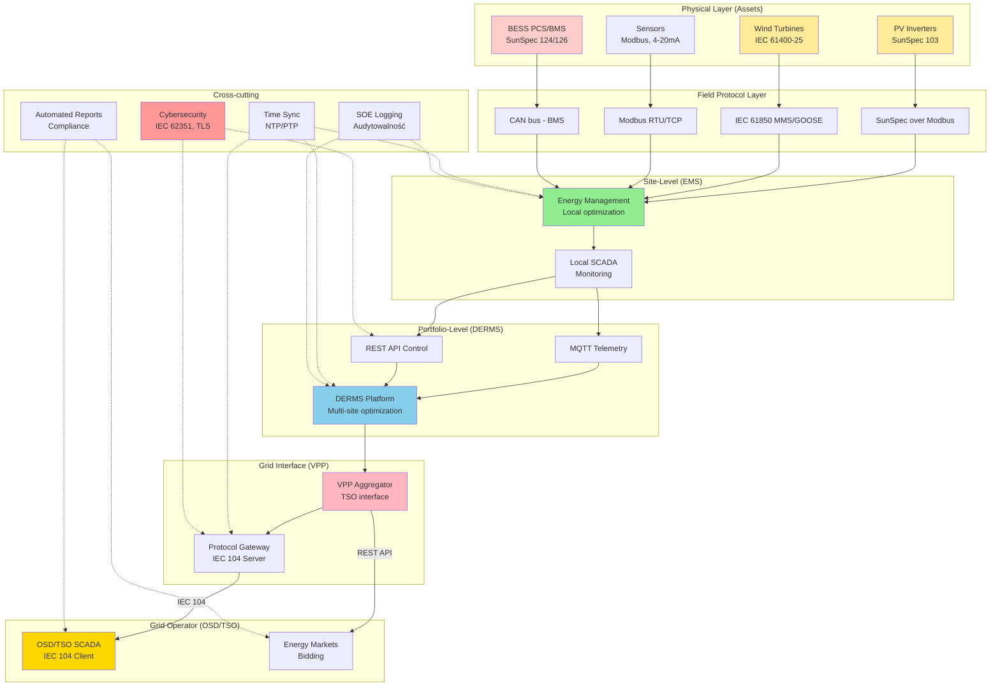

import { 
  SlideContainer, 
  Slide, 
  KeyPoints, 
  SupportingDetails, 
  InstructorNotes,
  VisualSeparator,
  LearningObjective,
  Example
} from '@site/src/components/SlideComponents';

<LearningObjective>
Po tym wykładzie student potrafi:
- Zastosować standardy komunikacji energetycznej (IEC 61850, IEC 104, SunSpec) w projektach integracyjnych
- Zaprojektować kompletny system od field devices (sensors, inverters) poprzez protokoły (Modbus, IEC 61850) do grid interface (IEC 104 → OSD)
- Zintegrować instalacje OZE z systemami zarządzania energią (EMS/DERMS/VPP) z właściwymi API i security
- Spełnić wymagania raportowe i compliance (SOE, KPI, telemetry SLA) dla różnych stakeholders
</LearningObjective>

<SlideContainer>

<Slide title="📚 Przegląd kluczowych tematów Wykładu 04" type="info">

<KeyPoints title="📋 Struktura wykładu - 6 sekcji, synteza">

### **Część 1: Standardy danych (sekcje 01-03)**

**01. Profile danych (SunSpec, IEC 61400-25, BESS)**
- **Problem**: Multi-vendor chaos → różne nazwy/jednostki
- **Rozwiązanie**: Standardized data profiles
- **SunSpec** (PV): Modbus register maps, &gt;90% support producentów, Models 101/103/124/126/160/201/203/302
- **IEC 61400-25** (Wind): Logical Nodes (WTUR, WROT, WNAC), based on IEC 61850
- **BESS**: 3 warstwy (BMS + PCS + EMS), thermal runaway monitoring critical
- **Tag dictionary**: System.Device.Parameter + SI units + quality flags + metadata
- **Key insight**: Standaryzacja = 50-80% integration time savings

**02. IEC 61850 i IEC 60870-5-104**
- **IEC 61850**: Universal standard energetyki, 100+ wires → 2 fibers
  - Information Model: IED → LD → LN → DO → DA (hierarchia semantyczna)
  - Services: GOOSE (&lt;4 ms, protection), MMS (10-100 ms, monitoring), SV (&lt;1 ms, waveforms)
  - Logical Nodes: XCBR, MMXU, DPVI, DGEN, ZBAT
- **IEC 60870-5-104**: Telecontrol (TSO/DSO)
  - APDU: Type ID + COT + CASDU + IOA + value + quality
  - Deadband (0.5-2%) reduces traffic 10-50×
  - Requirement dla &gt;1 MW w Polsce/EU
- **Gateway pattern**: Farm (Modbus/SunSpec) → IEC 104 → OSD (€15-20k CAPEX)
- **Key insight**: GOOSE = fast/local, MMS = flexible/routable, IEC 104 = TSO standard

**03. Integracja EMS/DERMS/VPP**
- **Hierarchia**: EMS (local, 1 site) → DERMS (portfolio, 10-1000 sites) → VPP (agregacja, 100-10k assets)
- **API-first**: REST (config/control), MQTT (telemetry), OAuth 2.0 + MFA (security)
- **Data flows**: Downstream (commands &lt;1 min), Upstream (telemetry, 180 000× aggregation!)
- **Use cases**: Peak shaving (€63k/year savings, ROI 5 months), frequency regulation (€30-80/MW/h)
- **Cybersecurity**: Defense-in-depth, IEC 62351, cost prevention €120k vs. incident €206k
- **Key insight**: Optimization cascades (TSO → VPP → DERMS → EMS → Assets), każda warstwa agreguje

---

### **Część 2: Praktyka operacyjna (sekcje 04-06)**

**04. Telemetria do OSD/VPP**
- **Wymagania**: 15-25 data points minimum (P, Q, U, I, f, E, status)
- **Agregacja**: 1-min (real-time), 15-min (billing/settlement standard)
- **Quality flags**: IEC 104 quality byte (IV, NT, SB, BL), tylko 0x00 (VALID) w KPI
- **Curtailment**: Grid congestion/overvoltage → command → confirmation loop (&lt;5 min)
- **SLA**: Uptime &gt;99% (max 87.6 h downtime/year), completeness &gt;95%, latency &lt;5 s
- **Key insight**: Redundant links (fiber + LTE) achieve 99%+ uptime

**05. SOE i reporting**
- **SOE**: Chronological log, precision ±10-100 ms, categorization (CRITICAL→DEBUG)
- **Root cause analysis**: Timeline correlation (Δt = 111 ms grid fault → inverter trip)
- **Raporty regulatory**: Miesięczne/kwartalne (OSD compliance, KPI, incidents)
- **Raporty commercial**: Investor (PR, CF, revenue), O&M (MTBF/MTTR)
- **Environmental**: CO₂ avoided, RECs (ESG metrics)
- **Audytowalność**: Immutability (append-only), retention 10+ lat (CRITICAL)
- **Key insight**: Automation (Python + templates) eliminuje manual errors

**06. Podsumowanie i integracja** ← **TEN SLAJD**

</KeyPoints>

<SupportingDetails title="🎯 Mapa integracji – Big Picture">

### **Synteza według przypadku użycia:**

| Use Case | Protokoły | Standardy danych | Security | Reporting | Typowa instalacja |
|----------|-----------|------------------|----------|-----------|-------------------|
| **Farma PV → OSD** | Modbus TCP, IEC 104 | SunSpec Models 103/203/302 | VPN IPsec, firewall | Miesięczne KPI (OSD) | 1-50 MWp, przyłączenie SN/WN |
| **Wind farm → DERMS** | IEC 61850 MMS, IEC 104 | IEC 61400-25 LNs (WTUR, WROT) | TLS, RBAC | SOE (incidents), Quarterly CF | 50-500 MW portfolio |
| **Hybrid PV+BESS → VPP** | SunSpec, MQTT, REST API | SunSpec 103/124, custom tags | OAuth 2.0, MFA | Daily forecasts, Real-time telemetry | 2 MWp PV + 1 MWh BESS |
| **Multi-site aggregation** | OPC UA, MQTT, GraphQL | Normalized tag dictionary | Zero-trust, segmentation | Portfolio KPI, Market bids | 100-1000 sites, DERMS/VPP |

</SupportingDetails>

<InstructorNotes>

**Czas**: 14-16 min

**Przebieg**:
1. Przegląd 6 sekcji (5 min) – recap kluczowych punktów
2. Mapa integracji (4 min) – pokazuje big picture, jak wszystko się łączy
3. Tabela use cases (3 min) – konkretne przykłady
4. Mini-ćwiczenie preview (2 min)
5. Q&A finalne (2 min)

**Punkty kluczowe**:
- **Big picture**: Physical assets → Field protocols → Site EMS → Portfolio DERMS → Grid VPP → Market/OSD
- **Standardy na każdym poziomie**: SunSpec (field), IEC 61850 (site), IEC 104 (grid)
- **Cross-cutting**: Time sync, security, SOE, reporting (przez wszystkie warstwy)
- **Integration complexity**: 6+ layers, 5+ protocols, ale standardy make it manageable

**Demonstracja praktyczna**:
- Live dashboard: Multi-layer view (assets → site → portfolio → grid) w Grafana
- API call chain: curl → REST API → MQTT publish → IEC 104 send (pokazuje cascade)

**Materiały pomocnicze**:
- Wykład 04 mindmap (PDF) – synthesizes all topics
- Integration reference architecture (diagram, detailed)

**Typowe błędy studenckie**:
- Zapominanie o którymś layer (np. direct assets → OSD, skip EMS/DERMS)
- Brak big picture – focus na protocole, nie na system
- Niedocenianie complexity (integration to 60-80% projektu, nie tylko sensors!)

**Pytania studenckie**:
- Q: Co jest najważniejsze z wykładu 04?
- A: (1) Standardy danych (SunSpec, IEC 61400-25) = interoperability, (2) IEC 104 = grid interface (compliance), (3) EMS/DERMS hierarchy (optimization), (4) Security (IEC 62351, defense-in-depth).

- Q: Jak przygotować się do egzaminu?
- A: (1) Zrozum hierarchię (assets → field → site → portfolio → grid), (2) Naucz się różnic protocols (GOOSE vs. MMS, REST vs. MQTT), (3) Potrenuj mapping (SunSpec → IEC 104).

</InstructorNotes>

</Slide>

<VisualSeparator type="technical" />

<Slide title="🔧 Mini-ćwiczenie: Projekt integracji hybrid PV+BESS+Wind" type="success">

**Zadanie: Zaprojektuj kompletną architekturę integracji dla:**

**Instalacja:**
- 10 MWp PV (20 inwerterów × 500 kW)
- 5 MWh BESS (Tesla Megapack)
- 6 MW Wind (3 turbiny × 2 MW)
- Przyłączenie: 110 kV (WN)
- Operator: Aggregator (chce participate w rynkach TSO)

**Wymagania:**
1. **Field-level protocols** (jak komunikować się z assets?)
2. **Site EMS** (local optimization: self-consumption, peak shaving)
3. **Portfolio DERMS** (ma 50 innych sites, total 500 MW)
4. **VPP interface** (do TSO: frequency regulation, reserves)
5. **OSD telemetry** (compliance: IEC 104, data points, SLA)
6. **Security** (defense-in-depth, protocols encryption)
7. **Reporting** (monthly KPI, SOE dla incidents)
8. **Budget** (CAPEX/OPEX, 5-year TCO)

**Hint: Użyj knowledge z sekcji 01-05 tego wykładu**

</Slide>

<VisualSeparator type="default" />

<Slide title="📖 Przykładowe rozwiązanie (guidance)" type="info">

<SupportingDetails title="🎯 Solution architecture">

### **1. Field-level protocols:**

| Asset | Protocol | Standard | Interface | Rationale |
|-------|----------|----------|-----------|-----------|
| **PV Inverters** | Modbus TCP | SunSpec Model 103 | Ethernet, Modbus port 502 | Industry standard, plug-and-play |
| **BESS PCS** | Modbus TCP | SunSpec Model 124/126 | Ethernet | AC side (grid interface) |
| **BESS BMS** | CAN bus (internal) | Proprietary Tesla | Gateway translates CAN → Modbus | Detailed cell monitoring |
| **Wind Turbines** | IEC 61850 MMS | IEC 61400-25 (WTUR, WROT, etc.) | Ethernet, MMS port 102 | Turbines &gt;1 MW standard |
| **Meteo** (pyranometry, anemometry) | Modbus RTU | SunSpec Model 302/307 | RS-485 | Simple sensors, local |

**Integration gateway:**
- Raspberry Pi 4 (3× units, redundancy) + Node-RED
- Collect all protocols → normalize → InfluxDB

---

### **2. Site EMS (local optimization):**

**Software**: OpenEMS (open-source) lub Victron CCGX

**Strategies:**
- **Self-consumption**: PV → loads first, excess → BESS charge (avoid grid export @ low prices)
- **Peak shaving**: BESS discharge during demand peaks (>threshold), charge off-peak
- **Forecast-based**: ML model predicts load/PV (15 min ahead) → preemptive BESS dispatch

**Control loop**: 1-min cycle, decision logic (pseudocode w sekcji 03)

---

### **3. Portfolio DERMS:**

**Platform**: AutoGrid DERMS (commercial, €200k) lub custom (Python + optimization library)

**Functions:**
- **Portfolio optimization**: 50 sites (500 MW total), distribute TSO setpoints according to availability, SoC, costs
- **Grid constraints**: Respect voltage/thermal limits (per feeder)
- **Market bidding**: Day-ahead, intraday (aggregate forecasts)

**Interface to site EMS:**
- **Downstream**: REST API POST /setpoint (power targets)
- **Upstream**: MQTT telemetry (SoC, Power, Status) co 1-5 min

---

### **4. VPP interface (to TSO):**

**Protocol**: IEC 60870-5-104

**Aggregated data points (5 punktów dla 10+5+6=21 MW hybrid):**
- IOA 4001: P_AC_Total (MW) = PV + Wind + BESS_discharge - BESS_charge
- IOA 4002: Q_AC_Total (MVAr)
- IOA 5001: E_Export_Total (MWh, cumulative)
- IOA 3001: Site_Status (BOOL: all OK = 1)
- IOA 4050: Available_Power (MW, weather + SoC dependent)

**Connection**: VPN IPsec, redundant (fiber + LTE)

---

### **5. OSD telemetry (compliance):**

**Requirements (PSE/OSD):**
- Update: SPONTANEOUS (deadband 1%) + GI co 15 min
- Latency: &lt;5 s
- Uptime: &gt;99%
- Reporting: Miesięczne (availability, CF, incidents)

**Implementation**: RTU (Siemens SICAM lub Raspberry Pi + lib60870), same as section 02 case study

---

### **6. Security (defense-in-depth):**

**5 layers:**
1. **Network segmentation**: DMZ (VPN) → OT (DERMS/EMS) → Field (assets), 2× firewalls
2. **Authentication**: OAuth 2.0 + MFA (dla DERMS/VPP), client certificates (mTLS)
3. **Encryption**: TLS 1.3 (REST/MQTT), IPsec VPN (IEC 104)
4. **Monitoring**: SIEM (Splunk, ELK), anomaly detection, audit logs
5. **Incident response**: Playbooks, isolation capability (&lt;5 min), backups (daily)

**Cost**: €30-50k (infrastructure), €20k/year (managed security)

---

### **7. Reporting (automated):**

**Monthly:**
- KPI report (PR dla PV, CF dla Wind, round-trip efficiency dla BESS)
- Availability (per technology, site-level)
- Incidents (SOE analysis dla CRITICAL events)
- Environmental (CO₂ avoided: 21 MW × 2000 h equivalent = 42 GWh/year × 0.7 = 29 400 ton CO₂)

**Generation**: Python + Jinja2, runs 1st of month, PDF output, email distribution

---

### **8. Budget (5-year TCO):**

| Kategoria | CAPEX | OPEX/year | 5-year total |
|-----------|-------|-----------|--------------|
| **Field devices** (sensors, meters) | €15 000 | — | €15 000 |
| **Integration gateways** (3× RPi) | €1200 | €300 | €2700 |
| **RTU (IEC 104)** | €10 000 | — | €10 000 |
| **EMS software** | €30 000 | €5000 | €55 000 |
| **DERMS subscription** | — | €15 000 | €75 000 |
| **Connectivity** (fiber, VPN, LTE) | €5000 | €4000 | €25 000 |
| **Security** (firewall, SIEM) | €30 000 | €20 000 | €130 000 |
| **Installation/commissioning** | €20 000 | — | €20 000 |
| **TOTAL** | **€111 200** | **€44 300/year** | **€332 700** |

**Cost per MW**: €332 700 / 21 MW = **€15 843/MW** (5-year TCO)

**ROI analysis:**
- Revenue增 from optimization (peak shaving, market participation): €50-100k/year
- Payback: 3-6 years (zależnie od market conditions)

</SupportingDetails>

<InstructorNotes>

**Czas**: 20-30 min (główna aktywność!)

**Przebieg**:
1. Przedstawienie zadania (3 min) – hybrid instalacja, wymagania
2. Studenci pracują w grupach (15 min) – projektują architekturę
3. Prezentacje (2 min/grupa, 3-4 grupy = 6-8 min)
4. Dyskusja + przykładowe rozwiązanie (5 min)
5. Wnioski (2 min)

**Punkty kluczowe**:
- **Integration to 60-80% effort** w projektach OZE (więcej niż hardware!)
- **Standardy упрощają** (SunSpec, IEC 104), ale still complexity (6 layers)
- **Security NIE opcjonalne** – €30-50k cost, ale critical infrastructure
- **Budget €15-20k/MW** (5-year TCO) to typical dla advanced integration

**Ocena pracy grupowej**:
- Completeness (czy wszystkie layers pokryte?)
- Technical correctness (właściwe protocols, standards?)
- Ekonomia (realistic budget? ROI?)
- Praktyczność (czy da się zbudować?)

**Materiały pomocnicze**:
- Worksheet template (sekcje 1-8 do wypełnienia)
- Reference architectures (przykłady z industry: Siemens, GE, Schneider whitepapers)
- Cost calculator (Excel) – input choices, see budget

**Pytania studenckie podczas exercise**:
- Q: Czy trzeba używać wszystkich protokołów (Modbus, IEC 61850, IEC 104)?
- A: Depends. Minimum: Field protocol (Modbus/SunSpec) + Grid interface (IEC 104). IEC 61850 optional (jeśli turbiny/large substations). Trade-off: compatibility vs. complexity.

- Q: Jaki jest difference między RTU a gateway?
- A: Terminology overlap. RTU (Remote Terminal Unit) typowo = IEC 104 server dla OSD. Gateway = generic translator między protocols. W praktyce: RTU jest type of gateway (protocol gateway).

</InstructorNotes>

</Slide>

<VisualSeparator type="default" />

<Slide title="🎓 Przygotowanie do Wykładu 05 i dalszych" type="info">

<KeyPoints title="📋 Co dalej? Roadmap">

### **Wykład 05: Jakość danych i inżynieria strumieni**

**Tematy:**
- **Data quality**: Completeness, accuracy, consistency, timeliness (4 wymiary)
- **Walidacja i imputacja**: Outlier detection (CUSUM, z-score), missing data interpolation
- **Drift detection**: Sensor degradation, kalibracja predictive
- **Stream processing**: InfluxDB, Kafka, Flink (real-time pipelines)
- **Schema design**: Time-series database optimization, retention policies

**Connection z Wykładem 04:**
- Protokoły (W4) → **Data pipelines** (W5)
- Quality flags (IEC 104, W4) → **Data quality frameworks** (W5)
- SOE logging (W4) → **Event stream processing** (W5)

**Przygotowanie:**
- Review: InfluxDB basics (measurements, tags, fields, timestamps)
- Install: InfluxDB 2.x + Grafana (local lub cloud)
- Read: Time-series data modeling best practices

---

### **Wykład 06: Analityka i wykrywanie anomalii**

**Tematy:**
- **Statistical methods**: Control charts, CUSUM, threshold-based
- **ML for anomaly detection**: Isolation Forest, autoencoders, LSTM
- **Root cause analysis**: Correlation, SOE timeline, fishbone diagrams
- **Predictive maintenance**: Failure prediction (CMS data), remaining useful life (RUL)

**Connection:**
- Data quality (W5) → **Analytics** (W6) – "garbage in, garbage out"
- SOE (W4) → **Correlation analysis** (W6) – multi-variate event detection

---

### **Wykłady 07-10: Aplikacje dziedzinowe i bezpieczeństwo**

- **W07**: Monitoring PV (I-V curves, soiling detection, degradation analysis)
- **W08**: Monitoring wind/biogas/hydro (CMS vibration, gas composition, flow optimization)
- **W09**: Edge AI i digital twins (SoC/SoH prediction, TinyML, simulation)
- **W10**: Systemy bezpieczeństwa (fire protection, thermal runaway BESS, ATEX)

</KeyPoints>

<SupportingDetails title="🎯 Kluczowe umiejętności do konsolidacji">

### **Po Wykładzie 04 powinieneś umieć:**

**Technical (hard skills):**
1. ✅ **Czytać specyfikacje** protokołów (IEC 61850, IEC 104, SunSpec) i implementować
2. ✅ **Projektować tag dictionaries** z normalizacją (naming, units, quality)
3. ✅ **Mapować między protokołami** (SunSpec register → IEC 104 IOA)
4. ✅ **Implementować API** (REST endpoints, MQTT topics, authentication)
5. ✅ **Analizować SOE** (timeline correlation, root cause identification)
6. ✅ **Obliczać KPI** (PR według IEC 61724, CF, Availability)
7. ✅ **Projektować security** (network segmentation, encryption, RBAC)

**Conceptual (understanding):**
1. ✅ **Big picture**: Hierarchia assets → field → site → portfolio → grid
2. ✅ **Trade-offs**: Standardization (interoperability) vs. flexibility (custom)
3. ✅ **Compliance**: Grid codes to non-negotiable, how to meet requirements
4. ✅ **Economics**: Integration costs (€15-20k/MW TCO) vs. benefits (optimization, market access)

**Soft skills:**
1. ✅ **Systems thinking**: Jak protocols/standards łączą się w całość
2. ✅ **Vendor evaluation**: Pytać o SunSpec/IEC compliance w przetargach
3. ✅ **Troubleshooting**: SOE analysis dla root cause (methodical approach)
4. ✅ **Communication**: Technical specs dla engineers, executive summaries dla management

---

### **Self-study recommendations:**

**Praktyka hands-on (buduj home lab):**
- **Level 1** (beginner, €200): Raspberry Pi + Modbus simulator + InfluxDB + Grafana
- **Level 2** (intermediate, €500): + SunSpec inverter (used Fronius, eBay ~€300) lub simulator
- **Level 3** (advanced, €1000+): + IEC 104 gateway (lib60870), connect to test SCADA

**Online resources:**
- **SunSpec Alliance**: Free specifications, test tools (https://sunspec.org/)
- **UCA Users Group**: IEC 61850 resources, webinars (https://ucaiug.org/)
- **lib60870**: GitHub examples (https://github.com/mz-automation/lib60870)
- **OpenEMS**: Open-source EMS (https://openems.io/), contribution opportunities

**Certifications (opcjonalne, ale valuable):**
- **Certified Energy Manager** (CEM) – AEE (Association of Energy Engineers)
- **IEC 61850 System Configurator** – vendor training (Siemens, ABB, ~€2000)

</SupportingDetails>

<Example title="Checklist: Czy jesteś gotowy na Wykład 05?">

✅ **Standardy danych:**
- [ ] Rozumiem SunSpec Models (101, 103, 124, 126) i potrafię czytać register maps
- [ ] Znam Logical Nodes IEC 61400-25 (WTUR, WROT, WNAC) i hierarchię
- [ ] Potrafię zaprojektować tag dictionary (naming, units, quality flags)

✅ **Protokoły:**
- [ ] Rozumiem różnicę GOOSE (&lt;4 ms, Layer 2) vs. MMS (10-100 ms, TCP/IP)
- [ ] Znam strukturę IEC 104 (APDU, Type IDs, COT, deadband)
- [ ] Potrafię zaprojektować gateway (Modbus → IEC 104 mapping)

✅ **Integracja:**
- [ ] Rozumiem hierarchię EMS → DERMS → VPP (scales, optimization objectives)
- [ ] Znam best practices API (REST vs. MQTT, OAuth 2.0, QoS levels)
- [ ] Potrafię zaprojektować data flows (upstream telemetry, downstream commands)

✅ **Praktyka:**
- [ ] Potrafię analizować SOE (timeline correlation, Δt calculations)
- [ ] Umiem obliczyć KPI (PR według IEC 61724, Availability, completeness)
- [ ] Rozumiem wymagania security (defense-in-depth, IEC 62351)
- [ ] Znam SLA metrics (uptime, latency, quality)

**Jeśli ≥12/16: READY ✅**  
**Jeśli 8-11/16: Review słabsze sekcje + przykłady**  
**Jeśli &lt;8/16: Przejrzyj wykład ponownie + konsultacje**

---

**Next lecture preview:**
- **W05 focus**: Jakość danych (quality nie tylko flaga, ale process), stream processing (InfluxDB hands-on), outlier detection (algorytmy)
- **Labs**: InfluxDB + Grafana setup, data cleaning pipeline (Python), real-time anomaly detection

</Example>

<InstructorNotes>

**Czas**: 15-20 min

**Cel**:
- Synthesis całego wykładu (integration wszystkich concepts)
- Forward-looking (roadmap W5-W10)
- Praktyczne (checklist, self-study)

**Format**:
- Interactive (mini-exercise, presentations)
- Reflective (checklist – studenci self-assess)
- Inspiring (pokazać career opportunities w OZE integration/SCADA)

**Atmosfera**:
- Celebratory (completed complex lecture!)
- Supportive (resources available)
- Motivating (standards & integration to high-demand skills)

**Final message**: "Integration engineers są kluczowi dla energy transition – łączycie distributed OZE z centralized grid. Mastering standards (IEC 61850, SunSpec, security) to your competitive advantage! 🚀"

</InstructorNotes>

</Slide>

</SlideContainer>

---

## 🎯 Końcowe podsumowanie – Key Takeaways

**Wykład 04 w trzech zdaniach:**

1. **Standardy danych** (SunSpec, IEC 61400-25, IEC 61850) eliminują vendor lock-in i reduce integration time 50-80% → multi-vendor installations become feasible i economiczne.

2. **Protokoły energetyczne** (IEC 61850 GOOSE/MMS, IEC 60870-5-104) łączą distributed OZE z centralized grid → wymagania compliance (telemetria, curtailment, SOE) są strict, ale achievable z proper architecture.

3. **Hierarchia systemów** (EMS → DERMS → VPP) plus **security** (defense-in-depth, IEC 62351) plus **reporting** (automated, audytowalne) = professional-grade integration → ready for grid participation i market access.

---

## 📚 Zasoby dodatkowe

**Normy i standardy:**
- **IEC 61850** series (parts 1-10): Substation communication
- **IEC 60870-5-104**: Telecontrol, transmission protocols
- **IEC 61400-25**: Wind turbine communications
- **SunSpec specifications**: https://sunspec.org/specifications/
- **IEEE 1547**: Interconnecting DER with grid
- **IEC 62351**: Security for power system communication

**Software & Tools:**
- **lib60870**: Open-source IEC 104 (https://github.com/mz-automation/lib60870)
- **OpenEMS**: Open-source EMS (https://openems.io/)
- **pymodbus**: Python Modbus library (SunSpec support)
- **UAExpert**: OPC UA client (browse IEC 61850 servers)
- **Wireshark**: Protocol analyzer (GOOSE, MMS, IEC 104 dissectors)

**Literatura:**
- Mackiewicz: "IEC 61850: A Practical Overview for Users" (IEEE tutorial)
- Brand, Lohmann: "IEC 61850 Communications Networks and Systems in Substations" (book)
- ENTSO-E: "Network Codes and Guidelines" (EU grid codes, free PDFs)

---

## ✅ Checklist: Czy jesteś gotowy na egzamin (Wykład 04)?

**Wiedza teoretyczna:**
- [ ] SunSpec Models (103, 124, purpose każdego)
- [ ] IEC 61850 hierarchy (IED/LD/LN/DO/DA)
- [ ] GOOSE vs. MMS (latency, transport, use cases)
- [ ] IEC 104 structure (Type IDs, COT meanings)
- [ ] EMS vs. DERMS vs. VPP (scale, optimization)

**Umiejętności praktyczne:**
- [ ] Mapowanie tagów (SunSpec → IEC 104)
- [ ] Obliczanie KPI (PR, Availability)
- [ ] SOE analysis (timeline correlation)
- [ ] SLA metrics (uptime, completeness)
- [ ] Security architecture (defense-in-depth layers)

**Jeśli ≥8/10: GOTOWY na egzamin ✅**  
**Jeśli 5-7/10: Review + przykłady praktyczne**  
**Jeśli &lt;5/10: Konsultacje + powtórka wykładu**

---

**Dziękuję za uwagę! Pytania? 🙋**

📝 Notatki prowadzącego

**Czas total**: 45-60 min

**Cel**:
- Synthesis (nie tylko recap, but integration concepts)
- Praktyka (mini-exercise w grupach)
- Roadmap (connection do W5-W10)

**Assessment**:
- Observe group work (kto rozumie, kto struggleuje?)
- Note common mistakes (address w next lecture)
- Identify students for advanced projects (pokazują dobry systems thinking)

**Atmosfera**:
- Encouraging (W04 był trudny – standards/protocols są dense)
- Praktyczna (pokazać że to useful skills, not just theory)
- Forward-looking (W05-W06 będą bardziej hands-on, mniej specifications)

**Final thought**: "Standards might seem dry (specifications, acronyms), ale to fundament scalable systems. Bez standardów: każdy projekt to custom integration (expensive, risky). Ze standardami: proven patterns, reusable components, vendor choices. Worth the effort! 💪"

