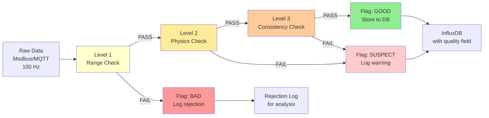
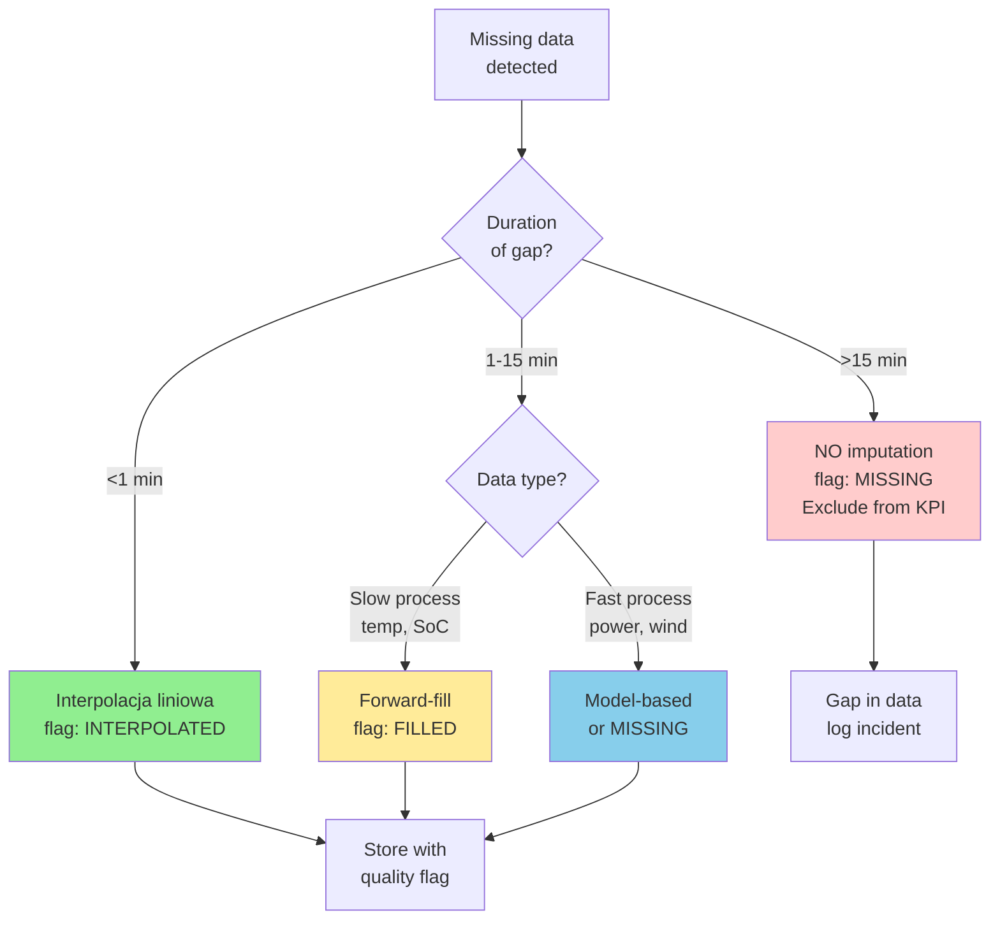

import { 
  SlideContainer, 
  Slide, 
  KeyPoints, 
  SupportingDetails, 
  InstructorNotes,
  VisualSeparator,
  LearningObjective,
  KeyConcept,
  Example
} from '@site/src/components/SlideComponents';
import { InteractiveQuiz } from '@site/src/components/InteractiveQuiz';

<LearningObjective>
Po tej sekcji student potrafi:
- Zaprojektować reguły walidacji danych (range checks, physical laws, cross-channel consistency)
- Zastosować odpowiednie metody imputacji (interpolacja, forward-fill, model-based) z transparency flagging
- Wykryć drift czujników używając metod statystycznych (CUSUM, MAD, reference comparison)
- Zaimplementować pipeline jakości danych (validation → imputation → quality scoring) w systemie monitoringu
</LearningObjective>

<SlideContainer>

<Slide title="🧪 Walidacja danych – 4 wymiary jakości" type="info">

<KeyPoints title="📋 Framework jakości danych (Data Quality Dimensions)">

**ISO 8000** i literatura (Batini, Scannapieco) definiują **4 kluczowe wymiary**:

**1. Completeness (kompletność)**
- **Definicja**: Jaką część expected data points faktycznie mamy?
- **Formula**: $Completeness = \frac{N_{received}}{N_{expected}} \times 100\%$
- **Target**: &gt;95% dla critical KPI (PR, billing), &gt;90% dla monitoring
- **Przykład**: Farma PV, 1 miesiąc, 15-min intervals → expected 2880, received 2850 → 98.96% ✓

**2. Accuracy (dokładność)**
- **Definicja**: Jak blisko prawdziwej wartości (zgodność z rzeczywistością)?
- **Measurement**: Niepewność pomiarowa (z kalibracji), błąd systematyczny
- **Target**: Depends on czujnika (pyranometr First Class ±5%, PT1000 ±0.3°C)
- **Przykład**: G_POA = 950 W/m² ± 20 W/m² (U, k=2) → accuracy band

**3. Consistency (spójność)**
- **Definicja**: Zgodność między related data points (nie contradictions)
- **Types**:
  - **Internal**: ∑I_string ≈ I_DC_inverter (suma prądów stringów = prąd total)
  - **Temporal**: P(t) nie może jump z 1000 kW do 5000 kW w 1 s (physical limit)
  - **Cross-source**: G_POA(pyranometr) vs. G_POA(satelita) powinny korelować (R² >0.9)
- **Example**: Jeśli P_AC = 2000 kW, ale G_POA = 10 W/m² (noc) → INCONSISTENT (likely sensor fault)

**4. Timeliness (aktualność)**
- **Definicja**: Jak "świeże" są dane (opóźnienie acquisition → availability)
- **Target**: &lt;10 s dla real-time control, &lt;5 min dla monitoring
- **Przykład**: SOE event timestamp 14:23:42.123, received @ SCADA 14:23:45.678 → latency 3.5 s ✓

</KeyPoints>

<SupportingDetails title="🔧 Reguły walidacji – hierarchia checks">

### **Level 1: Range checks (podstawowe)**

**Min/max bounds (zakresy fizyczne):**

```python
# Python validation example
def validate_range(value, min_val, max_val, param_name):
    if value < min_val or value > max_val:
        return False, f"{param_name} out of range: {value} not in [{min_val}, {max_val}]"
    return True, "OK"

# Examples:
validate_range(G_POA, min=0, max=1500, param="Irradiance")  # W/m², max theoretical ~1350
validate_range(T_mod, min=-40, max=85, param="Module Temp")  # °C, operational range
validate_range(P_AC, min=0, max=P_rated*1.05, param="AC Power")  # Allow 5% overload transient
validate_range(SoC, min=0, max=100, param="State of Charge")  # %
validate_range(f_grid, min=47, max=52, param="Grid Frequency")  # Hz, Europe 50 Hz ±2 Hz extreme
```

**Typowe zakresy dla wielkości OZE:**

| Wielkość | Min | Max | Uwagi |
|----------|-----|-----|-------|
| **G_POA** | 0 W/m² | 1500 W/m² | &gt;1350 = suspekt (odbicia, błąd czujnika) |
| **T_mod** | -40 °C | 85 °C | Poniżej/powyżej = ekstremalnie rzadkie |
| **P_AC** (PV) | 0 W | P_rated × 1.05 | Overload transient dopuszczalny &lt;1 min |
| **Wind speed** | 0 m/s | 40 m/s | &gt;35 m/s = shutdown (safety) |
| **SoC** (BESS) | 0% | 100% | Exactly, nie może być &lt;0 lub &gt;100 |
| **U_grid** | 0.9 × U_nom | 1.1 × U_nom | Dla 110 kV: 99-121 kV |
| **f_grid** | 47.5 Hz | 52.5 Hz | Europe 50 Hz, extreme ±2.5 Hz |

---

### **Level 2: Physical laws (reguły fizyczne)**

**Relationship checks:**

```python
# P_AC nie może przekraczać P_DC (inverter efficiency <100%)
def validate_power_balance(P_AC, P_DC, tolerance=0.02):
    if P_AC > P_DC * 1.02:  # Allow 2% measurement error
        return False, f"P_AC ({P_AC}) > P_DC ({P_DC}) – impossible (efficiency >100%)"
    return True, "OK"

# P_AC ≤ P_theoretical (function of G, T)
def validate_pv_physics(P_AC, G_POA, T_mod, P_rated, gamma=-0.004):
    # Theoretical max (simplified, ignores efficiency losses)
    P_theoretical = P_rated * (G_POA / 1000) * (1 + gamma * (T_mod - 25))
    
    if P_AC > P_theoretical * 1.1:  # Allow 10% margin (measurement uncertainty)
        return False, f"P_AC ({P_AC}) >> P_theoretical ({P_theoretical}) – inconsistent"
    return True, "OK"

# Energy conservation (nie można wytworzyć więcej niż dostępne w źródle)
# For BESS: E_discharged ≤ E_charged × round_trip_efficiency
def validate_bess_energy(E_discharged, E_charged, eta_rt=0.90):
    if E_discharged > E_charged * eta_rt * 1.05:  # 5% margin
        return False, f"Discharged ({E_discharged}) > Charged ({E_charged}) × η – energy loss too high"
    return True, "OK"
```

---

### **Level 3: Cross-channel consistency (spójność międzykanałowa)**

```python
# Sum of string currents ≈ DC current inverter
def validate_string_currents(I_strings, I_DC_total, tolerance=0.05):
    I_sum = sum(I_strings)
    diff_percent = abs(I_sum - I_DC_total) / I_DC_total
    
    if diff_percent > tolerance:  # >5% difference
        return False, f"String currents sum ({I_sum} A) ≠ DC total ({I_DC_total} A), diff {diff_percent*100:.1f}%"
    return True, "OK"

# Wind: Generator speed ≈ Rotor speed × gearbox ratio
def validate_wind_gearbox(rotor_rpm, gen_rpm, ratio=91, tolerance=0.05):
    expected_gen = rotor_rpm * ratio
    diff_percent = abs(gen_rpm - expected_gen) / expected_gen
    
    if diff_percent > tolerance:
        return False, f"Generator speed ({gen_rpm} rpm) ≠ Rotor ({rotor_rpm}) × ratio ({ratio}), possible gearbox fault"
    return True, "OK"
```

---

### **Quality flags (znaczniki jakości):**

Po walidacji, assign quality flag:
- **GOOD** (0x00): All validations passed
- **SUSPECT** (0x04): Failed Level 2/3 (physical law, consistency), ale nie Level 1 (range)
- **BAD** (0x01): Failed Level 1 (out of range, clearly invalid)
- **MISSING** (0xFF): No data received

</SupportingDetails>

<Example title="Walidacja pipeline – farma PV 10 MWp">

**Architektura:**



**Statistics (1 miesiąc, 2 880 000 data points total):**

| Quality | Count | Percentage | Action |
|---------|-------|------------|--------|
| **GOOD** | 2 835 600 | 98.46% | Used in KPI calculations |
| **SUSPECT** | 28 800 | 1.00% | Logged, used with caution (flagged) |
| **BAD** | 14 400 | 0.50% | Rejected (not stored) |
| **MISSING** | 1 200 | 0.04% | Gaps (imputation może być applied) |

**Rejection reasons (BAD, top 5):**
1. G_POA < 0 W/m² (6000 points, 0.21%) – sensor fault (night offset drift)
2. P_AC > P_rated × 1.05 (4800 points, 0.17%) – measurement spike (EMI)
3. T_mod > 85 °C (2400 points, 0.08%) – sensor fault lub extreme heat (investigated)
4. f_grid > 52 Hz (800 points, 0.03%) – grid event (external, confirmed by OSD)
5. Communication timeout (400 points, 0.01%) – network glitch

**Actions taken:**
- G_POA offset: Recalibration pyranometru (zero adjustment)
- P_AC spikes: Added EMI filter (RC, 100 Hz cutoff)
- T_mod >85°C: False alarm (sensor briefly touched by bird, no real overheat)

**Impact on KPI:**
- **Przed walidacją**: PR calculated z ALL data (incl. BAD) = 79.2% (zaniżony przez night G_POA &lt;0)
- **Po walidacji**: PR tylko GOOD data = **82.8%** (correct value)
- **Difference**: 3.6 punktów procentowych! Walidacja kluczowa.

</Example>

<InstructorNotes>

**Czas**: 16-18 min

**Przebieg**:
1. 4 wymiary jakości (4 min) – completeness, accuracy, consistency, timeliness
2. Hierarchia walidacji (5 min) – Level 1 (range), Level 2 (physics), Level 3 (consistency)
3. Pipeline diagram (2 min) – pokazuje flow
4. Case study (4 min) – real statistics, rejection reasons, impact on KPI
5. Q&A (2 min)

**Punkty kluczowe**:
- **"Garbage in, garbage out"** – bez walidacji KPI są worthless
- **Multi-level validation** (nie tylko range!) – physics i consistency catch subtle errors
- **Quality flags obowiązkowe** – każdy data point MA quality (GOOD/SUSPECT/BAD/MISSING)
- **Impact na KPI może być huge** (3.6 p.p. difference w PR!)

**Demonstracja praktyczna**:
- Live validation (Python script) – input bad data, pokazuje rejection
- InfluxDB query z quality filtering: `WHERE quality='GOOD'`
- Wykres: Before/after validation (PR trend, pokazuje skok gdy fix validation)

**Materiały pomocnicze**:
- ISO 8000 (Data Quality) – framework
- Great Expectations (Python library) – data validation framework
- Example validation rules (YAML config file)

**Typowe błędy studenckie**:
- Tylko range validation (Level 1) – insufficient, physics checks kluczowe
- Brak quality flags (all data treated as GOOD) – risky
- Storing rejected data (zamiast log separately) → pollutes DB

**Pytania studenckie**:
- Q: Czy zawsze reject data jeśli fails validation?
- A: Depends on level. Level 1 (range) = hard reject (clearly invalid). Level 2/3 (physics, consistency) = flag as SUSPECT (może być measurement error, ale może też transient real event). Human review dla SUSPECT.

- Q: Co z night data (G_POA = 0, P_AC = 0)?
- A: NIE reject (to valid!). Ale: exclude z PR calculation (IEC 61724 wymaga G > 200 W/m² dla PR). Filter in query, not in validation.

</InstructorNotes>

</Slide>

<VisualSeparator type="technical" />

<Slide title="🧩 Imputacja braków (Missing Data Imputation)" type="tip">

<KeyConcept title="Kiedy i jak imputować missing data?">

**Missing data** występuje z powodu:
- Communication errors (network glitches, Modbus timeout)
- Sensor faults (temporary failure, restoration)
- Maintenance windows (planned downtime)
- Power outages (UPS exhausted, &lt;5 min typical)

**Decision tree: Czy imputować?**



### **Metody imputacji:**

**1. Linear interpolation (interpolacja liniowa)**

**Zastosowanie**: Short gaps (&lt;1 min), smooth processes
**Formula**: 
$$
y(t) = y_{t-1} + \frac{y_{t+1} - y_{t-1}}{t+1 - (t-1)} \times (t - (t-1))
$$

**Przykład:**
```python
# Gap: t=10:05:00 missing (between 10:04:00 and 10:06:00)
t_before = "10:04:00", value = 950 W/m² (G_POA)
t_after  = "10:06:00", value = 970 W/m²

# Interpolate @ 10:05:00 (midpoint)
value_imputed = 950 + (970 - 950) / 2 = 960 W/m²
quality = "INTERPOLATED"
```

**Zalety**: Prosty, szybki, reasonable dla smooth signals  
**Wady**: Assumes linearity (może miss peaks/valleys w gap)

---

**2. Forward-fill (carry forward last known value)**

**Zastosowanie**: Slow-changing processes (SoC, temp amb), gaps 1-15 min

**Przykład:**
```python
# Gap @ 10:05:00, last known SoC @ 10:04:00 = 65.2%
# Assume SoC nie zmienił się drastycznie w 1 min
SoC_imputed = 65.2%  # Same as last
quality = "FILLED"
```

**Zalety**: Safe assumption dla slow processes  
**Wady**: Ignores changes w gap (jeśli było charging/discharging, będzie wrong)

---

**3. Model-based imputation (predictive)**

**Zastosowanie**: Longer gaps, gdy mamy model procesu

**Przykład (PV power based on irradiance model):**
```python
# Gap: P_AC missing @ 10:05:00
# Available: G_POA = 950 W/m², T_mod = 55°C
# Model: P_AC = P_rated × (G/1000) × (1 + gamma × (T-25)) × efficiency

P_imputed = 10000 × (950/1000) × (1 + (-0.004) × (55-25)) × 0.95
          = 10000 × 0.95 × 0.88 × 0.95
          = 7942 kW
quality = "MODEL_IMPUTED"
```

**Zalety**: Physics-informed, can be accurate  
**Wady**: Model uncertainty (może be wrong jeśli assumptions violated)

---

**4. NO imputation (gdy gap zbyt długi lub critical data)**

**Przypadki:**
- Gap >15 min → flag as MISSING, exclude z KPI
- SOE events (NEVER imputuj – każdy event musi być real, nie estimated)
- Billing data (energy totals) – conservative approach (don't invent data)

</KeyConcept>

<SupportingDetails title="🎯 Best practices dla imputacji">

### **Zasady transparentności:**

**1. ZAWSZE flaguj imputowane dane**
- Original data point: `value=950, quality=GOOD`
- Imputed data point: `value=960, quality=INTERPOLATED`
- W InfluxDB:
```flux
// Query: Exclude imputed data from KPI
from(bucket: "solar")
  |> filter(fn: (r) => r.quality == "GOOD")  // Only measured, nie imputed
```

**2. Przechowuj original gaps (nie overwrite)**
- Option A: Separate field (`value` + `value_imputed`)
- Option B: Quality flag distinguishes (query filters)

**3. Dokumentuj imputation policy**
```yaml
# Imputation config (YAML)
imputation_rules:
  G_POA:
    gap_threshold_sec: 60  # <60s → interpolate
    method: linear
  SoC:
    gap_threshold_sec: 900  # <15 min → forward-fill
    method: forward_fill
  P_AC:
    gap_threshold_sec: 300  # <5 min → model-based
    method: physics_model
    model_params:
      efficiency: 0.95
      gamma: -0.004
  SOE_events:
    method: none  # NEVER impute events
```

**4. Monitor imputation rate**
$$
Imputation\_rate = \frac{N_{imputed}}{N_{total}} \times 100\%
$$

**Target**: &lt;2% (jeśli &gt;5% → investigate communication/sensor issues)

</SupportingDetails>

<Example title="Impact imputacji na KPI – case study">

**Scenariusz: Communication loss, farma PV 5 MWp, 15 min gap**

**Gap details:**
- Time: 10:00-10:15 (15 min = 1 interval w 15-min aggregation)
- Cause: Fiber cut (construction accident)
- Missing: P_AC, G_POA, T_mod (all sensors offline)

**Option 1: NO imputation (conservative)**
- Energy month: 2845 MWh - **15 min gap excluded**
- Gap energy estimate (missed): ~1.2 MWh (5 MW × 0.25 h)
- **Billed energy**: 2843.8 MWh (undercounted -0.04%)
- Financial impact: -1.2 MWh × €50/MWh = **-€60** (lost revenue, nie można bill)

**Option 2: Model-based imputation (aggressive)**
- Use: Weather forecast (G predicted from satellite) + temperature model
- Estimated P_AC: 4.8 MW (based on model)
- Gap energy imputed: 4.8 MW × 0.25 h = 1.2 MWh
- **Billed energy**: 2845 MWh (imputed included, flagged)
- Financial impact: **€0** (no loss)

**Risk:**
- Model uncertainty: ±10-20% (weather forecast can be wrong)
- Audit challenge: OSD może not accept imputed data dla billing (depends on contract)

**Best practice (hybrid):**
- **For internal KPI**: Use imputation (better estimate)
- **For billing/compliance**: Conservative (NO imputation, flag gap, accept small loss)
- **Documentation**: Report gap w monthly KPI ("15-min communication loss on 8 July, 1.2 MWh estimated loss, excluded from billing per SLA")

**Lesson**: Imputation to trade-off – accuracy vs. completeness. Transparency (flagging) kluczowa.

</Example>

<InstructorNotes>

**Czas**: 14-16 min

**Przebieg**:
1. Kiedy imputować decision tree (3 min)
2. Metody imputation (5 min) – linear, forward-fill, model-based, none
3. Best practices (3 min) – transparency, quality flags, documentation
4. Case study (3 min) – pokazuje trade-off i financial impact
5. Q&A (2 min)

**Punkty kluczowe**:
- **Imputation to NIE zawsze good idea** – short gaps OK, long gaps risky
- **Transparency obowiązkowa** – quality flags (INTERPOLATED, FILLED, MODEL_IMPUTED)
- **Conservative dla billing** (don't invent data dla money), aggressive dla internal analysis OK
- **&lt;2% imputation rate** target (więcej → fix root cause, nie mask problem)

**Demonstracja praktyczna**:
- Python code: Linear interpolation (pandas `interpolate()`)
- Comparison: Time series before/after imputation (wykres pokazuje filled gaps)
- InfluxDB: Query filtering imputed vs. measured

**Materiały pomocnicze**:
- Pandas documentation: `interpolate()`, `fillna()` methods
- Great Expectations: Missing data profiling
- Example imputationpolicy (YAML config)

**Typowe błędy studenckie**:
- Imputacja bez flagowania (pretending it's measured) – very bad!
- Forward-fill dla fast processes (power) – leads to flat lines (unrealistic)
- Imputacja >15 min gaps – model uncertainty too high

**Pytania studenckie**:
- Q: Czy ML (neural network) może robić lepszą imputację?
- A: TAK, ale: (1) complexity (training data, model maintenance), (2) explainability (auditors may not trust black box). Dla production: simple methods (linear, forward-fill) + transparency > complex ML.

- Q: Co jeśli cały dzień brakuje (major outage)?
- A: NO imputation. Flag całego dnia jako MISSING, exclude z KPI. W monthly report: note ("1-day outage on 15 July, 0 production, equipment failure, repaired 16 July").

</InstructorNotes>

</Slide>

<VisualSeparator type="data" />

<Slide title="📈 Dryft czujników (Sensor Drift Detection)" type="warning">

<KeyConcept title="Co to drift i dlaczego jest problem?">

**Drift (dryft)** = stopniowa zmiana charakterystyki czujnika w czasie (degradacja, aging, environmental exposure).

**Typy drift:**

**1. Zero drift (offset drift)**
- Zmiana punktu zerowego (baseline)
- **Przykład**: Pyranometr pokazuje +5 W/m² w nocy (powinno być 0) → offset +5 W/m²
- **Wpływ**: Systematyczne zawyżenie o 5 W/m² → error w PR (małe G zwyżone %, duże G zaniżone %)

**2. Span drift (gain drift)**
- Zmiana czułości (sensitivity)
- **Przykład**: Czujnik prądu Hall po roku pokazuje 9.8 A gdy rzeczywiste 10.0 A → gain drift -2%
- **Wpływ**: Wszystkie pomiary zaniżone o 2% → underestimated production

**3. Nonlinearity drift**
- Zmiana krzywej charakterystyki (nieliniowości)
- **Przykład**: NTC thermistor (nieliniowy) degraduje → błąd rośnie z temperaturą
- **Wpływ**: Error varies z zakresem (małe T: OK, wysokie T: duży error)

---

### **Detekcja drift – metody:**

**Metoda 1: Reference comparison (porównanie do wzorca)**

Montaż reference sensor (calibrated, known accuracy) obok testowanego:
- Daily/weekly snapshots (same conditions)
- Difference = drift

**Przykład (pyranometry):**
```
Day 0 (installation):
  Sensor A (tested): 1000 W/m²
  Sensor B (reference): 1000 W/m²
  Difference: 0%

Day 180 (6 miesięcy):
  Sensor A: 970 W/m²
  Sensor B: 1000 W/m²
  Difference: -3% → DRIFT detected!
```

**Action**: Recalibration sensor A (adjust sensitivity) lub wymiana

---

**Metoda 2: CUSUM (Cumulative Sum Control Chart)**

**Zasada**: Kumuluj różnice od baseline → wykrywa stopniowe zmiany poziomu

$$
CUSUM_i = \sum_{j=1}^{i} (x_j - \mu_0 - k)
$$

Gdzie:
- x_j: Measurement
- μ₀: Baseline mean (z historical data, gdy czujnik był OK)
- k: Allowable drift (slack, typowo 0.5σ)

**Decision**: Jeśli |CUSUM| > threshold (typ. 4-5σ) → alarm drift

**Przykład (pyranometr drift detection):**
```python
import numpy as np

# Historical baseline (pierwsze 3 miesiące po kalibracji)
baseline_mean = 850  # W/m² (mean daily max)
baseline_std = 50    # W/m²

# Current measurements (daily max, następne 6 miesięcy)
measurements = [845, 840, 842, 835, 830, 828, 825, 820, ...]  # Gradual decrease

k = 0.5 * baseline_std  # Slack = 25 W/m²
threshold = 5 * baseline_std  # 250 W/m²

cusum = 0
for i, x in enumerate(measurements):
    cusum += (x - baseline_mean - k)
    print(f"Day {i}: measurement={x}, CUSUM={cusum:.1f}")
    
    if abs(cusum) > threshold:
        print(f"DRIFT ALARM @ day {i}: CUSUM={cusum:.1f} > {threshold}")
        break

# Output (example):
# Day 0: measurement=845, CUSUM=-30.0
# Day 1: measurement=840, CUSUM=-65.0
# ...
# Day 12: measurement=820, CUSUM=-255.0 > 250 → DRIFT ALARM! 🚨
```

**Detection time**: 12 dni (po starcie drift) → early warning, przed deterioration becomes severe

---

**Metoda 3: MAD (Median Absolute Deviation) – outlier-resistant**

Dla sytuacji gdy mamy outliers (noise) ale też drift:

\[
MAD = median(|x_i - median(x)|)
\]

**Robust drift detection:**
```python
# Rolling window (30 days)
for window in rolling_30day_windows:
    median_current = np.median(window)
    mad_current = np.median(np.abs(window - median_current))
    
    # Compare to baseline
    if abs(median_current - baseline_median) > 3 * baseline_MAD:
        print(f"DRIFT detected: median shifted {median_current - baseline_median:.1f} W/m²")
```

**Zalety MAD**: Odporny na outliers (pojedyncze spike nie trigger alarm)  
**Wady**: Wymaga więcej data (30+ days window)

</KeyConcept>

<SupportingDetails title="📊 Drift prevention i mitigation">

### **Prevention (zapobieganie):**

- **Regular calibration** (co 2-5 lat, zależnie od czujnika)
- **Controlled environment** (protect sensors od extreme temp, UV, corrosion)
- **Quality sensors** (First Class pyranometry, PT1000 Class A – niższy drift vs. cheap)
- **Redundancy** (2 sensors → compare, detect drift early)

### **Mitigation (łagodzenie skutków):**

**Software correction** (jeśli drift linear i known):
```python
# Apply correction factor (z porównania do reference)
P_corrected = P_measured × correction_factor
# correction_factor = 1.03 (jeśli sensor drifted -3%, multiply by 1.03 to correct)
```

**Recalibration** (adjustment zera lub span):
- Zero: Offset w firmware/software
- Span: Multiply factor (gain adjustment)

**Replacement** (jeśli drift nieodwracalny lub >5%):
- Typical: Elektrochemiczne czujniki H₂S (1-3 lata), pyranometry (degradacja kopuły >10 lat)

### **Monitoring drift (dashboard):**

Metrics do track:
- **Drift rate** (%/month): Trend sensor readingu relative to baseline
- **Time since calibration** (days): Alert @ 80% interwału (e.g., 580 days dla 2-year interval)
- **Comparison to peers**: Sensor A vs. sensors B/C (jeśli A outlier → suspect drift)

**Grafana alert:**
```
ALERT: Pyranometer PYR01 drift detected
- Current: 920 W/m² (daily max avg, last 30 days)
- Baseline: 950 W/m² (first 30 days post-calibration)
- Drift: -3.2% (-30 W/m²)
- CUSUM: 265 W/m²·days (threshold: 250)
→ ACTION: Schedule recalibration within 30 days
```

</SupportingDetails>

<Example title="Pyranometer drift – detection i correction">

**Instalacja: Farma PV 10 MWp, 2 pyranometry POA (PYR01, PYR02)**

**Timeline:**

**Month 0 (styczeń 2023):** Instalacja i kalibracja obu
- PYR01: Kalibracja akredytowana, sensitivity 10.5 µV/(W/m²), U = ±20 W/m² (k=2)
- PYR02: Reference (Secondary Standard), sensitivity 8.2 µV/(W/m²), U = ±10 W/m²

**Month 6 (lipiec 2023):** Routine comparison
- Warunki: Clear sky, 12:00, stable
- PYR02 (reference): 1000 W/m² (trusted)
- PYR01 (tested): **970 W/m²**
- **Difference: -3%** (drift suspected)

**Verification (multiple days):**
```
July 10: PYR01=968, PYR02=1000 → diff -3.2%
July 12: PYR01=972, PYR02=1005 → diff -3.3%
July 15: PYR01=965, PYR02=995  → diff -3.0%

Average drift: -3.2% (consistent, nie random noise → DRIFT confirmed)
```

**CUSUM analysis (retroactively na last 6 months):**
```python
# Daily max G_POA (historical)
baseline_mean = 950  # W/m² (Jan-Mar average, post-calibration)

# Actual daily max (Apr-Jul)
daily_max = [945, 940, 935, ..., 970]  # Gradual decline

# CUSUM calculation shows alarm triggered @ day 140 (mid-June)
# Detection lag: ~1 month (drift started Month 4, detected Month 6)
```

**Correction:**

**Option A: Software correction (immediate)**
```python
# Apply correction factor 1.031 (to compensate -3% drift)
G_POA_corrected = G_POA_measured × 1.031

# Retroactive correction (re-calculate PR dla Apr-Jul)
# PR before correction: 80.1%
# PR after correction: 82.7% (+2.6 p.p.)
```

**Option B: Physical recalibration (permanent fix)**
- Send PYR01 to lab (koszt €500, czas 2 tygodnie)
- Alternative: In-situ outdoor comparison calibration (cheaper, €200, 3 dni)
- Result: New sensitivity = 10.2 µV/(W/m²) (was 10.5), adjusted

**Decision taken:** Option A (software) immediately + Option B (recalibration) scheduled (next planned maintenance, 2 miesiące)

**Lessons:**
- **Redundant sensors** (PYR02 reference) kluczowy dla drift detection
- **Regular comparison** (co kwartał) catches drift early (zamiast wait 2 years do next calibration)
- **Software correction** to temporary fix (permanent: recalibration)

</Example>

<InstructorNotes>

**Czas**: 16-18 min

**Przebieg**:
1. Drift definition i typy (3 min) – zero, span, nonlinearity
2. Detekcja methods (6 min) – reference comparison, CUSUM, MAD
3. Prevention i mitigation (3 min) – calibration, correction, replacement
4. Case study (4 min) – pyranometer drift, detection, correction
5. Q&A (2 min)

**Punkty kluczowe**:
- **Drift to inevitability** (all sensors drift over time), question is HOW FAST
- **CUSUM** to powerful tool (wykrywa stopniowe zmiany, które są invisible w daily noise)
- **Redundancy** (2 sensors different types/manufacturers) catches drift early
- **Software correction** = quick fix, recalibration = proper fix

**Demonstracja praktyczna**:
- Live CUSUM calculation (Python + matplotlib) – pokazuje detection
- Comparison plot: PYR01 vs. PYR02 (6 months, drift visible as divergence)
- Grafana alert rule: CUSUM > threshold → email notification

**Materiały pomocnicze**:
- NIST: "Drift in Measurement Systems" (technical note)
- CUSUM tutorial (statistical process control)
- Example drift monitoring dashboard (Grafana JSON)

**Typowe błędy studenckie**:
- Ignorowanie drift ("czujnik działa, więc OK") – drift może być 3-5% before visible
- Stosowanie tylko kalibracji (fixed intervals) bez continuous monitoring – drift może occur between calibrations
- Brak redundancy (1 sensor) → nie można detect drift (nothing to compare)

**Pytania studenckie**:
- Q: Czy każdy czujnik driftuje?
- A: TAK, ale z różną prędkością. Elektrochemiczne H₂S: 5-15%/rok (fast). Pyranometry termopilowe: 1-3%/rok (slow). PT1000: &lt;0.5%/rok (bardzo slow). Depends on technology i environment.

- Q: Czy można prevent drift całkowicie?
- A: NO (physics: degradacja materiałów, thermal cycling, contamination). Można minimize (quality sensors, controlled environment), ale nie eliminate. Dlatego: drift monitoring + calibration schedule.

</InstructorNotes>

</Slide>

<VisualSeparator type="default" />

<Slide title="📝 Quiz: Walidacja, imputacja, drift" type="info">

<InteractiveQuiz 
  questions={[
    {
      question: "Która metoda walidacji wykryje problem: P_AC = 1500 kW, P_DC = 1400 kW (inverter efficiency >100%)?",
      options: [
        "Level 1 (Range check) – P_AC w zakresie [0, P_rated]",
        "Level 2 (Physics check) – P_AC > P_DC impossible",
        "Level 3 (Consistency check) – cross-channel",
        "Wszystkie powyższe"
      ],
      correctAnswer: 1,
      explanation: "P_AC > P_DC violates physics (efficiency >100%). Level 2 (physics check) wykryje. Level 1 może pass (jeśli P_rated > 1500 kW). Level 3 to cross-channel (różne sensor), ale tu to power balance (physics)."
    },
    {
      question: "Missing data gap: 5 min. Parametr: G_POA (irradiancja). Która metoda imputacji najbardziej appropriate?",
      options: [
        "Linear interpolation (smooth signal, gap short)",
        "Forward-fill (carry last value)",
        "NO imputation (gap too long)",
        "Model-based (physics model PV)"
      ],
      correctAnswer: 0,
      explanation: "5 min gap dla G_POA (relatywnie smooth w clear sky) → linear interpolation reasonable. Forward-fill może miss changes (cloud transient). NO imputation to overkill (<15 min OK). Model-based possible ale overkill dla 5 min."
    },
    {
      question: "CUSUM alarm triggered (drift suspected). Co robisz NAJPIERW?",
      options: [
        "Natychmiastowa wymiana czujnika",
        "Porównanie do reference sensor lub danych satelitarnych (verify drift is real)",
        "Ignorowanie (CUSUM może dać false alarm)",
        "Software correction (apply factor immediately)"
      ],
      correctAnswer: 1,
      explanation: "Verify BEFORE action! CUSUM może false alarm (jeśli baseline był wrong). Porównanie do reference/satellite confirms drift. Opcja (a) wasteful (może nie być drift). Opcja (c) dangerous (może być real). Opcja (d) premature (verify first)."
    },
    {
      question: "Pyranometr driftował -3% przez 6 miesięcy. Jaki wpływ na PR calculation (bez korekty)?",
      options: [
        "PR zawyżony ~3% (G zaniżony → E_expected niższy → PR wyższy)",
        "PR zaniżony ~3% (G niższy → produkcja niższa)",
        "Brak wpływu (PR to ratio, drift cancels)",
        "Nie można ocenić bez znajomości E_actual"
      ],
      correctAnswer: 0,
      explanation: "PR = E_actual / E_expected. E_expected = f(G_POA, ...). Jeśli G drifted -3% (zaniżony), to E_expected -3% → PR = E_actual / (E_expected × 0.97) → PR zawyżony ~3%. Opcja (b) odwrotnie. Opcja (c) nieprawda (drift affects denominator). Opcja (d) nieprawda (direction of error is clear)."
    },
    {
      question: "Co to immutability principle w kontekście imputacji?",
      options: [
        "Imputed data NIE może być used (only measured)",
        "Original data (with gaps) MUST być preserved (nie overwrite z imputed), imputed stored separately lub flagged",
        "Imputation musi być approved przez auditor",
        "Imputacja tylko dla CRITICAL data"
      ],
      correctAnswer: 1,
      explanation: "Immutability: Original data (gaps included) zachowane (append-only, audit trail). Imputed może być added (separate field lub quality flag), ale NIE overwrite original. Opcja (a) za strict (imputed can be used if flagged). Opcja (c) nieprawda (policy decision, nie per-imputation approval). Opcja (d) odwrotnie (imputation typically dla non-critical, CRITICAL = preserve gaps)."
    }
  ]}
/>

:::tip Rekomendacja po quizie
Jeśli uzyskałeś &lt;80% poprawnych odpowiedzi, przejrzyj sekcje o poziomach walidacji (physics checks kluczowe), metodach imputacji (kiedy którą), i CUSUM drift detection. Zrozumienie data quality to fundament wiarygodnego monitoringu.
:::

</Slide>

</SlideContainer>

---

## Podsumowanie i wnioski

**Kluczowe punkty z tej sekcji:**

**1. 4 wymiary jakości danych**: Completeness (&gt;95%), Accuracy (±uncertainty), Consistency (physics + cross-channel), Timeliness (&lt;10 s).

**2. Walidacja 3-poziomowa**:
   - Level 1: Range checks (min/max) → hard reject jeśli fail
   - Level 2: Physics laws (P_AC ≤ P_DC, energy conservation) → flag SUSPECT
   - Level 3: Consistency (∑I_string ≈ I_DC, sensor correlation) → flag SUSPECT
   - **Impact**: 3.6 p.p. różnica w PR (z/bez walidacji)

**3. Imputacja missing data**:
   - &lt;1 min: Linear interpolation (flag: INTERPOLATED)
   - 1-15 min: Forward-fill (slow) lub model-based (fast processes)
   - &gt;15 min: NO imputation (flag: MISSING, exclude z KPI)
   - **Transparency**: Quality flags obowiązkowe, dokumentuj policy

**4. Drift detection**:
   - Reference comparison (gold standard, wymaga 2nd sensor)
   - CUSUM (wykrywa stopniowe zmiany, early warning ~2 tygodnie-3 miesiące)
   - MAD (outlier-resistant, dla noisy data)
   - **Typical drift**: Pyranometry 1-3%/rok, czujniki gazu 5-15%/rok

**5. Prevention &gt; Correction**: Quality sensors + regular calibration + redundancy &lt;&lt; cost błędnych decisions (drift -3% → PR error +3 p.p. → potential disputes €10-50k).

**Następne kroki:**
- Ćwiczenie: Implementacja validation pipeline (Python + pandas)
- Lab: CUSUM drift detection (real sensor data)
- Przygotowanie do następnej sekcji: Windowing i resampling

---

**Dodatkowe zasoby:**
- **ISO 8000**: Data Quality framework
- **Great Expectations**: Python library dla data validation
- **CUSUM**: Statistical process control (SPC) literature
- **IEC 61724-1**: PV performance monitoring (data quality section)


