import { 
  SlideContainer, 
  Slide, 
  KeyPoints, 
  SupportingDetails, 
  InstructorNotes,
  VisualSeparator,
  LearningObjective,
  KeyConcept,
  Example
} from '@site/src/components/SlideComponents';
import { InteractiveQuiz } from '@site/src/components/InteractiveQuiz';

<LearningObjective>
Po tej sekcji student potrafi:
- Zaprojektować topic hierarchy MQTT (namespace, wildcards) dla multi-site OZE deployment
- Dobrać odpowiedni QoS level (0/1/2) na podstawie wymagań (alarms vs. telemetry)
- Skonfigurować MQTT security (TLS, authentication, ACL) zgodnie z best practices
- Zaimplementować Grafana provisioning (datasources, dashboards as code) dla automated deployment
- Zaprojektować alerting pipeline (contact points, notification policies, inhibition rules)
- Ocenić SLO metrics dla data pipeline (latency, completeness, packet loss)
</LearningObjective>

<SlideContainer>

<Slide title="📡 MQTT broker – lightweight pub/sub dla IoT/IIoT" type="info">

<KeyPoints title="📋 Dlaczego MQTT dla OZE monitoring?">

**MQTT (Message Queuing Telemetry Transport)** to lightweight pub/sub protocol designed dla **IoT/IIoT** environments.

**Characteristics ideal dla OZE:**
- **Lightweight**: Small packet overhead (~2 bytes header) → efficient @ low-bandwidth networks (cellular, edge)
- **Pub/sub model**: Decoupling producers (sensors, PLCs) from consumers (TSDB, analytics) → flexible, scalable
- **Broker-centric**: Central broker (Mosquitto, HiveMQ, EMQX) routes messages → simplifies device logic
- **QoS levels**: 0 (at most once), 1 (at least once), 2 (exactly once) → reliability trade-offs
- **Retained messages**: Last value cached → new subscribers receive immediately (no wait dla next publish)
- **Last Will & Testament (LWT)**: Automatic "offline" notification jeśli client disconnects unexpectedly → fault detection

**Comparison to alternatives:**

| Protocol | Overhead | Latency | Scalability | Use case |
|----------|----------|---------|-------------|----------|
| **MQTT** | 2 bytes | &lt;10 ms | 1M+ clients/broker | **IoT/IIoT telemetry** (OZE default) |
| **HTTP REST** | 100+ bytes | 50-200 ms | 10k clients | Web APIs (low-frequency polling) |
| **Modbus TCP** | 12 bytes | 10-50 ms | 100 clients | **PLC/SCADA** (point-to-point) |
| **OPC UA** | 20+ bytes | 20-100 ms | 10k clients | Industrial automation (complex models) |
| **WebSocket** | 2-14 bytes | &lt;20 ms | 100k clients | Real-time web apps |

**Verdict**: MQTT wins dla **high-volume, low-latency** telemetry (PV inverters publishing every 1 s).

</KeyPoints>

<KeyConcept title="MQTT QoS levels – reliability vs. performance">

### **QoS 0: At most once (fire and forget)**

**Behavior**: Publisher sends message → broker forwards → NO acknowledgement → NO retry

**Pros:**
- **Lowest latency** (&lt;5 ms typical)
- **Lowest bandwidth** (no ACKs)
- **Highest throughput** (no retransmission overhead)

**Cons:**
- **Message loss possible** (network glitch, broker overload → message dropped)
- **No guarantee delivery**

**Use case**: **High-frequency telemetry** (PV power every 1 s) – loss tolerable (next sample arrives soon)

**Example:**
```python
# Python paho-mqtt
import paho.mqtt.client as mqtt

client = mqtt.Client()
client.connect("mqtt.farm.local", 1883)

# Publish with QoS 0 (default)
client.publish("solar/farm01/inv01/power", payload="1250.5", qos=0)
```

---

### **QoS 1: At least once (acknowledged delivery)**

**Behavior**: Publisher sends → broker ACKs → IF no ACK within timeout → retry → possible **duplicates**

**Pros:**
- **Guaranteed delivery** (at least once)
- **Moderate overhead** (single ACK per message)

**Cons:**
- **Duplicates possible** (retry after delayed ACK → message delivered 2×)
- **Higher latency** (+5-10 ms dla ACK)

**Use case**: **Alarms, events** (critical data, must arrive) – duplicates handled by deduplication logic

**Example:**
```python
# Publish alarm with QoS 1 (at least once)
client.publish("solar/farm01/alarms/critical", 
               payload='{"type":"overvoltage","inv_id":"INV01","value":800}', 
               qos=1)
```

**Deduplication** (receiver side):
```python
# Track message IDs to detect duplicates
seen_messages = set()

def on_message(client, userdata, msg):
    msg_id = msg.mid  # Message ID (MQTT packet identifier)
    
    if msg_id in seen_messages:
        print(f"Duplicate message {msg_id}, ignored")
        return
    
    seen_messages.add(msg_id)
    process_alarm(msg.payload)
```

---

### **QoS 2: Exactly once (4-way handshake)**

**Behavior**: Publisher sends → broker ACKs → publisher confirms ACK → broker confirms confirmation → **NO duplicates**

**Pros:**
- **Exactly once guarantee** (no loss, no duplicates)
- **Data integrity** (critical dla billing, compliance)

**Cons:**
- **Highest latency** (+15-30 ms, 4× handshake)
- **Highest bandwidth** (4 messages per payload)
- **Lowest throughput** (handshake overhead)

**Use case**: **Billing data, legal compliance** (energy totals, regulatory reports) – rare dla real-time telemetry

**Example:**
```python
# Publish daily energy total with QoS 2 (exactly once, dla billing)
client.publish("solar/farm01/billing/energy_daily", 
               payload='{"date":"2024-07-15","energy_kwh":52800.5}', 
               qos=2)
```

---

### **QoS selection guide:**

| Data type | Frequency | QoS | Rationale |
|-----------|-----------|-----|-----------|
| **Telemetry** (P, U, I, G) | 1 Hz | **0** | High-frequency, loss tolerable (next sample soon) |
| **KPI** (PR, energy totals) | 1/min - 1/hour | **1** | Important, loss not tolerable, duplicates OK (idempotent) |
| **Alarms, faults** | Event-driven | **1** | Critical, must arrive, duplicates handled |
| **Billing, compliance** | 1/day | **2** | Exactly once required (legal, financial) |
| **Commands** (setpoints) | On-demand | **1** or **2** | Must arrive, QoS 2 jeśli idempotency impossible |

</KeyConcept>

<SupportingDetails title="🔐 MQTT Security – TLS, authentication, authorization">

### **1. TLS encryption (transport security)**

**Problem**: MQTT default = plain text → man-in-the-middle attacks, eavesdropping

**Solution**: **TLS 1.3** (successor to SSL)

**Mosquitto configuration:**
```conf
# mosquitto.conf
listener 8883
protocol mqtt

# TLS certificates
cafile /etc/mosquitto/ca_certificates/ca.crt
certfile /etc/mosquitto/certs/server.crt
keyfile /etc/mosquitto/certs/server.key

# Require TLS 1.2 minimum (1.3 preferred)
tls_version tlsv1.2

# Require client certificates (mTLS, optional but recommended)
require_certificate true
```

**Client connection:**
```python
import ssl

client = mqtt.Client()

# TLS configuration
client.tls_set(ca_certs="/path/to/ca.crt",
               certfile="/path/to/client.crt",
               keyfile="/path/to/client.key",
               tls_version=ssl.PROTOCOL_TLSv1_2)

client.connect("mqtt.farm.local", 8883)  # Port 8883 = MQTT over TLS
```

**Performance impact**: TLS handshake adds ~20-50 ms @ connection, negligible overhead @ steady-state (symmetric encryption fast).

---

### **2. Authentication (who are you?)**

**Methods:**

**A) Username/password (basic)**
```conf
# mosquitto.conf
allow_anonymous false
password_file /etc/mosquitto/passwd

# Create user (mosquitto_passwd utility)
# mosquitto_passwd -c /etc/mosquitto/passwd farm01_user
```

**Client:**
```python
client.username_pw_set("farm01_user", "SecurePassword123!")
client.connect("mqtt.farm.local", 8883)
```

**Pros**: Simple  
**Cons**: Password management (rotation, leaks)

---

**B) Client certificates (mTLS, mutual TLS)**
```conf
# mosquitto.conf (already configured above)
require_certificate true

# Client certificate CN (Common Name) becomes username
use_identity_as_username true
```

**Pros**: No passwords (certificate-based), strong security  
**Cons**: Certificate management (CA, renewal)

---

**C) OAuth 2.0 / JWT (modern)**

**Flow**: Client obtains JWT from OAuth provider (e.g., Azure AD) → includes JWT in MQTT CONNECT packet → broker validates JWT signature

**Pros**: Centralized auth (SSO), token expiry (automatic revocation)  
**Cons**: Complexity (OAuth infrastructure required)

---

### **3. Authorization (what can you do?) – ACL**

**Access Control List (ACL)** defines **who** can **publish/subscribe** to **which topics**.

**Mosquitto ACL file:**
```conf
# /etc/mosquitto/acl

# User: farm01_inverters (can publish telemetry to farm01 topics only)
user farm01_inverters
topic write solar/farm01/+/+/#

# User: analytics_service (can subscribe to all farms)
user analytics_service
topic read solar/#

# User: admin (full access)
user admin
topic readwrite solar/#
```

**Wildcards:**
- `+`: Single level (e.g., `solar/farm01/+/power` matches `solar/farm01/inv01/power`, NOT `solar/farm01/inv01/string01/power`)
- `#`: Multi-level (e.g., `solar/#` matches ALL topics under `solar/`)

**Client (farm01_inverters) try publish:**
```python
# Allowed (matches ACL)
client.publish("solar/farm01/inv01/power", "1250.5")  # ✓ PASS

# Denied (no write permission to farm02)
client.publish("solar/farm02/inv01/power", "1300.2")  # ✗ FAIL (403 forbidden, connection dropped)
```

**Best practice**: **Principle of least privilege** – grant minimal necessary permissions.

</SupportingDetails>

<Example title="MQTT topic hierarchy design – 50 MW PV farm, 10 sites">

**Requirements:**
- 10 sites (Farm_01 - Farm_10)
- 20 inverters/site (INV_01 - INV_20)
- 12 strings/inverter (STR_01 - STR_12)
- Telemetry: Power, voltage, current, temp (1 Hz)
- Alarms: Faults, warnings (event-driven)
- Commands: Curtailment setpoints (on-demand)

**Topic hierarchy:**

```
solar/                           # Root namespace
├── {farm_id}/                   # Farm level (Farm_01, Farm_02, ...)
│   ├── telemetry/               # Regular telemetry data
│   │   ├── {inv_id}/            # Inverter level (INV_01, INV_02, ...)
│   │   │   ├── power            # AC power (kW)
│   │   │   ├── voltage          # AC voltage (V)
│   │   │   ├── current          # AC current (A)
│   │   │   ├── temp             # Temperature (°C)
│   │   │   └── strings/         # String-level data
│   │   │       ├── {str_id}/    # String level (STR_01, STR_02, ...)
│   │   │       │   ├── voltage  # DC voltage (V)
│   │   │       │   └── current  # DC current (A)
│   │   └── weather/             # Weather station data
│   │       ├── irradiance       # G_POA (W/m²)
│   │       ├── temp_amb         # Ambient temp (°C)
│   │       └── wind_speed       # Wind speed (m/s)
│   ├── alarms/                  # Alarms and faults
│   │   ├── critical             # Critical alarms (requires immediate action)
│   │   ├── warning              # Warnings (monitor)
│   │   └── info                 # Informational events
│   └── commands/                # Control commands
│       ├── curtailment          # Power curtailment setpoint
│       └── reset                # Reset inverter
```

**Example topics:**
```
solar/Farm_01/telemetry/INV_05/power            → "1250.5" (kW, QoS 0)
solar/Farm_01/telemetry/INV_05/strings/STR_03/voltage → "720.2" (V, QoS 0)
solar/Farm_01/telemetry/weather/irradiance      → "950.3" (W/m², QoS 0)
solar/Farm_01/alarms/critical                   → '{"type":"overvoltage","inv":"INV_05","value":800}' (QoS 1)
solar/Farm_01/commands/curtailment              → '{"target_power_kw":18000}' (QoS 1)
```

**Subscription patterns:**

**1. Monitor ALL inverters @ Farm_01:**
```python
client.subscribe("solar/Farm_01/telemetry/+/power")  # + = any inverter
```

**2. Monitor ALL telemetry (all types) dla INV_05:**
```python
client.subscribe("solar/Farm_01/telemetry/INV_05/#")  # # = all subtopics
```

**3. Monitor ALL critical alarms (all farms):**
```python
client.subscribe("solar/+/alarms/critical")  # + = any farm
```

**Benefits:**
- **Scalability**: Add farms/inverters without redesign (just new topics)
- **Flexibility**: Subscribe to specific levels (farm, inverter, string)
- **Security**: ACL granular control (farm01_user can't access farm02 topics)
- **Organization**: Clear hierarchy (human-readable, self-documenting)

</Example>

<InstructorNotes>

**Czas**: 18-20 min

**Przebieg**:
1. MQTT basics (3 min) – pub/sub model, why MQTT dla OZE
2. QoS levels (6 min) – 0/1/2, trade-offs, use cases (table)
3. Security (5 min) – TLS, authentication (username/password, mTLS), ACL
4. Topic hierarchy example (4 min) – 50 MW farm design, subscription patterns
5. Q&A (2 min)

**Punkty kluczowe**:
- **QoS 0 dla telemetry** (high-frequency, loss tolerable), **QoS 1 dla alarms** (critical, duplicates OK)
- **TLS mandatory** dla production (plain text = security risk)
- **ACL principle of least privilege** (grant minimal permissions)
- **Topic hierarchy** = namespace design (scalability, flexibility, security)

**Demonstracja praktyczna**:
- Live MQTT: Mosquitto broker setup (Docker), publish/subscribe (mosquitto_pub/sub CLI)
- QoS test: Publish with QoS 0/1/2, pokazuje ACKs (wireshark packet capture optional)
- ACL demo: Try publish with insufficient permissions → connection dropped
- Grafana: MQTT datasource plugin (subscribe to topics, visualize real-time)

**Materiały pomocnicze**:
- MQTT specification v5.0 (official docs)
- Mosquitto documentation (configuration, ACL, TLS)
- HiveMQ MQTT Essentials guide (free online course)
- Example mosquitto.conf + ACL files (GitHub repo)

**Typowe błędy studenckie**:
- **QoS 2 dla everything** (overkill, performance hit) – use QoS 0/1 dla most cases
- **No TLS** (plain text in production) – ALWAYS enable TLS
- **Flat topic hierarchy** (`solar_farm01_inv05_power`) – hard to filter, scale; use `/` hierarchy
- **Too many wildcards** (`#` everywhere) – subscribe to specific topics (performance)

**Pytania studenckie**:
- Q: Czy MQTT może replace Modbus dla PLC communication?
- A: POSSIBLE, ale: Modbus = request/response (synchronous), MQTT = pub/sub (asynchronous). Dla real-time control (setpoints, immediate feedback), Modbus better. Dla telemetry (publish data), MQTT better. Hybrid common: Modbus @ device level, MQTT dla aggregation/cloud.

- Q: Retained messages – kiedy używać?
- A: **Use case**: New subscriber chce last known value immediately (bez wait dla next publish). Example: Dashboard startup → subscribe to `solar/Farm_01/telemetry/+/power` with retained = true → receive last power value dla all inverters instantly. **Caution**: Retained messages persist @ broker (storage), clean up stale topics periodically.

- Q: Co z MQTT over WebSocket (dla web apps)?
- A: MQTT supports WebSocket transport (port 9001 typical). Use dla: Browser-based dashboards (JavaScript client connects to broker). **Trade-off**: WebSocket overhead slightly higher vs. native MQTT TCP, ale negligible dla typical telemetry rates.

</InstructorNotes>

</Slide>

<VisualSeparator type="technical" />

<Slide title="📊 Grafana 10+ – provisioning, dashboards as code, alerting" type="tip">

<KeyConcept title="Infrastructure as Code (IaC) dla monitoring stack">

**Problem**: Manual Grafana configuration (click UI) = **NOT reproducible**, **NOT version-controlled**, **NOT scalable**.

**Manual workflow pains:**
1. Admin creates dashboard manually (clicks, drags panels)
2. Exports JSON (download)
3. Shares JSON file (email, wiki)
4. Colleague imports JSON (upload)
5. Colleague modifies dashboard → divergence (no sync)
6. Disaster: Grafana server crashes → lost dashboards (no backup)

**Solution**: **Grafana Provisioning** = Configuration as Code (stored in Git).

**Provisioning workflow:**


**Benefits:**
- **Reproducible**: Spin up new Grafana instance → provisioned automatically (no manual steps)
- **Version-controlled**: Git history (who changed what, when, rollback)
- **Review process**: Pull requests (code review dla dashboards!)
- **Multi-environment**: Dev/staging/prod (same config, different datasource URLs)
- **Disaster recovery**: Grafana crashes → redeploy from Git (RTO &lt;30 min)

</KeyConcept>

<SupportingDetails title="🛠️ Grafana provisioning – datasources, dashboards, alerting">

### **1. Datasource provisioning (YAML)**

**File**: `/etc/grafana/provisioning/datasources/influxdb.yaml`

```yaml
apiVersion: 1

datasources:
  - name: InfluxDB_Solar_Farm
    type: influxdb
    access: proxy  # Grafana server queries (not browser direct)
    url: http://influxdb.farm.local:8086
    database: solar_farm
    
    # Authentication
    basicAuth: true
    basicAuthUser: grafana_user
    secureJsonData:
      basicAuthPassword: ${INFLUX_PASSWORD}  # Env var (secret)
    
    # Query settings
    jsonData:
      httpMode: GET  # InfluxQL (GET), Flux uses POST
      maxSeries: 10000
      timeInterval: "1s"
    
    # Default datasource
    isDefault: true
    
    # Provisioning metadata
    editable: false  # Prevent manual edits (maintain IaC integrity)
    version: 2
```

**Environment variable** (secure secret management):
```bash
# /etc/grafana/grafana.ini or docker-compose.yml
export INFLUX_PASSWORD="SecurePassword456!"
```

**Result**: Grafana automatically creates datasource @ startup, no UI clicks needed.

---

### **2. Dashboard provisioning (JSON)**

**File structure:**
```
/etc/grafana/provisioning/dashboards/
├── dashboards.yaml         # Provider config (where to find JSONs)
└── solar_farm/             # Dashboard directory
    ├── overview.json       # Farm overview dashboard
    ├── inverter_detail.json  # Inverter detail dashboard
    └── alarms.json         # Alarms dashboard
```

**Provider config** (`dashboards.yaml`):
```yaml
apiVersion: 1

providers:
  - name: 'Solar Farm Dashboards'
    orgId: 1
    folder: 'Production'  # Grafana folder name
    type: file
    disableDeletion: true  # Prevent accidental deletion
    updateIntervalSeconds: 30  # Auto-reload if JSON changes
    allowUiUpdates: false  # Enforce IaC (no manual edits)
    options:
      path: /etc/grafana/provisioning/dashboards/solar_farm
```

**Dashboard JSON** (simplified example, `overview.json`):
```json
{
  "dashboard": {
    "title": "Solar Farm Overview",
    "uid": "solar-farm-overview",  // Unique ID (for URL stability)
    "tags": ["solar", "overview"],
    "timezone": "Europe/Warsaw",
    "refresh": "5s",
    
    "panels": [
      {
        "id": 1,
        "type": "timeseries",
        "title": "Total AC Power",
        "targets": [
          {
            "datasource": "InfluxDB_Solar_Farm",
            "query": "SELECT mean(\"P_AC\") FROM \"power\" WHERE $timeFilter GROUP BY time($__interval) fill(null)"
          }
        ],
        "gridPos": {"x": 0, "y": 0, "w": 12, "h": 8}
      },
      {
        "id": 2,
        "type": "stat",
        "title": "Current Power",
        "targets": [
          {
            "datasource": "InfluxDB_Solar_Farm",
            "query": "SELECT last(\"P_AC\") FROM \"power\""
          }
        ],
        "gridPos": {"x": 12, "y": 0, "w": 6, "h": 4}
      }
    ],
    
    "templating": {
      "list": [
        {
          "name": "farm_id",
          "type": "query",
          "query": "SHOW TAG VALUES WITH KEY = \"farm_id\"",
          "datasource": "InfluxDB_Solar_Farm",
          "multi": false
        }
      ]
    }
  }
}
```

**Deploy**:
```bash
# Mount provisioning directory (Docker)
docker run -d \
  -p 3000:3000 \
  -v /path/to/provisioning:/etc/grafana/provisioning \
  grafana/grafana:10.2.0

# Grafana auto-loads dashboards @ startup (logs show "Dashboard provisioned: Solar Farm Overview")
```

---

### **3. Alerting provisioning (contact points, notification policies)**

**Contact points** (`/etc/grafana/provisioning/alerting/contact_points.yaml`):
```yaml
apiVersion: 1

contactPoints:
  - orgId: 1
    name: Email Operations Team
    receivers:
      - uid: email-ops
        type: email
        settings:
          addresses: ops-team@solarfarm.com
          
  - orgId: 1
    name: Slack Critical Alarms
    receivers:
      - uid: slack-critical
        type: slack
        settings:
          url: https://hooks.slack.com/services/T00000000/B00000000/XXXXXXXXXXXXXXXXXXXX
          recipient: '#solar-alarms-critical'
```

**Notification policy** (`/etc/grafana/provisioning/alerting/notification_policies.yaml`):
```yaml
apiVersion: 1

policies:
  - orgId: 1
    receiver: Email Operations Team  # Default receiver
    group_by: ['farm_id', 'severity']
    group_wait: 30s       # Wait 30s before sending first notification (aggregate alerts)
    group_interval: 5m    # Subsequent notifications every 5 min
    repeat_interval: 4h   # Repeat notification every 4h if alert still firing
    
    routes:
      - matchers:
          - severity = critical
        receiver: Slack Critical Alarms
        continue: true      # Also send to default receiver
        group_wait: 10s     # Critical alerts faster (10s vs. 30s default)
```

**Alert rule** (defined in dashboard JSON lub separate file):
```json
{
  "title": "Inverter Offline",
  "condition": "last() < 1",  // If power < 1 kW (offline)
  "datasource": "InfluxDB_Solar_Farm",
  "query": "SELECT last(\"P_AC\") FROM \"power\" WHERE \"inverter_id\" = '$inverter_id'",
  "for": "5m",  // Must be offline dla 5 min before alert (avoid transient)
  "annotations": {
    "summary": "Inverter {{$labels.inverter_id}} @ {{$labels.farm_id}} is offline",
    "description": "Power output < 1 kW dla 5+ minutes"
  },
  "labels": {
    "severity": "critical",
    "farm_id": "{{$labels.farm_id}}"
  }
}
```

**Result**: Alert triggers → Grafana sends notification to Slack (#solar-alarms-critical) AND email (ops-team@solarfarm.com).

</SupportingDetails>

<Example title="Onboarding automation: New 10 MW PV farm → full monitoring in 4 hours">

**Scenario**: Firma ma 10 existing PV farms (już deployed). New farm (Farm_11, 10 MW) commissioned.

**Traditional manual approach (before IaC):**

| Task | Time | Notes |
|------|------|-------|
| Install Grafana server | 2 hours | OS setup, dependencies, config |
| Create InfluxDB datasource | 15 min | Manual UI clicks, test connection |
| Create overview dashboard | 3 hours | Design layout, add 20 panels, queries, formatting |
| Create inverter detail dashboard | 2 hours | Similar to overview, more detail |
| Create alarms dashboard | 1 hour | Table panel, query tuning |
| Configure alerts | 1 hour | Contact points, notification policies, alert rules |
| Test end-to-end | 1 hour | Verify data flow, alert delivery |
| **TOTAL** | **~10 hours** | 1+ workday, error-prone (manual steps) |

---

**IaC approach (with provisioning):**

**Pre-requisites** (done once, reusable):
- Git repo with provisioning configs (datasources, dashboards, alerts)
- CI/CD pipeline (validates JSON, deploys to Grafana)
- Templates (variables: `farm_id`, `influxdb_url`)

**Onboarding steps:**

**1. Clone repo, create farm-specific config (15 min)**
```bash
git clone https://github.com/company/grafana-solar-monitoring.git
cd grafana-solar-monitoring

# Copy template, replace variables
cp templates/datasource.yaml provisioning/datasources/farm11.yaml
sed -i 's/${FARM_ID}/Farm_11/g' provisioning/datasources/farm11.yaml
sed -i 's/${INFLUX_URL}/http://influxdb-farm11.local:8086/g' provisioning/datasources/farm11.yaml

# Dashboards already templated (use $farm_id variable, no changes needed)
```

**2. Commit + Push (5 min)**
```bash
git add provisioning/datasources/farm11.yaml
git commit -m "Add Farm_11 datasource"
git push origin main
```

**3. CI/CD pipeline validates + deploys (automated, 10 min)**
```yaml
# .github/workflows/deploy.yml (GitHub Actions example)
name: Deploy Grafana Provisioning

on:
  push:
    branches: [main]

jobs:
  validate:
    runs-on: ubuntu-latest
    steps:
      - uses: actions/checkout@v3
      
      - name: Validate JSON dashboards
        run: |
          for file in provisioning/dashboards/**/*.json; do
            jq empty "$file" || exit 1  # Check valid JSON
          done
      
      - name: Validate YAML configs
        run: yamllint provisioning/**/*.yaml
  
  deploy:
    needs: validate
    runs-on: ubuntu-latest
    steps:
      - name: Deploy to Grafana server
        run: |
          rsync -avz provisioning/ grafana-server:/etc/grafana/provisioning/
          ssh grafana-server "systemctl restart grafana-server"
```

**4. Verify dashboards live (10 min)**
- Open Grafana @ http://grafana-farm11.local:3000
- Dashboards auto-appeared w Production folder (provisioned)
- Data flowing (InfluxDB datasource connected)
- Alerts configured (test by simulating alarm)

**TOTAL TIME: ~40 min active work** (CI/CD runs in background)

---

**Comparison:**

| Approach | Time | Scalability | Reproducibility | Error rate |
|----------|------|-------------|-----------------|------------|
| **Manual** | 10 hours | Poor (repeat dla each farm) | None (undocumented) | High (click mistakes) |
| **IaC** | **40 min** | **Excellent** (template reuse) | **Perfect** (Git-tracked) | **Low** (CI validates) |

**ROI**: 
- Time savings: 9.3 hours/farm × 10 farms/year = **93 hours saved** (~€9,300 @ €100/h engineer rate)
- Quality: Dashboards consistent (same panels, queries) → easier maintenance
- Disaster recovery: Server crash → redeploy from Git in 30 min (vs. 10 hours manual rebuild)

**Lesson**: **Initial investment** (create templates, CI/CD pipeline, 1-2 days) **pays off** after 2-3 farms.

</Example>

<InstructorNotes>

**Czas**: 18-20 min

**Przebieg**:
1. IaC concept (3 min) – manual vs. provisioning, benefits
2. Datasource provisioning (4 min) – YAML config, secrets management
3. Dashboard provisioning (5 min) – JSON structure, provider config
4. Alerting provisioning (3 min) – contact points, notification policies
5. Onboarding example (4 min) – 10 hours → 40 min automation
6. Q&A (2 min)

**Punkty kluczowe**:
- **Provisioning = IaC dla monitoring** (reproducible, version-controlled)
- **Git = single source of truth** (all configs tracked)
- **CI/CD validates** (catch errors before deploy)
- **ROI huge** (9.3 hours/farm savings, consistency, DR)

**Demonstracja praktyczna**:
- Live: Grafana provisioning setup (Docker Compose with mounted /etc/grafana/provisioning/)
- Show: Dashboard auto-loads @ Grafana startup (logs: "Dashboard provisioned...")
- Edit: Change dashboard JSON in Git → push → CI/CD deploys → Grafana reloads (updateIntervalSeconds)
- Alert test: Trigger alert (inject bad data) → notification received (Slack/email)

**Materiały pomocnicze**:
- Grafana provisioning documentation (official)
- Example repo: Grafana Solar Monitoring (GitHub template)
- CI/CD templates (GitHub Actions, GitLab CI)
- Dashboard JSON schema reference

**Typowe błędy studenckie**:
- **Exporting dashboard from UI → manual edits** – breaks IaC (changes not tracked). Always edit JSON in Git.
- **Hardcoding secrets in YAML** (passwords visible) – use env vars ($INFLUX_PASSWORD) lub secret managers (Vault)
- **No validation** (push broken JSON) – CI/CD must validate before deploy

**Pytania studenckie**:
- Q: Czy można mix provisioned + manual dashboards?
- A: TAK, ale: Provisioned = `allowUiUpdates: false` (read-only). Manual dashboards separate folder. **Best practice**: ALL dashboards provisioned (enforce IaC, avoid drift).

- Q: Co z user management (permissions, folders)?
- A: Grafana provisioning supports users/teams/folders (YAML config). Example: Create "Operators" team with read-only access to "Production" folder. **Limitation**: Complex RBAC may require Terraform/Ansible dla full automation.

- Q: Dashboard JSON huge (10k+ lines) – hard to edit manually?
- A: TRUE. **Workflow**: (1) Create prototype in UI (visual editor), (2) Export JSON, (3) Commit to Git, (4) Future edits in JSON (or re-export from UI if major redesign). **Alternative**: Grafonnet (Jsonnet library) generates JSON from code (more maintainable dla complex dashboards).

</InstructorNotes>

</Slide>

<VisualSeparator type="data" />

<Slide title="🔗 End-to-end data pipeline – MQTT → InfluxDB → Grafana integration" type="success">

<KeyConcept title="Pipeline architecture & data flow">

**Full stack integration:**

```mermaid
graph LR
    A[PV Inverters<br/>Modbus RTU] --> B[Edge Gateway<br/>Modbus→MQTT]
    B --> C[MQTT Broker<br/>Mosquitto]
    
    C --> D[Telegraf<br/>MQTT Consumer]
    D --> E[InfluxDB<br/>TSDB]
    
    E --> F[Grafana<br/>Dashboards]
    F --> G[Operators<br/>Web Browser]
    
    E --> H[Alert Engine<br/>Kapacitor/Grafana]
    H --> I[Notifications<br/>Email/Slack]
    
    style B fill:#ffeb99
    style C fill:#87ceeb
    style E fill:#98fb98
    style F fill:#ffb6c1
```



**Components:**

**1. Edge Gateway** (Modbus → MQTT bridge)
- Reads Modbus RTU (inverters, 1 Hz)
- Converts to MQTT messages
- Publishes to broker (`solar/farm01/telemetry/...`)

**2. MQTT Broker** (Mosquitto)
- Receives messages from edge (pub)
- Routes to consumers (sub)
- Store-and-forward (if consumer offline, buffer messages)

**3. Telegraf** (data collector)
- Subscribes to MQTT topics
- Transforms messages (JSON parsing, unit conversion)
- Writes to InfluxDB (bulk inserts, batching)

**4. InfluxDB** (TSDB)
- Stores time-series data (measurements, tags, fields)
- Retention policies (auto-delete old data)
- Continuous queries (downsampling)

**5. Grafana** (visualization)
- Queries InfluxDB (Flux/InfluxQL)
- Renders dashboards (time-series charts, stats, tables)
- Alerts (threshold-based, sends notifications)

**6. Alert Engine** (Kapacitor lub Grafana Alerting)
- Evaluates alert rules (e.g., `P_AC < 100 kW dla 5 min`)
- Sends notifications (email, Slack, PagerDuty)

</KeyConcept>

<SupportingDetails title="📊 SLO metrics – pipeline health monitoring">

**SLO (Service Level Objective)** = target dla pipeline reliability.

### **Key metrics:**

**1. End-to-end latency** (sensor → visualization)

**Formula:**
$$
Latency_{e2e} = T_{sensor} + T_{gateway} + T_{mqtt} + T_{telegraf} + T_{influx} + T_{grafana}
$$

**Target**: &lt;10 s dla real-time monitoring, &lt;60 s dla KPI

**Measurement:**
```python
# Inject timestamp @ source (inverter)
payload = {
    "power": 1250.5,
    "timestamp_source": "2024-07-15T14:23:42.123Z"  # ISO 8601
}

# @ Grafana, calculate latency
timestamp_grafana = datetime.now(timezone.utc)
latency_ms = (timestamp_grafana - timestamp_source).total_seconds() * 1000

# Alert jeśli latency > 10 s
if latency_ms > 10000:
    send_alert("High pipeline latency: {} ms".format(latency_ms))
```

**Typical breakdown:**
- Gateway (Modbus read + MQTT publish): 100-500 ms
- MQTT broker (routing): 5-20 ms
- Telegraf (consume + transform): 50-200 ms
- InfluxDB (write): 10-50 ms
- Grafana (query + render): 200-1000 ms
- **Total**: 365-1770 ms (typical &lt;2 s, well under 10 s target)

---

**2. Data completeness** (% expected data points received)

**Formula:**
$$
Completeness = \frac{N_{received}}{N_{expected}} \times 100\%
$$

**Target**: &gt;99% dla critical telemetry, &gt;95% dla non-critical

**Measurement:**
```sql
-- InfluxDB query (count received points last hour)
SELECT COUNT("P_AC") FROM "power" WHERE time > now() - 1h

-- Expected: 3600 points (1 Hz × 3600 s)
-- Received: 3580 points
-- Completeness: 3580/3600 = 99.44% ✓ (above 99% target)
```

**Root causes jeśli low (&lt;95%)**:
- Network issues (packet loss, outages)
- MQTT broker overload (message drops)
- InfluxDB write timeouts (disk I/O bottleneck)
- Telegraf crashes (OOM, bugs)

---

**3. Packet loss rate** (MQTT broker)

**Formula:**
$$
Loss_{rate} = \frac{N_{dropped}}{N_{published}} \times 100\%
$$

**Target**: &lt;0.1% (1 in 1000 messages lost)

**Monitoring** (Mosquitto stats):
```bash
# Mosquitto CLI (SHOW STATS)
mosquitto_sub -h localhost -t '$SYS/broker/messages/publish/received' -C 1
# Output: 1250000 (messages received by broker)

mosquitto_sub -h localhost -t '$SYS/broker/messages/publish/dropped' -C 1
# Output: 120 (messages dropped, e.g., client offline + queue full)

# Loss rate: 120 / 1250000 = 0.0096% ✓ (below 0.1% target)
```

**Mitigation jeśli high loss**:
- Increase MQTT broker queue size (config: `max_queued_messages`)
- Add broker replicas (load balancing)
- Upgrade broker (more CPU/RAM)
- QoS 1 dla critical messages (guaranteed delivery)

---

**4. Alert delivery time** (alarm → notification received)

**Target**: &lt;60 s dla critical alarms

**Measurement**:
```python
# Log alarm timestamp @ InfluxDB write
timestamp_alarm = datetime.now(timezone.utc)

# Log notification timestamp @ Slack/email delivery
timestamp_notification = datetime.now(timezone.utc)  # (from webhook callback)

# Delivery time
delivery_time_s = (timestamp_notification - timestamp_alarm).total_seconds()

# SLO check
if delivery_time_s > 60:
    log_slo_violation("Alert delivery time {} s > 60 s target".format(delivery_time_s))
```

**Typical delivery time**: 5-30 s (depends on Grafana alert evaluation frequency, notification service latency)

</SupportingDetails>

<Example title="Onboarding speedup: 2 days → 4 hours via automation">

**Scenario**: Add new 5 MW PV farm (Farm_12) to existing monitoring infrastructure.

**Manual baseline (before automation):**

| Task | Time | Errors/issues |
|------|------|---------------|
| **1. Edge gateway setup** | 4 hours | Modbus address mapping errors (trial-and-error) |
| **2. MQTT broker config** | 2 hours | ACL typos (access denied, debug) |
| **3. Telegraf config** | 3 hours | JSON parsing bugs (malformed payloads) |
| **4. InfluxDB schema** | 1 hour | Tag cardinality explosion (forgot design principles) |
| **5. Grafana dashboards** | 8 hours | Recreate 5 dashboards manually (copy-paste errors) |
| **6. Alerting setup** | 2 hours | Contact points, notification policies (trial-and-error) |
| **7. End-to-end testing** | 4 hours | Debug data flow, latency issues, alert delivery |
| **8. Documentation** | 2 hours | Update wiki (farm-specific notes) |
| **TOTAL** | **26 hours** (~3 workdays, error-prone) |

---

**Automated approach (with templates + IaC):**

**Pre-work (done once, reusable):**
- Ansible playbooks (edge gateway, MQTT broker, Telegraf config)
- Grafana provisioning (dashboards, datasources, alerts)
- CI/CD pipeline (validate → deploy)

**Onboarding workflow:**

**1. Run Ansible playbook (15 min active, 1 hour automated)**
```bash
# inventory.yml (define farm-specific variables)
all:
  hosts:
    farm12-gateway:
      ansible_host: 192.168.12.10
      farm_id: Farm_12
      inverters:
        - {id: INV_01, modbus_addr: 1}
        - {id: INV_02, modbus_addr: 2}
        # ... (20 inverters)
      mqtt_broker: mqtt.solar.local
      influxdb_url: http://influxdb.solar.local:8086

# Run playbook
ansible-playbook -i inventory.yml playbooks/deploy_farm.yml

# Playbook tasks (automated):
# - Install edge gateway software
# - Generate Modbus → MQTT mapping (from inverters list)
# - Configure MQTT ACL (farm-specific topics)
# - Deploy Telegraf config (subscribe to farm12 topics)
# - Create InfluxDB retention policies
# - Reload services (gateway, Telegraf, MQTT broker)
```

**2. Git commit + push (provisioning configs, 10 min)**
```bash
# Update Grafana provisioning (datasource, dashboards already templated with $farm_id variable)
echo "Farm_12" >> provisioning/datasources/farms_list.txt

git add provisioning/
git commit -m "Add Farm_12 to monitoring"
git push origin main

# CI/CD pipeline (automated, 10 min):
# - Validate JSON/YAML
# - Deploy to Grafana server
# - Restart Grafana (reload provisioning)
```

**3. Smoke tests (30 min)**
```bash
# Verify data flow
curl -G 'http://influxdb.solar.local:8086/query' \
  --data-urlencode "db=solar_farm" \
  --data-urlencode "q=SELECT COUNT(*) FROM power WHERE farm_id='Farm_12' AND time > now() - 5m"

# Expected: COUNT > 0 (data flowing)

# Check Grafana dashboards (open browser)
# http://grafana.solar.local:3000/dashboards → Farm_12 dashboards visible

# Test alert (simulate fault)
mosquitto_pub -t "solar/Farm_12/alarms/critical" \
  -m '{"type":"overvoltage","inv":"INV_01","value":850}'

# Check Slack/email (notification received within 60 s)
```

**4. Handoff to operations (30 min)**
- Brief ops team (dashboards, alerts, escalation)
- Update runbook (farm-specific procedures)

**TOTAL TIME: ~4 hours** (mostly automated, minimal manual steps)

---

**Comparison:**

| Metric | Manual | Automated | Improvement |
|--------|--------|-----------|-------------|
| **Time** | 26 hours | **4 hours** | **-85%** (22 hours saved) |
| **Error rate** | High (trial-and-error) | **Low** (validated templates) | **-90%** fewer issues |
| **Reproducibility** | None (ad-hoc) | **Perfect** (IaC) | Consistent across farms |
| **Scalability** | Poor (repeat dla each) | **Excellent** (template reuse) | 10× faster @ scale |

**ROI**: 22 hours/farm × €100/h = **€2,200 saved/farm**. With 10 farms/year = **€22,000 savings** (pays for automation dev costs in &lt;1 year).

</Example>

<InstructorNotes>

**Czas**: 18-20 min

**Przebieg**:
1. Pipeline architecture (4 min) – Mermaid diagram, components (gateway, MQTT, Telegraf, InfluxDB, Grafana)
2. SLO metrics (6 min) – latency, completeness, packet loss, alert delivery (formulas + targets)
3. Onboarding automation (6 min) – 26 hours → 4 hours (Ansible, IaC, CI/CD)
4. ROI calculation (2 min) – €22k/year savings
5. Q&A (2 min)

**Punkty kluczowe**:
- **End-to-end latency &lt;10 s** target (real-time monitoring requirement)
- **Completeness &gt;99%** dla critical telemetry (data loss not acceptable)
- **Automation = 85% time savings** (26h → 4h) + consistency
- **SLO monitoring** = proactive (catch pipeline issues before they impact operations)

**Demonstracja praktyczna**:
- Live pipeline: Edge gateway → MQTT → Telegraf → InfluxDB → Grafana (Docker Compose stack)
- Latency measurement: Inject timestamp @ source, calculate @ Grafana (query + dashboard panel)
- Completeness check: InfluxDB query COUNT(*), compare to expected (show gap detection)
- Ansible playbook run: Show automated deployment (terminal recording lub live demo)

**Materiały pomocnicze**:
- Example Ansible playbooks (GitHub repo)
- SLO dashboard template (Grafana JSON)
- Monitoring pipeline diagram (Mermaid source)
- ROI calculator (spreadsheet)

**Typowe błędy studenckie**:
- **No latency monitoring** (assume pipeline fast) – measure to verify!
- **No completeness checks** (assume 100% data) – gaps happen (network, bugs)
- **Manual onboarding** (repeat forever) – automate after 2-3 farms (pays off)

**Pytania studenckie**:
- Q: Co jeśli MQTT broker fails (single point of failure)?
- A: **HA (High Availability)**: (1) MQTT broker cluster (e.g., HiveMQ, EMQX Enterprise), (2) Edge gateway buffering (store-and-forward, local queue), (3) Multiple brokers (load balancing + failover). **Trade-off**: Complexity vs. uptime requirements (99.9% = 8.76 h downtime/year, acceptable dla most; 99.99% = 52 min/year, requires HA).

- Q: Telegraf vs. direct MQTT → InfluxDB (InfluxDB MQTT plugin)?
- A: **Telegraf advantages**: (1) Flexible transformations (JSON parsing, unit conversion, tagging), (2) Multiple outputs (InfluxDB, Prometheus, Kafka, ...), (3) Buffering/retry logic. **InfluxDB plugin**: Simpler (fewer components), but less flexible. **Recommendation**: Telegraf dla production (flexibility, robustness).

- Q: Jak scale @ 100 farms (10k+ devices)?
- A: **Horizontal scaling**: (1) MQTT broker cluster (sharding by farm_id), (2) Multiple Telegraf instances (dedicated per farm lub per region), (3) InfluxDB clustering (Enterprise) lub separate instances per region + Grafana federation. **Key**: Partition by geography lub farm_id (isolate failures, easier troubleshooting).

</InstructorNotes>

</Slide>

<VisualSeparator type="default" />

<Slide title="📝 Quiz: MQTT, Grafana provisioning, pipeline SLO" type="info">

<InteractiveQuiz 
  questions={[
    {
      question: "Alarm critical (must arrive, duplicates OK). Który MQTT QoS?",
      options: [
        "QoS 0 (at most once, lowest latency)",
        "QoS 1 (at least once, duplicates possible)",
        "QoS 2 (exactly once, no duplicates)",
        "Zależy od network latency"
      ],
      correctAnswer: 1,
      explanation: "Critical alarm = must arrive (QoS 0 risky, message loss possible). Duplicates OK (deduplication @ receiver lub idempotent alarm handling). QoS 1 = best balance (guaranteed delivery, moderate overhead). QoS 2 overkill (4-way handshake, high latency, nie needed dla alarms). Opcja (d) nieprawda (QoS about reliability, nie latency optimization)."
    },
    {
      question: "MQTT topic hierarchy: `solar/+/telemetry/INV_05/power`. Co matuje + wildcard?",
      options: [
        "Wszystkie farmy (Farm_01, Farm_02, ..., any single level)",
        "Wszystkie inverters (INV_01, INV_02, ..., any single level)",
        "Wszystkie subtopics (power, voltage, current, multi-level)",
        "Nic (syntax error)"
      ],
      correctAnswer: 0,
      explanation: "+ = single-level wildcard (matches one level). W `solar/+/telemetry/INV_05/power`, + matches farm_id (Farm_01, Farm_02, ...). Opcja (b) nieprawda (INV_05 fixed, nie wildcard). Opcja (c) nieprawda (# to multi-level, nie +). Opcja (d) nieprawda (syntax valid)."
    },
    {
      question: "Grafana provisioning: `allowUiUpdates: false`. Co to oznacza?",
      options: [
        "Dashboard read-only w UI (enforce IaC, changes tylko przez Git)",
        "Dashboard nie może być deleted (protection)",
        "Dashboard auto-refresh disabled (static)",
        "Dashboard nie visible w UI (hidden)"
      ],
      correctAnswer: 0,
      explanation: "`allowUiUpdates: false` = read-only @ UI (cannot edit panels, save changes). Enforce IaC (all changes via Git → provisioning). Opcja (b) to `disableDeletion: true` (separate setting). Opcja (c) nieprawda (refresh independent). Opcja (d) nieprawda (visible, but read-only)."
    },
    {
      question: "Pipeline SLO: Completeness 97.5% (target >99%). Root cause analysis – który metric check NAJPIERW?",
      options: [
        "MQTT broker packet loss rate (dropped messages?)",
        "InfluxDB write latency (slow writes → buffer overflow?)",
        "Grafana query time (slow queries → missing recent data?)",
        "Edge gateway uptime (offline → no data published?)"
      ],
      correctAnswer: 0,
      explanation: "Completeness = % data points received @ InfluxDB. 97.5% < 99% → 2.5% missing. **First check**: MQTT broker (central routing point). Packet loss = messages dropped before reaching Telegraf/InfluxDB. Opcja (b) write latency affects timeliness, nie completeness (data eventually written). Opcja (c) query time affects visualization, nie data ingestion. Opcja (d) gateway uptime affects specific devices, ale MQTT broker affects ALL (wider impact, check first)."
    },
    {
      question: "Onboarding automation: Ansible playbook deploys edge gateway config. Secret (MQTT password) – jak store securely?",
      options: [
        "Hardcode w playbook YAML (plain text)",
        "Ansible Vault (encrypted file, decrypt @ runtime with password)",
        "Git commit encrypted file (password in README)",
        "Email password to engineer (manual input)"
      ],
      correctAnswer: 1,
      explanation: "Ansible Vault = encrypted secrets storage (decrypt @ runtime with vault password lub key file). Best practice dla IaC. Opcja (a) dangerous (plain text secrets in repo → leak risk). Opcja (c) weak (password in README defeats encryption). Opcja (d) not automated (manual step, error-prone). Alternative: HashiCorp Vault, AWS Secrets Manager (enterprise)."
    }
  ]}
/>

:::tip Rekomendacja po quizie
Jeśli uzyskałeś &lt;80%, przejrzyj: (1) MQTT QoS trade-offs (reliability vs. latency), (2) Wildcard syntax (+ = single-level, # = multi-level), (3) Grafana provisioning options (allowUiUpdates, disableDeletion), (4) SLO metric troubleshooting hierarchy (broker → DB → frontend), (5) Secret management best practices (Vault, encrypted storage).
:::

</Slide>

</SlideContainer>

---

## Podsumowanie i wnioski

**Kluczowe punkty z tej sekcji:**

**MQTT broker (pub/sub telemetry)**:
   - **QoS 0**: High-frequency telemetry (1 Hz power, loss tolerable)
   - **QoS 1**: Alarms, events (must arrive, duplicates OK)
   - **QoS 2**: Billing, compliance (exactly once, rare use)
   - **Security**: TLS (encryption) + mTLS/OAuth (authentication) + ACL (authorization)
   - **Topic hierarchy**: Structured namespace (`solar/{farm_id}/telemetry/{inv_id}/power`) dla scalability

**Grafana provisioning (IaC dla monitoring)**:
   - **Datasources**: YAML config (automated setup, secret management)
   - **Dashboards**: JSON stored w Git (version-controlled, reproducible)
   - **Alerting**: Contact points, notification policies as code
   - **Benefits**: Reproducible (spin up Grafana → auto-configured), scalable (template reuse), DR (redeploy from Git)

**Pipeline integration (MQTT → Telegraf → InfluxDB → Grafana)**:
   - **Latency SLO**: &lt;10 s end-to-end (real-time monitoring)
   - **Completeness SLO**: &gt;99% data points received (minimal loss)
   - **Packet loss**: &lt;0.1% @ MQTT broker (network reliability)
   - **Alert delivery**: &lt;60 s (critical alarms)

**Automation ROI**:
   - **Onboarding**: 26 hours → 4 hours (-85%, templates + IaC + CI/CD)
   - **Cost savings**: €2,200/farm × 10 farms/year = **€22k/year**
   - **Quality**: Consistent configs, fewer errors, faster troubleshooting

**Następne kroki:**
- Ćwiczenie: Setup MQTT → InfluxDB → Grafana pipeline (Docker Compose)
- Lab: Create Grafana provisioning config (datasource, dashboard JSON)
- Przygotowanie: Następna sekcja – Wersjonowanie konfiguracji (Git workflows, backup strategies)

---

**Dodatkowe zasoby:**
- **MQTT**: Specification v5.0, Mosquitto documentation, HiveMQ MQTT Essentials
- **Grafana**: Provisioning guide, API reference, dashboard JSON schema
- **Telegraf**: Input/output plugins, transformation processors
- **SLO**: Google SRE book (monitoring, alerting best practices)


