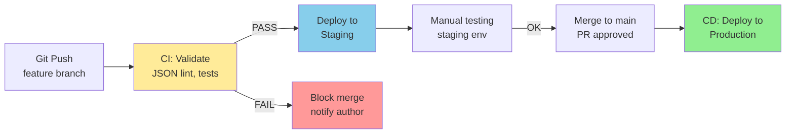

import { 
  SlideContainer, 
  Slide, 
  KeyPoints, 
  SupportingDetails, 
  InstructorNotes,
  VisualSeparator,
  LearningObjective,
  KeyConcept,
  Example
} from '@site/src/components/SlideComponents';
import { InteractiveQuiz } from '@site/src/components/InteractiveQuiz';

<LearningObjective>
Po tej sekcji student potrafi:
- Uzasadnić potrzebę wersjonowania konfiguracji (reprodukowalność, audyt, rollback)
- Zaprojektować Git workflow dla IaC (branches, pull requests, code review)
- Zaimplementować CI/CD pipeline z walidacją (JSON lint, query tests, regression tests)
- Ocenić RPO/RTO requirements i zaprojektować backup strategy (3-2-1 rule)
- Odtworzyć system po awarii z Git repository (&lt;30 min RTO)
</LearningObjective>

<SlideContainer>

<Slide title="🧾 Configuration as Code (CaC) – dlaczego wersjonować?" type="info">

<KeyPoints title="📋 Problem: Manual configuration = chaos">

**Scenario bez wersjonowania:**

**Timeline disaster:**
- **Day 0**: Admin creates Grafana dashboard manually (clicks, 2 hours work)
- **Week 1**: Colleague modifies dashboard (adds panel, changes query) → no tracking kto/kiedy/dlaczego
- **Month 2**: Dashboard breaks (query error after InfluxDB schema change) → no history, nie można rollback
- **Month 6**: Grafana server crashes (disk failure) → **dashboard lost** (no backup)
- **Recovery**: Recreate from memory? Screenshots? Email attachments? **Impossible** (2+ days work, incomplete)

**Impact:**
- **Lost knowledge**: No audit trail (who changed what, when, why)
- **No reproducibility**: Cannot recreate configuration (tribal knowledge)
- **No rollback**: Cannot revert to previous working version (break it = fix it manually lub rebuild)
- **No DR**: Disaster recovery = start from scratch (days of downtime)

---

### **Solution: Configuration as Code (stored in Git)**

**Wersjonowanie** = treating configuration as **source code** (Git version control).

**Benefits:**

**1. Reprodukowalność (Reproducibility)**
- Git repo = single source of truth (all configs stored)
- Clone repo → deploy → **exact same configuration** (dev/staging/prod identical)
- Onboard new team member: `git clone` → full context instantly

**2. Audyt zmian (Audit trail)**
- Every change = Git commit (who, when, what, why)
- Example commit message: `"Fixed inverter power query (bug #1234) - John Smith, 2024-07-15"`
- Full history: `git log` → see all changes (forensics dla troubleshooting)

**3. Rollback (Revert to previous version)**
- Dashboard breaks → `git revert <commit>` → restore working version (seconds)
- Compare versions: `git diff` → see exactly co się zmieniło

**4. Code review (Peer validation)**
- Pull request (PR) workflow → colleague reviews before merge
- Catch errors early (typo in query, wrong threshold) → prevent production issues

**5. Disaster recovery (DR)**
- Server crash → `git clone` + redeploy → **RTO &lt;30 min** (vs. days manual rebuild)
- Backup = Git repo (distributed, multiple copies: GitHub, GitLab, on-prem)

**6. Multi-environment consistency**
- Same config (Git), different variables (dev/staging/prod)
- Example: Dashboard template with `$environment` variable → consistent across all

</KeyPoints>

<KeyConcept title="Co wersjonować? (Scope of version control)">

**Everything that defines system behavior:**

### **1. Monitoring stack configs**

**Grafana:**
- Datasources (`/etc/grafana/provisioning/datasources/*.yaml`)
- Dashboards (`/etc/grafana/provisioning/dashboards/*.json`)
- Alert rules, contact points, notification policies
- Users, teams, folders, permissions (YAML)

**InfluxDB:**
- Retention policies (SQL scripts)
- Continuous queries (SQL scripts)
- Database creation scripts
- User management (authentication, authorization)

**MQTT broker (Mosquitto):**
- `mosquitto.conf` (broker config)
- ACL file (authorization rules)
- TLS certificates (paths, not private keys! Use secret manager)

**Telegraf:**
- `telegraf.conf` (input/output plugins, transformations)

---

### **2. Infrastructure configs**

**Docker Compose / Kubernetes manifests:**
```yaml
# docker-compose.yml (versioned in Git)
version: '3.8'
services:
  mosquitto:
    image: eclipse-mosquitto:2.0
    volumes:
      - ./mosquitto.conf:/mosquitto/config/mosquitto.conf
      - ./acl:/mosquitto/config/acl
  
  influxdb:
    image: influxdb:2.7
    environment:
      INFLUX_DB: ${INFLUX_DB}  # Variable from .env file (not in Git)
  
  grafana:
    image: grafana/grafana:10.2
    volumes:
      - ./provisioning:/etc/grafana/provisioning
```

**Ansible playbooks / Terraform:**
- Infrastructure as Code (server provisioning, network config)

---

### **3. Application code**

**Data processing scripts:**
- Python scripts (data validation, transformation, ETL)
- SQL queries (KPI calculation, reporting)

**Edge gateway code:**
- Modbus → MQTT bridge (configuration, mapping)

---

### **4. Documentation**

**Runbooks, SOPs (Standard Operating Procedures):**
- Incident response procedures
- Maintenance checklists
- Troubleshooting guides

**Architecture diagrams:**
- System architecture (Mermaid, draw.io source)
- Network topology

---

### **NOT to version (Secrets):**

**❌ Do NOT commit to Git:**
- Passwords, API keys, tokens (use secret managers: HashiCorp Vault, AWS Secrets Manager)
- Private TLS certificates/keys (use certificate managers)
- `.env` files with secrets (use `.env.example` template instead)

**How to handle secrets:**
```bash
# .gitignore (prevent accidental commit)
.env
*.key
*.pem
passwords.txt

# .env.example (template, versioned in Git)
INFLUX_PASSWORD=changeme
MQTT_PASSWORD=changeme

# Actual .env (NOT versioned, stored securely)
INFLUX_PASSWORD=SecurePassword123!
MQTT_PASSWORD=AnotherSecure456!
```

</KeyConcept>

<SupportingDetails title="📂 Git repository structure – organization best practices">

**Example repository layout:**

```
solar-monitoring/
├── README.md                       # Overview, setup instructions
├── .gitignore                      # Exclude secrets, build artifacts
├── docker-compose.yml              # Container orchestration
├── .env.example                    # Environment variables template
│
├── grafana/
│   ├── provisioning/
│   │   ├── datasources/
│   │   │   ├── influxdb.yaml      # InfluxDB datasource
│   │   │   └── prometheus.yaml    # (optional) Prometheus
│   │   ├── dashboards/
│   │   │   ├── dashboards.yaml    # Provider config
│   │   │   └── solar-farm/
│   │   │       ├── overview.json  # Farm overview dashboard
│   │   │       ├── inverter.json  # Inverter detail
│   │   │       └── alarms.json    # Alarms dashboard
│   │   └── alerting/
│   │       ├── contact_points.yaml
│   │       └── notification_policies.yaml
│   └── grafana.ini                 # Grafana server config
│
├── influxdb/
│   ├── init-scripts/
│   │   ├── 01-create-db.sql       # Database creation
│   │   ├── 02-retention-policies.sql
│   │   └── 03-continuous-queries.sql
│   └── influxdb.conf               # InfluxDB config
│
├── mosquitto/
│   ├── mosquitto.conf              # Broker config
│   ├── acl                         # Authorization rules
│   └── certs/                      # TLS certificates (paths only)
│       └── README.md               # Instructions dla cert generation
│
├── telegraf/
│   └── telegraf.conf               # Telegraf config
│
├── scripts/
│   ├── backup.sh                   # Backup script (InfluxDB, Grafana)
│   ├── restore.sh                  # Restore script
│   └── validate.sh                 # CI validation script
│
├── docs/
│   ├── architecture.md             # System architecture
│   ├── runbook.md                  # Operations runbook
│   └── troubleshooting.md          # Common issues + solutions
│
└── .github/                        # GitHub-specific
    └── workflows/
        └── ci.yml                  # CI/CD pipeline
```

**Benefits organizacji:**
- **Separation of concerns**: Each component in dedicated directory
- **Self-documenting**: Structure mirrors system architecture
- **Easy navigation**: Team members quickly find configs
- **Scalability**: Add new components without restructuring

</SupportingDetails>

<Example title="Git workflow – branches, pull requests, code review">

**Workflow: GitFlow variant (simplified dla ops team)**

### **Branch strategy:**

```
main (production)
├── develop (staging)
│   ├── feature/add-farm12-dashboard
│   ├── feature/update-alert-thresholds
│   └── hotfix/fix-query-syntax-error
```

**Branches:**

**1. `main`** (protected, production-ready)
- Always stable (deploys to production)
- Direct commits **forbidden** (only via PR from `develop`)
- Tagged releases: `v1.0.0`, `v1.1.0`, ...

**2. `develop`** (integration, staging)
- Integration branch (features merge here first)
- Deploys to staging environment (test before production)
- Regularly merged to `main` (after validation)

**3. `feature/*`** (short-lived, task-specific)
- One feature per branch (e.g., `feature/add-farm12-dashboard`)
- Created from `develop`, merged back to `develop` via PR
- Deleted after merge (keep repo clean)

**4. `hotfix/*`** (emergency fixes)
- Critical bugs in production (bypass `develop` → merge directly to `main`)
- Example: Dashboard query error causing alerts to fail
- Also merge to `develop` (keep in sync)

---

### **Workflow example: Add new dashboard dla Farm_12**

**Step 1: Create feature branch**
```bash
git checkout develop
git pull origin develop  # Sync latest changes
git checkout -b feature/add-farm12-dashboard
```

**Step 2: Make changes (add dashboard JSON)**
```bash
# Create new dashboard
cp grafana/provisioning/dashboards/solar-farm/template.json \
   grafana/provisioning/dashboards/solar-farm/farm12.json

# Edit farm12.json (replace $farm_id with Farm_12, customize panels)
vim grafana/provisioning/dashboards/solar-farm/farm12.json

# Test locally (Docker Compose)
docker-compose up -d
# Open Grafana, verify dashboard works
```

**Step 3: Commit changes**
```bash
git add grafana/provisioning/dashboards/solar-farm/farm12.json
git commit -m "Add Farm_12 overview dashboard

- Cloned from template
- Customized panels: power, energy, alarms
- Tested locally, data flowing correctly

Closes #456"  # Reference ticket/issue number
```

**Step 4: Push to remote + create Pull Request (PR)**
```bash
git push origin feature/add-farm12-dashboard
```

**On GitHub/GitLab:**
- Create PR: `feature/add-farm12-dashboard` → `develop`
- Title: "Add Farm_12 overview dashboard"
- Description: What changed, why, testing done
- Assign reviewer (colleague)

---

### **Step 5: Code review (colleague reviews PR)**

**Reviewer checks:**
- **JSON syntax valid?** (CI should validate, but manual check nie boli)
- **Query correctness?** (InfluxQL syntax, correct measurement/tags)
- **Naming conventions?** (consistent with other dashboards)
- **Documentation?** (comment explaining complex queries)
- **Testing evidence?** (screenshot showing dashboard works)

**Review outcome:**
- **Approved**: Reviewer clicks "Approve" → merge to `develop`
- **Changes requested**: Reviewer comments (e.g., "Fix typo in panel title") → author updates → re-review

---

### **Step 6: Merge to `develop`**
```bash
# GitHub UI: Click "Merge pull request" (squash commits optional)
# Or command line:
git checkout develop
git merge --no-ff feature/add-farm12-dashboard  # --no-ff preserves history
git push origin develop
```

**Automated deployment (CI/CD):**
- Push to `develop` triggers CI pipeline
- Validates JSON, deploys to **staging environment**
- Ops team tests in staging (smoke tests)

---

### **Step 7: Promote to production (`develop` → `main`)**

After staging validation (1-7 days typical):
```bash
git checkout main
git merge develop
git tag v1.5.0  # Semantic versioning
git push origin main --tags
```

**Automated deployment:**
- Push to `main` triggers production deployment
- Grafana reloads provisioning → Farm_12 dashboard live in production

---

**Timeline summary:**
- Feature branch created: Day 0
- PR created: Day 0 (after local testing)
- Code review: Day 1 (colleague reviews within 1 business day)
- Merged to `develop`, deployed to staging: Day 1
- Tested in staging: Day 1-3
- Merged to `main`, deployed to production: Day 3
- **Total: 3 days** (safe, validated process)

**Comparison to direct production change:**
- Manual change in Grafana UI: 10 min
- **But**: No review, no testing, no rollback → high risk (1 in 10 changes breaks something)
- Git workflow: 3 days, but **safe** (review + staging catch 95% issues)

</Example>

<InstructorNotes>

**Czas**: 18-20 min

**Przebieg**:
1. Dlaczego wersjonować (4 min) – problem manual config, benefits CaC
2. Co wersjonować (4 min) – monitoring configs, infrastructure, docs (NOT secrets!)
3. Repo structure (3 min) – example layout, organization best practices
4. Git workflow (5 min) – branches, PR, code review (full example)
5. Q&A (2 min)

**Punkty kluczowe**:
- **Configuration = code** (treat it like software development)
- **Git = single source of truth** (all configs, full history)
- **Code review** (PR workflow) catches errors early (95% issues prevented)
- **Staging environment** (test before production) mandatory dla safety
- **NOT commit secrets** to Git (passwords, keys) – use secret managers

**Demonstracja praktyczna**:
- Live Git workflow: Create branch, commit, push, PR (GitHub UI)
- Show PR review: Comment on code, request changes, approve
- CI/CD pipeline: Show GitHub Actions logs (validate JSON, deploy to staging)
- Rollback demo: `git revert` → redeploy → dashboard restored (seconds)

**Materiały pomocnicze**:
- Example Git repo: Solar Monitoring (GitHub template)
- Git cheatsheet (common commands)
- GitHub Flow documentation (simplified workflow)
- CI/CD pipeline templates (GitHub Actions, GitLab CI)

**Typowe błędy studenckie**:
- **Committing secrets** (passwords in Git) – use .gitignore + secret managers!
- **No code review** (merge own PR) – defeats purpose (catch errors)
- **Large commits** (change 20 files at once) – hard to review; split into small PRs
- **Poor commit messages** ("fix", "update") – be descriptive ("Fix query timeout in power panel, closes #123")

**Pytania studenckie**:
- Q: Czy Git nie jest overkill dla małego teamu (2-3 osoby)?
- A: NO. Even 1-person team benefits (audyt, rollback, DR). Git overhead minimal (learn once, use forever). Alternative (no Git) = chaos after 6 months.

- Q: Co z large binary files (e.g., database backups, images)?
- A: **Git LFS** (Large File Storage) dla binaries >10 MB. Lub: Store outside Git (S3, NAS), link in README. Git designed dla text files (configs, code), nie large binaries.

- Q: Jak handle merge conflicts (2 people edit same dashboard)?
- A: **Conflicts happen** (Git shows conflict markers). **Resolution**: (1) Communicate (Slack: "I'm editing farm overview dashboard"), (2) Small PRs (reduce overlap), (3) Manual merge (choose which change to keep). **Prevention > cure**.

</InstructorNotes>

</Slide>

<VisualSeparator type="technical" />

<Slide title="🛠️ CI/CD pipeline – automated validation & deployment" type="tip">

<KeyConcept title="Continuous Integration / Continuous Deployment (CI/CD)">

**CI/CD** = automation pipeline triggered by Git events (push, PR).

**Stages:**



**Benefits:**
- **Automated validation**: Catch errors before deploy (JSON syntax, query errors)
- **Fast feedback**: PR author notified within 2-5 min (CI runs automatically)
- **Consistent deployment**: Same process every time (no manual steps, no human error)
- **Rollback-friendly**: Tagged releases → easy revert (`git checkout v1.4.0` → redeploy)

</KeyConcept>

<SupportingDetails title="🔍 CI pipeline stages – validation steps">

### **Stage 1: Syntax validation (JSON lint)**

**Goal**: Catch syntax errors (malformed JSON, missing commas).

**GitHub Actions workflow** (`.github/workflows/ci.yml`):
```yaml
name: CI - Validate Configs

on:
  pull_request:
    branches: [develop, main]
  push:
    branches: [develop, main]

jobs:
  validate-json:
    runs-on: ubuntu-latest
    steps:
      - uses: actions/checkout@v3
      
      - name: Validate Grafana dashboards (JSON)
        run: |
          for file in grafana/provisioning/dashboards/**/*.json; do
            echo "Validating $file"
            jq empty "$file" || exit 1  # jq = JSON processor, "empty" = validate only
          done
      
      - name: Validate YAML configs
        run: |
          pip install yamllint
          yamllint grafana/provisioning/datasources/*.yaml
          yamllint grafana/provisioning/alerting/*.yaml
```

**Output (if error):**
```
Error: Validating grafana/provisioning/dashboards/solar-farm/farm12.json
parse error: Expected separator between values at line 45, column 12
❌ CI failed → PR blocked (cannot merge until fixed)
```

---

### **Stage 2: Query validation (InfluxDB queries)**

**Goal**: Catch query errors (typos, wrong measurement names).

**Test script** (`scripts/validate-queries.sh`):
```bash
#!/bin/bash
# Extract queries from dashboard JSON, test against InfluxDB

for dashboard in grafana/provisioning/dashboards/**/*.json; do
  # Extract InfluxQL queries (jq filter)
  queries=$(jq -r '.panels[].targets[].query' "$dashboard" 2>/dev/null)
  
  for query in $queries; do
    # Test query against staging InfluxDB (dry-run, EXPLAIN)
    curl -G 'http://influxdb-staging:8086/query' \
      --data-urlencode "db=solar_farm" \
      --data-urlencode "q=EXPLAIN $query" \
      -u "$INFLUX_USER:$INFLUX_PASSWORD" || {
        echo "❌ Query error in $dashboard: $query"
        exit 1
      }
  done
done

echo "✅ All queries valid"
```

**CI workflow integration:**
```yaml
- name: Validate InfluxDB queries
  env:
    INFLUX_USER: ${{ secrets.INFLUX_USER }}
    INFLUX_PASSWORD: ${{ secrets.INFLUX_PASSWORD }}
  run: ./scripts/validate-queries.sh
```

---

### **Stage 3: Regression tests (KPI calculations)**

**Goal**: Ensure dashboard changes don't break KPI calculations.

**Test case example** (`tests/test_pr_calculation.py`):
```python
import pytest
import requests

def test_pr_calculation_accuracy():
    """Test PR (Performance Ratio) calculation in overview dashboard"""
    
    # Query Grafana API (render panel, get result)
    response = requests.get(
        'http://grafana-staging:3000/api/dashboards/uid/solar-farm-overview',
        auth=('admin', 'admin')
    )
    dashboard = response.json()
    
    # Extract PR panel query
    pr_panel = next(p for p in dashboard['dashboard']['panels'] if p['title'] == 'PR (%)')
    pr_query = pr_panel['targets'][0]['query']
    
    # Expected query (regression baseline)
    expected_query = 'SELECT mean("E_actual") / mean("E_expected") * 100 FROM "energy" WHERE $timeFilter'
    
    assert pr_query == expected_query, f"PR query changed unexpectedly: {pr_query}"

def test_pr_value_range():
    """Test PR value within realistic range (70-95%)"""
    
    # Query InfluxDB directly (last 24h PR)
    response = requests.get(
        'http://influxdb-staging:8086/query',
        params={
            'db': 'solar_farm',
            'q': 'SELECT mean("PR") FROM "kpi" WHERE time > now() - 24h'
        },
        auth=('grafana', 'password')
    )
    
    pr_value = response.json()['results'][0]['series'][0]['values'][0][1]
    
    assert 70 <= pr_value <= 95, f"PR value {pr_value}% outside realistic range (70-95%)"

# Run tests
# pytest tests/test_pr_calculation.py
```

**CI integration:**
```yaml
- name: Run regression tests
  run: |
    pip install pytest requests
    pytest tests/ --junitxml=test-results.xml
  
- name: Publish test results
  uses: actions/upload-artifact@v3
  with:
    name: test-results
    path: test-results.xml
```

---

### **Stage 4: Deploy to staging (if all tests pass)**

**Deployment script** (`scripts/deploy-staging.sh`):
```bash
#!/bin/bash
# Deploy Grafana provisioning to staging environment

# 1. Sync provisioning directory
rsync -avz grafana/provisioning/ \
  staging-server:/etc/grafana/provisioning/

# 2. Restart Grafana (reload provisioning)
ssh staging-server "systemctl restart grafana-server"

# 3. Wait dla Grafana startup (health check)
for i in {1..30}; do
  curl -f http://staging-server:3000/api/health && break
  echo "Waiting dla Grafana... ($i/30)"
  sleep 2
done

echo "✅ Deployed to staging: http://staging-server:3000"
```

**CI integration:**
```yaml
- name: Deploy to staging
  if: github.ref == 'refs/heads/develop'  # Only on develop branch
  run: ./scripts/deploy-staging.sh
```

</SupportingDetails>

<Example title="Disaster recovery: Restore from Git in 30 minutes (RTO)">

**Scenario**: Grafana server hardware failure (disk crash), complete data loss.

**Recovery objectives:**
- **RTO (Recovery Time Objective)**: &lt;30 min (max downtime tolerable)
- **RPO (Recovery Point Objective)**: &lt;15 min (max data loss tolerable)

---

### **Recovery procedure:**

**T+0 min: Incident detected**
- Monitoring alerts: "Grafana server unreachable"
- Ops team confirms: Server unresponsive (hardware failure)

**T+2 min: Decision – restore from Git (DR plan activated)**

**T+5 min: Provision new server (cloud or spare hardware)**
```bash
# Launch new VM (AWS EC2, Azure, lub on-prem spare)
# Install base OS (Ubuntu 22.04), Docker

sudo apt update
sudo apt install -y docker.io docker-compose git
```

**T+10 min: Clone Git repository (all configs)**
```bash
git clone https://github.com/company/solar-monitoring.git
cd solar-monitoring
```

**T+12 min: Restore secrets (from secret manager)**
```bash
# Retrieve secrets from HashiCorp Vault / AWS Secrets Manager
vault kv get -field=password secret/influxdb/grafana > .env
# .env now contains INFLUX_PASSWORD, MQTT_PASSWORD, etc.
```

**T+15 min: Deploy monitoring stack (Docker Compose)**
```bash
docker-compose up -d

# Services starting:
# - Mosquitto (MQTT broker)
# - InfluxDB (TSDB)
# - Telegraf (data collector)
# - Grafana (visualization)
```

**T+20 min: Verify services healthy**
```bash
# Check all containers running
docker-compose ps

# Check Grafana dashboards auto-loaded (provisioned from Git)
curl http://localhost:3000/api/dashboards/uid/solar-farm-overview

# Check InfluxDB data (restored from backup, separate process)
influx -execute 'SHOW DATABASES'
```

**T+25 min: Update DNS (point to new server)**
```bash
# Update DNS A record: grafana.solarfarm.com → new IP
# (DNS TTL = 5 min, propagation within 5 min)
```

**T+30 min: Service restored ✅**
- Grafana accessible @ http://grafana.solarfarm.com:3000
- All dashboards present (provisioned from Git)
- Data flowing (MQTT → InfluxDB → Grafana)

---

### **Data loss assessment (RPO):**

**InfluxDB data:**
- **Last backup**: T-2 hours (automated backup every 2 hours)
- **Data loss**: 2 hours raw data (**NOT** 15 min target!)

**Improvement needed:**
- **Continuous replication** (InfluxDB Enterprise lub manual replication)
- **Example**:
  ```bash
  # Primary InfluxDB → Replica (async replication, <1 min lag)
  influx -execute 'CREATE SUBSCRIPTION "replica" ON "solar_farm"."raw_7d" DESTINATIONS ALL "http://influxdb-replica:8086"'
  ```
- **With replication**: RPO = **&lt;1 min** (acceptable!)

---

### **Lessons learned:**

**What went well:**
- ✅ Git repo = single source of truth (all configs recovered instantly)
- ✅ Docker Compose = consistent deployment (no manual config, click-ops)
- ✅ Provisioning = dashboards auto-loaded (no manual recreation)
- ✅ RTO met: **30 min** (target achieved)

**What needs improvement:**
- ❌ RPO violated: 2 hours data loss (> 15 min target)
- **Action**: Implement InfluxDB replication (continuous backup)
- ❌ Secrets manual retrieval (5 min delay)
- **Action**: Automate secret injection (CI/CD pipeline fetches from Vault)

**Final RTO/RPO (after improvements):**
- **RTO**: 20 min (automation improvements, -10 min)
- **RPO**: &lt;1 min (continuous replication, -119 min)

</Example>

<InstructorNotes>

**Czas**: 18-20 min

**Przebieg**:
1. CI/CD concept (3 min) – stages, benefits (automated validation)
2. CI pipeline stages (6 min) – JSON lint, query validation, regression tests
3. Deployment stages (3 min) – staging → production workflow
4. Disaster recovery example (5 min) – restore from Git (30 min RTO)
5. Q&A (2 min)

**Punkty kluczowe**:
- **CI = automated gatekeeper** (catch errors before deploy)
- **Regression tests** (KPI calculations) critical (prevent silent bugs)
- **Staging environment** mandatory (test before production)
- **DR from Git** = fast recovery (RTO &lt;30 min achievable)
- **RPO vs. RTO** trade-off (continuous replication expensive, backup lag cheaper)

**Demonstracja praktyczna**:
- Live CI pipeline: Trigger GitHub Actions (push to branch), show logs (validate → deploy)
- Intentional error: Commit broken JSON, show CI failure (PR blocked)
- Fix error: Commit fix, CI passes, PR mergeable (green checkmark)
- DR simulation: `docker-compose down -v` (destroy), `git clone` + `docker-compose up` (restore in 5 min local)

**Materiały pomocnicze**:
- Example CI/CD workflows (GitHub Actions, GitLab CI templates)
- Regression test examples (pytest, integration tests)
- DR runbook (step-by-step recovery procedure)
- RTO/RPO calculator (spreadsheet – input requirements, output architecture recommendations)

**Typowe błędy studenckie**:
- **No regression tests** (only syntax validation) – JSON valid ≠ dashboard works correctly
- **Skipping staging** (deploy directly to production) – risky, errors discovered by users
- **No backup testing** (assume backups work) – test restore procedure (quarterly drill)
- **Confusing RPO/RTO**: RTO = time to restore service (downtime), RPO = data loss (backup frequency)

**Pytania studenckie**:
- Q: CI pipeline slow (10 min) – delays development. Jak przyspieszyć?
- A: **Optimization**: (1) Parallel jobs (validate JSON, YAML, queries simultaneously), (2) Cache dependencies (pip, npm), (3) Skip redundant tests (only test changed files). **Trade-off**: Speed vs. thoroughness (don't skip critical tests).

- Q: Staging environment = duplicate infrastructure (expensive). Alternatywy?
- A: **Options**: (1) Shared staging (multiple teams, scheduled deployments), (2) Lightweight staging (single server, vs. production cluster), (3) Feature flags (deploy to production, enable dla subset users, test in production). **Risk**: Lightweight staging may miss production-specific issues (scale, load).

- Q: Secrets w Git (accidentally committed) – jak remove completely?
- A: **Damage control**: (1) Revoke secret immediately (change password, rotate key), (2) Remove from Git history (`git filter-branch`, `BFG Repo-Cleaner`), (3) Force push (rewrite history), (4) Notify team (all clones contain secret, re-clone after cleanup). **Prevention**: Pre-commit hooks (block commits with secrets), `.gitignore` (secrets files), secret scanning (GitHub, GitGuardian).

</InstructorNotes>

</Slide>

<VisualSeparator type="default" />

<Slide title="📝 Quiz: Wersjonowanie, CI/CD, disaster recovery" type="info">

<InteractiveQuiz 
  questions={[
    {
      question: "Co NIE powinno być versioned w Git repository?",
      options: [
        "Grafana dashboard JSON files",
        "InfluxDB retention policy SQL scripts",
        ".env file with INFLUX_PASSWORD=SecurePass123!",
        "Docker Compose YAML manifests"
      ],
      correctAnswer: 2,
      explanation: ".env z passwords = SECRET (NIE commit to Git). Use .env.example (template) + secret manager (Vault). Opcja (a), (b), (d) = configs (safe to version). Rule: If it's sensitive (password, key, token) → NOT in Git."
    },
    {
      question: "Git workflow: Feature branch → Pull Request → Review. Reviewer finds critical bug. Co NAJPIERW?",
      options: [
        "Merge anyway (fix later in hotfix)",
        "Request changes (author fixes, re-review before merge)",
        "Reject PR (close, start over)",
        "Merge to staging (test in production)"
      ],
      correctAnswer: 1,
      explanation: "Code review purpose = catch bugs BEFORE merge. Request changes → author fixes → re-review → merge (safe). Opcja (a) defeats review purpose (bug in production). Opcja (c) wasteful (rework entire PR). Opcja (d) staging = pre-production test (but review first, catch obvious bugs early)."
    },
    {
      question: "CI pipeline: JSON validation PASS, query validation FAIL (typo w measurement name). Co się dzieje?",
      options: [
        "PR merge blocked (CI failed, cannot merge)",
        "PR merge allowed (warning tylko, nie blocker)",
        "Automatic fix (CI corrects typo, commits)",
        "Deploy to staging (test failures allowed)"
      ],
      correctAnswer: 0,
      explanation: "CI failure (any stage) = block merge (red X). Author must fix + push → CI re-runs → all stages PASS → merge allowed. Opcja (b) dangerous (warnings ignored → bugs in production). Opcja (c) nieprawda (CI validates, nie modyfikuje code). Opcja (d) nieprawda (staging only IF CI passes)."
    },
    {
      question: "RTO = 30 min, RPO = 15 min. Grafana crashes @ 14:00. Last backup @ 13:00. Recovery finishes @ 14:45. Które violated?",
      options: [
        "RTO violated (45 min > 30 min target), RPO OK (60 min < 15 min)",
        "RPO violated (60 min > 15 min target), RTO OK (45 min < 30 min)",
        "BOTH violated (RTO: 45 min > 30, RPO: 60 min > 15)",
        "NEITHER violated (both within targets)"
      ],
      correctAnswer: 2,
      explanation: "RTO = recovery time = 14:45 - 14:00 = **45 min** (target 30) → VIOLATED. RPO = data loss = 14:00 - 13:00 = **60 min** (target 15) → VIOLATED. Opcja (c) correct. Improvement needed: Faster recovery (automation, DR rehearsal) + more frequent backups (continuous replication)."
    },
    {
      question: "Regression test: PR changes dashboard query, test fails (PR value now 105%, expected 70-95%). Co to oznacza?",
      options: [
        "Bug in PR (query broken, returns wrong result) – author must fix",
        "Test outdated (baseline wrong) – update test",
        "InfluxDB data corrupt – restore backup",
        "Normal (PR value varies, test too strict) – ignore test"
      ],
      correctAnswer: 0,
      explanation: "PR = 105% (impossible, >100%) → clearly wrong result → BUG in query. Author review query logic, fix, re-test. Opcja (b) possible ale unlikely (baseline 70-95% reasonable dla PR). Opcja (c) unrelated (test uses staging data, isolated). Opcja (d) dangerous (ignoring test defeats purpose; if test wrong, fix test, nie ignore)."
    }
  ]}
/>

:::tip Rekomendacja po quizie
Jeśli uzyskałeś &lt;80%, przejrzyj: (1) Secrets management (NOT in Git, use Vault), (2) Code review workflow (request changes → fix → merge), (3) CI blocking (failure = no merge), (4) RTO/RPO definitions (time to restore vs. data loss), (5) Regression tests (catch logic bugs, nie just syntax).
:::

</Slide>

</SlideContainer>

---

## Podsumowanie i wnioski

**Kluczowe punkty z tej sekcji:**

**Configuration as Code (wersjonowanie obowiązkowe)**:
   - Git = single source of truth (wszystkie configs, pełna historia)
   - Benefits: Reprodukowalność, audyt, rollback, DR (&lt;30 min RTO)
   - Zakres: Monitoring configs, infrastructure (IaC), docs (NOT secrets!)

**Git workflow (branches + code review)**:
   - Branches: `main` (production), `develop` (staging), `feature/*` (tasks)
   - Pull Request (PR) → code review → staging → production (safe path)
   - Code review catches 95% issues before production (peer validation)

**CI/CD pipeline (automated validation)**:
   - Stages: JSON lint → query validation → regression tests → deploy staging
   - CI failure = block merge (no broken configs to production)
   - Regression tests critical (KPI calculations, nie tylko syntax)

**Disaster recovery (Git = backup)**:
   - Restore procedure: Clone Git → deploy → RTO &lt;30 min (achievable)
   - RPO &lt;15 min: Continuous InfluxDB replication (vs. periodic backups)
   - DR rehearsal quarterly (test procedure, improve RTO/RPO)

**Następne kroki:**
- Ćwiczenie: Setup Git repo dla monitoring stack, create PR, code review
- Lab: Build CI pipeline (GitHub Actions, validate JSON/YAML)
- Przygotowanie: Następna sekcja – Podsumowanie Wykładu 05 (comprehensive review)

---

**Dodatkowe zasoby:**
- **Git**: Pro Git book (free, online), GitHub Flow documentation
- **CI/CD**: GitHub Actions docs, GitLab CI examples
- **Secrets management**: HashiCorp Vault, AWS Secrets Manager guides
- **Disaster recovery**: Google SRE book (Chapter 26: Data Integrity)


