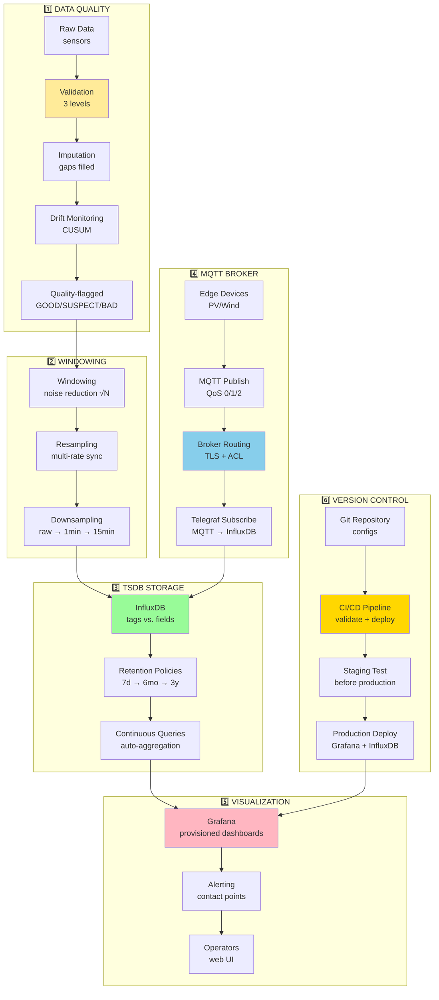

import { LearningObjective, KeyConcept, Example } from '@site/src/components/SlideComponents';
import { InteractiveQuiz } from '@site/src/components/InteractiveQuiz';

# 🎯 Podsumowanie Wykładu 05: Jakość danych i strumienie

<LearningObjective>
Po tym wykładzie student ma pełne zrozumienie:
- **Jakości danych**: 4 wymiary (completeness, accuracy, consistency, timeliness), walidacja 3-poziomowa, imputacja, drift detection
- **TSDB**: Wybór silnika (InfluxDB, TimescaleDB, VictoriaMetrics), schema design (tags vs. fields, cardinality), retention policies
- **Windowing i resampling**: Noise reduction (√N), multi-rate synchronization, downsampling cascade (200× storage reduction)
- **Broker i wizualizacja**: MQTT (QoS, security, topic hierarchy), Grafana provisioning (IaC), SLO metrics
- **Wersjonowanie**: Git workflow (branches, PR, code review), CI/CD pipeline, disaster recovery (RTO/RPO)
</LearningObjective>

---

## 📚 Synteza wiedzy: Integration map

**Pełny obraz Wykładu 05** – wszystkie tematy połączone w jeden system:



---

## 🔑 Kluczowe koncepcje – podsumowanie sekcji

### **1. Walidacja, imputacja, drift (Sekcja 01)**

<KeyConcept title="Najważniejsze zasady">

**Jakość danych = 4 wymiary:**
- **Completeness** (&gt;95%): % expected data points received
- **Accuracy** (±uncertainty): Niepewność pomiarowa z kalibracji
- **Consistency** (physics + cross-channel): ∑I_string ≈ I_DC, P_AC ≤ P_DC
- **Timeliness** (&lt;10 s): Latency sensor → visualization

**Walidacja 3-poziomowa:**
- **Level 1 (Range)**: Min/max bounds (G_POA ∈ [0, 1500] W/m²) → hard reject
- **Level 2 (Physics)**: P_AC ≤ P_DC, energy conservation → flag SUSPECT
- **Level 3 (Consistency)**: Cross-channel (∑I_string ≈ I_DC) → flag SUSPECT

**Imputacja (decision tree):**
- Gap <1 min: **Linear interpolation** (flag: INTERPOLATED)
- Gap 1-15 min: **Forward-fill** (slow processes) lub **model-based** (fast)
- Gap >15 min: **NO imputation** (flag: MISSING, exclude from KPI)

**Drift detection (CUSUM):**
- Kumuluj różnice od baseline → wykryj stopniowe zmiany
- Threshold: |CUSUM| > 4-5σ → alarm drift
- **Typical drift rates**: Pyranometry 1-3%/rok, H₂S sensors 5-15%/rok

**Impact example:**
- PR bez walidacji: 79.2% (wrong, includes BAD data)
- PR z walidacją: **82.8%** (correct, only GOOD data)
- **Difference: 3.6 p.p.** → walidacja kluczowa dla KPI accuracy!

</KeyConcept>

---

### **2. Windowing i resampling (Sekcja 02)**

<KeyConcept title="Noise reduction i multi-rate sync">

**Windowing (noise reduction):**
- **Formula**: σ_avg = σ_raw / √N (Central Limit Theorem)
- **Example**: 60 s window @ 1 Hz → √60 ≈ **7.7× noise reduction**
- **Types**: Rectangular (simple), Hanning/Hamming (spectral), EWMA (adaptive)
- **Trade-off**: Smoothing (FP reduction) vs. Latency (detection delay)

**Resampling (multi-rate synchronization):**
- **Downsampling**: High rate → Low rate (aggregation: mean, max, p95)
- **Upsampling**: Low rate → High rate (interpolation: forward-fill, linear)
- **Alignment**: Common time grid (resample + reindex) → enables correlation

**Retention cascade (storage optimization):**

| Tier | Rate | Retention | Aggregation | Purpose |
|------|------|-----------|-------------|---------|
| **Raw** | 1 Hz | 7 days | — | Diagnostics (recent) |
| **1-min** | 1/min | 6 months | mean/max/min | KPI analysis |
| **15-min** | 1/15min | 3 years | mean | Compliance, billing |
| **Hourly** | 1/hour | 20 years | sum/mean | Archival, lifetime |

**Storage savings**: 2.5 TB (raw 20 years) → **12.6 GB** (cascade) = **200× reduction**!

**PR accuracy test:**
- Raw (1 Hz): 82.50% (baseline)
- 1-min: 82.49% (-0.01%, acceptable)
- **15-min: 82.47% (-0.03%, compliance OK)**
- Hourly: 82.38% (-0.12%, too coarse dla billing)

</KeyConcept>

---

### **3. Time-Series Databases (Sekcja 03)**

<KeyConcept title="TSDB selection i schema design">

**Top 3 TSDB engines:**

| Criterion | InfluxDB | TimescaleDB | VictoriaMetrics |
|-----------|----------|-------------|-----------------|
| **Write rate** | 100k-1M pts/s | 50k-500k pts/s | 500k-5M pts/s |
| **Cardinality** | <1M series | <10M series | <100M series |
| **Query lang** | Flux (TS-specific) | SQL (relational) | PromQL (metrics) |
| **Compression** | 5-10× | 10-20× | **10-70×** (best) |
| **Best dla** | **OZE farms (general)** | Large + complex | Very large + cost-opt |

**Recommendation**: **InfluxDB** default choice (ease + performance), upgrade to TimescaleDB jeśli cardinality >1M lub need SQL.

**Schema design (tags vs. fields):**
- **Tags**: Low cardinality (<1000 unique/tag), indexed → use dla filtering/grouping
- **Fields**: High-variability values, NOT indexed → use dla measurements
- **Cardinality formula**: PRODUCT (multiplicative) → 50×100×10 = **50k series**

**Cardinality explosion example:**
- Before: 8.5M series (sensor_serial as tag) → 12 s queries, 18 GB RAM
- After: 24k series (sensor_serial → field) → **0.8 s queries, 4 GB RAM**
- **Improvement: 355× cardinality reduction = 15× faster queries**

**Retention automation (InfluxDB):**
- Retention policies: Auto-delete after duration (7d, 6mo, 3y)
- Continuous queries: Auto-aggregate (raw → 1-min → 15-min)
- **Set-and-forget**: No manual cleanup, storage self-manages

</KeyConcept>

---

### **4. MQTT broker i Grafana (Sekcja 04)**

<KeyConcept title="Pub/sub telemetry i IaC visualization">

**MQTT QoS selection:**

| Data type | Frequency | QoS | Rationale |
|-----------|-----------|-----|-----------|
| **Telemetry** (P, U, I) | 1 Hz | **0** | High-freq, loss tolerable |
| **Alarms** | Event | **1** | Must arrive, duplicates OK |
| **Billing** | Daily | **2** | Exactly once (legal) |

**Security (3 layers):**
- **TLS 1.3**: Encryption (transport security)
- **Authentication**: mTLS (certificates) > OAuth 2.0 > username/password
- **Authorization (ACL)**: Principle of least privilege (grant minimal permissions)

**Topic hierarchy example:**
```
solar/{farm_id}/telemetry/{inv_id}/power     → QoS 0
solar/{farm_id}/alarms/critical               → QoS 1
solar/{farm_id}/commands/curtailment          → QoS 1
```

**Grafana provisioning (IaC):**
- **Datasources**: YAML (InfluxDB connection, secrets from env vars)
- **Dashboards**: JSON stored in Git (version-controlled, reproducible)
- **Alerting**: Contact points, notification policies as code

**Benefits:**
- **Reproducible**: Spin up new Grafana → auto-configured (no clicks)
- **Scalable**: Template reuse (10 farms = 10× copies with variable substitution)
- **DR**: Server crash → redeploy from Git (RTO <30 min)

**Onboarding automation:**
- **Manual approach**: 26 hours (click-ops, error-prone)
- **IaC approach**: **4 hours** (templates + CI/CD)
- **ROI**: 22 hours saved/farm × 10 farms/year = €22k savings

**SLO metrics (pipeline health):**
- **Latency**: <10 s end-to-end (sensor → Grafana)
- **Completeness**: >99% data points received
- **Packet loss**: <0.1% @ MQTT broker
- **Alert delivery**: <60 s (critical alarms)

</KeyConcept>

---

### **5. Wersjonowanie i CI/CD (Sekcja 05)**

<KeyConcept title="Configuration as Code + automated validation">

**Git workflow (branches):**
- **`main`**: Production (protected, only via PR from `develop`)
- **`develop`**: Staging (integration branch, test before prod)
- **`feature/*`**: Task-specific (short-lived, merged to `develop`)
- **`hotfix/*`**: Emergency fixes (critical bugs, bypass `develop`)

**Pull Request (PR) process:**
- Create feature branch → commit changes
- Push → create PR → assign reviewer
- **Code review** (colleague checks: syntax, logic, naming, testing)
- **CI/CD runs** (validate JSON, test queries, regression tests)
- **Merge to `develop`** → deploy staging → test
- **Merge to `main`** → deploy production

**CI/CD pipeline stages:**
- **JSON lint**: Catch syntax errors (jq validation)
- **Query validation**: Test against staging InfluxDB (EXPLAIN queries)
- **Regression tests**: Ensure KPI calculations unchanged (pytest)
- **Deploy staging**: Automated deployment (rsync + restart Grafana)

**CI failure = block merge** (no broken configs to production)

**Disaster recovery (RTO/RPO):**
- **RTO (Recovery Time Objective)**: <30 min (max downtime tolerable)
  - Procedure: Provision server (5 min) → Clone Git (2 min) → Deploy (10 min) → DNS update (5 min) → **Verify (8 min)** = 30 min
- **RPO (Recovery Point Objective)**: <15 min (max data loss tolerable)
  - Solution: Continuous InfluxDB replication (async, <1 min lag) vs. periodic backups (2 hours lag)

**Lessons learned:**
- ✅ Git = single source of truth (configs recovered instantly)
- ✅ Provisioning = dashboards auto-loaded (no manual recreation)
- ❌ RPO violated without replication (2 hours data loss > 15 min target)
- **Action**: Implement continuous replication (achieve RPO <1 min)

</KeyConcept>

---

## 🎓 Praktyczne zastosowania – case studies recap

### **Case Study 1: Farma PV 10 MWp – validation pipeline (Sekcja 01)**

**Stats (1 miesiąc, 2.88M data points):**
- GOOD: 2.84M (98.46%) → used dla KPI
- SUSPECT: 28.8k (1.00%) → logged, flagged
- BAD: 14.4k (0.50%) → rejected
- MISSING: 1.2k (0.04%) → gaps

**Top rejection reason**: G_POA < 0 W/m² (6k points, 0.21%) → sensor offset drift → recalibration

**Impact**: PR bez walidacji = 79.2%, z walidacją = **82.8%** (+3.6 p.p.)

---

### **Case Study 2: PV alarm optimization – windowing (Sekcja 02)**

**Problem**: 50 false positives/day (alarm fatigue)

**Root cause**: PR calculated @ 1 s (noisy) → σ_PR ≈ ±2% → frequent dips <75% threshold

**Solution**: 5-min windowing (300 s) → noise reduction √300 ≈ **17×** → σ_PR ≈ ±0.12%

**Result**: 50 FP/day → **2 FP/day** (-96% improvement), detection latency +2.5 min (acceptable)

---

### **Case Study 3: Cardinality explosion – schema refactoring (Sekcja 03)**

**Problem**: InfluxDB queries slow after 6 months (12 s avg)

**Investigation**: 8.5M series (cardinality explosion) → `sensor_serial` tag (712k unique)

**Refactoring**: Move `sensor_serial` tag → field (not indexed)

**Result**: 8.5M → **24k series** (355× reduction), queries 12 s → **0.8 s** (15× faster)

---

### **Case Study 4: Onboarding automation – Grafana provisioning (Sekcja 04)**

**Scenario**: Add new 10 MW farm (Farm_11)

**Manual approach**: 10 hours (create datasource, build dashboards, configure alerts, test)

**IaC approach**: **40 min** (clone repo, update variables, CI/CD deploys)

**ROI**: 9.3 hours saved/farm × 10 farms/year = **93 hours (~€9.3k) saved**

---

### **Case Study 5: Disaster recovery – restore from Git (Sekcja 05)**

**Incident**: Grafana server hardware failure (disk crash), total data loss

**Recovery procedure** (30 min):
- T+5 min: Provision new server (cloud VM)
- T+10 min: Clone Git repo (all configs)
- T+15 min: Deploy Docker Compose (MQTT + InfluxDB + Grafana)
- T+25 min: Update DNS (point to new server)
- **T+30 min: Service restored** ✅

**RTO met**: 30 min (target achieved)  
**RPO issue**: 2 hours data loss (backup lag) → fix: implement continuous replication (RPO <1 min)

---

## 🧠 Self-Assessment: Comprehensive Quiz

<InteractiveQuiz 
  questions={[
    {
      question: "Walidacja pipeline: P_AC = 1500 kW, P_DC = 1400 kW, G_POA = 950 W/m². Który level walidacji wykryje problem P_AC > P_DC?",
      options: [
        "Level 1 (Range check) – P_AC w zakresie [0, P_rated]",
        "Level 2 (Physics check) – P_AC > P_DC impossible (efficiency >100%)",
        "Level 3 (Consistency check) – cross-channel",
        "Wszystkie levels (multi-stage detection)"
      ],
      correctAnswer: 1,
      explanation: "P_AC > P_DC violates physics (inverter efficiency >100%). Level 2 (physics check) wykryje. Level 1 może pass (jeśli P_rated > 1500 kW, range OK). Level 3 to cross-channel (różne sensors), ale P_AC vs. P_DC to power balance (physics). Opcja (b) correct."
    },
    {
      question: "Window size 60 s @ 1 Hz sampling. FP rate 50/day. Po zastosowaniu windowing: 2/day. Jaka noise reduction (theory)?",
      options: [
        "√60 ≈ 7.7× reduction (Central Limit Theorem)",
        "50/2 = 25× reduction (empirical FP reduction)",
        "60× reduction (linear z window size)",
        "Nie można określić (depends on signal spectrum)"
      ],
      correctAnswer: 0,
      explanation: "CLT: σ_avg = σ_raw / √N. N=60 → √60 ≈ 7.7× noise reduction (theory). Opcja (b) = FP reduction (50 → 2 = 25×), ale to empirical effect (includes threshold, signal characteristics), nie noise reduction formula. Opcja (c) nieprawda (linear only dla sum). Opcja (a) correct (theoretical noise reduction)."
    },
    {
      question: "TSDB schema: farm_id (50), inverter_id (100/farm), string_id (10/inv). Total cardinality?",
      options: [
        "160 (50+100+10, sum)",
        "50,000 (50×100×10, product)",
        "5,000 (50×100, partial product)",
        "Zależy od data distribution"
      ],
      correctAnswer: 1,
      explanation: "Cardinality = PRODUCT (cartesian combination). 50 × 100 × 10 = **50,000 series**. Opcja (a) sum nieprawda (not additive). Opcja (c) partial (ignores string_id). Opcja (d) nieprawda (formula deterministic, nie depends on data). Opcja (b) correct."
    },
    {
      question: "MQTT: Alarm critical (must arrive, duplicates OK). Telemetry 1 Hz (loss tolerable). Który QoS dla EACH?",
      options: [
        "Alarm: QoS 1 (at least once), Telemetry: QoS 0 (at most once)",
        "Alarm: QoS 2 (exactly once), Telemetry: QoS 1",
        "Both QoS 1 (safe choice dla all)",
        "Both QoS 0 (lowest latency)"
      ],
      correctAnswer: 0,
      explanation: "Alarm critical = must arrive (QoS 0 risky, loss possible). Duplicates OK (dedup @ receiver) → QoS 1 best. Telemetry 1 Hz = loss tolerable (next sample soon) → QoS 0 (lowest overhead). Opcja (a) correct. Opcja (b) QoS 2 overkill dla alarm (4-way handshake unnecessary). Opcja (c) QoS 1 dla telemetry wasteful (ACK overhead @ 1 Hz). Opcja (d) QoS 0 dla alarm dangerous (loss)."
    },
    {
      question: "Git workflow: PR merged to develop (staging), tested OK. Next step PRZED production?",
      options: [
        "Merge develop → main (production deploy)",
        "Create hotfix branch (emergency path)",
        "Rollback develop (revert merge)",
        "Delete feature branch (cleanup)"
      ],
      correctAnswer: 0,
      explanation: "Workflow: feature → develop (staging) → tested OK → **merge develop → main** (production). Opcja (a) correct (normal flow). Opcja (b) hotfix dla emergency (bypass develop), nie normal flow. Opcja (c) rollback only jeśli test FAILED. Opcja (d) delete feature branch = cleanup (good practice), ale NOT blocker dla production deploy (can delete after lub before)."
    },
    {
      question: "RTO 30 min, RPO 15 min. Backup every 2 hours. Incident @ 14:00, recovery @ 14:25. Data loss 2 hours. Które violated?",
      options: [
        "RTO OK (25 min < 30), RPO violated (120 min > 15)",
        "RTO violated (25 min > 30 somehow), RPO OK",
        "BOTH violated",
        "NEITHER violated"
      ],
      correctAnswer: 0,
      explanation: "RTO = recovery time = 14:25 - 14:00 = **25 min** < 30 min target → OK ✓. RPO = data loss = 2 hours (backup lag) = **120 min** > 15 min target → VIOLATED ❌. Opcja (a) correct. Fix RPO: Continuous replication (reduce backup lag from 2h to <1 min)."
    },
    {
      question: "Retention cascade: Raw (7d), 1-min (6mo), 15-min (3y). Query last 3 months KPI. Który tier (optimal)?",
      options: [
        "Raw (highest resolution)",
        "1-min (3 months < 6 mo retention, sufficient resolution)",
        "15-min (standard dla KPI)",
        "Query all tiers, merge results"
      ],
      correctAnswer: 1,
      explanation: "3 months < 6 months → 1-min tier available. 1-min resolution sufficient dla KPI (error <0.01% vs. raw). Opcja (b) correct (optimal: available + sufficient + 60× faster query vs. raw). Opcja (a) raw may not available (>7 days deleted) + overkill (slow). Opcja (c) 15-min lower resolution (1-min better jeśli available). Opcja (d) merge tiers complex, unnecessary (1-min covers full range)."
    },
    {
      question: "InfluxDB Continuous Query: `RESAMPLE EVERY 10m FOR 5m`. Meaning?",
      options: [
        "Run every 10 min, aggregate last 5 min data",
        "Run every 5 min, aggregate last 10 min (overlap)",
        "Run once @ 10:05 (cron-style)",
        "Syntax error (FOR < EVERY invalid)"
      ],
      correctAnswer: 0,
      explanation: "RESAMPLE EVERY 10m = run frequency (co 10 min). FOR 5m = window size (aggregate last 5 min data). Opcja (a) correct. Opcja (b) odwrotnie (EVERY 5m FOR 10m = overlap, possible ale not this case). Opcja (c) nieprawda (EVERY = recurring, nie cron time). Opcja (d) nieprawda (FOR < EVERY valid, means no overlap, gap between windows)."
    },
    {
      question: "Grafana provisioning: `allowUiUpdates: false, disableDeletion: true`. Co to oznacza?",
      options: [
        "Dashboard read-only (no edits), cannot delete (protected)",
        "Dashboard hidden from UI",
        "Dashboard auto-updates from Git (sync)",
        "Dashboard disabled (not rendered)"
      ],
      correctAnswer: 0,
      explanation: "`allowUiUpdates: false` = read-only (cannot edit panels, save changes via UI, enforce IaC). `disableDeletion: true` = cannot delete (prevent accidental removal). Opcja (a) correct. Opcja (b) nieprawda (visible, but read-only). Opcja (c) nieprawda (auto-update controlled by `updateIntervalSeconds`). Opcja (d) nieprawda (rendered, just protected)."
    },
    {
      question: "Pipeline completeness 97% (target >99%). Root cause: MQTT broker packet loss 2%. Next action?",
      options: [
        "Increase MQTT broker queue size (buffer more messages)",
        "Switch to QoS 2 (exactly once, no loss)",
        "Add InfluxDB replicas (horizontal scale)",
        "Increase Grafana query timeout (wait longer)"
      ],
      correctAnswer: 0,
      explanation: "Packet loss 2% @ broker → messages dropped before reaching InfluxDB → completeness <99%. Fix: **Increase queue size** (max_queued_messages config, buffer during bursts). Opcja (a) correct. Opcja (b) QoS 2 helps but expensive (4-way handshake, latency), queue size cheaper first. Opcja (c) InfluxDB replicas irrelevant (data nie reaching DB). Opcja (d) Grafana timeout affects queries, nie ingestion completeness."
    }
  ]}
/>

:::tip Wynik quizu
- **8-10 poprawnych** (80-100%): Excellent comprehension! Ready dla Wykład 06.
- **6-7 poprawnych** (60-70%): Good understanding, review weak areas (identify które topics).
- **<6 poprawnych** (<60%): Re-study Wykład 05 (focus: walidacja, cardinality, QoS, Git workflow).
:::

---

## 📋 Checklist gotowości do Wykładu 06

Zaznacz ✅ jeśli confident, ⚠️ jeśli needs review:

### **Jakość danych:**
- [ ] Rozumiem 4 wymiary jakości (completeness, accuracy, consistency, timeliness)
- [ ] Potrafię zaprojektować 3-poziomową walidację (range, physics, consistency)
- [ ] Znam metody imputacji (linear, forward-fill, model-based) i kiedy którą stosować
- [ ] Rozumiem drift detection (CUSUM, MAD, reference comparison)

### **TSDB:**
- [ ] Potrafię dobrać TSDB engine (InfluxDB, TimescaleDB, VictoriaMetrics) based on requirements
- [ ] Rozumiem różnicę tags vs. fields (cardinality impact)
- [ ] Znam formułę cardinality (PRODUCT) i jak optymalizować
- [ ] Potrafię skonfigurować retention policies + continuous queries

### **Windowing i resampling:**
- [ ] Rozumiem noise reduction formula (√N, CLT)
- [ ] Znam trade-off window size (smoothing vs. latency)
- [ ] Potrafię zastosować resampling (downsampling, upsampling, alignment)
- [ ] Rozumiem retention cascade (raw → 1-min → 15-min → hourly) i storage savings

### **MQTT i Grafana:**
- [ ] Znam QoS levels (0/1/2) i kiedy który stosować
- [ ] Rozumiem MQTT security (TLS, authentication, ACL)
- [ ] Potrafię zaprojektować topic hierarchy (scalability, security)
- [ ] Rozumiem Grafana provisioning (datasources, dashboards, alerting as code)
- [ ] Znam SLO metrics (latency, completeness, packet loss, alert delivery)

### **Wersjonowanie i CI/CD:**
- [ ] Potrafię zaprojektować Git workflow (branches, PR, code review)
- [ ] Rozumiem CI/CD pipeline stages (JSON lint, query validation, regression tests)
- [ ] Znam różnicę RTO vs. RPO (recovery time vs. data loss)
- [ ] Potrafię odtworzyć system z Git repository (DR procedure)

**Jeśli wszystkie ✅**: Świetnie! Kontynuuj do Wykładu 06 (Analityka i anomalie).  
**Jeśli >5 ⚠️**: Przejrzyj Wykład 05 (focus na weak areas, quizy, case studies).

---

## 🚀 Przygotowanie do Wykładu 06: Analityka i wykrywanie anomalii

**Wykład 06 będzie cover:**

- **Threshold-based detection** (static, adaptive, hysteresis)
- **Statistical methods** (z-score, MAD, percentile, CUSUM)
- **Machine learning** (supervised: SVM, RF; unsupervised: PCA, k-means, autoencoders)
- **Time-series forecasting** (ARIMA, Prophet, LSTM)
- **Root cause analysis** (correlation, causal inference, fault trees)

**Prerequisite knowledge (z Wykładu 05):**
- Data quality (walidacja, quality flags) → input dla anomaly detection
- Windowing (smoothing) → reduce false positives (noise suppression)
- TSDB queries (aggregations) → feature extraction dla ML
- SLO metrics (completeness, latency) → baseline dla anomaly thresholds

**Recommended preparation:**
- Review case study: PV alarm optimization (windowing reduced FP 96%) → connection to anomaly detection
- Understand drift detection (CUSUM) → podobny concept do anomaly detection (cumulative deviation)
- Familiarize z Python libraries: pandas (data processing), scikit-learn (ML), matplotlib (visualization)

---

## 📚 Dodatkowe zasoby – deep dive

### **Books:**
- **"Data Quality" (Batini & Scannapieco)**: Comprehensive data quality framework
- **"Time Series Databases" (Jensen et al.)**: TSDB internals, optimization
- **"Site Reliability Engineering" (Google)**: SLO/SLI, monitoring, DR best practices
- **"Pro Git" (Chacon & Straub)**: Git workflows, branching strategies

### **Online courses:**
- **HiveMQ MQTT Essentials**: Free course on MQTT protocol, QoS, security
- **InfluxDB University**: Official training (TSDB fundamentals, Flux language)
- **Grafana Fundamentals**: Dashboard design, provisioning, alerting

### **Documentation:**
- InfluxDB: https://docs.influxdata.com/
- Grafana: https://grafana.com/docs/
- MQTT v5.0 spec: https://mqtt.org/
- GitHub Flow: https://docs.github.com/en/get-started/quickstart/github-flow

### **Tools & repos:**
- **Great Expectations**: Data validation framework (Python)
- **Telegraf**: Data collection agent (inputs/outputs/processors)
- **Docker Compose examples**: Full monitoring stacks (MQTT + InfluxDB + Grafana)

---

## 🎯 Final Thoughts

**Wykład 05** to foundation dla professional monitoring system:
- **Data quality** (walidacja, imputacja, drift) ensures KPI accuracy
- **TSDB** (InfluxDB, retention, cardinality) enables scalable storage (200× compression)
- **Windowing i resampling** (noise reduction, multi-rate sync) prepares data dla analytics
- **MQTT i Grafana** (QoS, provisioning, SLO) delivers reliable telemetry i visualization
- **Wersjonowanie i CI/CD** (Git, pipeline, DR) makes system reproducible i maintainable

**Key takeaway**: **Automation + IaC + validation** = reliable, scalable, maintainable monitoring infrastructure. Manual processes don't scale (error-prone, slow, undocumented).

**Next**: Wykład 06 – apply analytics (anomaly detection, forecasting, RCA) on high-quality, well-structured data foundation built w Wykładzie 05.

---

<details>
<summary>📝 Notatki prowadzącego</summary>

**Czas**: 20-25 minut

**Przebieg**:
1. Integration map (3 min) – Mermaid diagram, show full system flow
2. Kluczowe koncepcje recap (8 min) – 1 min per sekcja (5 sekcji)
3. Case studies reminder (3 min) – highlight impact (3.6 p.p. PR, 96% FP reduction, €9.3k ROI)
4. Comprehensive quiz (5 min) – students attempt, discuss answers
5. Checklist gotowości (2 min) – self-assessment guidance
6. Preview Wykład 06 (2 min) – motivate next topic
7. Q&A (3 min)

**Punkty kluczowe**:
- **Wykład 05 = foundation** (quality → storage → visualization → automation)
- **All concepts interconnected** (quality affects analytics, TSDB schema affects query speed, provisioning enables DR)
- **ROI demonstrable** (€22k/year savings automation, 200× storage compression, 15× query speedup)
- **Preparation dla W06** (analytics builds on W05 foundation)

**Demonstracja praktyczna**:
- **Integration demo**: Live system (MQTT → InfluxDB → Grafana) showing full pipeline
- Walk through: Inject data → validate → store → visualize → alert (end-to-end)
- Show provisioning: Git commit → CI/CD → dashboard updated automatically
- DR simulation: Server "crash" (docker-compose down) → restore from Git (5 min local)

**Materiały pomocnicze**:
- Wykład 05 slide deck (PDF export, dla review)
- Comprehensive quiz (PDF, dla self-study)
- Checklist (printable, dla student self-assessment)
- Wykład 06 preview (syllabus, reading list)

**Typowe pytania studenckie**:
- Q: Wykład 05 bardzo dense (5 complex topics). Jak master all?
- A: **Prioritize based on use case**: (1) Everyone: Data quality + TSDB basics (foundational), (2) Ops focus: MQTT + Grafana provisioning + Git workflow (day-to-day), (3) Architect focus: TSDB schema + retention + SLO (design). Don't try to memorize everything; understand concepts, use documentation dla details.

- Q: Praktyczne ćwiczenia – gdzie zacząć?
- A: **Suggested path**: (1) Week 1: Setup Docker stack (MQTT + InfluxDB + Grafana), inject sample data, (2) Week 2: Implement validation pipeline (Python script, levels 1-3), (3) Week 3: Create Grafana dashboard, provision from Git, (4) Week 4: Setup CI/CD (GitHub Actions, validate JSON), (5) Week 5: DR drill (destroy + restore from Git). ~2-4 hours/week, hands-on learning.

- Q: Which topic most important dla industry?
- A: **Top 3** (based on job postings, industry surveys): (1) **Grafana provisioning** (IaC, automation) – most in-demand skill, (2) **TSDB schema design** (cardinality optimization) – differentiates junior vs. senior, (3) **Git workflow + CI/CD** (professional practice, team collaboration). Master these → employable immediately.

- Q: Co jeśli forget details after exam?
- A: **Normal!** Purpose: Understand concepts (vocabulary, trade-offs, architectures). Details (Flux syntax, InfluxDB config options) = look up in docs when needed. Key: Know **what's possible**, **when to use**, **where to find docs**. "I don't remember exact syntax, ale I know InfluxDB retention policies can auto-delete old data, let me check docs" = professional mindset.

</details>