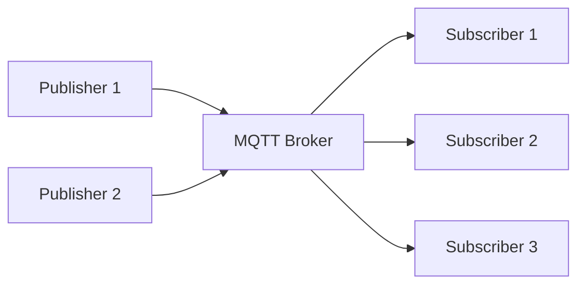

# Custom Components Documentation

## 📚 Component Library Overview

This directory contains custom React components designed for educational content delivery in the OZE course website.

**Last Updated**: 2025-09-30

---

## 🎯 Available Components

| Component | File | Purpose | Status |
|-----------|------|---------|--------|
| SlideComponents | `SlideComponents.jsx` | Presentation slides | ✅ Ready |
| LiteratureList | `LiteratureList.jsx` | Bibliography display | ✅ Ready |
| InteractiveQuiz | `InteractiveQuiz.jsx` | Assessments & tabs | ✅ Ready |
| HomepageFeatures | `HomepageFeatures/index.js` | Homepage cards | ✅ Existing |

---

## 1️⃣ SlideComponents

**File**: `src/components/SlideComponents.jsx`

### SlideContainer

Wraps all slides in a lecture section.

**Usage:**
```mdx
import { SlideContainer, Slide } from '@site/src/components/SlideComponents';

<SlideContainer>
  <Slide>Content here</Slide>
  <Slide>More content</Slide>
</SlideContainer>
```

**Props**: None (just wraps children)

---

### Slide

Individual slide with title and typed styling.

**Props:**
- `title` (string, optional): Slide title
- `type` (string, optional): Slide type - Default: `'default'`
  - `'info'` - Blue background (informational)
  - `'tip'` - Green background (best practices)
  - `'warning'` - Yellow background (cautions)
  - `'danger'` - Red background (critical info)
  - `'note'` - Gray background (side notes)
  - `'default'` - Neutral styling
- `children` (ReactNode, required): Slide content

**Usage:**
```mdx
<Slide title="🎯 Główny temat" type="info">
  <p>Slide content goes here...</p>
</Slide>

<Slide title="⚠️ Ostrzeżenie" type="warning">
  <p>Important warning message...</p>
</Slide>
```

---

### KeyPoints

Highlights main learning points with distinctive styling.

**Props:**
- `title` (string, optional): Section title - Default: `"📋 Kluczowe punkty"`
- `children` (ReactNode, required): Content to highlight

**Usage:**
```mdx
import { KeyPoints } from '@site/src/components/SlideComponents';

<KeyPoints title="🎯 Główne zagadnienia">
  - **Punkt 1** - Wyjaśnienie
  - **Punkt 2** - Wyjaśnienie
  - **Punkt 3** - Wyjaśnienie
</KeyPoints>

<KeyPoints>
  Default title will be used: "📋 Kluczowe punkty"
</KeyPoints>
```

---

### SupportingDetails

Provides additional context or detailed explanation.

**Props:**
- `title` (string, optional): Section title - Default: `"🔧 Szczegóły"`
- `children` (ReactNode, required): Detailed content

**Usage:**
```mdx
import { SupportingDetails } from '@site/src/components/SlideComponents';

<SupportingDetails title="🔍 Dodatkowe informacje">
  Detailed explanation here...
</SupportingDetails>
```

---

### InfoBox / WarningBox / SuccessBox

Styled callout boxes for different types of information.

**Props (all similar):**
- `title` (string, optional): Box title
  - InfoBox default: `"ℹ️ Informacja"`
  - WarningBox default: `"⚠️ Ważne"`
  - SuccessBox default: `"✅ Sukces"`
- `children` (ReactNode, required): Box content

**Usage:**
```mdx
import { InfoBox, WarningBox, SuccessBox } from '@site/src/components/SlideComponents';

<InfoBox title="💡 Wskazówka">
  Helpful information for students...
</InfoBox>

<WarningBox>
  Important warning (uses default title)
</WarningBox>

<SuccessBox title="🎉 Gratulacje">
  Congratulations message...
</SuccessBox>
```

---

### InstructorNotes

**CRITICAL COMPONENT** - Collapsible detailed teaching notes.

**Props:**
- `title` (string, optional): Summary text - Default: `"🎓 Notatki wykładowcy (Kliknij aby rozwinąć)"`
- `children` (ReactNode, required): Instructor guidance

**Usage:**
```mdx
import { InstructorNotes } from '@site/src/components/SlideComponents';

<InstructorNotes>
**Notatki wykładowcy:**

**📚 Kontekst:**
- Background information
- Why this matters

**⏱️ Czas:** 15 minut

**💡 Sugestie:**
- Interactive element to add
- Questions to ask students

**❓ Częste pytania:**
- Q: Common question
- A: Detailed answer
</InstructorNotes>
```

---

### VisualSeparator

Themed visual separator between sections.

**Props:**
- `type` (string, optional): Separator theme - Default: `'default'`
  - `'default'` - 🎯 ➡️ 🎯
  - `'data'` - 📊 📈 📊
  - `'technical'` - 💻 🔧 💻
  - `'energy'` - ⚡ 🌱 ⚡

**Usage:**
```mdx
import { VisualSeparator } from '@site/src/components/SlideComponents';

<VisualSeparator />

<VisualSeparator type="energy" />

<VisualSeparator type="technical" />
```

---

### SlideProgress

Progress indicator showing position in lecture.

**Props:**
- `current` (number, required): Current slide number
- `total` (number, required): Total slides
- `className` (string, optional): Additional CSS class

**Usage:**
```mdx
import { SlideProgress } from '@site/src/components/SlideComponents';

<SlideProgress current={3} total={10} />
```

**Visual**: `[████████░░] 3 / 10`

---

### SlideNavigation

Previous/Next navigation buttons for slides.

**Props:**
- `onPrevious` (function, required): Previous button handler
- `onNext` (function, required): Next button handler
- `hasPrevious` (boolean, required): Enable previous button
- `hasNext` (boolean, required): Enable next button

**Usage:**
```mdx
import { SlideNavigation } from '@site/src/components/SlideComponents';

<SlideNavigation 
  onPrevious={() => navigate('/previous')}
  onNext={() => navigate('/next')}
  hasPrevious={true}
  hasNext={true}
/>
```

---

## 2️⃣ LiteratureList

**File**: `src/components/LiteratureList.jsx`  
**Data**: `src/data/literature.json`

Displays formatted bibliography from structured JSON data.

**Props:**
- `topic` (string, **required**): Key from literature.json
- `title` (string, optional): Section heading - Default: `'Literatura'`
- `sortBy` (string, optional): Sort field - Default: `'year'`
  - `'year'` - Sort by publication year
  - `'title'` - Sort by title alphabetically
  - `'authors'` - Sort by author names
- `order` (string, optional): Sort order - Default: `'desc'`
  - `'desc'` - Descending (newest first for year)
  - `'asc'` - Ascending (oldest first for year)

**Usage:**
```mdx
import LiteratureList from '@site/src/components/LiteratureList';

## Literatura podstawowa

<LiteratureList 
  topic="monitoring" 
  title="Systemy monitoringu"
  sortBy="year"
  order="desc"
/>

## Literatura SCADA

<LiteratureList 
  topic="scada"
  sortBy="title"
/>
```

### Adding New Literature

Edit `src/data/literature.json`:

```json
{
  "your-topic": [
    {
      "authors": "Last, F. M.",
      "year": "2024",
      "title": "Book or Article Title",
      "source": "Publisher or Journal Name",
      "link": "https://example.com/resource"
    }
  ]
}
```

**Available Topics:**
- `monitoring` - General monitoring systems
- `scada` - SCADA specific literature
- `security` - Cybersecurity and safety
- `solar` - Photovoltaic systems
- `analytics` - Data analytics and ML
- `databases` - Time-series databases

**Add more topics as needed!**

---

## 3️⃣ InteractiveQuiz

**File**: `src/components/InteractiveQuiz.jsx`

### MultipleChoiceQuiz

Interactive quiz with single correct answer and explanation.

**Props:**
- `question` (string, **required**): Question text
- `options` (array, **required**): Array of answer strings
- `correctAnswer` (number, **required**): Index of correct answer (0-based)
- `explanation` (string, optional): Explanation shown after answering

**Usage:**
```mdx
import { MultipleChoiceQuiz } from '@site/src/components/InteractiveQuiz';

<MultipleChoiceQuiz
  question="Który protokół jest najlepszy do komunikacji IIoT?"
  options={[
    "HTTP",
    "MQTT",
    "FTP",
    "SMTP"
  ]}
  correctAnswer={1}
  explanation="MQTT został zaprojektowany specjalnie dla IoT, oferując lekki protokół pub-sub idealny dla urządzeń o ograniczonych zasobach."
/>
```

**Features:**
- ✅ Radio button selection
- ✅ Submit validation (must select answer)
- ✅ Visual feedback (green=correct, red=wrong)
- ✅ Explanation display
- ✅ Reset to try again
- ✅ Accessible (keyboard navigation)

---

### TabbedContent

Displays content in tabbed interface.

**Props:**
- `tabs` (array, **required**): Array of tab objects
  - Each object: `{ label: string, content: ReactNode }`

**Usage:**
```mdx
import { TabbedContent } from '@site/src/components/InteractiveQuiz';

<TabbedContent 
  tabs={[
    { 
      label: "Teoria", 
      content: <>
        <h3>Teoria</h3>
        <p>Theoretical content here...</p>
      </> 
    },
    { 
      label: "Praktyka", 
      content: <>
        <h3>Praktyka</h3>
        <p>Practical examples here...</p>
      </> 
    },
    {
      label: "Kod",
      content: <>
        <pre><code>Code examples...</code></pre>
      </>
    }
  ]}
/>
```

---

## 🎨 Styling

**Note**: All components use **global CSS classes** defined in `src/css/custom.css`.

The CSS styling will be added in **Prompt 08: Styling Customization**.

**CSS Classes Used:**
- `.slide-container`, `.slide-card`, `.slide-title`
- `.key-points-box`, `.supporting-details-box`
- `.warning-box`, `.success-box`, `.info-box`
- `.instructor-notes`, `.instructor-notes-summary`
- `.visual-separator`, `.slide-separator`
- `.quiz-container`, `.quiz-option`, `.quiz-submit-button`
- `.tabbed-container`, `.tab-button`, `.tab-content`

---

## 📝 Complete Usage Example

### Full Lecture Section with Components

```mdx
---
title: "Wprowadzenie do MQTT"
---

import { 
  SlideContainer, 
  Slide, 
  KeyPoints, 
  SupportingDetails,
  InstructorNotes,
  VisualSeparator 
} from '@site/src/components/SlideComponents';
import { MultipleChoiceQuiz } from '@site/src/components/InteractiveQuiz';
import LiteratureList from '@site/src/components/LiteratureList';

<SlideContainer>

<Slide title="🎓 Wprowadzenie do MQTT" type="info">

<KeyPoints title="🌱 Czym jest MQTT?">

**MQTT** = Message Queuing Telemetry Transport

- **Lekki protokół** pub-sub dla IoT
- **Niskie zużycie** zasobów (bandwidth, CPU, RAM)
- **Quality of Service** (QoS 0, 1, 2)
- **Retain messages** i Last Will

</KeyPoints>

<InstructorNotes>
**Notatki wykładowcy:**

**⏱️ Czas:** 15 minut

**🎯 Kluczowe punkty:**
- Podkreśl różnicę między pub-sub a request-response
- Pokaż przykład z rzeczywistego brokera MQTT

**❓ Częste pytania:**
- Q: Czy MQTT jest bezpieczny?
- A: Podstawowa wersja nie, ale MQTT over TLS (port 8883) zapewnia szyfrowanie
</InstructorNotes>

</Slide>

<VisualSeparator type="technical" />

<Slide title="📊 Architektura MQTT" type="tip">

<KeyPoints title="Komponenty systemu">



</KeyPoints>

<SupportingDetails title="🔍 Szczegóły techniczne">

**Broker** to centralny serwer przekazujący wiadomości:
- Mosquitto (open source)
- HiveMQ (commercial)
- AWS IoT Core (cloud)

**Topics** to hierarchia tematów:
- `sensors/temperature/room1`
- `actuators/lights/floor2`

</SupportingDetails>

</Slide>

</SlideContainer>

## Quiz sprawdzający

<MultipleChoiceQuiz
  question="Jaki port domyślnie używa MQTT?"
  options={[
    "80",
    "443",
    "1883",
    "8080"
  ]}
  correctAnswer={2}
  explanation="Port 1883 jest domyślnym portem dla MQTT. Port 8883 jest używany dla MQTT over TLS (szyfrowane połączenie)."
/>

## Literatura

<LiteratureList 
  topic="monitoring"
  title="Literatura z zakresu protokołów IIoT"
/>
```

---

## 🎨 Visual Styling Preview

### Slide Types

**type="info"** (Blue):
- For informational content
- Definitions and explanations
- General knowledge

**type="tip"** (Green):
- Best practices
- Helpful hints
- Success patterns

**type="warning"** (Yellow):
- Important cautions
- Common mistakes to avoid
- Things to be careful about

**type="danger"** (Red):
- Critical safety information
- Security vulnerabilities
- Must-know warnings

**type="note"** (Gray):
- Side notes
- Additional context
- Optional reading

---

## 🔧 Import Patterns

### Single Component Import
```mdx
import { Slide } from '@site/src/components/SlideComponents';

<Slide title="Test">Content</Slide>
```

### Multiple Component Import
```mdx
import { 
  SlideContainer, 
  Slide, 
  KeyPoints,
  InstructorNotes 
} from '@site/src/components/SlideComponents';
```

### Default Export Import
```mdx
import LiteratureList from '@site/src/components/LiteratureList';
```

### Named Export Import
```mdx
import { MultipleChoiceQuiz, TabbedContent } from '@site/src/components/InteractiveQuiz';
```

---

## ⚠️ Common Issues & Solutions

### Issue: "Cannot find module '@site/src/components/...'"

**Solutions:**
1. Verify file exists in `src/components/`
2. Check import path uses `@site` alias
3. Ensure file extension matches (.jsx)
4. Restart dev server: `npm run start`

### Issue: "Component renders but has no styling"

**Solution**: CSS classes are added in Prompt 08. Components will work but look plain until CSS is added to `src/css/custom.css`.

**Temporary**: Components are functional, styling comes next!

### Issue: "Props not working as expected"

**Solutions:**
1. Check prop name spelling (case-sensitive)
2. Verify prop type matches (string, number, array)
3. Check browser console for warnings
4. Review component source code

### Issue: "LiteratureList shows nothing"

**Solutions:**
1. Check `topic` prop matches key in `literature.json`
2. Verify `literature.json` exists in `src/data/`
3. Check JSON syntax is valid
4. Look in browser console for errors

### Issue: "Quiz doesn't reset properly"

**Solution**: This is a React state issue. Check that:
- `useState` hooks are initialized correctly
- `handleReset` function updates all state
- Component is not being unmounted/remounted

---

## 🧪 Testing Components

### Manual Testing Checklist

**For each component:**
- [ ] Import works without errors
- [ ] Component renders in browser
- [ ] Props work as documented
- [ ] Default props apply correctly
- [ ] Interactive elements function
- [ ] Styling appears (after Prompt 08)
- [ ] Responsive on mobile
- [ ] Keyboard navigation works
- [ ] No console errors/warnings

### Test in Browser

1. Start dev server: `npm run start`
2. Create test MDX file
3. Import and use each component
4. Verify in browser
5. Test interactions
6. Check console for errors

---

## 📚 Best Practices

### When to Use Each Component

**SlideContainer + Slide**:
- ✅ Presentation-style content
- ✅ When want slide-like appearance
- ✅ Lecture sections with multiple topics

**KeyPoints**:
- ✅ Highlighting 3-7 main concepts
- ✅ Summary points
- ✅ Learning objectives

**SupportingDetails**:
- ✅ Additional context
- ✅ Technical details
- ✅ Advanced explanations

**InstructorNotes**:
- ✅ Every major slide/section
- ✅ Teaching guidance
- ✅ Timing and pacing notes
- ✅ Student FAQs

**Boxes (Info/Warning/Success)**:
- ✅ Important callouts
- ✅ Safety warnings
- ✅ Tips and tricks
- ✅ Success criteria

**VisualSeparator**:
- ✅ Between major topics
- ✅ Section transitions
- ✅ Visual breathing room

**MultipleChoiceQuiz**:
- ✅ End of lecture assessments
- ✅ Check-your-understanding
- ✅ Practice questions

**LiteratureList**:
- ✅ Bibliography pages
- ✅ Resource sections
- ✅ Reference lists

### Component Composition

**Good composition pattern:**
```mdx
<SlideContainer>
  
  <Slide title="Topic A" type="info">
    <KeyPoints>Main points</KeyPoints>
    <InstructorNotes>Teaching notes</InstructorNotes>
  </Slide>
  
  <VisualSeparator />
  
  <Slide title="Topic B" type="tip">
    <SupportingDetails>Details</SupportingDetails>
    <InstructorNotes>Teaching notes</InstructorNotes>
  </Slide>
  
</SlideContainer>
```

---

## 📊 Component Statistics

| Component | Lines of Code | Exports | Dependencies |
|-----------|---------------|---------|--------------|
| SlideComponents.jsx | ~160 | 10 components | clsx |
| LiteratureList.jsx | ~60 | 1 default | literature.json |
| InteractiveQuiz.jsx | ~90 | 2 named | React hooks |

**Total**: ~310 lines of reusable component code

---

## ✅ Completion Checklist

- [x] SlideComponents.jsx created (10 components)
- [x] LiteratureList.jsx created
- [x] InteractiveQuiz.jsx created (2 components)
- [x] literature.json data file created
- [x] Component README documentation created
- [ ] CSS styling (Prompt 08 - next step)
- [ ] Components tested in lecture content
- [ ] All imports working
- [ ] No console errors

---

## ➡️ Next Steps

**Immediate**: Proceed to **Prompt 08: Styling Customization**
- Add comprehensive CSS for all components
- Define color schemes for slide types
- Implement dark mode support
- Ensure responsive design

**After Prompt 08**: Convert existing lectures to use components
- Upgrade Wykład 1 to use SlideComponents
- Enhanced visual appearance
- Better organization

---

## 🔗 Quick Reference

**Import all slide components:**
```mdx
import { 
  SlideContainer, 
  Slide, 
  KeyPoints, 
  SupportingDetails, 
  InfoBox,
  WarningBox,
  SuccessBox,
  InstructorNotes,
  VisualSeparator,
  SlideSeparator,
  SlideProgress,
  SlideNavigation
} from '@site/src/components/SlideComponents';
```

**Import quiz components:**
```mdx
import { MultipleChoiceQuiz, TabbedContent } from '@site/src/components/InteractiveQuiz';
```

**Import literature:**
```mdx
import LiteratureList from '@site/src/components/LiteratureList';
```

---

**Created**: 2025-09-30  
**Status**: ✅ Components Ready, Needs CSS (Prompt 08)
